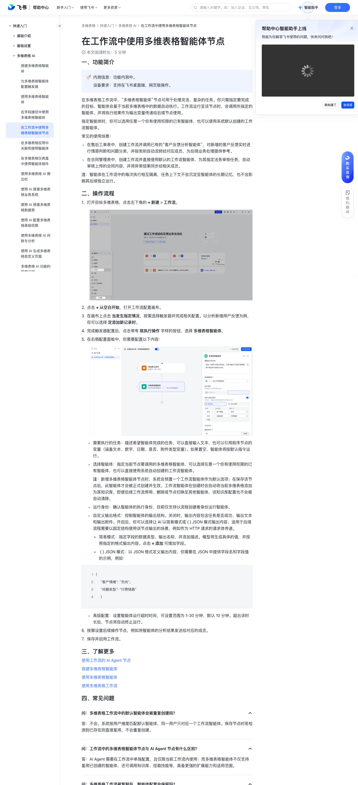

# 在工作流中使用多维表格智能体节点

> 来源：[飞书帮助中心](https://www.feishu.cn/hc/zh-CN/articles/930295068340)  
> 分类：多维表格 / 快速入门 / 多维表格 AI  
> 抓取时间：2026-09-22T01:16:03.294Z

## 界面截图

### 文档内配图

1. 配图：https://p1-hera.feishucdn.com/tos-cn-i-jbbdkfciu3/fd04c987ee9742939b9aca8a24c3ee11~tplv-jbbdkfciu3-image:0:0.image
2. 配图：https://p1-hera.feishucdn.com/tos-cn-i-jbbdkfciu3/67259cf02baf4bc49f476bfcf7a5e58d~tplv-jbbdkfciu3-image:0:0.image

## 功能定位

本页对应飞书帮助中心「多维表格 / 快速入门 / 多维表格 AI」下的「在工作流中使用多维表格智能体节点」。以下需求描述依据官方说明文档提炼，用于指导 DuoWei 对标实现。

## 功能目标

一、功能简介

## 文档结构（官方章节）

- 一、功能简介​
- 二、操作流程​
- 三、了解更多​
- 四、常见问题​

## 详细功能说明

一、功能简介

在售后工单表中，创建工作流并调用已有的“客户反馈分析智能体”，对新增的客户反馈实时进行情感判断和问题分类，并按类别自动流转给对应成员，为后续业务处理提供参考。

在合同管理表中，创建工作流并直接使用默认的工作流智能体，为其指定法务审核任务，自动审核上传的合同内容，并将异常结果同步给相关成员。

二、操作流程

打开目标多维表格，点击左下角的 + 新建 > 工作流。

点击 + 从空白开始，打开工作流配置画布。

在画布上点击 当发生指定情况，按需选择触发器并完成相关配置。以分析新增用户反馈为例，你可以选择 定添加新记录时。

完成触发器配置后，点击带有 就执行操作 字样的按钮，选择 多维表格智能体。

在右侧配置面板中，你需要配置以下内容：

需要执行的任务：描述希望智能体完成的任务，可以直接输入文本，也可以引用前序节点的变量（涵盖文本、数字、日期、是否、附件类型变量）。如果置空，智能体将按默认指令运行。

选择智能体：指定当前节点要调用的多维表格智能体，可以选择任意一个你有使用权限的已有智能体，也可以直接使用系统自动创建的工作流智能体。

注：新增多维表格智能体节点时，系统会预置一个工作流智能体作为默认选项；在保存该节点后，此智能体才会被正式创建并生效。工作流智能体在创建时会自动将当前多维表格添加为其知识库，即使后续工作流停用、删除或节点切换至其他智能体，该知识库配置也不会被自动清除。

运行身份：确认智能体的执行身份，目前仅支持以流程创建者身份运行智能体。

自定义输出格式：控制智能体的输出结构。关闭时，输出内容包含任务是否成功、输出文本和输出附件。开启后，你可以选择让 AI 以简易模式或 { } JSON 模式输出内容，适用于后续流程需要以固定结构使用该节点输出的场景，例如作为 HTTP 请求的请求体传递。

简易模式：指定字段的数据类型、输出名称，并添加描述。模型将生成具体的值，并按照指定的格式输出内容。点击 + 添加 可增加字段。

{ } JSON 模式：以 JSON 格式定义输出内容，你需要在 JSON 中提供字段名和字段值的示例，例如：

高级配置：设置智能体运行超时时间，可设置范围为 1-30 分钟，默认 10 分钟。超出该时长后，节点将自动终止运行。

按需设置后续操作节点，例如将智能体的分析结果发送给对应的成员。

保存并启用工作流。

三、了解更多

四、常见问题

问：多维表格工作流中的默认智能体会被重复创建吗？

答：不会。系统按用户维度匹配默认智能体，同一用户只对应一个工作流智能体。保存节点时若检测到已存在则直接复用，不会重复创建。

问：工作流中的多维表格智能体节点与 AI Agent 节点有什么区别？

答：AI Agent 需要在工作流中单独配置，且仅限当前工作流内使用；而多维表格智能体不仅支持复用已创建的智能体，还可调用知识库、挂载技能等，具备更强的扩展能力和适用范围。

问：多维表格工作流被复制后，智能体配置会保留吗？

答：不会。工作流被复制或随多维表格副本复制时，复制出的流程会自动丢失与智能体的关联关系，需要重新选择智能体。

## 实现要点（对标 DuoWei）

1. **入口与信息架构**：在产品中明确该能力所属模块（快速入门 / 多维表格 AI），并保证用户可从对应导航触达。
2. **核心交互**：按上文「详细功能说明」还原主要操作路径；截图中出现的按钮、字段、面板命名尽量与飞书语义一致或可映射。
3. **数据与权限**：若文档涉及可见范围、可编辑范围、分享或高级权限，实现时需落到角色/成员模型，并保证 API/MCP 与 UI 权限一致。
4. **边界与上限**：若文档提到数量上限、格式限制、导入导出约束，需在实现与错误提示中体现。
5. **验收**：以本页截图场景为用例，完成「能打开 / 能配置 / 能保存 / 能被 Agent 读写（如适用）」四项检查。

## 原始摘录摘要

> 一、功能简介 在售后工单表中，创建工作流并调用已有的“客户反馈分析智能体”，对新增的客户反馈实时进行情感判断和问题分类，并按类别自动流转给对应成员，为后续业务处理提供参考。 在合同管理表中，创建工作流并直接使用默认的工作流智能体，为其指定法务审核任务，自动审核上传的合同内容，并将异常结果同步给相关成员。 二、操作流程 打开目标多维表格，点击左下角的 + 新建 > 工作流。 点击 + 从空白开始，打开工作流配置画布。 在画布上点击 当发生指定情况，按需选择触发器并完成相关配置。以分析新增用户反馈为例，你可以选择 定添加新记录时。 完成触发器配置后，点击带有 就执行操作 字样的按钮，选择 多维表格智能体。 在右侧配置面板中，你需要配置以下内容： 需要执行的任务：描述希望智能体完成的任务，可以直接输入文本，也可以引用前序节点的变量（涵盖文本、数字、日期、是否、附件类型变量）。如果置空，智能体将按默认指令运行。 选择智能体：指定当前节点要调用的多维表格智能体，可以选择任意一个你有使用权限的已有智能体，也可以直接使用系统自动创建的工作流智能体。 注：新增多维表格智能体节点时，系统会预置一个工作流智能体作为默认选项；在保存该节点后，此智能体才会被正式创建并生效。工作流智能体在创建时会自动将当前多维表格添加为其知识库，即使后续工作流停用、删除或节点切换至其他智能体，该知识库配置也不会被自动清除。 运行身份：确认智能体的执行身份，目前仅支持以流程创建者身份运行智能体。 自定义输出格式：控制智能体的输出结构。关闭时，输出内容包含任务是否成功、输出文本和输出附件。开启后，你可以选择让 AI 以简易模式或 { } JSON 模式输出内容，适用于后续流程需要以固定结构使用该节点输出的场景，例如作为 HTTP 请求的请求体传递。 简易模式：指定字段的数据类型、输出名称，并添加描述。模型将生成具体的值…

## 元数据

- article_id: `7678552386683587803`
- category_id: `7630766419524717789`
- path: `/hc/zh-CN/articles/930295068340`
- extracted_text_length: 1289
