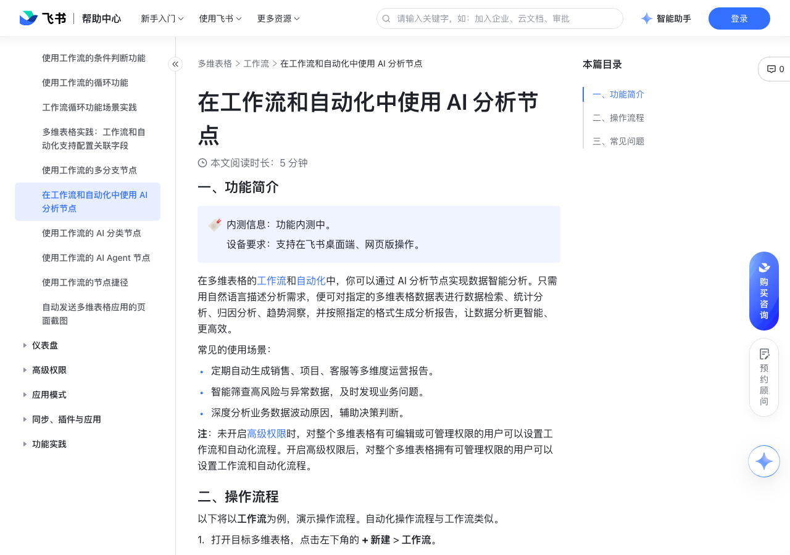

# 在工作流和自动化中使用 AI 分析节点

> 来源：[飞书帮助中心](https://www.feishu.cn/hc/zh-CN/articles/053888024514)  
> 分类：多维表格 / 工作流  
> 抓取时间：2026-09-22T01:25:11.476Z

## 界面截图

### 文档内配图

1. 配图：https://p1-hera.feishucdn.com/tos-cn-i-jbbdkfciu3/b9af337c55a9443d9ecde3fa9f740c44~tplv-jbbdkfciu3-image:0:0.image
2. 配图：https://p1-hera.feishucdn.com/tos-cn-i-jbbdkfciu3/8cb1a0f72bbe4e3b90f5b750f23d4762~tplv-jbbdkfciu3-image:0:0.image

## 功能定位

本页对应飞书帮助中心「多维表格 / 工作流」下的「在工作流和自动化中使用 AI 分析节点」。以下需求描述依据官方说明文档提炼，用于指导 DuoWei 对标实现。

## 功能目标

一、功能简介

## 文档结构（官方章节）

- 一、功能简介​
- 二、操作流程​
- 三、常见问题​

## 详细功能说明

一、功能简介

定期自动生成销售、项目、客服等多维度运营报告。

智能筛查高风险与异常数据，及时发现业务问题。

深度分析业务数据波动原因，辅助决策判断。

二、操作流程

打开目标多维表格，点击左下角的 + 新建 > 工作流。

点击 + 从空白开始，打开工作流配置画布。

在画布上点击 当发生指定情况，按需选择触发器并完成相关配置。例如，你可以选择 定时触发。

完成触发器配置后，点击带有 就执行操作 字样的按钮，选择 AI 分析。

在右侧配置面板中，你需要配置以下内容：

分析任务：描述数据分析任务，可以补充分析重点、统计方式及限制条件等具体要求。支持在任务描述中添加公式，或引用前序节点的输出值，让分析指令更精准。例如：找出[触发时间]这一天有更新的项目，生成汇总报告。

分析数据范围：通过下拉框选择需分析的数据表，选择范围限当前多维表格内的数据表。支持多选，默认为当前多维表格的全部数据表。AI 仅对所选范围内的数据进行智能分析。

数据访问身份：设置 AI 分析数据时使用的身份，可以选择流程触发者或流程创建者。选择流程触发者时，AI 仅能分析流程触发者拥有阅读权限的数据；如果流程触发者对分析的数据表均无权限，AI 分析节点将不执行。

流程创建者为创建该工作流的成员；流程触发者为实际触发该工作流的成员。例如，当触发条件为修改记录时，修改记录的成员即为流程触发者。

仅当触发条件设置为“点击按钮时”或“接收飞书消息触发”时，才支持将数据访问身份设置为流程触发者。

参考资料：上传本地文件作为 AI 分析的补充参考，帮助 AI 更精准地理解业务背景、数据口径及报告的结构风格要求。支持 .pdf、.docx、.doc 格式，单节点最多上传 10 个文件，单文件大小不可超过 10 MB。

输出要求：设置分析结果的呈现形式。你可以直接描述输出风格，也可以粘贴自己有阅读权限的云文档链接作为输出模板。例如：采用高管汇报风格，结构参考指定云文档。

按需配置后续流程：你可以直接引用 AI 分析的结果，用于发送通知、写入文档等操作。

保存并启用工作流。

三、常见问题

问：多维表格 AI 分析节点和 AI Agent 节点中的 AI 分析工具有什么区别？

答：AI 分析节点专注于对多维表格数据进行智能分析，分析结果可直接在工作流中被下游节点引用与使用，适用于目标明确、逻辑清晰的单点分析场景。AI Agent 节点中的“AI 分析”工具作为 Agent 可调用的工具之一，与其他工具灵活组合，共同支撑更复杂的任务场景。

## 实现要点（对标 DuoWei）

1. **入口与信息架构**：在产品中明确该能力所属模块（工作流），并保证用户可从对应导航触达。
2. **核心交互**：按上文「详细功能说明」还原主要操作路径；截图中出现的按钮、字段、面板命名尽量与飞书语义一致或可映射。
3. **数据与权限**：若文档涉及可见范围、可编辑范围、分享或高级权限，实现时需落到角色/成员模型，并保证 API/MCP 与 UI 权限一致。
4. **边界与上限**：若文档提到数量上限、格式限制、导入导出约束，需在实现与错误提示中体现。
5. **验收**：以本页截图场景为用例，完成「能打开 / 能配置 / 能保存 / 能被 Agent 读写（如适用）」四项检查。

## 原始摘录摘要

> 一、功能简介 定期自动生成销售、项目、客服等多维度运营报告。 智能筛查高风险与异常数据，及时发现业务问题。 深度分析业务数据波动原因，辅助决策判断。 二、操作流程 打开目标多维表格，点击左下角的 + 新建 > 工作流。 点击 + 从空白开始，打开工作流配置画布。 在画布上点击 当发生指定情况，按需选择触发器并完成相关配置。例如，你可以选择 定时触发。 完成触发器配置后，点击带有 就执行操作 字样的按钮，选择 AI 分析。 在右侧配置面板中，你需要配置以下内容： 分析任务：描述数据分析任务，可以补充分析重点、统计方式及限制条件等具体要求。支持在任务描述中添加公式，或引用前序节点的输出值，让分析指令更精准。例如：找出[触发时间]这一天有更新的项目，生成汇总报告。 分析数据范围：通过下拉框选择需分析的数据表，选择范围限当前多维表格内的数据表。支持多选，默认为当前多维表格的全部数据表。AI 仅对所选范围内的数据进行智能分析。 数据访问身份：设置 AI 分析数据时使用的身份，可以选择流程触发者或流程创建者。选择流程触发者时，AI 仅能分析流程触发者拥有阅读权限的数据；如果流程触发者对分析的数据表均无权限，AI 分析节点将不执行。 流程创建者为创建该工作流的成员；流程触发者为实际触发该工作流的成员。例如，当触发条件为修改记录时，修改记录的成员即为流程触发者。 仅当触发条件设置为“点击按钮时”或“接收飞书消息触发”时，才支持将数据访问身份设置为流程触发者。 参考资料：上传本地文件作为 AI 分析的补充参考，帮助 AI 更精准地理解业务背景、数据口径及报告的结构风格要求。支持 .pdf、.docx、.doc 格式，单节点最多上传 10 个文件，单文件大小不可超过 10 MB。 输出要求：设置分析结果的呈现形式。你可以直接描述输出风格，也可以粘贴自己有阅读权限的云文档链接作为输出模板。例如：…

## 元数据

- article_id: `7665936509064744117`
- category_id: `7415964452380049412`
- path: `/hc/zh-CN/articles/053888024514`
- extracted_text_length: 1055
