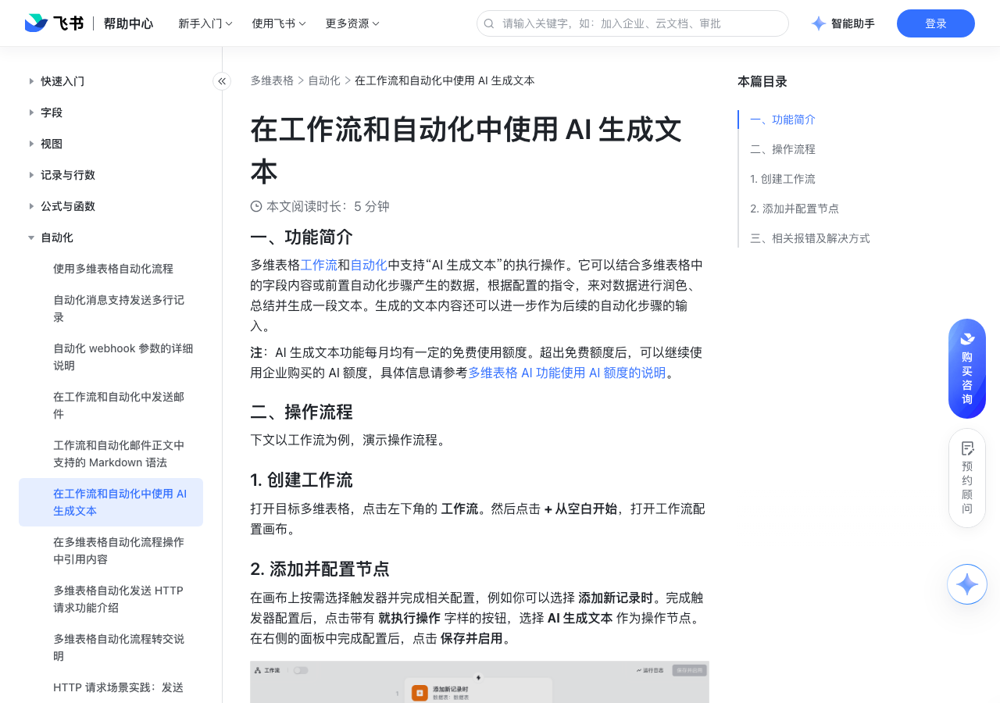

# 在工作流和自动化中使用 AI 生成文本

> 来源：[飞书帮助中心](https://www.feishu.cn/hc/zh-CN/articles/902812682257)  
> 分类：多维表格 / 自动化  
> 抓取时间：2026-09-22T01:24:00.865Z

## 界面截图

### 文档内配图

1. 配图：https://p1-hera.feishucdn.com/tos-cn-i-jbbdkfciu3/21abfe675d5444c69eb97637147d6f56~tplv-jbbdkfciu3-image:0:0.image
2. 配图：https://p1-hera.feishucdn.com/tos-cn-i-jbbdkfciu3/26a293fed0014e24b70ef9e06b9b6323~tplv-jbbdkfciu3-image:0:0.image
3. 配图：https://p1-hera.feishucdn.com/tos-cn-i-jbbdkfciu3/96e66c15731942d4b23b45621a28cd99~tplv-jbbdkfciu3-image:0:0.image
4. 配图：https://p1-hera.feishucdn.com/tos-cn-i-jbbdkfciu3/b1798f07f705423b8981ed9e71e1955e~tplv-jbbdkfciu3-image:0:0.image
5. 配图：https://p1-hera.feishucdn.com/tos-cn-i-jbbdkfciu3/2b8349b9069149f78b7aebe7ac1c51bd~tplv-jbbdkfciu3-image:0:0.image
6. 配图：https://p1-hera.feishucdn.com/tos-cn-i-jbbdkfciu3/be597fb2f1e2455ab79536a006d0edd4~tplv-jbbdkfciu3-image:0:0.image

## 功能定位

本页对应飞书帮助中心「多维表格 / 自动化」下的「在工作流和自动化中使用 AI 生成文本」。以下需求描述依据官方说明文档提炼，用于指导 DuoWei 对标实现。

## 功能目标

一、功能简介

## 文档结构（官方章节）

- 一、功能简介​
- 二、操作流程​
- 创建工作流​
- 添加并配置节点​
- 输入指令​
- 测试生成效果​
- 在后续步骤中引用生成的文本​
- 三、相关报错及解决方式​

## 详细功能说明

一、功能简介

二、操作流程

创建工作流

添加并配置节点

输入指令

测试生成效果

测试配置：

左侧为刚刚配置好的指令，此处仍然可以进行修改、引用或润色。

若你引用了数据表中的字段内容，你可以看到“用于测试的数据”这一列，它是生成测试结果的基础。你可以点击 生成测试数据 来更换数据源，点击 替换 即可使用新的测试数据。你也可以点击 重试，再次更换其他数据源。

预览生成结果：以测试数据为基础生成的测试结果展示在最右侧，支持 重新生成。

在后续步骤中引用生成的文本

三、相关报错及解决方式

报错文案

解决方法

AI 生成文本节点输入长度超过限制

AI 生成文本的输入长度上限为 8,192 个 UTF-8 字符。

减少指令的长度。

AI 生成文本节点输入指令错误

提示词内容不合法，例如触发了敏感词等。

修改指令内容。

AI 生成文本节点输入指令为空

指令为空时，无法调用模型生成文本。

重新检查指令并输入正确的指令内容。

报错文案 | 原因 | 解决方法

AI 生成文本节点输入长度超过限制 | AI 生成文本的输入长度上限为 8,192 个 UTF-8 字符。 | 减少指令的长度。

AI 生成文本节点输入指令错误 | 提示词内容不合法，例如触发了敏感词等。 | 修改指令内容。

AI 生成文本节点输入指令为空 | 指令为空时，无法调用模型生成文本。 | 重新检查指令并输入正确的指令内容。

## 实现要点（对标 DuoWei）

1. **入口与信息架构**：在产品中明确该能力所属模块（自动化），并保证用户可从对应导航触达。
2. **核心交互**：按上文「详细功能说明」还原主要操作路径；截图中出现的按钮、字段、面板命名尽量与飞书语义一致或可映射。
3. **数据与权限**：若文档涉及可见范围、可编辑范围、分享或高级权限，实现时需落到角色/成员模型，并保证 API/MCP 与 UI 权限一致。
4. **边界与上限**：若文档提到数量上限、格式限制、导入导出约束，需在实现与错误提示中体现。
5. **验收**：以本页截图场景为用例，完成「能打开 / 能配置 / 能保存 / 能被 Agent 读写（如适用）」四项检查。

## 原始摘录摘要

> 一、功能简介 二、操作流程 创建工作流 添加并配置节点 输入指令 测试生成效果 测试配置： 左侧为刚刚配置好的指令，此处仍然可以进行修改、引用或润色。 若你引用了数据表中的字段内容，你可以看到“用于测试的数据”这一列，它是生成测试结果的基础。你可以点击 生成测试数据 来更换数据源，点击 替换 即可使用新的测试数据。你也可以点击 重试，再次更换其他数据源。 预览生成结果：以测试数据为基础生成的测试结果展示在最右侧，支持 重新生成。 在后续步骤中引用生成的文本 三、相关报错及解决方式 报错文案 解决方法 AI 生成文本节点输入长度超过限制 AI 生成文本的输入长度上限为 8,192 个 UTF-8 字符。 减少指令的长度。 AI 生成文本节点输入指令错误 提示词内容不合法，例如触发了敏感词等。 修改指令内容。 AI 生成文本节点输入指令为空 指令为空时，无法调用模型生成文本。 重新检查指令并输入正确的指令内容。 报错文案 | 原因 | 解决方法 AI 生成文本节点输入长度超过限制 | AI 生成文本的输入长度上限为 8,192 个 UTF-8 字符。 | 减少指令的长度。 AI 生成文本节点输入指令错误 | 提示词内容不合法，例如触发了敏感词等。 | 修改指令内容。 AI 生成文本节点输入指令为空 | 指令为空时，无法调用模型生成文本。 | 重新检查指令并输入正确的指令内容。

## 元数据

- article_id: `7389956180586053635`
- category_id: `7165751270974767105`
- path: `/hc/zh-CN/articles/902812682257`
- extracted_text_length: 595
