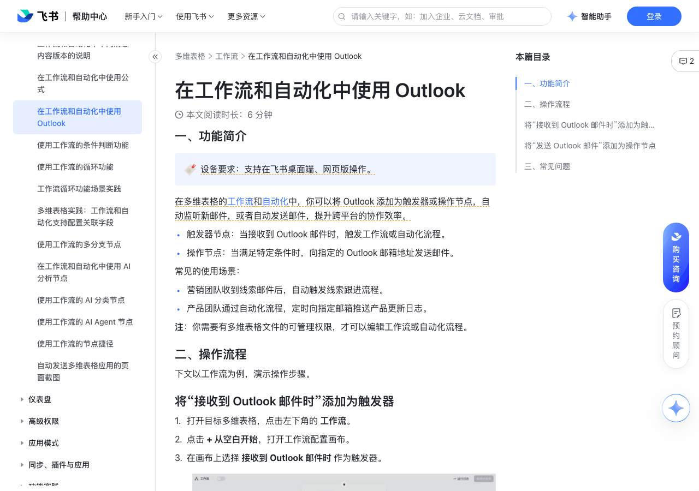

# 在工作流和自动化中使用 Outlook

> 来源：[飞书帮助中心](https://www.feishu.cn/hc/zh-CN/articles/033488625793)  
> 分类：多维表格 / 工作流  
> 抓取时间：2026-09-22T01:25:08.835Z

## 界面截图

### 文档内配图

1. 配图：https://p1-hera.feishucdn.com/tos-cn-i-jbbdkfciu3/caffede96e09415dbb30d69ecf019259~tplv-jbbdkfciu3-image:0:0.image
2. 配图：https://p1-hera.feishucdn.com/tos-cn-i-jbbdkfciu3/013430a35de14eaab40b0af5a966f904~tplv-jbbdkfciu3-image:0:0.image
3. 配图：https://p1-hera.feishucdn.com/tos-cn-i-jbbdkfciu3/ac4b46e103ad494899fa7aa2d7e5fc11~tplv-jbbdkfciu3-image:0:0.image
4. 配图：https://p1-hera.feishucdn.com/tos-cn-i-jbbdkfciu3/d9970e810fa4435896e1193de09d4d0f~tplv-jbbdkfciu3-image:0:0.image

## 功能定位

本页对应飞书帮助中心「多维表格 / 工作流」下的「在工作流和自动化中使用 Outlook」。以下需求描述依据官方说明文档提炼，用于指导 DuoWei 对标实现。

## 功能目标

一、功能简介

## 文档结构（官方章节）

- 一、功能简介​
- 二、操作流程​
- 将“接收到 Outlook 邮件时”添加为触发器​
- 将“发送 Outlook 邮件”添加为操作节点​
- 三、常见问题​

## 详细功能说明

一、功能简介

触发器节点：当接收到 Outlook 邮件时，触发工作流或自动化流程。

操作节点：当满足特定条件时，向指定的 Outlook 邮箱地址发送邮件。

营销团队收到线索邮件后，自动触发线索跟进流程。

产品团队通过自动化流程，定时向指定邮箱推送产品更新日志。

二、操作流程

将“接收到 Outlook 邮件时”添加为触发器

打开目标多维表格，点击左下角的 工作流。

点击 + 从空白开始，打开工作流配置画布。

在画布上选择 接收到 Outlook 邮件时 作为触发器。

在右侧弹窗中配置触发器的关联账号和触发条件：

关联账号：点击 + 关联账号，在弹窗中完成 Outlook 账号授权及关联操作。

完成授权后，后续在工作流中使用 Outlook 触发器或操作节点时，可直接关联已有的账号，无需再次授权。

如果你使用的是企业邮箱，需要企业管理员先完成组织授权（在工作流中使用 Outlook 管理员的账号进行授权操作，并代表组织同意授权），成员才可以关联个人账号。组织授权操作仅需进行一次。

触发条件（可选）：手动填写邮件主题关键词、正文关键词、发件地址、收件地址或抄送地址。

如果未配置任何条件，则接收到新邮件即触发流程。

关键词不区分大小写；每类关键词最多可填写 50 个；关键词只要有部分内容匹配，即视为满足条件。

邮箱地址不区分大小写；每类邮箱地址最多可填写 20 个。

添加操作节点后，保存并启用工作流。例如，你可以添加 新增记录 节点，那么每当收到 Outlook 邮件时，多维表格中就会自动创建一条相关记录。

将“发送 Outlook 邮件”添加为操作节点

在画布上按需选择触发器并完成相关配置，例如你可以选择 定时触发。

完成触发器配置后，点击带有 就执行操作 字样的按钮，选择 发送 Outlook 邮件 作为操作节点。

在右侧弹窗中配置操作节点的关联账号、接收人和邮件内容：

收件人/抄送/密送：指定邮件收件人、抄送人或密送收件人的邮箱地址，可手动填写或引用前序步骤中的数据。其中，抄送人、密送收件人为选填。

注：收件人、抄送人、密送收件人的上限均为 20。

主题：填写邮件的主题，可手动填写或引用前序步骤中的数据。

注：邮件主题最多支持 100 字（包括标点）。

正文：填写邮件的正文，可手动填写或引用前序步骤中的数据。邮件正文支持 HTML 语法，如加粗<b>文本</b>、斜体<i>文本</i>、分割线
、文字链接<a href="https://example.com">文本</a> 和标题文字格式<h1>文本</h1>。

注：邮件正文最多支持 10,000 字（包括标点）。

附件：仅支持引用前序步骤中的附件字段，作为邮件的附件发送。附件总数不得超过 20 个，附件的总大小不得超过 20 MB。

保存并启用工作流。

三、常见问题

问：在工作流或自动化流程中，进行复制、导入、导出或创建副本操作，关联的第三方账号会保留吗？

答：不会。在工作流或自动化流程中，进行复制、导入、导出或创建副本操作后，流程中关联的账号会被自动移除，需要重新关联。

## 实现要点（对标 DuoWei）

1. **入口与信息架构**：在产品中明确该能力所属模块（工作流），并保证用户可从对应导航触达。
2. **核心交互**：按上文「详细功能说明」还原主要操作路径；截图中出现的按钮、字段、面板命名尽量与飞书语义一致或可映射。
3. **数据与权限**：若文档涉及可见范围、可编辑范围、分享或高级权限，实现时需落到角色/成员模型，并保证 API/MCP 与 UI 权限一致。
4. **边界与上限**：若文档提到数量上限、格式限制、导入导出约束，需在实现与错误提示中体现。
5. **验收**：以本页截图场景为用例，完成「能打开 / 能配置 / 能保存 / 能被 Agent 读写（如适用）」四项检查。

## 原始摘录摘要

> 一、功能简介 触发器节点：当接收到 Outlook 邮件时，触发工作流或自动化流程。 操作节点：当满足特定条件时，向指定的 Outlook 邮箱地址发送邮件。 营销团队收到线索邮件后，自动触发线索跟进流程。 产品团队通过自动化流程，定时向指定邮箱推送产品更新日志。 二、操作流程 将“接收到 Outlook 邮件时”添加为触发器 打开目标多维表格，点击左下角的 工作流。 点击 + 从空白开始，打开工作流配置画布。 在画布上选择 接收到 Outlook 邮件时 作为触发器。 在右侧弹窗中配置触发器的关联账号和触发条件： 关联账号：点击 + 关联账号，在弹窗中完成 Outlook 账号授权及关联操作。 完成授权后，后续在工作流中使用 Outlook 触发器或操作节点时，可直接关联已有的账号，无需再次授权。 如果你使用的是企业邮箱，需要企业管理员先完成组织授权（在工作流中使用 Outlook 管理员的账号进行授权操作，并代表组织同意授权），成员才可以关联个人账号。组织授权操作仅需进行一次。 触发条件（可选）：手动填写邮件主题关键词、正文关键词、发件地址、收件地址或抄送地址。 如果未配置任何条件，则接收到新邮件即触发流程。 关键词不区分大小写；每类关键词最多可填写 50 个；关键词只要有部分内容匹配，即视为满足条件。 邮箱地址不区分大小写；每类邮箱地址最多可填写 20 个。 添加操作节点后，保存并启用工作流。例如，你可以添加 新增记录 节点，那么每当收到 Outlook 邮件时，多维表格中就会自动创建一条相关记录。 将“发送 Outlook 邮件”添加为操作节点 在画布上按需选择触发器并完成相关配置，例如你可以选择 定时触发。 完成触发器配置后，点击带有 就执行操作 字样的按钮，选择 发送 Outlook 邮件 作为操作节点。 在右侧弹窗中配置操作节点的关联账号、接收人和邮件内容： …

## 元数据

- article_id: `7569925341642080260`
- category_id: `7415964452380049412`
- path: `/hc/zh-CN/articles/033488625793`
- extracted_text_length: 1291
