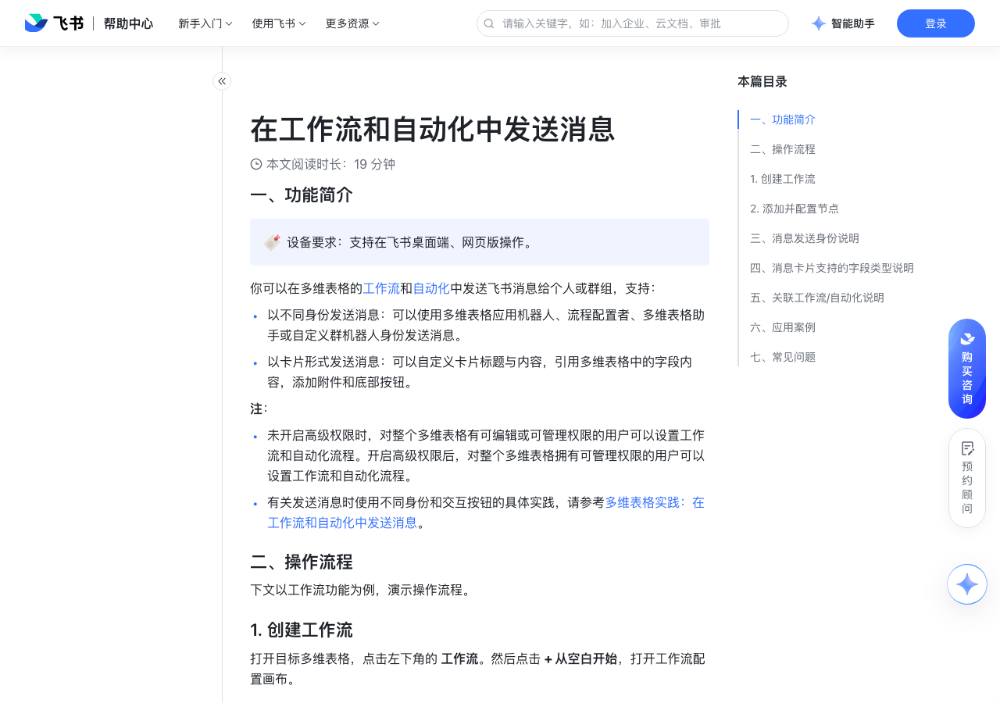

# 在工作流和自动化中发送消息

> 来源：[飞书帮助中心](https://www.feishu.cn/hc/zh-CN/articles/986962389649)  
> 分类：多维表格 / 工作流  
> 抓取时间：2026-09-22T01:25:10.280Z

## 界面截图

### 文档内配图

1. 配图：https://p1-hera.feishucdn.com/tos-cn-i-jbbdkfciu3/fda4aae052de4643a1ef1c4c0668e2b4~tplv-jbbdkfciu3-image:0:0.image
2. 配图：https://p1-hera.feishucdn.com/tos-cn-i-jbbdkfciu3/fcb081e470a04c989e8871d2ea442092~tplv-jbbdkfciu3-image:0:0.image
3. 配图：https://p1-hera.feishucdn.com/tos-cn-i-jbbdkfciu3/a32b8c1beb3944efb7a037535de29b03~tplv-jbbdkfciu3-image:0:0.image
4. 配图：https://p1-hera.feishucdn.com/tos-cn-i-jbbdkfciu3/699ccf197e1543a18e14b67c9802f937~tplv-jbbdkfciu3-image:0:0.image
5. 配图：https://p1-hera.feishucdn.com/tos-cn-i-jbbdkfciu3/07d6bc26c60f40d4a54057d2edfe6dbf~tplv-jbbdkfciu3-image:0:0.image
6. 配图：https://p1-hera.feishucdn.com/tos-cn-i-jbbdkfciu3/4f6507e67bca4b07a91e24739e34e0e9~tplv-jbbdkfciu3-image:0:0.image
7. 配图：https://p1-hera.feishucdn.com/tos-cn-i-jbbdkfciu3/a18afd615e944422b1ee2edba9379b83~tplv-jbbdkfciu3-image:0:0.image
8. 配图：https://p1-hera.feishucdn.com/tos-cn-i-jbbdkfciu3/e99decc7501c4e12a58e4852d56fd529~tplv-jbbdkfciu3-image:0:0.image
9. 配图：https://p1-hera.feishucdn.com/tos-cn-i-jbbdkfciu3/34de7c59e37946f1ad4d05aadaf3aec2~tplv-jbbdkfciu3-image:0:0.image
10. 配图：https://p1-hera.feishucdn.com/tos-cn-i-jbbdkfciu3/bcb54a81f63b4961a61a7a4927db62f9~tplv-jbbdkfciu3-image:0:0.image

## 功能定位

本页对应飞书帮助中心「多维表格 / 工作流」下的「在工作流和自动化中发送消息」。以下需求描述依据官方说明文档提炼，用于指导 DuoWei 对标实现。

## 功能目标

一、功能简介

## 文档结构（官方章节）

- 一、功能简介​
- 二、操作流程​
- 创建工作流​
- 添加并配置节点​
- 配置由谁发送消息​
- 配置消息接收方/群机器人 webhook 地址​
- 配置消息标题和内容​
- 配置消息附件​
- 配置消息底部按钮​
- 三、消息发送身份说明​
- 四、消息卡片支持的字段类型说明​
- 五、关联工作流/自动化说明​
- 六、应用案例​
- 在消息内容中引用多行记录​
- 七、常见问题​

## 详细功能说明

一、功能简介

以不同身份发送消息：可以使用多维表格应用机器人、流程配置者、多维表格助手或自定义群机器人身份发送消息。

以卡片形式发送消息：可以自定义卡片标题与内容，引用多维表格中的字段内容，添加附件和底部按钮。

未开启高级权限时，对整个多维表格有可编辑或可管理权限的用户可以设置工作流和自动化流程。开启高级权限后，对整个多维表格拥有可管理权限的用户可以设置工作流和自动化流程。

有关发送消息时使用不同身份和交互按钮的具体实践，请参考多维表格实践：在工作流和自动化中发送消息。

二、操作流程

创建工作流

添加并配置节点

配置由谁发送消息

多维表格应用机器人：以多维表格应用机器人身份发送消息，名称、图标与当前多维表格一致。以该身份发送消息，接收者可以明确区分消息的来源和所属多维表格，避免消息过多造成混淆。

注：使用多维表格应用机器人发送消息时，该机器人会自动获得当前多维表格的编辑权限，且会被添加到多维表格的文档应用里。你可以点击多维表格右上角 ··· 图标 > ··· 更多 > 添加文档应用，查看并管理应用机器人的权限。

用户身份：以流程配置者的个人身份发送消息，适用于个人群发通知场景，如管理者为员工发送生日祝福。

多维表格助手：以多维表格官方机器人的身份发送消息，但名称、图标不可修改，适用于广泛的消息通知场景。

自定义群机器人：以群机器人的身份向机器人所在的群组发送消息，适用于特定群组中的消息通知场景。

配置消息接收方/群机器人 webhook 地址

如果在 由谁发送 中选择了多维表格应用机器人、用户身份或多维表格助手，则在此处选择接收消息的群组、人员，或者直接选择多维表格协作者（人员或群组）。

如果选择多维表格协作者作为接收方，最多可以给前 10 个协作者发送消息，每个群组计为 1 个协作者。此外，接收消息的人员和群组总数上限会随发送身份不同而变化，具体信息请参考“三、消息发送身份说明”。

注：如果使用多维表格应用机器人或多维表格助手身份发送消息到群组，还可以勾选 单独通知每个群成员。勾选后，消息将单独发送给每一位群成员，不会在群内发送消息。该功能仅支持选择 200 人以下的群聊。

如果在 由谁发送 中选择了自定义群机器人，则填入自定义群机器人的 webhook 地址。最多可添加 5 个群机器人 webhook 地址。有关使用自定义机器人发送消息的实践的具体信息，请参考 HTTP 请求场景实践：发送群组消息。

配置消息标题和内容

切换为传统模式后，你可以基于 Markdown 和 HTML 语法设置内容格式。在这种模式下，你可以使用更多高级格式进行内容编辑，但需要了解格式代码。有关 Markdown 语法的具体信息，请参考工作流和自动化中不同消息内容版本的说明。

切换为富文本模式后，你可以通过工具栏直接设置内容格式，包括标题、加粗、删除线、斜体、文字颜色、有序列表、无序列表、超链接、表格、分割线。在这种模式下，你无需了解格式代码，即可快速完成内容格式编辑。

在普通消息中使用富文本模式时，不支持使用标题、字体颜色、表格、删除线格式。仅触发器为“接收到飞书消息时”且消息发送场景为“回复接收到的消息”时，消息类型支持选择普通消息；其他场景下消息类型默认为消息卡片，不支持修改为普通消息。

在消息 1.0 版本中使用富文本模式时，不支持使用标题、表格格式。有关消息 1.0 版本的具体信息，请参考工作流和自动化中不同消息内容版本的说明。

配置消息附件

配置消息底部按钮

按钮配置项

按钮文字

自定义按钮显示的文本内容。

按钮样式

支持“默认样式”“强调样式”“警示样式”三种。

点击按钮时

支持添加“跳转链接”“新增记录”“修改记录”“执行自动化”“执行工作流”操作。跳转链接：点击按钮后即可跳转至指定的页面，如多维表格的视图、记录或任何指定的链接。你可以输入链接地址，也可以点击 ⊕ 引用值 图标来进行引用，例如引用超链接、文本等字段内容，或是引用多维表格变量（多维表格链接、数据表链接、视图链接等）。注：此处引用的字段内容需为正确的链接格式，否则可能会使流程运行失败，出现“内容校验未通过”的报错。支持引用包含正确链接格式的文本字段和超链接字段，不支持公式字段中由 HYPERLINK 函数生成的结果。新增记录/修改记录：点击按钮后，在指定的数据表中新增或修改记录。你可以设置自动填写哪些内容，至少需选择一个字段值进行预设。你还可以勾选 点击后禁用按钮。勾选后，消息卡片中的按钮文字在点击后会变成“已点击”，并且无法再次点击。如果消息是发送给群组，你还可以进一步设置仅本人或所有群成员均禁用按钮。此处的设置将自动应用于当前流程中其他勾选了 点击后禁用按钮 的按钮。注：修改记录仅适用于前序节点中已关联某条记录的场景，如查找了数据表中的某条记录。如果前序节点中没有关联任何记录，则无法使用修改记录。250px|700px|reset250px|700px|reset执行工作流/自动化：点击按钮后，执行当前多维表格内已设定好的其他自动化或工作流。仅可以选择已开启的、且触发条件为“点击按钮时”的流程。支持关联的自动化或工作流受当前配置流程的触发条件的限制，具体信息请参考本文“五、关联工作流/自动化说明”。注：如果你在“由谁发送”处选择 自定义机器人 来发送消息，底部按钮可执行的操作只有“跳转链接”。

跳转链接：点击按钮后即可跳转至指定的页面，如多维表格的视图、记录或任何指定的链接。你可以输入链接地址，也可以点击 ⊕ 引用值 图标来进行引用，例如引用超链接、文本等字段内容，或是引用多维表格变量（多维表格链接、数据表链接、视图链接等）。

注：此处引用的字段内容需为正确的链接格式，否则可能会使流程运行失败，出现“内容校验未通过”的报错。支持引用包含正确链接格式的文本字段和超链接字段，不支持公式字段中由 HYPERLINK 函数生成的结果。

新增记录/修改记录：点击按钮后，在指定的数据表中新增或修改记录。你可以设置自动填写哪些内容，至少需选择一个字段值进行预设。你还可以勾选 点击后禁用按钮。勾选后，消息卡片中的按钮文字在点击后会变成“已点击”，并且无法再次点击。

如果消息是发送给群组，你还可以进一步设置仅本人或所有群成员均禁用按钮。此处的设置将自动应用于当前流程中其他勾选了 点击后禁用按钮 的按钮。

注：修改记录仅适用于前序节点中已关联某条记录的场景，如查找了数据表中的某条记录。如果前序节点中没有关联任何记录，则无法使用修改记录。

250px|700px|reset250px|700px|reset

执行工作流/自动化：点击按钮后，执行当前多维表格内已设定好的其他自动化或工作流。仅可以选择已开启的、且触发条件为“点击按钮时”的流程。支持关联的自动化或工作流受当前配置流程的触发条件的限制，具体信息请参考本文“五、关联工作流/自动化说明”。

注：如果你在“由谁发送”处选择 自定义机器人 来发送消息，底部按钮可执行的操作只有“跳转链接”。

三、消息发送身份说明

由谁发送

是否支持发送给外部人员或群组

单独通知选中群组中的每个群成员

同时发送消息给个人和群组

多维表格应用机器人

支持注：群组成员需小于 200 人，才能进行“单独通知”。

支持注：发送给个人时，一个多维表格应用机器人最多可以给 5,000 个不同的个人用户发送消息。发送给群组时，最后保存并启用该流程的人必须在群组中。即使多维表格应用机器人已经被邀请入群，最后启用流程的人也不能退出群组，否则会发送失败；一个步骤（节点）最多可选择 5 个群，每个流程最多可选择 10 个群。

发送给个人时，一个多维表格应用机器人最多可以给 5,000 个不同的个人用户发送消息。

发送给群组时，最后保存并启用该流程的人必须在群组中。即使多维表格应用机器人已经被邀请入群，最后启用流程的人也不能退出群组，否则会发送失败；一个步骤（节点）最多可选择 5 个群，每个流程最多可选择 10 个群。

用户身份（流程配置者本人）

支持发送给流程配置者的外部联系人，及其所在的外部群

支持注：发送给个人时，一个步骤（节点）最多可选择 20 人。每分钟可发送的单聊消息上限为 200 个。发送给群组时，流程配置者必须在群组中；一个步骤（节点）最多可选择 5 个群，每个流程最多可选择 10 个群。

发送给个人时，一个步骤（节点）最多可选择 20 人。每分钟可发送的单聊消息上限为 200 个。

发送给群组时，流程配置者必须在群组中；一个步骤（节点）最多可选择 5 个群，每个流程最多可选择 10 个群。

多维表格助手

支持注：发送给个人时，无人数限制。但如果人数过多，消息可能会发送失败。发送给群组时，流程配置者必须提前邀请“多维表格助手”入群；一个步骤（节点）最多可选择 5 个群，每个流程最多可选择 10 个群。多维表格助手入群后，流程配置者可以退群，消息仍可正常发送。如果群组中已经有了其他人邀请入群的“多维表格助手”机器人，那么消息会发送失败，显示“机器人不在接收消息的群里”的报错。建议移除已有的多维表格助手，或更换消息的发送身份。

发送给个人时，无人数限制。但如果人数过多，消息可能会发送失败。

发送给群组时，流程配置者必须提前邀请“多维表格助手”入群；一个步骤（节点）最多可选择 5 个群，每个流程最多可选择 10 个群。

多维表格助手入群后，流程配置者可以退群，消息仍可正常发送。如果群组中已经有了其他人邀请入群的“多维表格助手”机器人，那么消息会发送失败，显示“机器人不在接收消息的群里”的报错。建议移除已有的多维表格助手，或更换消息的发送身份。

自定义群机器人

支持发送给机器人所在的外部群

不支持，只能发送消息给机器人所在的群组。

四、消息卡片支持的字段类型说明

消息卡片支持的字段类型

在消息卡片上展示的格式

消息卡片上的内容限制

无限制。

单选/多选/群组/地理位置/条码/单向关联/查找引用

最多可展示 100 个字符。

最多可展示 100 个字符。注：如果公式字段内包含换行，会被识别为 \n，计算为 2 个字符。

自动编号

数字/文本

进度/评分/货币/数字/电话号码

最多可添加 10 个人员。

仅支持展示图片类型的附件。注：如果消息内容中添加了表格，表格中不支持引用附件字段。如果你想引用其他类型的附件，可以选择直接发送消息附件。该功能仅适用于发送对象为多维表格应用机器人的场景。具体信息请参考本篇“配置消息附件”小节。

如果消息内容中添加了表格，表格中不支持引用附件字段。

如果你想引用其他类型的附件，可以选择直接发送消息附件。该功能仅适用于发送对象为多维表格应用机器人的场景。具体信息请参考本篇“配置消息附件”小节。

单张图片不得超过 10 MB，每个消息卡片最多可展示 100 张图片。

true 或 false

不涉及。

五、关联工作流/自动化说明

当前流程的触发条件

可关联的流程

添加新记录时修改记录时新增/修改的记录满足条件时到达记录中的时间时点击按钮时，且按钮类型为“按钮字段”

添加新记录时

修改记录时

新增/修改的记录满足条件时

到达记录中的时间时

点击按钮时，且按钮类型为“按钮字段”

可关联以下两类流程：触发条件为“点击按钮时”、按钮类型为“按钮组件”的已开启的流程。250px|700px|reset触发条件为“点击按钮时”、按钮类型为“按钮字段”，且该按钮字段位于左侧的触发条件所选数据表当中的、已开启的流程。250px|700px|reset

触发条件为“点击按钮时”、按钮类型为“按钮组件”的已开启的流程。

触发条件为“点击按钮时”、按钮类型为“按钮字段”，且该按钮字段位于左侧的触发条件所选数据表当中的、已开启的流程。

定时触发点击按钮时，且按钮类型为“按钮组件”接收到飞书消息时接收到 webhook 时接收到 Outlook 邮件时

定时触发

点击按钮时，且按钮类型为“按钮组件”

接收到飞书消息时

接收到 webhook 时

接收到 Outlook 邮件时

仅可以关联触发条件为“点击按钮时”，且按钮类型为“按钮组件”的已开启的流程。250px|700px|reset

六、应用案例

在消息内容中引用多行记录

选择任一方式，在消息内容中添加表格或列表。

方式 1：在富文本模式下，点击工具栏中的 表格 图标，然后将鼠标悬停在前序步骤中查找到的所有记录。

方式 2：点击输入框右下角的 ⊕ 图标，然后将鼠标悬停在前序步骤中查找到的所有记录。

在弹窗中选择内容展示方式：

列表：通过列表展示查找到的记录，每条记录作为列表中的一项，每个字段的内容展示为列表项中的固定行。

250px|700px|reset

表格：通过表格展示查找到的记录，每条记录展示为表格中的一行，每个字段的内容展示为表格中的一列。单个表格的行数上限为 50，列数无限制。单个消息卡片中最多可添加 5 个表格。

确认字段的展示顺序：在插入字段弹窗中取消已勾选的字段，重新勾选需要展示的字段，勾选时选择字段的顺序即为字段最终的展示顺序。

点击 插入。

七、常见问题

问：多维表格工作流或自动化消息中配置的“点击按钮”操作，对使用者有权限要求吗？

答：按钮的点击权限取决于所在多维表格是否开启了高级权限：未开启高级权限：点击者无需任何权限，即可点击按钮并触发对应流程，如修改记录。已开启高级权限：点击者需需要有目标记录的阅读权限，才可以点击按钮并触发对应流程，如修改记录。

问：多维表格工作流或自动化中配置点击按钮后的操作时，为什么无法选择“修改记录”？

答：这是因为所配置的自动化流程的触发条件中没有选择任何数据表。当触发条件为“定时触发”时，或触发条件是“点击按钮时”且按钮类型为“按钮组件”时，无法选择“修改记录”的操作。250px|700px|reset250px|700px|reset

问：如果某个多维表格应用机器人对应的多维表格被删除，是否还能继续使用该应用机器人？

答：不能。当多维表格文档被删除时，对应的应用机器人账号会被停用。文档所有者在 30 天内可从回收站内恢复被删除的多维表格，恢复时该应用机器人账号就会被重新启用。超过 30 天后多维表格文件会被彻底删除。企业管理员在 90 天内可从后台恢复被删除的多维表格，恢复时该应用机器人账号就会被重新启用。超过 90 天后，多维表格文件会被彻底删除。具体信息请参考管理企业云文档文件。

问：当我进行使用模板、创建副本、导入导出等操作时，若原多维表格中已有一个多维表格应用机器人，是否会同步创建到新多维表格中？

答：否。创建的副本文档会在使用工作流或自动化发送消息等功能时，重新生成另一个应用机器人身份。

问：如果保存并启用工作流或自动化流程的人不在群组内，要如何向这个群组发送消息？

答：如果流程的启用者不在群里，可以将消息的发送身份更改为“自定义机器人”，并获取到这个群组对应的群机器人的 webhook 地址，再发送消息。

问：如何撤回多维表格自动化或工作流发送的消息？

答：不同发送场景下的消息撤回规则如下：个人身份发送的消息：发送人可直接撤回。群组中发送的消息：群主或群管理员可撤回。其他自动化消息：不支持撤回操作。

问：在多维表格自动化或工作流中，通过飞书消息发送仪表盘图片时，为什么图片展示异常？

答：当仪表盘没有任何数据或可视化内容时，生成的图片就显示为空白。

按钮配置项 | 说明

按钮文字 | 自定义按钮显示的文本内容。

按钮样式 | 支持“默认样式”“强调样式”“警示样式”三种。

点击按钮时 | 支持添加“跳转链接”“新增记录”“修改记录”“执行自动化”“执行工作流”操作。跳转链接：点击按钮后即可跳转至指定的页面，如多维表格的视图、记录或任何指定的链接。你可以输入链接地址，也可以点击 ⊕ 引用值 图标来进行引用，例如引用超链接、文本等字段内容，或是引用多维表格变量（多维表格链接、数据表链接、视图链接等）。注：此处引用的字段内容需为正确的链接格式，否则可能会使流程运行失败，出现“内容校验未通过”的报错。支持引用包含正确链接格式的文本字段和超链接字段，不支持公式字段中由 HYPERLINK 函数生成的结果。新增记录/修改记录：点击按钮后，在指定的数据表中新增或修改记录。你可以设置自动填写哪些内容，至少需选择一个字段值进行预设。你还可以勾选 点击后禁用按钮。勾选后，消息卡片中的按钮文字在点击后会变成“已点击”，并且无法再次点击。如果消息是发送给群组，你还可以进一步设置仅本人或所有群成员均禁用按钮。此处的设置将自动应用于当前流程中其他勾选了 点击后禁用按钮 的按钮。注：修改记录仅适用于前序节点中已关联某条记录的场景，如查找了数据表中的某条记录。如果前序节点中没有关联任何记录，则无法使用修改记录。250px|700px|reset250px|700px|reset执行工作流/自动化：点击按钮后，执行当前多维表格内已设定好的其他自动化或工作流。仅可以选择已开启的、且触发条件为“点击按钮时”的流程。支持关联的自动化或工作流受当前配置流程的触发条件的限制，具体信息请参考本文“五、关联工作流/自动化说明”。注：如果你在“由谁发送”处选择 自定义机器人 来发送消息，底部按钮可执行的操作只有“跳转链接”。

由谁发送 | 是否支持发送给外部人员或群组 | 单独通知选中群组中的每个群成员 | 同时发送消息给个人和群组

多维表格应用机器人 | 不支持 | 支持注：群组成员需小于 200 人，才能进行“单独通知”。 | 支持注：发送给个人时，一个多维表格应用机器人最多可以给 5,000 个不同的个人用户发送消息。发送给群组时，最后保存并启用该流程的人必须在群组中。即使多维表格应用机器人已经被邀请入群，最后启用流程的人也不能退出群组，否则会发送失败；一个步骤（节点）最多可选择 5 个群，每个流程最多可选择 10 个群。

用户身份（流程配置者本人） | 支持发送给流程配置者的外部联系人，及其所在的外部群 | 不支持 | 支持注：发送给个人时，一个步骤（节点）最多可选择 20 人。每分钟可发送的单聊消息上限为 200 个。发送给群组时，流程配置者必须在群组中；一个步骤（节点）最多可选择 5 个群，每个流程最多可选择 10 个群。

多维表格助手 | 支持 | 支持注：群组成员需小于 200 人，才能进行“单独通知”。 | 支持注：发送给个人时，无人数限制。但如果人数过多，消息可能会发送失败。发送给群组时，流程配置者必须提前邀请“多维表格助手”入群；一个步骤（节点）最多可选择 5 个群，每个流程最多可选择 10 个群。多维表格助手入群后，流程配置者可以退群，消息仍可正常发送。如果群组中已经有了其他人邀请入群的“多维表格助手”机器人，那么消息会发送失败，显示“机器人不在接收消息的群里”的报错。建议移除已有的多维表格助手，或更换消息的发送身份。

自定义群机器人 | 支持发送给机器人所在的外部群 | 不支持 | 不支持，只能发送消息给机器人所在的群组。

消息卡片支持的字段类型 | 在消息卡片上展示的格式 | 消息卡片上的内容限制

文本 | 文本 | 无限制。

单选/多选/群组/地理位置/条码/单向关联/查找引用 | 文本 | 最多可展示 100 个字符。

公式 | 文本 | 最多可展示 100 个字符。注：如果公式字段内包含换行，会被识别为 \n，计算为 2 个字符。

自动编号 | 数字/文本 | 最多可展示 100 个字符。

进度/评分/货币/数字/电话号码 | 数字 | 最多可展示 100 个字符。

人员 | @人名 | 最多可添加 10 个人员。

附件 | 仅支持展示图片类型的附件。注：如果消息内容中添加了表格，表格中不支持引用附件字段。如果你想引用其他类型的附件，可以选择直接发送消息附件。该功能仅适用于发送对象为多维表格应用机器人的场景。具体信息请参考本篇“配置消息附件”小节。 | 单张图片不得超过 10 MB，每个消息卡片最多可展示 100 张图片。

复选框 | true 或 false | 不涉及。

超链接 | 超链接 | 最多可展示 100 个字符。

当前流程的触发条件 | 可关联的流程

添加新记录时修改记录时新增/修改的记录满足条件时到达记录中的时间时点击按钮时，且按钮类型为“按钮字段” | 可关联以下两类流程：触发条件为“点击按钮时”、按钮类型为“按钮组件”的已开启的流程。250px|700px|reset触发条件为“点击按钮时”、按钮类型为“按钮字段”，且该按钮字段位于左侧的触发条件所选数据表当中的、已开启的流程。250px|700px|reset

定时触发点击按钮时，且按钮类型为“按钮组件”接收到飞书消息时接收到 webhook 时接收到 Outlook 邮件时 | 仅可以关联触发条件为“点击按钮时”，且按钮类型为“按钮组件”的已开启的流程。250px|700px|reset

## 实现要点（对标 DuoWei）

1. **入口与信息架构**：在产品中明确该能力所属模块（工作流），并保证用户可从对应导航触达。
2. **核心交互**：按上文「详细功能说明」还原主要操作路径；截图中出现的按钮、字段、面板命名尽量与飞书语义一致或可映射。
3. **数据与权限**：若文档涉及可见范围、可编辑范围、分享或高级权限，实现时需落到角色/成员模型，并保证 API/MCP 与 UI 权限一致。
4. **边界与上限**：若文档提到数量上限、格式限制、导入导出约束，需在实现与错误提示中体现。
5. **验收**：以本页截图场景为用例，完成「能打开 / 能配置 / 能保存 / 能被 Agent 读写（如适用）」四项检查。

## 原始摘录摘要

> 一、功能简介 以不同身份发送消息：可以使用多维表格应用机器人、流程配置者、多维表格助手或自定义群机器人身份发送消息。 以卡片形式发送消息：可以自定义卡片标题与内容，引用多维表格中的字段内容，添加附件和底部按钮。 未开启高级权限时，对整个多维表格有可编辑或可管理权限的用户可以设置工作流和自动化流程。开启高级权限后，对整个多维表格拥有可管理权限的用户可以设置工作流和自动化流程。 有关发送消息时使用不同身份和交互按钮的具体实践，请参考多维表格实践：在工作流和自动化中发送消息。 二、操作流程 创建工作流 添加并配置节点 配置由谁发送消息 多维表格应用机器人：以多维表格应用机器人身份发送消息，名称、图标与当前多维表格一致。以该身份发送消息，接收者可以明确区分消息的来源和所属多维表格，避免消息过多造成混淆。 注：使用多维表格应用机器人发送消息时，该机器人会自动获得当前多维表格的编辑权限，且会被添加到多维表格的文档应用里。你可以点击多维表格右上角 ··· 图标 > ··· 更多 > 添加文档应用，查看并管理应用机器人的权限。 用户身份：以流程配置者的个人身份发送消息，适用于个人群发通知场景，如管理者为员工发送生日祝福。 多维表格助手：以多维表格官方机器人的身份发送消息，但名称、图标不可修改，适用于广泛的消息通知场景。 自定义群机器人：以群机器人的身份向机器人所在的群组发送消息，适用于特定群组中的消息通知场景。 配置消息接收方/群机器人 webhook 地址 如果在 由谁发送 中选择了多维表格应用机器人、用户身份或多维表格助手，则在此处选择接收消息的群组、人员，或者直接选择多维表格协作者（人员或群组）。 如果选择多维表格协作者作为接收方，最多可以给前 10 个协作者发送消息，每个群组计为 1 个协作者。此外，接收消息的人员和群组总数上限会随发送身份不同而变化，具体信息请参考“三、消息发送身…

## 元数据

- article_id: `7223715710027317249`
- category_id: `7415964452380049412`
- path: `/hc/zh-CN/articles/986962389649`
- extracted_text_length: 8627
