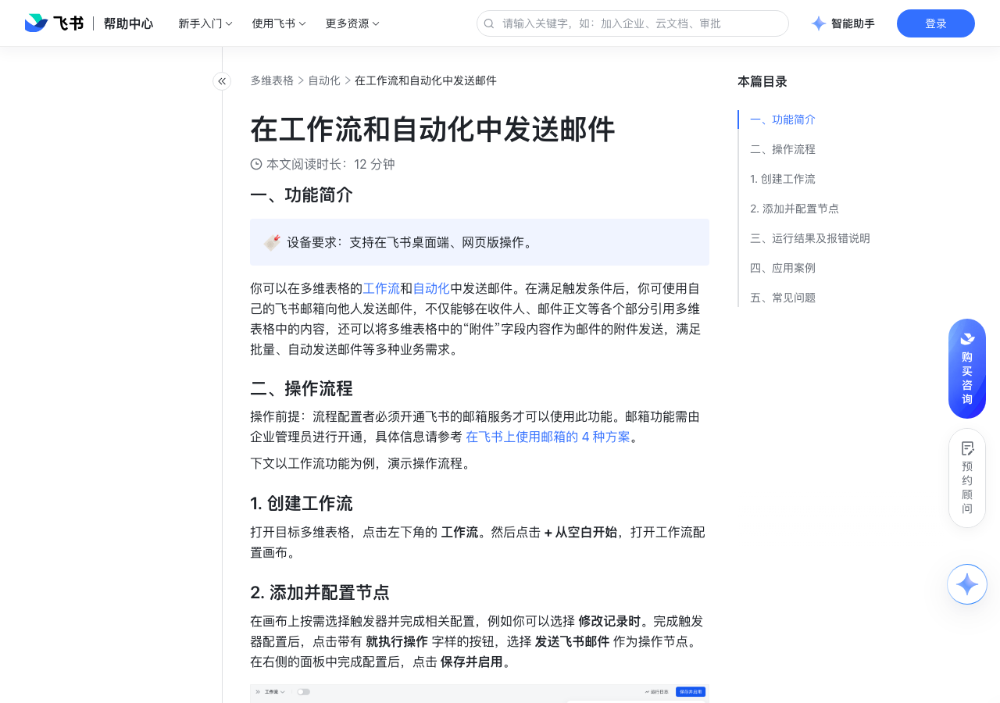

# 在工作流和自动化中发送邮件

> 来源：[飞书帮助中心](https://www.feishu.cn/hc/zh-CN/articles/209545872125)  
> 分类：多维表格 / 自动化  
> 抓取时间：2026-09-22T01:24:00.351Z

## 界面截图

### 文档内配图

1. 配图：https://p1-hera.feishucdn.com/tos-cn-i-jbbdkfciu3/76cb6c35ce57419ab512ce684e7bc166~tplv-jbbdkfciu3-image:0:0.image
2. 配图：https://p1-hera.feishucdn.com/tos-cn-i-jbbdkfciu3/a78302d6a422446b9c9a1429efb32b91~tplv-jbbdkfciu3-image:0:0.image
3. image.png：https://p1-hera.feishucdn.com/tos-cn-i-jbbdkfciu3/c0e9b855875b42868a7af7ba5e21b127.png~tplv-jbbdkfciu3-png:0:0.png
4. 配图：https://p1-hera.feishucdn.com/tos-cn-i-jbbdkfciu3/e01c6d8c5dfe4cbcb8cdacaad0709286~tplv-jbbdkfciu3-image:0:0.image
5. 配图：https://p1-hera.feishucdn.com/tos-cn-i-jbbdkfciu3/1ab7040160d74a1195291135a52f77ce~tplv-jbbdkfciu3-image:0:0.image
6. 配图：https://p1-hera.feishucdn.com/tos-cn-i-jbbdkfciu3/a96c41f606094be694e0b224a426de23~tplv-jbbdkfciu3-image:0:0.image
7. 配图：https://p1-hera.feishucdn.com/tos-cn-i-jbbdkfciu3/cffad24d38e444e08734f8b74475d48b~tplv-jbbdkfciu3-image:0:0.image
8. 配图：https://p1-hera.feishucdn.com/tos-cn-i-jbbdkfciu3/47d0038b73b14195b496471628edd05a~tplv-jbbdkfciu3-image:0:0.image
9. 配图：https://p1-hera.feishucdn.com/tos-cn-i-jbbdkfciu3/204b752cff56488fa36df21a125da31d~tplv-jbbdkfciu3-image:0:0.image

## 功能定位

本页对应飞书帮助中心「多维表格 / 自动化」下的「在工作流和自动化中发送邮件」。以下需求描述依据官方说明文档提炼，用于指导 DuoWei 对标实现。

## 功能目标

一、功能简介

## 文档结构（官方章节）

- 一、功能简介​
- 二、操作流程​
- 创建工作流​
- 添加并配置节点​
- 确认发件人​
- 设置收件人​
- 填写邮件主题及正文​
- 引用附件​
- 显示邮件来源及进行预览​
- 三、运行结果及报错说明​
- 四、应用案例​
- 在邮件正文中引用多行记录​
- 五、常见问题​

## 详细功能说明

一、功能简介

二、操作流程

创建工作流

添加并配置节点

确认发件人

设置收件人

选择联系人：支持选择企业内部联系人和可获取到邮箱信息的外部联系人。

注：如果外部联系人所在组织设置了不对外显示邮件信息，则无法获取该联系人的邮箱信息。

直接输入邮箱地址：需输入正确的邮箱格式，无其他限制。

引用之前步骤产生的数据：

支持选择 Email 字段、人员字段（包括记录创建人和修改人）、群组字段、文本字段、公式字段、查找引用字段。

引用文本字段时，可通过英文逗号分隔多个邮箱地址，实现“同时发送给多个收件人”的效果。

引用人员字段时，对方必须是企业内部成员、且设置了工作邮箱，邮件才能发送成功。如果你想要给外部人员发送邮件，请直接输入邮箱地址。

引用群组字段时，对应群组需要有群邮箱地址，邮件才能发送成功。点击群组右上角的 ··· 图标 > 设置 > 编辑群信息 > 获取群邮箱地址，即可查看群邮箱。如果你看不到群邮箱，说明无法发送邮件至此群。

250px|700px|reset

支持选择“多维表格协作者”，你可以将协作者中的人员或群组直接作为收件人。协作者中不包括部门、匿名用户、外部用户及外部群组。如果选择多维表格协作者作为接收方，最多可以给前 10 个协作者发送消息，每个群组计为 1 个协作者。

填写邮件主题及正文

在邮件正文中插入图片：

邮件正文中仅支持插入图片类型的附件，不支持其它类型。

在正文中插入的图片仅支持 .jpg 和 .png 格式，单个图片大小不得超过 2 MB。正文中最多可插入 5 张图片。

你可以使用 富文本模式 或者 传统模式 编辑邮件正文的格式，点击输入框右上角的切换按钮即可快速切换编辑模式。

切换为传统模式后，你可以基于 Markdown 和 HTML 语法设置内容格式。在这种模式下，你可以使用更多高级格式，但需要了解格式代码。有关 Markdown 基础语法的具体信息，请参考工作流和自动化邮件正文中支持的 Markdown 语法。

切换为富文本模式后，你可以通过工具栏直接设置内容格式，包括标题、加粗、删除线、斜体、文字颜色、有序列表、无序列表、超链接、表格、分割线。在这种模式下，你无需了解格式代码，即可快速完成内容格式编辑。

引用附件

显示邮件来源及进行预览

三、运行结果及报错说明

报错文案

解决方式

邮件图片数量超出限制，请减少图片后重试。

邮件正文中最多可插入 5 张图片。请减少图片数量。

邮件图片大小超出限制，请优化图片或减少数量后重试。

邮件正文中单个图片大小不得超过 2 MB。

附件数量超出限制，请减少附件后重试。

一封邮件的附件总数不得超过 20 个。

附件大小超出限制，请减少附件数量或调整附件大小。

一封邮件的附件总大小不得超过 20 MB。

邮件大小超出限制，请减少正文或附件内容后重试。

一封邮件的大小不得超过 37.5 MB，请减少正文、图片、附件等内容后重试。

收件人列表中无可用的邮箱地址。

检查收件人和密送列表，修改为正确邮箱地址后重试。

单次收件人个数超出上限，请减少收件人数量或分批发送。

单次收件人、抄送、密送的总和不得超过 500 个。

个人当日可发送的邮件数已达上限，次日恢复。

每个人具体的发送上限与当前使用的版本有关，可咨询企业管理员。具体信息请参考发信限制规则介绍。若当日可发送的邮件数/外部邮件数已达上限，可于次日重试。

个人当日可发送的外部邮件数已达上限，次日恢复。

企业当日可发送的外部邮件数已达上限，次日恢复。

邮箱地址或正文包含不合法的参数。

多出现在插入变量时，例如邮箱地址引用了某字段内容，但字段内容并非正确的邮箱格式。请检查引用的内容后重试。

短时间内发送的邮件数过多，请稍后重试。

稍后再试。

接收用户账号已冻结。

更换收件人。

接收用户已离职。

四、应用案例

在邮件正文中引用多行记录

选择任一方式，在邮件正文中添加表格或列表。

方式 1：点击输入框右下角的 ⊕ 图标，然后将鼠标悬停在前序步骤中查找到的所有记录。

方式 2：在富文本模式下，点击工具栏中的 表格 图标，然后将鼠标悬停在前序步骤中查找到的所有记录。

在弹窗中选择内容展示方式：

列表：通过列表展示查找到的记录，每条记录作为列表中的一项，每个字段的内容展示为列表项中的固定行。

表格：通过表格展示查找到的记录，每条记录展示为表格中的一行，每个字段的内容展示为表格中的一列。单个表格的行数上限为 50，列数无限制。单个邮件中最多可添加 20 个表格。

确认字段的展示顺序：在插入字段弹窗中取消已勾选的字段，重新勾选需要展示的字段，勾选时选择字段的顺序即为字段最终的展示顺序。

点击 插入。

五、常见问题

问：在多维表格自动化或工作流中，通过飞书邮件发送仪表盘图片时，为什么图片展示异常？

答：当仪表盘没有任何数据或可视化内容时，生成的图片就会出现显示空白。

报错文案 | 解决方式

邮件图片数量超出限制，请减少图片后重试。 | 邮件正文中最多可插入 5 张图片。请减少图片数量。

邮件图片大小超出限制，请优化图片或减少数量后重试。 | 邮件正文中单个图片大小不得超过 2 MB。

附件数量超出限制，请减少附件后重试。 | 一封邮件的附件总数不得超过 20 个。

附件大小超出限制，请减少附件数量或调整附件大小。 | 一封邮件的附件总大小不得超过 20 MB。

邮件大小超出限制，请减少正文或附件内容后重试。 | 一封邮件的大小不得超过 37.5 MB，请减少正文、图片、附件等内容后重试。

收件人列表中无可用的邮箱地址。 | 检查收件人和密送列表，修改为正确邮箱地址后重试。

单次收件人个数超出上限，请减少收件人数量或分批发送。 | 单次收件人、抄送、密送的总和不得超过 500 个。

个人当日可发送的邮件数已达上限，次日恢复。 | 每个人具体的发送上限与当前使用的版本有关，可咨询企业管理员。具体信息请参考发信限制规则介绍。若当日可发送的邮件数/外部邮件数已达上限，可于次日重试。

邮箱地址或正文包含不合法的参数。 | 多出现在插入变量时，例如邮箱地址引用了某字段内容，但字段内容并非正确的邮箱格式。请检查引用的内容后重试。

短时间内发送的邮件数过多，请稍后重试。 | 稍后再试。

接收用户账号已冻结。 | 更换收件人。

接收用户已离职。 | 更换收件人。

## 实现要点（对标 DuoWei）

1. **入口与信息架构**：在产品中明确该能力所属模块（自动化），并保证用户可从对应导航触达。
2. **核心交互**：按上文「详细功能说明」还原主要操作路径；截图中出现的按钮、字段、面板命名尽量与飞书语义一致或可映射。
3. **数据与权限**：若文档涉及可见范围、可编辑范围、分享或高级权限，实现时需落到角色/成员模型，并保证 API/MCP 与 UI 权限一致。
4. **边界与上限**：若文档提到数量上限、格式限制、导入导出约束，需在实现与错误提示中体现。
5. **验收**：以本页截图场景为用例，完成「能打开 / 能配置 / 能保存 / 能被 Agent 读写（如适用）」四项检查。

## 原始摘录摘要

> 一、功能简介 二、操作流程 创建工作流 添加并配置节点 确认发件人 设置收件人 选择联系人：支持选择企业内部联系人和可获取到邮箱信息的外部联系人。 注：如果外部联系人所在组织设置了不对外显示邮件信息，则无法获取该联系人的邮箱信息。 直接输入邮箱地址：需输入正确的邮箱格式，无其他限制。 引用之前步骤产生的数据： 支持选择 Email 字段、人员字段（包括记录创建人和修改人）、群组字段、文本字段、公式字段、查找引用字段。 引用文本字段时，可通过英文逗号分隔多个邮箱地址，实现“同时发送给多个收件人”的效果。 引用人员字段时，对方必须是企业内部成员、且设置了工作邮箱，邮件才能发送成功。如果你想要给外部人员发送邮件，请直接输入邮箱地址。 引用群组字段时，对应群组需要有群邮箱地址，邮件才能发送成功。点击群组右上角的 ··· 图标 > 设置 > 编辑群信息 > 获取群邮箱地址，即可查看群邮箱。如果你看不到群邮箱，说明无法发送邮件至此群。 250px|700px|reset 支持选择“多维表格协作者”，你可以将协作者中的人员或群组直接作为收件人。协作者中不包括部门、匿名用户、外部用户及外部群组。如果选择多维表格协作者作为接收方，最多可以给前 10 个协作者发送消息，每个群组计为 1 个协作者。 填写邮件主题及正文 在邮件正文中插入图片： 邮件正文中仅支持插入图片类型的附件，不支持其它类型。 在正文中插入的图片仅支持 .jpg 和 .png 格式，单个图片大小不得超过 2 MB。正文中最多可插入 5 张图片。 你可以使用 富文本模式 或者 传统模式 编辑邮件正文的格式，点击输入框右上角的切换按钮即可快速切换编辑模式。 切换为传统模式后，你可以基于 Markdown 和 HTML 语法设置内容格式。在这种模式下，你可以使用更多高级格式，但需要了解格式代码。有关 Markdown 基础语法的具体…

## 元数据

- article_id: `7345326319363899394`
- category_id: `7165751270974767105`
- path: `/hc/zh-CN/articles/209545872125`
- extracted_text_length: 2616
