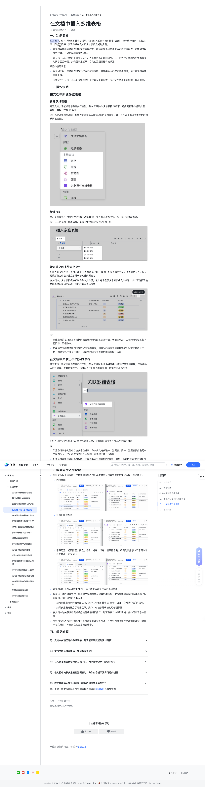

# 在文档中插入多维表格

> 来源：[飞书帮助中心](https://www.feishu.cn/hc/zh-CN/articles/360049067768)  
> 分类：多维表格 / 快速入门 / 基础设置  
> 抓取时间：2026-09-22T00:55:51.342Z

## 界面截图

### 文档内配图

1. img_v3_02rb_99406f92-1bde-4df5-ad30-530be2f1e18g.jpg：https://p1-hera.feishucdn.com/tos-cn-i-jbbdkfciu3/51fe2a3579a5435fb278785f23169dd3.jpg~tplv-jbbdkfciu3-image:0:0.image
2. img_v3_02rb_fda368d0-82f6-4b24-9e91-c837d5b9993g.png：https://p1-hera.feishucdn.com/tos-cn-i-jbbdkfciu3/87ba0cf458f546d2a450b637bc6423ec.png~tplv-jbbdkfciu3-png:0:0.png
3. 配图：https://p1-hera.feishucdn.com/tos-cn-i-jbbdkfciu3/9a6b595e424f4024a4ac558635aebf40~tplv-jbbdkfciu3-image:0:0.image
4. 配图：https://p1-hera.feishucdn.com/tos-cn-i-jbbdkfciu3/2a12d65435244c6eb06629f0758d4be9~tplv-jbbdkfciu3-image:0:0.image
5. 配图：https://p1-hera.feishucdn.com/tos-cn-i-jbbdkfciu3/522ec97e2b864fdab949229520c7c76a~tplv-jbbdkfciu3-image:0:0.image
6. 配图：https://p1-hera.feishucdn.com/tos-cn-i-jbbdkfciu3/4cbb5d5e22e048cb9126591aa26af290~tplv-jbbdkfciu3-image:0:0.image
7. 配图：https://p1-hera.feishucdn.com/tos-cn-i-jbbdkfciu3/3d254f09dcae4a3a860a4224a8076957~tplv-jbbdkfciu3-image:0:0.image

## 功能定位

本页对应飞书帮助中心「多维表格 / 快速入门 / 基础设置」下的「在文档中插入多维表格」。以下需求描述依据官方说明文档提炼，用于指导 DuoWei 对标实现。

## 功能目标

一、功能简介

## 文档结构（官方章节）

- 一、功能简介​
- 二、操作说明​
- 在文档中新建多维表格​
- 新建多维表格​
- 新建视图​
- 转为独立的多维表格文件​
- 在文档中关联已有的多维表格​
- 三、数据同步效果说明​
- 四、常见问题​

## 详细功能说明

一、功能简介

在文档中新建的多维表格也可以单独打开，在独立的多维表格文件页面进行操作，可完整使用高级权限、自动化流程等高级功能。

在文档中关联已有的多维表格文件，可实现数据的双向同步。在一侧进行的编辑和配置都会实时同步至另一侧，并保留高级权限、自动化流程等已有的设置。

展示和汇报：以多维表格的形式展示数据内容，或直接插入已有的多维表格，便于在文档中查看和汇报。

同步协作：文档中关联的多维表格可实现数据实时同步，多方协作结果实时展示，提高效率。

二、操作说明

在文档中新建多维表格

新建多维表格

新建视图

转为独立的多维表格文件

多维表格的权限配置与转换时的文档的权限配置完全一致。转换完成后，二者的权限设置将不再同步，互相独立。

如果当前文档存储在知识库或我的文档库内，则转为的独立多维表格将成为当前文档的子文档；如果文档存储在云盘内，则转为的独立多维表格同样存储在云盘。

在文档中关联已有的多维表格

你也可以将整个多维表格的链接粘贴至文档，按照界面指引将显示方式设置为 展开。

如果多维表格文件中存在多个数据表，单次仅支持关联一个数据表；同一个数据表仅能在同一文档内插入一次；不支持关联个人视图、表单视图或日历视图。

如果多维表格未开启高级权限，你需要有该多维表格的“查看、添加、移除协作者”的权限；如果多维表格开启了高级权限，你需要有该多维表格的可管理权限。

三、数据同步效果说明

当你进行以下操作时，文档中的多维表格和其关联的多维表格中的数据会双向、实时同步。

内容编辑：

250px|700px|reset

新增和删除视图：

字段配置、视图配置、筛选、分组、排序、行高、视图重命名、视图列表排序（示意图以字段配置和行高为例）：

将文档导出为 Word 或 PDF 时，导出的文件将无法展示多维表格。

当满足下述权限要求时，创建的文档副本内可包含多维表格。文档副本里包含的多维表格仍保留双向、实时同步的关联关系。

如果多维表格未开启高级权限，操作人有该多维表格“查看、添加、移除协作者”的权限。

如果多维表格开启了高级权限，操作人有该多维表格的可管理权限。

在文档中对关联多维表格数据进行的编辑和操作，均可在独立的多维表格文件的历史记录中查看。

文档内多维表格的评论和独立多维表格的评论不互通。在文档内对多维表格添加的评论只会显示在文档内，不显示在独立多维表格中。

四、常见问题

一、功能简介在文档中，对内容有疑问？选中评论吧我们将评估你的评论，及时优化内容知道了你可以新建多维表格模块，也可以关联已有的多维表格文件，便于进行展示、汇报总结、同步进展等，实现数据在文档和多维表格之间的贯通。在文档中新建的多维表格也可以单独打开，在独立的多维表格文件页面进行操作，可完整使用高级权限、自动化流程等高级功能。在文档中关联已有的多维表格文件，可实现数据的双向同步。在一侧进行的编辑和配置都会实时同步至另一侧，并保留高级权限、自动化流程等已有的设置。常见的使用场景：展示和汇报：以多维表格的形式展示数据内容，或直接插入已有的多维表格，便于在文档中查看和汇报。同步协作：文档中关联的多维表格可实现数据实时同步，多方协作结果实时展示，提高效率。二、操作说明在文档中新建多维表格新建多维表格打开文档，将鼠标悬停在空白行左侧，在 + 工具栏的 多维表格 分组下，选择要新建的视图类型：表格、看板、甘特 或 画册。 注：无论选择何种视图，都将为你创建具备同样功能的多维表格。唯一区别在于新建多维表格时的默认视图类型。250px|700px|reset 新建视图点击多维表格左上角的视图名称，选择 新建，即可新建其他视图，以不同形式展现信息。注：在任何视图中修改信息，都将同步修改其他视图中的内容。250px|700px|reset转为独立的多维表格文件在插入的多维表格右上角，点击 在多维表格中打开 图标，可将其转为独立的多维表格文件，原文档的所有者就是该独立多维表格文件的所有者。在文档中，多维表格模块被转为独立文件后，左上角将显示多维表格的文件名称，点击可跳转至独立界面进行自动化流程、高级权限等更多设置。250px|700px|reset注：多维表格的权限配置与转换时的文档的权限配置完全一致。转换完成后，二者的权限设置将不再同步，互相独立。如果当前文档存储在知识库或我的文档库内，则转为的独立多维表格将成为当前文档的子文档；如果文档存储在云盘内，则转为的独立多维表格同样存储在云盘。在文档中关联已有的多维表格打开文档，将鼠标悬停在空白行左侧，在 + 工具栏选择 多维表格 > 关联已有多维表格，选择要插入的数据表。关联数据表后，你可以通过切换视图查看同一数据表的其他视图。250px|700px|reset你也可以将整个多维表格的链接粘贴至文档，按照界面指引将显示方式设置为 展开。注：如果多维表格文件中存在多个数据表，单次仅支持关联一个数据表；同一个数据表仅能在同一文档内插入一次；不支持关联个人视图、表单视图或日历视图。如果多维表格未开启高级权限，你需要有该多维表格的“查看、添加、移除协作者”的权限；如果多维表格开启了高级权限，你需要有该多维表格的可管理权限。三、数据同步效果说明当你进行以下操作时，文档中的多维表格和其关联的多维表格中的数据会双向、实时同步。内容编辑：250px|700px|reset新增和删除视图：250px|700px|reset字段配置、视图配置、筛选、分组、排序、行高、视图重命名、视图列表排序（示意图以字段配置和行高为例）：250px|700px|reset将文档导出为 Word 或 PDF 时，导出的文件将无法展示多维表格。当满足下述权限要求时，创建的文档副本内可包含多维表格。文档副本里包含的多维表格仍保留双向、实时同步的关联关系。如果多维表格未开启高级权限，操作人有该多维表格“查看、添加、移除协作者”的权限。如果多维表格开启了高级权限，操作人有该多维表格的可管理权限。在文档中对关联多维表格数据进行的编辑和操作，均可在独立的多维表格文件的历史记录中查看。文档内多维表格的评论和独立多维表格的评论不互通。在文档内对多维表格添加的评论只会显示在文档内，不显示在独立多维表格中。四、常见问题

## 实现要点（对标 DuoWei）

1. **入口与信息架构**：在产品中明确该能力所属模块（快速入门 / 基础设置），并保证用户可从对应导航触达。
2. **核心交互**：按上文「详细功能说明」还原主要操作路径；截图中出现的按钮、字段、面板命名尽量与飞书语义一致或可映射。
3. **数据与权限**：若文档涉及可见范围、可编辑范围、分享或高级权限，实现时需落到角色/成员模型，并保证 API/MCP 与 UI 权限一致。
4. **边界与上限**：若文档提到数量上限、格式限制、导入导出约束，需在实现与错误提示中体现。
5. **验收**：以本页截图场景为用例，完成「能打开 / 能配置 / 能保存 / 能被 Agent 读写（如适用）」四项检查。

## 原始摘录摘要

> 一、功能简介 在文档中新建的多维表格也可以单独打开，在独立的多维表格文件页面进行操作，可完整使用高级权限、自动化流程等高级功能。 在文档中关联已有的多维表格文件，可实现数据的双向同步。在一侧进行的编辑和配置都会实时同步至另一侧，并保留高级权限、自动化流程等已有的设置。 展示和汇报：以多维表格的形式展示数据内容，或直接插入已有的多维表格，便于在文档中查看和汇报。 同步协作：文档中关联的多维表格可实现数据实时同步，多方协作结果实时展示，提高效率。 二、操作说明 在文档中新建多维表格 新建多维表格 新建视图 转为独立的多维表格文件 多维表格的权限配置与转换时的文档的权限配置完全一致。转换完成后，二者的权限设置将不再同步，互相独立。 如果当前文档存储在知识库或我的文档库内，则转为的独立多维表格将成为当前文档的子文档；如果文档存储在云盘内，则转为的独立多维表格同样存储在云盘。 在文档中关联已有的多维表格 你也可以将整个多维表格的链接粘贴至文档，按照界面指引将显示方式设置为 展开。 如果多维表格文件中存在多个数据表，单次仅支持关联一个数据表；同一个数据表仅能在同一文档内插入一次；不支持关联个人视图、表单视图或日历视图。 如果多维表格未开启高级权限，你需要有该多维表格的“查看、添加、移除协作者”的权限；如果多维表格开启了高级权限，你需要有该多维表格的可管理权限。 三、数据同步效果说明 当你进行以下操作时，文档中的多维表格和其关联的多维表格中的数据会双向、实时同步。 内容编辑： 250px|700px|reset 新增和删除视图： 字段配置、视图配置、筛选、分组、排序、行高、视图重命名、视图列表排序（示意图以字段配置和行高为例）： 将文档导出为 Word 或 PDF 时，导出的文件将无法展示多维表格。 当满足下述权限要求时，创建的文档副本内可包含多维表格。文档副本里包含的多维表格仍保留双向…

## 元数据

- article_id: `6933484043602247707`
- category_id: `7225072576895254530`
- path: `/hc/zh-CN/articles/360049067768`
- extracted_text_length: 1570
