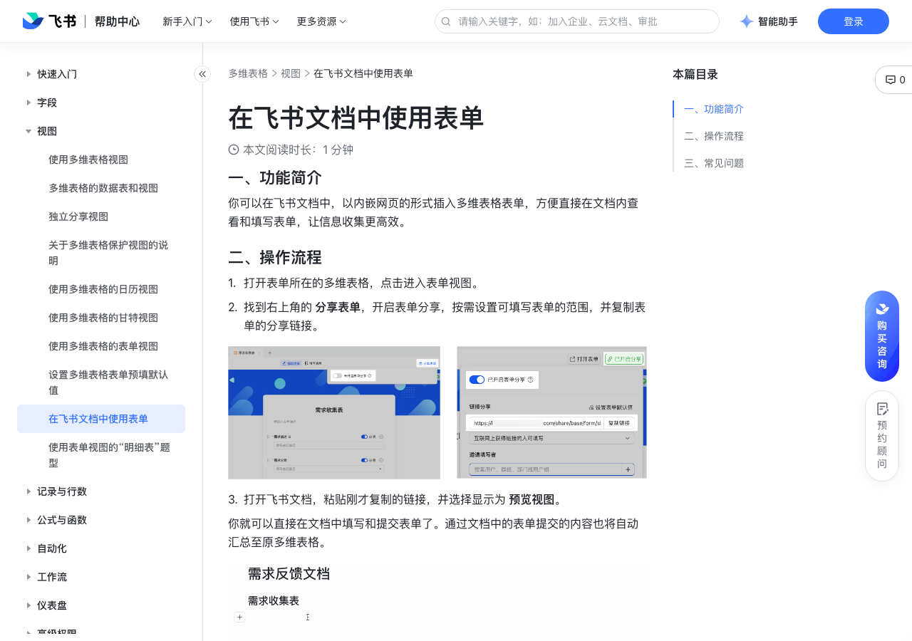

# 在飞书文档中使用表单

> 来源：[飞书帮助中心](https://www.feishu.cn/hc/zh-CN/articles/750789400865)  
> 分类：多维表格 / 视图  
> 抓取时间：2026-09-22T01:26:58.533Z

## 界面截图

### 文档内配图

1. 配图：https://p1-hera.feishucdn.com/tos-cn-i-jbbdkfciu3/04bb18f964fb41c4a95b9ade0dff2993~tplv-jbbdkfciu3-image:0:0.image
2. 配图：https://p1-hera.feishucdn.com/tos-cn-i-jbbdkfciu3/424442fab8b54dca94788fa81140fc06~tplv-jbbdkfciu3-image:0:0.image
3. 配图：https://p1-hera.feishucdn.com/tos-cn-i-jbbdkfciu3/70c342ae3cde465cb2ff3ccf063b98e0~tplv-jbbdkfciu3-image:0:0.image

## 功能定位

本页对应飞书帮助中心「多维表格 / 视图」下的「在飞书文档中使用表单」。以下需求描述依据官方说明文档提炼，用于指导 DuoWei 对标实现。

## 功能目标

一、功能简介

## 文档结构（官方章节）

- 一、功能简介​
- 二、操作流程​
- 三、常见问题​

## 详细功能说明

一、功能简介

二、操作流程

打开表单所在的多维表格，点击进入表单视图。

找到右上角的 分享表单，开启表单分享，按需设置可填写表单的范围，并复制表单的分享链接。

打开飞书文档，粘贴刚才复制的链接，并选择显示为 预览视图。

三、常见问题

问：可以在移动端的文档里插入并展开表单吗？

答：不可以。已插入的表单只会以链接的形式在移动端展示。

## 实现要点（对标 DuoWei）

1. **入口与信息架构**：在产品中明确该能力所属模块（视图），并保证用户可从对应导航触达。
2. **核心交互**：按上文「详细功能说明」还原主要操作路径；截图中出现的按钮、字段、面板命名尽量与飞书语义一致或可映射。
3. **数据与权限**：若文档涉及可见范围、可编辑范围、分享或高级权限，实现时需落到角色/成员模型，并保证 API/MCP 与 UI 权限一致。
4. **边界与上限**：若文档提到数量上限、格式限制、导入导出约束，需在实现与错误提示中体现。
5. **验收**：以本页截图场景为用例，完成「能打开 / 能配置 / 能保存 / 能被 Agent 读写（如适用）」四项检查。

## 原始摘录摘要

> 一、功能简介 二、操作流程 打开表单所在的多维表格，点击进入表单视图。 找到右上角的 分享表单，开启表单分享，按需设置可填写表单的范围，并复制表单的分享链接。 打开飞书文档，粘贴刚才复制的链接，并选择显示为 预览视图。 三、常见问题 问：可以在移动端的文档里插入并展开表单吗？ 答：不可以。已插入的表单只会以链接的形式在移动端展示。

## 元数据

- article_id: `7186480778203922460`
- category_id: `7006240778276110337`
- path: `/hc/zh-CN/articles/750789400865`
- extracted_text_length: 166
