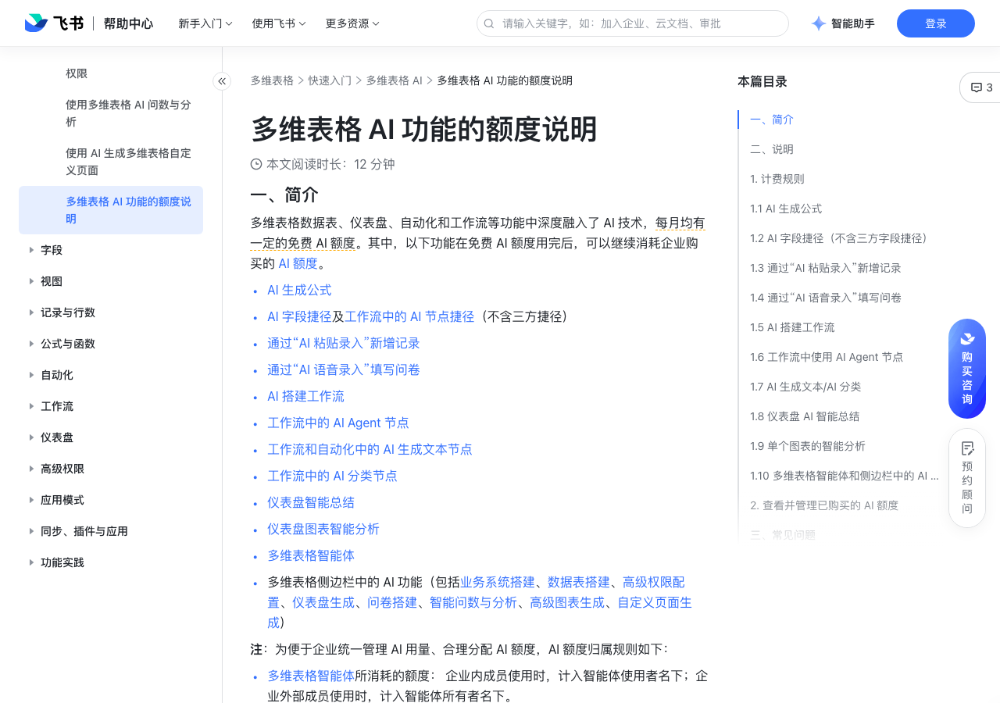

# 多维表格 AI 功能的额度说明

> 来源：[飞书帮助中心](https://www.feishu.cn/hc/zh-CN/articles/698366954342)  
> 分类：多维表格 / 快速入门 / 多维表格 AI  
> 抓取时间：2026-09-22T01:21:33.803Z

## 界面截图

### 文档内配图

1. 配图：https://p1-hera.feishucdn.com/tos-cn-i-jbbdkfciu3/f8babf668e9d46fab5ea013a42698949~tplv-jbbdkfciu3-image:0:0.image
2. 配图：https://p1-hera.feishucdn.com/tos-cn-i-jbbdkfciu3/cd2a363ee58a44a4b340ea8e1b9dab94~tplv-jbbdkfciu3-image:0:0.image
3. 配图：https://p1-hera.feishucdn.com/tos-cn-i-jbbdkfciu3/f9af4f8526ee4a688e464e4c705e7353~tplv-jbbdkfciu3-image:0:0.image
4. 配图：https://p1-hera.feishucdn.com/tos-cn-i-jbbdkfciu3/b1e538e50c644b839a356d3581592cf7~tplv-jbbdkfciu3-image:0:0.image
5. 配图：https://p1-hera.feishucdn.com/tos-cn-i-jbbdkfciu3/f0e148f1ee8d4d6bb11f2477055ea7e0~tplv-jbbdkfciu3-image:0:0.image
6. 配图：https://p1-hera.feishucdn.com/tos-cn-i-jbbdkfciu3/1208375209284ffb91e6544bc3ab5120~tplv-jbbdkfciu3-image:0:0.image
7. 配图：https://p1-hera.feishucdn.com/tos-cn-i-jbbdkfciu3/02d3b983356c4f79b5e586b12855c416~tplv-jbbdkfciu3-image:0:0.image
8. 配图：https://p1-hera.feishucdn.com/tos-cn-i-jbbdkfciu3/dfac350603044940b96cb8d6f6e7fd3c~tplv-jbbdkfciu3-image:0:0.image
9. 配图：https://p1-hera.feishucdn.com/tos-cn-i-jbbdkfciu3/889b783f93be49fd8efe8766e513916c~tplv-jbbdkfciu3-image:0:0.image
10. 配图：https://p1-hera.feishucdn.com/tos-cn-i-jbbdkfciu3/ff9f36bf901e44f098f5a80c3207304a~tplv-jbbdkfciu3-image:0:0.image
11. 配图：https://p1-hera.feishucdn.com/tos-cn-i-jbbdkfciu3/f6a98de2b9c2447295c8497636744ba0~tplv-jbbdkfciu3-image:0:0.image
12. 配图：https://p1-hera.feishucdn.com/tos-cn-i-jbbdkfciu3/917d2d5a1d0340bb8bf03761a471a3b0~tplv-jbbdkfciu3-image:0:0.image

## 功能定位

本页对应飞书帮助中心「多维表格 / 快速入门 / 多维表格 AI」下的「多维表格 AI 功能的额度说明」。以下需求描述依据官方说明文档提炼，用于指导 DuoWei 对标实现。

## 功能目标

一、简介

## 文档结构（官方章节）

- 一、简介​
- 二、说明​
- 计费规则​
- 1.1 AI 生成公式​
- 1.2 AI 字段捷径（不含三方字段捷径）​
- AI 字段捷径及工作流中的 AI 节点捷径（不含三方捷径）​
- 1.3 通过“AI 粘贴录入”新增记录​
- 1.4 通过“AI 语音录入”填写问卷​
- 1.5 AI 搭建工作流​
- ​250px|700px|reset​​250px|700px|reset​​
- 1.6 工作流中使用 AI Agent 节点​
- 1.7 AI 生成文本/AI 分类​
- 1.8 仪表盘 AI 智能总结​
- 1.9 单个图表的智能分析​
- 1.10 多维表格智能体和侧边栏中的 AI 功能​
- 查看并管理已购买的 AI 额度​
- 三、常见问题​

## 详细功能说明

一、简介

AI 生成公式

AI 字段捷径及工作流中的 AI 节点捷径（不含三方捷径）

通过“AI 粘贴录入”新增记录

通过“AI 语音录入”填写问卷

AI 搭建工作流

工作流中的 AI Agent 节点

工作流和自动化中的 AI 生成文本节点

工作流中的 AI 分类节点

仪表盘智能总结

仪表盘图表智能分析

多维表格智能体

多维表格侧边栏中的 AI 功能（包括业务系统搭建、数据表搭建、高级权限配置、仪表盘生成、问卷搭建、智能问数与分析、高级图表生成、自定义页面生成）

多维表格智能体所消耗的额度： 企业内成员使用时，计入智能体使用者名下；企业外部成员使用时，计入智能体所有者名下。

其余功能所消耗的额度：统一计入多维表格所有者名下。

二、说明

计费规则

1.1 AI 生成公式

1.2 AI 字段捷径（不含三方字段捷径）

数据表中的 AI 字段捷径：生成的每个单元格都会消耗对应的 AI 点数，所以如果数据表中有多行记录，同一个字段捷径总消耗 AI 点数为单次生成消耗 AI 点数 × 生成行数。刷新单元格时，AI 字段捷径会重新生成内容，因此也会消耗 AI 点数。

注：此处为数据表中的 AI 字段捷径使用企业通用额度的计费规则。如需更多个人 AI 额度，可购买个人会员，其额度可用于下列 AI 字段捷径在数据表中的消耗使用。个人 AI 额度仅可用于数据表中的 Al 字段捷径，不适用于工作流中的 AI 节点捷径。

工作流中的 AI 节点捷径：AI 节点捷径直接使用对应的 AI 字段捷径的能力，所以对于同一个 AI 字段捷径，每次在工作流的节点捷径中成功运行，单次消耗的 AI 点数等于 AI 字段捷径在数据表中单次生成消耗的 AI 点数。

字段捷径类型

字段捷径名称

单次生成消耗 AI 点数

由飞书科技提供的字段捷径

总结、翻译、智能标签、自定义 AI 自动填充、信息提取、分类

消耗点数因所选模型而异，具体如下：Doubao-Seed-2.0-Lite：0.1 MiniMax-M3：0.3GLM-5.2：0.5

Doubao-Seed-2.0-Lite：0.1

MiniMax-M3：0.3

GLM-5.2：0.5

由火山引擎提供的字段捷径

豆包 2.0（多模态+深度思考）

豆包 1.8（多模态+深度思考）

豆包 1.6（多模态+深度思考）

豆包 2.0（联网搜索）

生成图片（Seedream 5.0）

该字段捷径可以在一个单元格内生成多张图片，按照图片生成的数量消耗 AI 点数，单张图片消耗 AI 点数 5.0。

即梦 4.0

该字段捷径可以在一个单元格内生成多张图片，按照图片生成的数量消耗 AI 点数，单张图片消耗 5.0 AI 点数。

AI 图片理解（豆包）

图片变装（豆包）

AI 语音识别（豆包）

AI 语音合成（豆包）

AI 生成视频（豆包）

图生视频（Seedance）

文生视频（Seedance）

智能绘图（图像特效）

智能绘图

图像增强

图片评分

通用文字识别

实体识别

PDF 转文本

豆包解析 PDF

该字段捷径按解析的 PDF 页数计费，每页消耗 0.5 AI 点数。页数根据 token 消耗推导，单页约 1000–1200 token。

DeepSeek V4

DeepSeek V4（联网搜索）

注：你也可以前往对应的字段捷径详情页，查看特定字段捷径单次消耗 AI 点数。

1.3 通过“AI 粘贴录入”新增记录

1.4 通过“AI 语音录入”填写问卷

1.5 AI 搭建工作流

250px|700px|reset250px|700px|reset

1.6 工作流中使用 AI Agent 节点

1.7 AI 生成文本/AI 分类

1.8 仪表盘 AI 智能总结

1.9 单个图表的智能分析

1.10 多维表格智能体和侧边栏中的 AI 功能

通过 AI 侧边栏使用的 AI 功能功能，包括业务系统搭建、数据表搭建、高级权限配置、仪表盘生成、问卷搭建、智能问数与分析、高级图表生成、自定义页面生成

模型类型及调用工具的复杂度：涉及搜图、数据查询、访问外部 API 等复杂工具调用时，消耗高于普通任务。

输入与产出的数量、质量及复杂度：按照内容类型分，视频消耗 > 图片消耗 > 文本消耗。

云端运行环境：涉及云端文件操作、网页访问、代码执行时，消耗会高于普通任务。

查看并管理已购买的 AI 额度

在 资产管理 > AI 使用管理 > 用量概览 中查看企业内 AI 额度的使用情况，具体信息请参考管理员查看企业 AI 权益用量。

在 资产管理 > AI 使用管理 > 限额管理 中设置每月 AI 额度使用上限和用量告警，具体信息请参考管理员为企业 AI 权益设置限额。

三、常见问题

问：为什么使用火山引擎的多维表格字段捷径时，计费方式和在火山引擎中调用模型时的计费方式不一致？

答：火山引擎采用按大模型输入、输出 token 数计费的方式，而字段捷径调用模型的方式复杂，难以提前预估 token 消耗。多维表格字段捷径按火山引擎大模型的平均 token 消耗，统一折算为单位“额度”，即点数，与大模型消耗成本基本贴近，且与实际产生的行数直接挂钩。该计费方式具有以下优势：规则简单：无需理解 token 细节，计费逻辑更直观。成本可预测：单元格数量明确，使用成本更清晰。可控性强：企业可根据额度分配灵活管理使用量，避免费用失控。

问：是否可以设置当免费 AI 额度用尽时，直接限制用户继续使用多维表格 AI 功能？

答：可以，企业管理员可以在管理后台的 AI 用量管理页面，将多维表格 AI 每月的可用额度设置为 0。

问：企业管理员如何收到多维表格 AI 用量与计费相关的通知？

答：在多维表格首次消耗企业已购买的 AI 额度或 AI 用量超过管理员设置的预警值时，管理员将收到提醒。

字段捷径类型 | 字段捷径名称 | 单次生成消耗 AI 点数

由飞书科技提供的字段捷径 | 总结、翻译、智能标签、自定义 AI 自动填充、信息提取、分类 | 消耗点数因所选模型而异，具体如下：Doubao-Seed-2.0-Lite：0.1 MiniMax-M3：0.3GLM-5.2：0.5

由火山引擎提供的字段捷径 | 豆包 2.0（多模态+深度思考） | 0.1

| 豆包 1.8（多模态+深度思考） | 0.1

| 豆包 1.6（多模态+深度思考） | 0.1

| 豆包 2.0（联网搜索） | 1.0

| 生成图片（Seedream 5.0） | 该字段捷径可以在一个单元格内生成多张图片，按照图片生成的数量消耗 AI 点数，单张图片消耗 AI 点数 5.0。

| 即梦 4.0 | 该字段捷径可以在一个单元格内生成多张图片，按照图片生成的数量消耗 AI 点数，单张图片消耗 5.0 AI 点数。

| AI 图片理解（豆包） | 0.2

| 图片变装（豆包） | 20

| AI 语音识别（豆包） | 5

| AI 语音合成（豆包） | 2

| AI 生成视频（豆包） | 40

| 图生视频（Seedance） | 50

| 文生视频（Seedance） | 50

| 智能绘图（图像特效） | 5

| 智能绘图 | 5

| 图像增强 | 0.5

| 图片评分 | 1

| 通用文字识别 | 0.2

| 实体识别 | 1

| PDF 转文本 | 2

| 豆包解析 PDF | 该字段捷径按解析的 PDF 页数计费，每页消耗 0.5 AI 点数。页数根据 token 消耗推导，单页约 1000–1200 token。

| DeepSeek V4 | 0.1

| DeepSeek V4（联网搜索） | 1.0

## 实现要点（对标 DuoWei）

1. **入口与信息架构**：在产品中明确该能力所属模块（快速入门 / 多维表格 AI），并保证用户可从对应导航触达。
2. **核心交互**：按上文「详细功能说明」还原主要操作路径；截图中出现的按钮、字段、面板命名尽量与飞书语义一致或可映射。
3. **数据与权限**：若文档涉及可见范围、可编辑范围、分享或高级权限，实现时需落到角色/成员模型，并保证 API/MCP 与 UI 权限一致。
4. **边界与上限**：若文档提到数量上限、格式限制、导入导出约束，需在实现与错误提示中体现。
5. **验收**：以本页截图场景为用例，完成「能打开 / 能配置 / 能保存 / 能被 Agent 读写（如适用）」四项检查。

## 原始摘录摘要

> 一、简介 AI 生成公式 AI 字段捷径及工作流中的 AI 节点捷径（不含三方捷径） 通过“AI 粘贴录入”新增记录 通过“AI 语音录入”填写问卷 AI 搭建工作流 工作流中的 AI Agent 节点 工作流和自动化中的 AI 生成文本节点 工作流中的 AI 分类节点 仪表盘智能总结 仪表盘图表智能分析 多维表格智能体 多维表格侧边栏中的 AI 功能（包括业务系统搭建、数据表搭建、高级权限配置、仪表盘生成、问卷搭建、智能问数与分析、高级图表生成、自定义页面生成） 多维表格智能体所消耗的额度： 企业内成员使用时，计入智能体使用者名下；企业外部成员使用时，计入智能体所有者名下。 其余功能所消耗的额度：统一计入多维表格所有者名下。 二、说明 计费规则 1.1 AI 生成公式 1.2 AI 字段捷径（不含三方字段捷径） 数据表中的 AI 字段捷径：生成的每个单元格都会消耗对应的 AI 点数，所以如果数据表中有多行记录，同一个字段捷径总消耗 AI 点数为单次生成消耗 AI 点数 × 生成行数。刷新单元格时，AI 字段捷径会重新生成内容，因此也会消耗 AI 点数。 注：此处为数据表中的 AI 字段捷径使用企业通用额度的计费规则。如需更多个人 AI 额度，可购买个人会员，其额度可用于下列 AI 字段捷径在数据表中的消耗使用。个人 AI 额度仅可用于数据表中的 Al 字段捷径，不适用于工作流中的 AI 节点捷径。 工作流中的 AI 节点捷径：AI 节点捷径直接使用对应的 AI 字段捷径的能力，所以对于同一个 AI 字段捷径，每次在工作流的节点捷径中成功运行，单次消耗的 AI 点数等于 AI 字段捷径在数据表中单次生成消耗的 AI 点数。 字段捷径类型 字段捷径名称 单次生成消耗 AI 点数 由飞书科技提供的字段捷径 总结、翻译、智能标签、自定义 AI 自动填充、信息提取、分类 消耗点数因…

## 元数据

- article_id: `7546248130677850114`
- category_id: `7630766419524717789`
- path: `/hc/zh-CN/articles/698366954342`
- extracted_text_length: 3180
