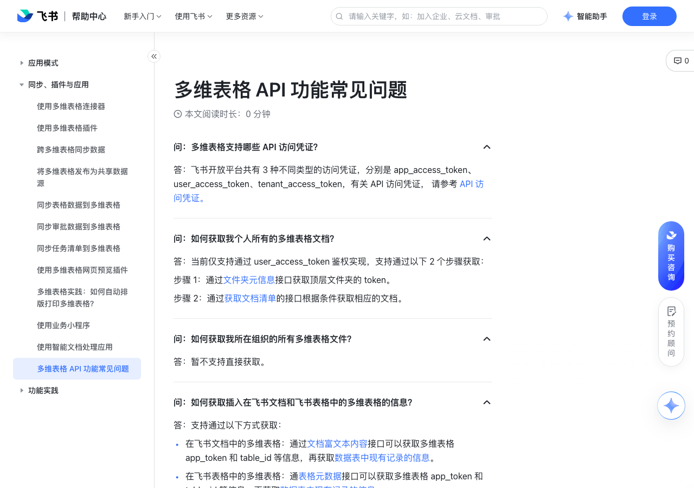

# 多维表格 API 功能常见问题

> 来源：[飞书帮助中心](https://www.feishu.cn/hc/zh-CN/articles/336307279050)  
> 分类：多维表格 / 同步、插件与应用  
> 抓取时间：2026-09-22T01:26:36.920Z

## 界面截图

## 功能定位

本页对应飞书帮助中心「多维表格 / 同步、插件与应用」下的「多维表格 API 功能常见问题」。以下需求描述依据官方说明文档提炼，用于指导 DuoWei 对标实现。

## 功能目标

在飞书文档中的多维表格：通过文档富文本内容接口可以获取多维表格 app_token 和 table_id 等信息，再获取数据表中现有记录的信息。

## 详细功能说明

在飞书文档中的多维表格：通过文档富文本内容接口可以获取多维表格 app_token 和 table_id 等信息，再获取数据表中现有记录的信息。

在飞书表格中的多维表格：通表格元数据接口可以获取多维表格 app_token 和 table_id 等信息，再获取数据表中现有记录的信息。

问：多维表格支持哪些 API 访问凭证？

答：飞书开放平台共有 3 种不同类型的访问凭证，分别是 app_access_token、user_access_token、tenant_access_token，有关 API 访问凭证， 请参考 API 访问凭证。

问：如何获取我个人所有的多维表格文档？

答：当前仅支持通过 user_access_token 鉴权实现，支持通过以下 2 个步骤获取： 步骤 1：通过文件夹元信息接口获取顶层文件夹的 token。 步骤 2：通过获取文档清单的接口根据条件获取相应的文档。

问：如何获取我所在组织的所有多维表格文件？

答：暂不支持直接获取。

问：如何获取插入在飞书文档和飞书表格中的多维表格的信息？

答：支持通过以下方式获取： 在飞书文档中的多维表格：通过文档富文本内容接口可以获取多维表格 app_token 和 table_id 等信息，再获取数据表中现有记录的信息。在飞书表格中的多维表格：通表格元数据接口可以获取多维表格 app_token 和 table_id 等信息，再获取数据表中现有记录的信息。

问：如何更新多维表格中的一行记录？

答：支持通过以下 2 个步骤实现： 步骤 1：使用 RECORD_ID 函数获取多维表格数据表中每一条记录的 ID。步骤 2：通过更新记录的接口将更新相应的记录内容。

问：如何更新多维表格中的一列记录？

答：支持通过以下 3 个步骤实现： 步骤 1：使用 RECORD_ID 函数获取多维表格数据表中每一条记录的 ID。步骤 2：通过 字段信息 接口获取多维表格数据表中每一个字段的 ID。 步骤 3：找到需要更新的字段的 ID，通过更新多条记录的接口更新该字段下所有的记录内容。

问：如何更新多维表格中某一个单元格的内容？

答：支持通过以下 3 个步骤实现： 步骤 1：使用 RECORD_ID 函数获取多维表格数据表中每一条记录的 ID。 步骤 2：通过字段信息接口获取多维表格数据表中每一个字段的 ID。 步骤 3：找到需要更新的单元格的记录 ID 和字段 ID，通过更新记录的接口更新该字段下所有的记录内容。

问：如何搜索、过滤、筛选多维表格中的内容？

答：直接使用多维表格中的搜索或筛选功能，也支持通过以下 2 个步骤实现： 步骤 1：通过字段信息接口获取多维表格数据表中每一个字段的 ID。 步骤 2：通过查询参数 FILTER 筛选和查找内容，支持多个条件的组合。

问：我可以直接导出多维表格文件到其他平台或系统中吗？

答：暂不支持直接导出文件，你可以通过复制文档的接口备份文件中的数据和内容。

问：对日期字段进行筛选时，为什么 API 的筛选结果和多维表格自带的筛选功能的结果不一致？

答：多维表格自带的筛选功能当前仅支持精确到年月日，API 筛选则能精确到具体的时分秒。如需两种方式的筛选结果一致，可以将 API 中的筛选条件修改为：FILTER=DATEDIF(CurrentValue.[日期],TODAY(),"D")=0

问：我可以批量上传文件或图片到多维表格吗？

答：支持通过以下 2 个步骤实现： 步骤 1：通过上传附件的接口将需要的图片或文件上传至云空间并获取 file_token。步骤 2：通过新增记录或更新记录的接口将素材更新至多维表格中。

## 实现要点（对标 DuoWei）

1. **入口与信息架构**：在产品中明确该能力所属模块（同步、插件与应用），并保证用户可从对应导航触达。
2. **核心交互**：按上文「详细功能说明」还原主要操作路径；截图中出现的按钮、字段、面板命名尽量与飞书语义一致或可映射。
3. **数据与权限**：若文档涉及可见范围、可编辑范围、分享或高级权限，实现时需落到角色/成员模型，并保证 API/MCP 与 UI 权限一致。
4. **边界与上限**：若文档提到数量上限、格式限制、导入导出约束，需在实现与错误提示中体现。
5. **验收**：以本页截图场景为用例，完成「能打开 / 能配置 / 能保存 / 能被 Agent 读写（如适用）」四项检查。

## 原始摘录摘要

> 在飞书文档中的多维表格：通过文档富文本内容接口可以获取多维表格 app_token 和 table_id 等信息，再获取数据表中现有记录的信息。 在飞书表格中的多维表格：通表格元数据接口可以获取多维表格 app_token 和 table_id 等信息，再获取数据表中现有记录的信息。 问：多维表格支持哪些 API 访问凭证？ 答：飞书开放平台共有 3 种不同类型的访问凭证，分别是 app_access_token、user_access_token、tenant_access_token，有关 API 访问凭证， 请参考 API 访问凭证。 问：如何获取我个人所有的多维表格文档？ 答：当前仅支持通过 user_access_token 鉴权实现，支持通过以下 2 个步骤获取： 步骤 1：通过文件夹元信息接口获取顶层文件夹的 token。 步骤 2：通过获取文档清单的接口根据条件获取相应的文档。 问：如何获取我所在组织的所有多维表格文件？ 答：暂不支持直接获取。 问：如何获取插入在飞书文档和飞书表格中的多维表格的信息？ 答：支持通过以下方式获取： 在飞书文档中的多维表格：通过文档富文本内容接口可以获取多维表格 app_token 和 table_id 等信息，再获取数据表中现有记录的信息。在飞书表格中的多维表格：通表格元数据接口可以获取多维表格 app_token 和 table_id 等信息，再获取数据表中现有记录的信息。 问：如何更新多维表格中的一行记录？ 答：支持通过以下 2 个步骤实现： 步骤 1：使用 RECORD_ID 函数获取多维表格数据表中每一条记录的 ID。步骤 2：通过更新记录的接口将更新相应的记录内容。 问：如何更新多维表格中的一列记录？ 答：支持通过以下 3 个步骤实现： 步骤 1：使用 RECORD_ID 函数获取多维表格数据表中每一条记录的 ID。…

## 元数据

- article_id: `7095023646137139228`
- category_id: `7225134052943200257`
- path: `/hc/zh-CN/articles/336307279050`
- extracted_text_length: 1529
