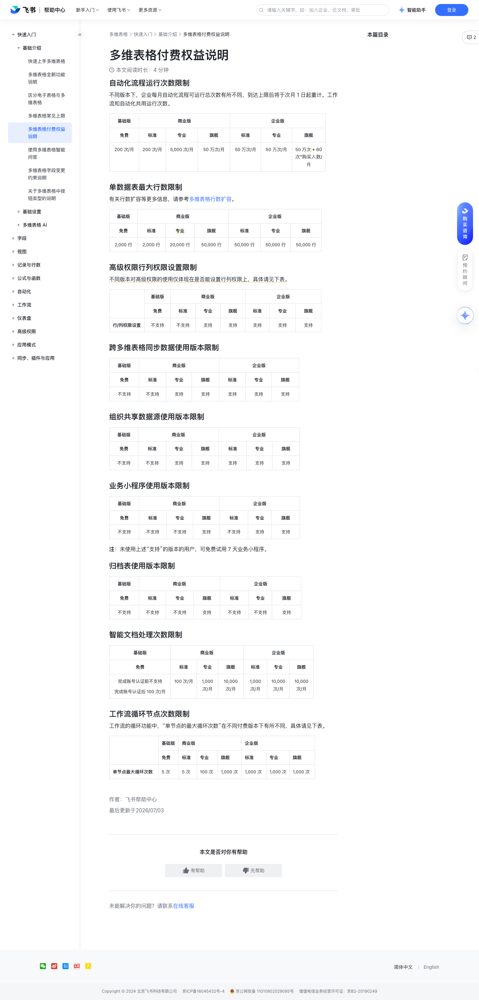

# 多维表格付费权益说明

> 来源：[飞书帮助中心](https://www.feishu.cn/hc/zh-CN/articles/487931070605)  
> 分类：多维表格 / 快速入门 / 基础介绍  
> 抓取时间：2026-09-22T00:43:35.524Z

## 界面截图

## 功能定位

本页对应飞书帮助中心「多维表格 / 快速入门 / 基础介绍」下的「多维表格付费权益说明」。以下需求描述依据官方说明文档提炼，用于指导 DuoWei 对标实现。

## 功能目标

自动化流程运行次数限制

## 文档结构（官方章节）

- 自动化流程运行次数限制​
- 单数据表最大行数限制​
- 高级权限行列权限设置限制​
- 跨多维表格同步数据使用版本限制​
- 组织共享数据源使用版本限制​
- 业务小程序使用版本限制​
- 归档表使用版本限制​
- 智能文档处理次数限制​
- 工作流循环节点次数限制​

## 详细功能说明

自动化流程运行次数限制

200 次/月

5,000 次/月

50 万次/月

50 万次 + 60 次*购买人数/月

单数据表最大行数限制

2,000 行

20,000 行

50,000 行

高级权限行列权限设置限制

行/列权限设置

跨多维表格同步数据使用版本限制

组织共享数据源使用版本限制

业务小程序使用版本限制

归档表使用版本限制

智能文档处理次数限制

完成账号认证前不支持完成账号认证后 100 次/月

100 次/月

1,000 次/月

10,000 次/月

工作流循环节点次数限制

单节点最大循环次数

100 次

1,000 次

自动化流程运行次数限制不同版本下，企业每月自动化流程可运行总次数有所不同，到达上限后将于次月 1 日起重计。工作流和自动化共用运行次数。基础版商业版企业版免费标准专业旗舰标准专业旗舰200 次/月200 次/月5,000 次/月50 万次/月50 万次/月50 万次/月50 万次 + 60 次*购买人数/月单数据表最大行数限制有关行数扩容等更多信息，请参考多维表格行数扩容。基础版商业版企业版免费标准专业旗舰标准专业旗舰2,000 行2,000 行20,000 行50,000 行50,000 行50,000 行50,000 行高级权限行列权限设置限制不同版本对高级权限的使用仅体现在是否能设置行列权限上，具体请见下表。基础版商业版企业版免费标准专业旗舰标准专业旗舰行/列权限设置不支持不支持支持支持支持支持支持跨多维表格同步数据使用版本限制基础版商业版企业版免费标准专业旗舰标准专业旗舰不支持不支持支持支持支持支持支持组织共享数据源使用版本限制基础版商业版企业版免费标准专业旗舰标准专业旗舰不支持不支持支持支持支持支持支持业务小程序使用版本限制基础版商业版企业版免费标准专业旗舰标准专业旗舰不支持不支持不支持支持不支持支持支持注：未使用上述“支持”的版本的用户，可免费试用 7 天业务小程序。归档表使用版本限制基础版商业版企业版免费标准专业旗舰标准专业旗舰不支持不支持不支持支持不支持不支持支持智能文档处理次数限制基础版商业版企业版免费标准专业旗舰标准专业旗舰完成账号认证前不支持完成账号认证后 100 次/月100 次/月1,000 次/月10,000 次/月1,000 次/月10,000 次/月10,000 次/月工作流循环节点次数限制工作流的循环功能中，“单节点的最大循环次数”在不同付费版本下有所不同，具体请见下表。基础版商业版企业版免费标准专业旗舰标准专业旗舰单节点最大循环次数5 次5 次100 次1,000 次1,000 次1,000 次1,000 次

基础版 | 商业版 | | | 企业版 | |

免费 | 标准 | 专业 | 旗舰 | 标准 | 专业 | 旗舰

200 次/月 | 200 次/月 | 5,000 次/月 | 50 万次/月 | 50 万次/月 | 50 万次/月 | 50 万次 + 60 次*购买人数/月

2,000 行 | 2,000 行 | 20,000 行 | 50,000 行 | 50,000 行 | 50,000 行 | 50,000 行

| 基础版 | 商业版 | | | 企业版 | |

| 免费 | 标准 | 专业 | 旗舰 | 标准 | 专业 | 旗舰

行/列权限设置 | 不支持 | 不支持 | 支持 | 支持 | 支持 | 支持 | 支持

不支持 | 不支持 | 支持 | 支持 | 支持 | 支持 | 支持

不支持 | 不支持 | 不支持 | 支持 | 不支持 | 支持 | 支持

不支持 | 不支持 | 不支持 | 支持 | 不支持 | 不支持 | 支持

完成账号认证前不支持完成账号认证后 100 次/月 | 100 次/月 | 1,000 次/月 | 10,000 次/月 | 1,000 次/月 | 10,000 次/月 | 10,000 次/月

单节点最大循环次数 | 5 次 | 5 次 | 100 次 | 1,000 次 | 1,000 次 | 1,000 次 | 1,000 次

## 实现要点（对标 DuoWei）

1. **入口与信息架构**：在产品中明确该能力所属模块（快速入门 / 基础介绍），并保证用户可从对应导航触达。
2. **核心交互**：按上文「详细功能说明」还原主要操作路径；截图中出现的按钮、字段、面板命名尽量与飞书语义一致或可映射。
3. **数据与权限**：若文档涉及可见范围、可编辑范围、分享或高级权限，实现时需落到角色/成员模型，并保证 API/MCP 与 UI 权限一致。
4. **边界与上限**：若文档提到数量上限、格式限制、导入导出约束，需在实现与错误提示中体现。
5. **验收**：以本页截图场景为用例，完成「能打开 / 能配置 / 能保存 / 能被 Agent 读写（如适用）」四项检查。

## 原始摘录摘要

> 自动化流程运行次数限制 200 次/月 5,000 次/月 50 万次/月 50 万次 + 60 次*购买人数/月 单数据表最大行数限制 2,000 行 20,000 行 50,000 行 高级权限行列权限设置限制 行/列权限设置 跨多维表格同步数据使用版本限制 组织共享数据源使用版本限制 业务小程序使用版本限制 归档表使用版本限制 智能文档处理次数限制 完成账号认证前不支持完成账号认证后 100 次/月 100 次/月 1,000 次/月 10,000 次/月 工作流循环节点次数限制 单节点最大循环次数 100 次 1,000 次 自动化流程运行次数限制不同版本下，企业每月自动化流程可运行总次数有所不同，到达上限后将于次月 1 日起重计。工作流和自动化共用运行次数。基础版商业版企业版免费标准专业旗舰标准专业旗舰200 次/月200 次/月5,000 次/月50 万次/月50 万次/月50 万次/月50 万次 + 60 次*购买人数/月单数据表最大行数限制有关行数扩容等更多信息，请参考多维表格行数扩容。基础版商业版企业版免费标准专业旗舰标准专业旗舰2,000 行2,000 行20,000 行50,000 行50,000 行50,000 行50,000 行高级权限行列权限设置限制不同版本对高级权限的使用仅体现在是否能设置行列权限上，具体请见下表。基础版商业版企业版免费标准专业旗舰标准专业旗舰行/列权限设置不支持不支持支持支持支持支持支持跨多维表格同步数据使用版本限制基础版商业版企业版免费标准专业旗舰标准专业旗舰不支持不支持支持支持支持支持支持组织共享数据源使用版本限制基础版商业版企业版免费标准专业旗舰标准专业旗舰不支持不支持支持支持支持支持支持业务小程序使用版本限制基础版商业版企业版免费标准专业旗舰标准专业旗舰不支持不支持不支持支持不支持支持支持注：未使用上述“支持”的版本的…

## 元数据

- article_id: `7185456862018666498`
- category_id: `7225072370607013890`
- path: `/hc/zh-CN/articles/487931070605`
- extracted_text_length: 836
