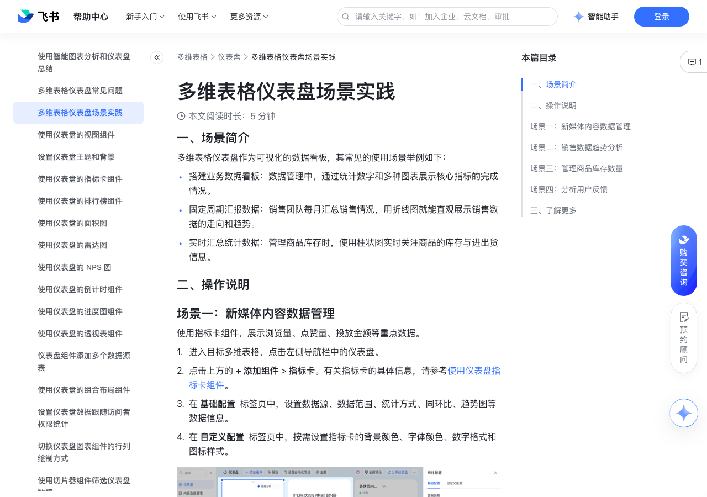

# 多维表格仪表盘场景实践

> 来源：[飞书帮助中心](https://www.feishu.cn/hc/zh-CN/articles/772312836264)  
> 分类：多维表格 / 仪表盘  
> 抓取时间：2026-09-22T01:25:18.684Z

## 界面截图

### 文档内配图

1. 配图：https://p1-hera.feishucdn.com/tos-cn-i-jbbdkfciu3/58464a83318f490290448f8471cf4590~tplv-jbbdkfciu3-image:0:0.image
2. 配图：https://p1-hera.feishucdn.com/tos-cn-i-jbbdkfciu3/c00e2d290df242f486c3f79a115609e2~tplv-jbbdkfciu3-image:0:0.image
3. 配图：https://p1-hera.feishucdn.com/tos-cn-i-jbbdkfciu3/19697f68c9364b4986de4a896e988745~tplv-jbbdkfciu3-image:0:0.image
4. 配图：https://p1-hera.feishucdn.com/tos-cn-i-jbbdkfciu3/d50fb1fa50dc4f9ab5e6e1f85c9cf1e9~tplv-jbbdkfciu3-image:0:0.image

## 功能定位

本页对应飞书帮助中心「多维表格 / 仪表盘」下的「多维表格仪表盘场景实践」。以下需求描述依据官方说明文档提炼，用于指导 DuoWei 对标实现。

## 功能目标

一、场景简介

## 文档结构（官方章节）

- 一、场景简介​
- 二、操作说明​
- 场景一：新媒体内容数据管理​
- 场景二：销售数据趋势分析 ​
- 场景三：管理商品库存数量​
- 场景四：分析用户反馈​
- 三、了解更多​

## 详细功能说明

一、场景简介

搭建业务数据看板：数据管理中，通过统计数字和多种图表展示核心指标的完成情况。

固定周期汇报数据：销售团队每月汇总销售情况，用折线图就能直观展示销售数据的走向和趋势。

实时汇总统计数据：管理商品库存时，使用柱状图实时关注商品的库存与进出货信息。

二、操作说明

场景一：新媒体内容数据管理

进入目标多维表格，点击左侧导航栏中的仪表盘。

点击上方的 + 添加组件 > 指标卡。有关指标卡的具体信息，请参考使用仪表盘指标卡组件。

在 基础配置 标签页中，设置数据源、数据范围、统计方式、同环比、趋势图等数据信息。

在 自定义配置 标签页中，按需设置指标卡的背景颜色、字体颜色、数字格式和图标样式。

场景二：销售数据趋势分析

点击上方的 + 添加组件 > 折线图。

在 基础配置 标签页中，设置数据源、数据范围、主题色、图表选项、横轴、纵轴等数据信息。例如，选择日期字段作为 横轴（类别），设置纵轴的统计方式为 统计字段数值，并选择纵轴需要展示的销售数据相关字段。

在 自定义配置 标签页中，按需设置折线图的背景颜色、字体颜色、字号、图例等样式。

在 分析 标签页中分析数据排名情况，例如分析月销量前三名的地区或月销量下滑最严重的地区等。具体信息请参考使用 TopN 筛选仪表盘图表中的数据。

场景三：管理商品库存数量

点击上方的 + 添加组件 > 柱状图。

在 基础配置 标签页中，设置数据源、数据范围、主题色、图表选项、横轴、纵轴等数据信息。例如，选择“商品名称”字段作为 横轴（类别），设置纵轴的统计方式为 统计字段数值，并选择纵轴需要展示的库存相关字段。

在 自定义配置 标签页中，按需设置柱状图的背景颜色、字体颜色、字号、图例等样式。

在 分析 标签页中分析数据排名情况，例如分析库存最多或最少的产品。具体信息请参考使用 TopN 筛选仪表盘图表中的数据。

场景四：分析用户反馈

创建问卷并收集用户反馈，具体信息请参考使用飞书问卷。

在问卷页面右上角点击 结果分析，进入对应多维表格的仪表盘页面。

你可以视需求添加饼图、柱状图、折线图等图表组件，并按需配置各个图表。有关配置仪表盘各个组件的具体信息，请参考仪表盘。

三、了解更多

项目管理模板

## 实现要点（对标 DuoWei）

1. **入口与信息架构**：在产品中明确该能力所属模块（仪表盘），并保证用户可从对应导航触达。
2. **核心交互**：按上文「详细功能说明」还原主要操作路径；截图中出现的按钮、字段、面板命名尽量与飞书语义一致或可映射。
3. **数据与权限**：若文档涉及可见范围、可编辑范围、分享或高级权限，实现时需落到角色/成员模型，并保证 API/MCP 与 UI 权限一致。
4. **边界与上限**：若文档提到数量上限、格式限制、导入导出约束，需在实现与错误提示中体现。
5. **验收**：以本页截图场景为用例，完成「能打开 / 能配置 / 能保存 / 能被 Agent 读写（如适用）」四项检查。

## 原始摘录摘要

> 一、场景简介 搭建业务数据看板：数据管理中，通过统计数字和多种图表展示核心指标的完成情况。 固定周期汇报数据：销售团队每月汇总销售情况，用折线图就能直观展示销售数据的走向和趋势。 实时汇总统计数据：管理商品库存时，使用柱状图实时关注商品的库存与进出货信息。 二、操作说明 场景一：新媒体内容数据管理 进入目标多维表格，点击左侧导航栏中的仪表盘。 点击上方的 + 添加组件 > 指标卡。有关指标卡的具体信息，请参考使用仪表盘指标卡组件。 在 基础配置 标签页中，设置数据源、数据范围、统计方式、同环比、趋势图等数据信息。 在 自定义配置 标签页中，按需设置指标卡的背景颜色、字体颜色、数字格式和图标样式。 场景二：销售数据趋势分析 点击上方的 + 添加组件 > 折线图。 在 基础配置 标签页中，设置数据源、数据范围、主题色、图表选项、横轴、纵轴等数据信息。例如，选择日期字段作为 横轴（类别），设置纵轴的统计方式为 统计字段数值，并选择纵轴需要展示的销售数据相关字段。 在 自定义配置 标签页中，按需设置折线图的背景颜色、字体颜色、字号、图例等样式。 在 分析 标签页中分析数据排名情况，例如分析月销量前三名的地区或月销量下滑最严重的地区等。具体信息请参考使用 TopN 筛选仪表盘图表中的数据。 场景三：管理商品库存数量 点击上方的 + 添加组件 > 柱状图。 在 基础配置 标签页中，设置数据源、数据范围、主题色、图表选项、横轴、纵轴等数据信息。例如，选择“商品名称”字段作为 横轴（类别），设置纵轴的统计方式为 统计字段数值，并选择纵轴需要展示的库存相关字段。 在 自定义配置 标签页中，按需设置柱状图的背景颜色、字体颜色、字号、图例等样式。 在 分析 标签页中分析数据排名情况，例如分析库存最多或最少的产品。具体信息请参考使用 TopN 筛选仪表盘图表中的数据。 场景四：分析用户反馈 创建问…

## 元数据

- article_id: `7096001275799568386`
- category_id: `7165754521875005468`
- path: `/hc/zh-CN/articles/772312836264`
- extracted_text_length: 928
