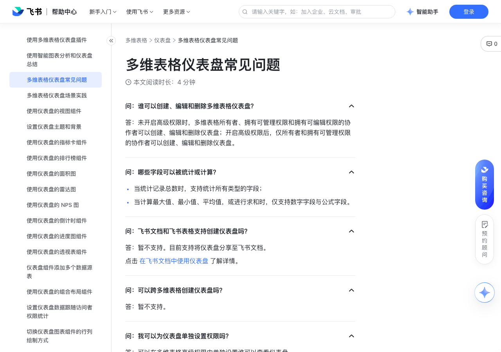

# 多维表格仪表盘常见问题

> 来源：[飞书帮助中心](https://www.feishu.cn/hc/zh-CN/articles/120891901586)  
> 分类：多维表格 / 仪表盘  
> 抓取时间：2026-09-22T01:25:18.796Z

## 界面截图

## 功能定位

本页对应飞书帮助中心「多维表格 / 仪表盘」下的「多维表格仪表盘常见问题」。以下需求描述依据官方说明文档提炼，用于指导 DuoWei 对标实现。

## 功能目标

问：谁可以创建、编辑和删除多维表格仪表盘？

## 详细功能说明

问：谁可以创建、编辑和删除多维表格仪表盘？

答：未开启高级权限时，多维表格所有者、拥有可管理权限和拥有可编辑权限的协作者可以创建、编辑和删除仪表盘；开启高级权限后，仅所有者和拥有可管理权限的协作者可以创建、编辑和删除仪表盘。

问：哪些字段可以被统计或计算？

当统计记录总数时，支持统计所有类型的字段； 当计算最大值、最小值、平均值，或进行求和时，仅支持数字字段与公式字段。

问：飞书文档和飞书表格支持创建仪表盘吗？

答：暂不支持。目前支持将仪表盘分享至飞书文档。点击 在飞书文档中使用仪表盘 了解详情。

问：可以跨多维表格创建仪表盘吗？

答：暂不支持。

问：我可以为仪表盘单独设置权限吗？

答：可以在多维表格高级权限中单独设置谁可以查看仪表盘。

问：我可以在移动端创建、编辑和删除多维表格仪表盘吗？

答：暂不支持，当前仅支持在移动端查看仪表盘。如需编辑仪表盘请在桌面端进行操作。

问：我可以在移动端删除、编辑图表吗？

答：暂不支持，当前移动端仅支持查看图表。

## 实现要点（对标 DuoWei）

1. **入口与信息架构**：在产品中明确该能力所属模块（仪表盘），并保证用户可从对应导航触达。
2. **核心交互**：按上文「详细功能说明」还原主要操作路径；截图中出现的按钮、字段、面板命名尽量与飞书语义一致或可映射。
3. **数据与权限**：若文档涉及可见范围、可编辑范围、分享或高级权限，实现时需落到角色/成员模型，并保证 API/MCP 与 UI 权限一致。
4. **边界与上限**：若文档提到数量上限、格式限制、导入导出约束，需在实现与错误提示中体现。
5. **验收**：以本页截图场景为用例，完成「能打开 / 能配置 / 能保存 / 能被 Agent 读写（如适用）」四项检查。

## 原始摘录摘要

> 问：谁可以创建、编辑和删除多维表格仪表盘？ 答：未开启高级权限时，多维表格所有者、拥有可管理权限和拥有可编辑权限的协作者可以创建、编辑和删除仪表盘；开启高级权限后，仅所有者和拥有可管理权限的协作者可以创建、编辑和删除仪表盘。 问：哪些字段可以被统计或计算？ 当统计记录总数时，支持统计所有类型的字段； 当计算最大值、最小值、平均值，或进行求和时，仅支持数字字段与公式字段。 问：飞书文档和飞书表格支持创建仪表盘吗？ 答：暂不支持。目前支持将仪表盘分享至飞书文档。点击 在飞书文档中使用仪表盘 了解详情。 问：可以跨多维表格创建仪表盘吗？ 答：暂不支持。 问：我可以为仪表盘单独设置权限吗？ 答：可以在多维表格高级权限中单独设置谁可以查看仪表盘。 问：我可以在移动端创建、编辑和删除多维表格仪表盘吗？ 答：暂不支持，当前仅支持在移动端查看仪表盘。如需编辑仪表盘请在桌面端进行操作。 问：我可以在移动端删除、编辑图表吗？ 答：暂不支持，当前移动端仅支持查看图表。

## 元数据

- article_id: `7165775690858676225`
- category_id: `7165754521875005468`
- path: `/hc/zh-CN/articles/120891901586`
- extracted_text_length: 429
