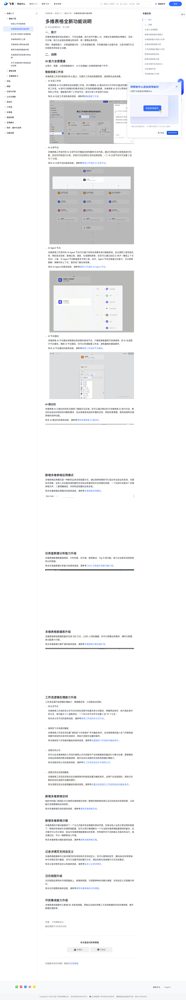

# 多维表格全新功能说明

> 来源：[飞书帮助中心](https://www.feishu.cn/hc/zh-CN/articles/366209794581)  
> 分类：多维表格 / 快速入门 / 基础介绍  
> 抓取时间：2026-09-22T00:43:29.930Z

## 界面截图

### 文档内配图

1. 配图：https://p1-hera.feishucdn.com/tos-cn-i-jbbdkfciu3/2e11309731db4e03a97fb401e7185fdd~tplv-jbbdkfciu3-image:0:0.image
2. 配图：https://p1-hera.feishucdn.com/tos-cn-i-jbbdkfciu3/01908051f2b8469ba0ea2ce8d12407a6~tplv-jbbdkfciu3-image:0:0.image
3. 配图：https://p1-hera.feishucdn.com/tos-cn-i-jbbdkfciu3/a298ddae7b5a4bd4abff75530b7f825c~tplv-jbbdkfciu3-image:0:0.image
4. 配图：https://p1-hera.feishucdn.com/tos-cn-i-jbbdkfciu3/5795601b95c64b6989cd02a7d4a8d0a8~tplv-jbbdkfciu3-image:0:0.image
5. 配图：https://p1-hera.feishucdn.com/tos-cn-i-jbbdkfciu3/2c58854648484305a21f90ffe2f22015~tplv-jbbdkfciu3-image:0:0.image
6. 配图：https://p1-hera.feishucdn.com/tos-cn-i-jbbdkfciu3/f78a656b263b47e091022057ad26c028~tplv-jbbdkfciu3-image:0:0.image
7. 配图：https://p1-hera.feishucdn.com/tos-cn-i-jbbdkfciu3/d1358dd7363d4a7b96995b987c6e6f3d~tplv-jbbdkfciu3-image:0:0.image
8. 配图：https://p1-hera.feishucdn.com/tos-cn-i-jbbdkfciu3/a9c55be4bea044348dda20d7b4826b88~tplv-jbbdkfciu3-image:0:0.image
9. 配图：https://p1-hera.feishucdn.com/tos-cn-i-jbbdkfciu3/36f7cf6468184204bbd013a1fdffdbba~tplv-jbbdkfciu3-image:0:0.image
10. 配图：https://p1-hera.feishucdn.com/tos-cn-i-jbbdkfciu3/0d3da9c381954ba6ace91e2b4119bf6d~tplv-jbbdkfciu3-image:0:0.image
11. 配图：https://p1-hera.feishucdn.com/tos-cn-i-jbbdkfciu3/a646e5c567d2456daa6f4cb91578f057~tplv-jbbdkfciu3-image:0:0.image
12. 配图：https://p1-hera.feishucdn.com/tos-cn-i-jbbdkfciu3/ceaf9f23a13342459e5140e8802b8067~tplv-jbbdkfciu3-image:0:0.image
13. 配图：https://p1-hera.feishucdn.com/tos-cn-i-jbbdkfciu3/91e5d8afadc6455995dafc0f8c233f47~tplv-jbbdkfciu3-image:0:0.image
14. image.png：https://p1-hera.feishucdn.com/tos-cn-i-jbbdkfciu3/ce244fbb7ee84112a2d1ffa93799d7db.png~tplv-jbbdkfciu3-png:0:0.png
15. 配图：https://p1-hera.feishucdn.com/tos-cn-i-jbbdkfciu3/738ce4dd7eba475caa6703b91985dbe9~tplv-jbbdkfciu3-image:0:0.image
16. 配图：https://p1-hera.feishucdn.com/tos-cn-i-jbbdkfciu3/dbb6ed5aa1814c5e9b7087b52ec6efe3~tplv-jbbdkfciu3-image:0:0.image
17. 配图：https://p1-hera.feishucdn.com/tos-cn-i-jbbdkfciu3/add190662d934d9180cc00bc27de1dbc~tplv-jbbdkfciu3-image:0:0.image

## 功能定位

本页对应飞书帮助中心「多维表格 / 快速入门 / 基础介绍」下的「多维表格全新功能说明」。以下需求描述依据官方说明文档提炼，用于指导 DuoWei 对标实现。

## 功能目标

一、简介

## 文档结构（官方章节）

- 一、简介​
- 二、说明​
- AI 能力全面覆盖​
- 智能搭建工作流​
- AI 侧边栏 ​
- 新增多维表格应用模式​
- 仪表盘数据分析能力升级​
- 多维表格数据库升级​
- 工作流逻辑处理能力升级​
- 新增多维表格空间​
- 新增多维表格沙箱​
- 记录详情页支持自定义​
- 日历视图升级​
- 开放集成能力升级​

## 详细功能说明

一、简介

二、说明

AI 能力全面覆盖

智能搭建工作流

AI 生成工作流

多维表格 AI 可以帮助你自动搭建工作流。你只需要在 AI 侧边栏中以文字形式描述你需要搭建的工作流，AI 就可以根据你的需求完成工作流的搭建和配置。多维表格 AI 还可以帮助你更新已有的工作流，智能填充单个工作流节点，或对已有工作流进行总结。

有关 AI 生成工作流的具体信息，请参考智能搭建工作流。

AI 分类节点

多维表格工作流中的 AI 分类节点可智能识别和解析文本内容。通过与预设的分类规则进行匹配，自动对内容进行分类，并执行对应类别分支的后续流程。一个 AI 分类节点中可设置 2 至 10 个分类。

有关 AI 分类节点的具体信息，请参考使用工作流的 AI 分类节点。

AI Agent 节点

多维表格工作流中的 AI Agent 节点可以基于实际任务要求进行智能规划，自主调用工具完成任务，例如发送消息、新增记录、抽签、生成随机数等。你还可以通过自定义 MCP（模型上下文协议）工具，为 Agent 节点配备更多可用工具。此外，Agent 节点还具备记忆能力，可以获取群聊、单聊中的上下文，更好地了解任务背景。

有关 AI Agent 的具体信息，请参考使用工作流的 AI Agent 节点。

AI 节点捷径

多维表格 AI 节点捷径将高频业务场景封装进节点，只需简单配置即可快速使用，如 AI 生成图片节点捷径。借助 AI 节点捷径，你可以快速配置工作流，避免重复的基础操作。

有关 AI 节点捷径的具体信息，请参考使用工作流的节点捷径。

AI 侧边栏

新增多维表格应用模式

仪表盘数据分析能力升级

多维表格数据库升级

工作流逻辑处理能力升级

多分支节点

多维表格工作流的多分支节点支持在流程中创建多条分支路径，根据预设条件，执行满足条件的分支，其功能与 IFS 函数类似。一个多分支节点中可设置 2 至 10 个分支。

有关多分支节点的具体信息，请参考使用工作流的多分支节点。

接收到飞书消息时触发

多维表格工作流支持设置“接收到飞书消息时”作为触发条件。当多维表格机器人在飞书群组或单聊中收到符合条件的消息时，将执行流程中设置的操作。

有关接收到飞书消息时触发的具体信息，请参考设置接收飞书消息为触发条件。

流程支持公式

你可以在多维表格的工作流中使用公式对流程中产生的数据或变量进行计算与处理，更便捷地实现业务规则判断及数据流转，提升自动化流程的灵活性和数据处理能力。

有关流程支持公式的具体信息，请参考在工作流和自动化中使用公式。

流程支持点击按钮触发

多维表格工作流支持将点击多维表格中的按钮设置为触发条件。当用户点击按钮时，将执行关联的自动化流程中设置的操作。

有关流程支持点击按钮触发的具体信息，请参考设置点击按钮为工作流和自动化触发条件。

新增多维表格空间

新增多维表格沙箱

记录详情页支持自定义

日历视图升级

开放集成能力升级

一、简介多维表格新增多项业务能力，不仅在搭建、执行全环节融入 AI，还推出多维表格应用模式、空间与沙箱，助力企业轻松搭建业务系统、统一管理业务资源。同时，数据库能力、仪表盘数据分析、工作流逻辑处理、开放集成能力全面升级，记录详情页与日历视图支持自定义设置。二、说明AI 能力全面覆盖从指令、搭建、分类到智能执行，AI 已全面融入多维表格的每个环节。智能搭建工作流多维表格工作流中新增多项 AI 能力，可提升工作流的搭建效率，适用更多业务场景。AI 生成工作流 多维表格 AI 可以帮助你自动搭建工作流。你只需要在 AI 侧边栏中以文字形式描述你需要搭建的工作流，AI 就可以根据你的需求完成工作流的搭建和配置。多维表格 AI 还可以帮助你更新已有的工作流，智能填充单个工作流节点，或对已有工作流进行总结。有关 AI 生成工作流的具体信息，请参考智能搭建工作流。250px|700px|resetAI 分类节点多维表格工作流中的 AI 分类节点可智能识别和解析文本内容。通过与预设的分类规则进行匹配，自动对内容进行分类，并执行对应类别分支的后续流程。一个 AI 分类节点中可设置 2 至 10 个分类。有关 AI 分类节点的具体信息，请参考使用工作流的 AI 分类节点。250px|700px|resetAI Agent 节点 多维表格工作流中的 AI Agent 节点可以基于实际任务要求进行智能规划，自主调用工具完成任务，例如发送消息、新增记录、抽签、生成随机数等。你还可以通过自定义 MCP（模型上下文协议）工具，为 Agent 节点配备更多可用工具。此外，Agent 节点还具备记忆能力，可以获取群聊、单聊中的上下文，更好地了解任务背景。有关 AI Agent 的具体信息，请参考使用工作流的 AI Agent 节点。250px|700px|resetAI 节点捷径多维表格 AI 节点捷径将高频业务场景封装进节点，只需简单配置即可快速使用，如 AI 生成图片节点捷径。借助 AI 节点捷径，你可以快速配置工作流，避免重复的基础操作。有关 AI 节点捷径的具体信息，请参考使用工作流的节点捷径。250px|700px|resetAI 侧边栏 多维表格 AI 以侧边栏的形式提供了智能交互区域。你可以通过侧边栏与多维表格 AI 进行对话。侧边栏会自动识别你的问题和需求，给出答案或完成你布置的任务，帮助你更便捷、高效地使用多维表格的各种功能。有关 AI 侧边栏的具体信息，请参考使用多维表格 AI 侧边栏。250px|700px|reset新增多维表格应用模式多维表格应用模式是一种新的业务系统搭建方式，通过简单拖拽即可打造出专业级业务系统，无需技术背景，业务人员也能快速构建符合实际业务需求的交互界面和流程。一个应用可关联多个多维表格文件，二者相辅相成，共同构成完整的业务系统。有关多维表格应用模式的具体信息，请参考多维表格应用模式。250px|700px|reset仪表盘数据分析能力升级多维表格新增数据透视表、行列切换、切片器、图表联动、Top N 等功能，助力企业更灵活地探索和分析数据。有关仪表盘数据分析能力的具体信息，请参考 2025 仪表盘升级新功能介绍。250px|700px|reset多维表格数据库升级多维表格单张数据表最多支持 200 万行，1,000 人同时编辑。你可以根据业务需求，随时为数据表分配更大行数。有关多维表格行数扩容的具体信息，请参考多维表格行数自助扩容。250px|700px|reset工作流逻辑处理能力升级工作流全面升级逻辑处理能力，增强稳定性，让流程自动流转。多分支节点多维表格工作流的多分支节点支持在流程中创建多条分支路径，根据预设条件，执行满足条件的分支，其功能与 IFS 函数类似。一个多分支节点中可设置 2 至 10 个分支。有关多分支节点的具体信息，请参考使用工作流的多分支节点。250px|700px|reset接收到飞书消息时触发多维表格工作流支持设置“接收到飞书消息时”作为触发条件。当多维表格机器人在飞书群组或单聊中收到符合条件的消息时，将执行流程中设置的操作。有关接收到飞书消息时触发的具体信息，请参考设置接收飞书消息为触发条件。250px|700px|reset流程支持公式你可以在多维表格的工作流中使用公式对流程中产生的数据或变量进行计算与处理，更便捷地实现业务规则判断及数据流转，提升自动化流程的灵活性和数据处理能力。有关流程支持公式的具体信息，请参考在工作流和自动化中使用公式。250px|700px|reset流程支持点击按钮触发 多维表格工作流支持将点击多维表格中的按钮设置为触发条件。当用户点击按钮时，将执行关联的自动化流程中设置的操作。有关流程支持点击按钮触发的具体信息，请参考设置点击按钮为工作流和自动化触发条件。250px|700px|reset新增多维表格空间组织中的部门或团队可以使用多维表格空间统一管理多维表格资源以及空间成员的资源权限，从而提升资源管理和协同效率。有关多维表格空间的具体信息，请参考使用多维表格空间。250px|700px|reset新增多维表格沙箱多维表格的沙箱功能提供了一个与正式版本完全隔离的测试环境，在保证线上业务正常运转的前提下，帮助你快速迭代多维表格配置。你可以将沙箱理解为一个与当前多维表格配置相同的副本。在沙箱中可以充分测试、验证对多维表格配置做出的变更，所有操作均不会影响正式版本的运行。验证通过后，可以一键更新线上环境。有关多维表格沙箱的具体信息，请参考使用多维表格沙箱。250px|700px|reset记录详情页支持自定义多维表格数据表中记录详情页的布局和样式支持自定义。你可以使用标签页、横向/纵向布局等组件对详情页进行重组，还可以设置字段的展示方式，满足定制化信息展示与交互的需求。有关记录详情页自定义的具体信息，请参考自定义记录详情页。250px|700px|reset日历视图升级日历视图在原有的月视图基础上，新增周视图、日视图两种时间展示维度，支持自定义日程展示样式。有关日历视图的具体信息，请参考使用多维表格的日历视图。250px|700px|reset开放集成能力升级多维表格连接器中心新增 80 多款连接器，帮助企业轻松将第三方系统数据同步到多维表格，提升数据处理效率。250px|700px|reset

## 实现要点（对标 DuoWei）

1. **入口与信息架构**：在产品中明确该能力所属模块（快速入门 / 基础介绍），并保证用户可从对应导航触达。
2. **核心交互**：按上文「详细功能说明」还原主要操作路径；截图中出现的按钮、字段、面板命名尽量与飞书语义一致或可映射。
3. **数据与权限**：若文档涉及可见范围、可编辑范围、分享或高级权限，实现时需落到角色/成员模型，并保证 API/MCP 与 UI 权限一致。
4. **边界与上限**：若文档提到数量上限、格式限制、导入导出约束，需在实现与错误提示中体现。
5. **验收**：以本页截图场景为用例，完成「能打开 / 能配置 / 能保存 / 能被 Agent 读写（如适用）」四项检查。

## 原始摘录摘要

> 一、简介 二、说明 AI 能力全面覆盖 智能搭建工作流 AI 生成工作流 多维表格 AI 可以帮助你自动搭建工作流。你只需要在 AI 侧边栏中以文字形式描述你需要搭建的工作流，AI 就可以根据你的需求完成工作流的搭建和配置。多维表格 AI 还可以帮助你更新已有的工作流，智能填充单个工作流节点，或对已有工作流进行总结。 有关 AI 生成工作流的具体信息，请参考智能搭建工作流。 AI 分类节点 多维表格工作流中的 AI 分类节点可智能识别和解析文本内容。通过与预设的分类规则进行匹配，自动对内容进行分类，并执行对应类别分支的后续流程。一个 AI 分类节点中可设置 2 至 10 个分类。 有关 AI 分类节点的具体信息，请参考使用工作流的 AI 分类节点。 AI Agent 节点 多维表格工作流中的 AI Agent 节点可以基于实际任务要求进行智能规划，自主调用工具完成任务，例如发送消息、新增记录、抽签、生成随机数等。你还可以通过自定义 MCP（模型上下文协议）工具，为 Agent 节点配备更多可用工具。此外，Agent 节点还具备记忆能力，可以获取群聊、单聊中的上下文，更好地了解任务背景。 有关 AI Agent 的具体信息，请参考使用工作流的 AI Agent 节点。 AI 节点捷径 多维表格 AI 节点捷径将高频业务场景封装进节点，只需简单配置即可快速使用，如 AI 生成图片节点捷径。借助 AI 节点捷径，你可以快速配置工作流，避免重复的基础操作。 有关 AI 节点捷径的具体信息，请参考使用工作流的节点捷径。 AI 侧边栏 新增多维表格应用模式 仪表盘数据分析能力升级 多维表格数据库升级 工作流逻辑处理能力升级 多分支节点 多维表格工作流的多分支节点支持在流程中创建多条分支路径，根据预设条件，执行满足条件的分支，其功能与 IFS 函数类似。一个多分支节点中可设置 2 至 1…

## 元数据

- article_id: `7567217287033225217`
- category_id: `7225072370607013890`
- path: `/hc/zh-CN/articles/366209794581`
- extracted_text_length: 2629
