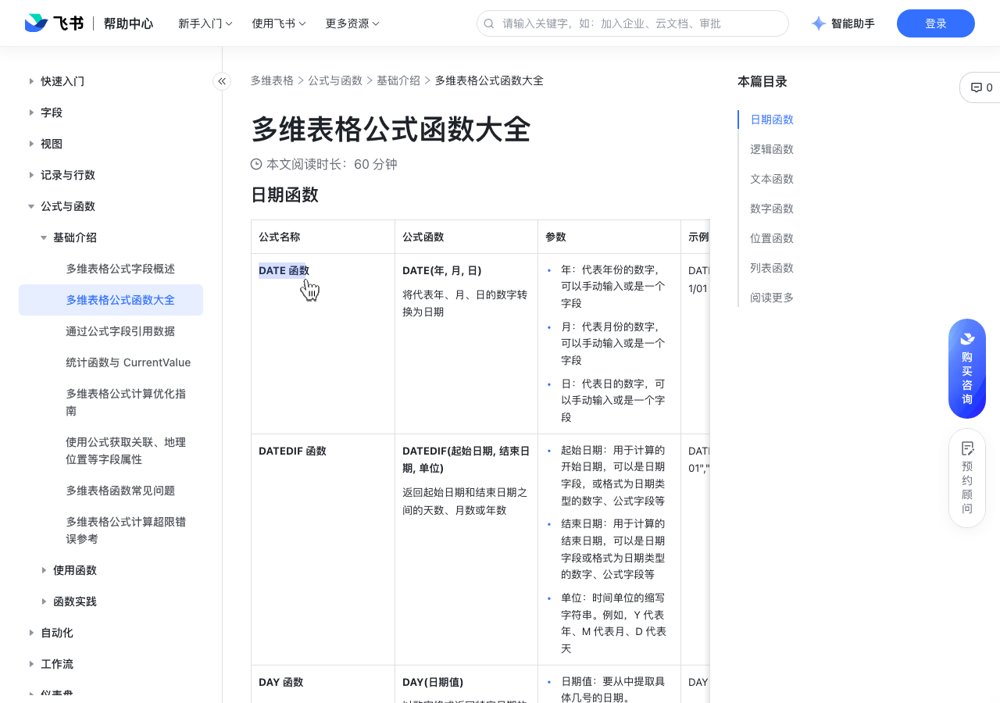

# 多维表格公式函数大全

> 来源：[飞书帮助中心](https://www.feishu.cn/hc/zh-CN/articles/687638790379)  
> 分类：多维表格 / 公式与函数 / 基础介绍  
> 抓取时间：2026-09-22T01:23:48.585Z

## 界面截图

## 功能定位

本页对应飞书帮助中心「多维表格 / 公式与函数 / 基础介绍」下的「多维表格公式函数大全」。以下需求描述依据官方说明文档提炼，用于指导 DuoWei 对标实现。

## 功能目标

日期函数

## 文档结构（官方章节）

- 日期函数​
- 逻辑函数​
- 文本函数​
- 数字函数​
- 位置函数​
- 列表函数 ​
- 阅读更多​

## 详细功能说明

日期函数

公式名称

公式函数

DATE 函数对内容有疑问？选中评论吧我们将评估你的评论，及时优化内容知道了

DATE(年, 月, 日)将代表年、月、日的数字转换为日期

年：代表年份的数字，可以手动输入或是一个字段月：代表月份的数字，可以手动输入或是一个字段日：代表日的数字，可以手动输入或是一个字段

年：代表年份的数字，可以手动输入或是一个字段

月：代表月份的数字，可以手动输入或是一个字段

日：代表日的数字，可以手动输入或是一个字段

DATE(2000,01,01)=2000/01/01

DATEDIF 函数

DATEDIF(起始日期, 结束日期, 单位)返回起始日期和结束日期之间的天数、月数或年数

起始日期：用于计算的开始日期，可以是日期字段，或格式为日期类型的数字、公式字段等结束日期：用于计算的结束日期，可以是日期字段或格式为日期类型的数字、公式字段等单位：时间单位的缩写字符串。例如，Y 代表年、M 代表月、D 代表天

起始日期：用于计算的开始日期，可以是日期字段，或格式为日期类型的数字、公式字段等

结束日期：用于计算的结束日期，可以是日期字段或格式为日期类型的数字、公式字段等

单位：时间单位的缩写字符串。例如，Y 代表年、M 代表月、D 代表天

DATEDIF("2000-01-01","2000-01-08","D")=7

DAY 函数

DAY(日期值)以数字格式返回特定日期的日

日期值：要从中提取具体几号的日期。

DAY("2000-01-03")=3

DAYS 函数

DAYS(结束日期, 起始日期)返回起始日期与结束日期之间的天数

结束日期：用于计算的结束日期，可以是日期字段或格式为日期类型的数字、公式字段等起始日期：用于计算的开始日期，可以是日期字段或格式为日期类型的数字、公式字段等

起始日期：用于计算的开始日期，可以是日期字段或格式为日期类型的数字、公式字段等

DAYS("2000-01-08","2000-01-01")=7

EDATE 函数

EDATE(开始日期, 月数)返回输入日期特定月数之前或者之后的日期

开始日期：用于计算的起始日期月数：输入正值将生成开始日期之后相应月数的日期输入负值将生开始日期之前相应月数的日期注：如任意参数无法转化为日期类型，返回 #VALUE! 错误如果任意参数为空，返回 #VALUE! 错误如果计算后的月份没有相应的日期，则自动返回该月最后一天

开始日期：用于计算的起始日期

输入正值将生成开始日期之后相应月数的日期

输入负值将生开始日期之前相应月数的日期

如任意参数无法转化为日期类型，返回 #VALUE! 错误

如果任意参数为空，返回 #VALUE! 错误

如果计算后的月份没有相应的日期，则自动返回该月最后一天

EDATE("2011/01/31", 1) = 2011/02/28EDATE("2011/01/01", -1) = 2010/12/01

EDATE("2011/01/31", 1) = 2011/02/28

EDATE("2011/01/01", -1) = 2010/12/01

EOMONTH 函数

EOMONTH(开始日期,月数)返回与开始日期相隔数月的某个月份最后一天的日期

开始日期：从哪一天开始计算月数：正值将生成未来日期；负值将生成过去日期

开始日期：从哪一天开始计算

月数：正值将生成未来日期；负值将生成过去日期

EOMONTH("2000-1-1", 1)=2000/2/28EOMONTH("2000-3-1", -1)=2000/02/29

HOUR 函数

HOUR(时间)以数字格式返回特定时间的小时部分

时间：用于计算的时间

HOUR("11:40:59")=11

MINUTE 函数

MINUTE(时间)以数字格式返回特定时间的分钟部分

MINUTE("11:40:59")=40

MONTH 函数

MONTH(日期值)以数字格式返回特定日期对应的月份

日期值：要从中提取月份的日期

MONTH("2000-12-01")=12

NETWORKDAYS 函数

NETWORKDAYS(起始日期, 结束日期, [节假日])返回起始日期和结束日期之间的净工作日天数

起始日期：用于计算的开始日期，可以是日期字段或格式为日期类型的数字、公式字段等 结束日期：用于计算的结束日期，可以是日期字段或格式为日期类型的数字、公式字段等 节假日：默认为双休日，也可加上列入该参数的日期范围或日期字段查看详情：使用 NETWORKDAYS 函数

节假日：默认为双休日，也可加上列入该参数的日期范围或日期字段

NETWORKDAYS("2000-01-01","2000-01-12")=8

NOW 函数

NOW() 返回当前日期和时间 注：在使用“服务端计算模式”的多维表格文件中，当数据表处于编辑状态时，NOW 函数每 5 分钟更新一次；当数据表处于非编辑状态时，NOW 函数每 30 分钟更新一次。可以在性能诊断界面的左下角查看当前多维表格文件是否使用了“服务端计算模式”。

NOW()=2000/01/01 00:00

SECOND 函数

SECOND(时间)以数字格式返回特定时间的秒钟部分

SECOND("11:40:59")=59

TODAY 函数

TODAY()返回当天的日期

TODAY()=2000/01/01

WEEKDAY 函数

WEEKDAY(日期值, [类型])返回目标日期在当周的第几天，结果以数字形式显示

日期值：需要返回星期的目标日期，可以是日期字段或格式为日期类型的数字、公式字段等类型：表示一周的第 1 天从星期几开始，若为 1 则该周的第 1 天从星期天开始，若为 2 则从星期一开始，默认为 1

日期值：需要返回星期的目标日期，可以是日期字段或格式为日期类型的数字、公式字段等

类型：表示一周的第 1 天从星期几开始，若为 1 则该周的第 1 天从星期天开始，若为 2 则从星期一开始，默认为 1

WEEKDAY("2000-01-01")=7

WEEKNUM 函数

WEEKNUM(日期, [类型])返回目标日期在当前年份的第几周

日期：需要返回所在周序号的目标日期，可以是日期字段或格式为日期类型的数字、公式字段等类型：表示一周的第 1 天从星期几开始，若为 1 则该周的第 1 天从星期天开始，若为 2 则从星期一开始，默认为 1

日期：需要返回所在周序号的目标日期，可以是日期字段或格式为日期类型的数字、公式字段等

WEEKNUM("2000-01-01")=1

WORKDAY 函数

WORKDAY(起始日期, 天数, [节假日])指定起始日期和所需要的工作日天数，返回结束日期

起始日期：要计算的开始日期，可以是格式为日期类型的函数或数字字段等天数：从起始日期开始需要的工作天数节假日：默认双休日，加上列入该参数的范围或数组常量

起始日期：要计算的开始日期，可以是格式为日期类型的函数或数字字段等

天数：从起始日期开始需要的工作天数

节假日：默认双休日，加上列入该参数的范围或数组常量

WORKDAY("2000/01/01",7)=2000/01/11

YEAR 函数

YEAR(日期值)以数字格式返回给定日期所指定的年份

日期值：需要从中提取年份的日期

YEAR("2000-01-01")=2000

DURATION 函数

DURATION(天数, [小时数], [分钟数], [秒数])生成指定时长，给已有日期加上或减去该时长，可以计算出新的日期

天数：表示时长中的天数小时数：表示时长中的小时数分钟数：表示时长中的分钟数秒数：表示时长中的秒数

天数：表示时长中的天数

小时数：表示时长中的小时数

分钟数：表示时长中的分钟数

秒数：表示时长中的秒数

案例：当前时间加上 12 小时后的日期和时间函数：NOW()+DURATION(0, 12)=2023/06/05 22:00案例：当前时间减去一天零两小时的日期和时间 函数：NOW()-DURATION(1, 2)=2023/06/03 21:30

案例：当前时间加上 12 小时后的日期和时间

函数：NOW()+DURATION(0, 12)=2023/06/05 22:00

案例：当前时间减去一天零两小时的日期和时间

函数：NOW()-DURATION(1, 2)=2023/06/03 21:30

逻辑函数

AND 函数

AND(逻辑表达式1, [逻辑表达式2, ...])当所有参数均为逻辑 TRUE 时，返回 TRUE；当参数中任何一个为逻辑 FALSE，返回 FALSE

逻辑表达式 1：逻辑表达式或对包含表达式字段的引用，代表逻辑值（即 TRUE 或 FALSE ）逻辑表达式 2：更多表示逻辑值的表达式

逻辑表达式 1：逻辑表达式或对包含表达式字段的引用，代表逻辑值（即 TRUE 或 FALSE ）

逻辑表达式 2：更多表示逻辑值的表达式

AND(1=1,1=2)=false

CONTAIN 函数

CONTAIN(查找范围, [要查找的值, ...])判断查找范围是否包含要查找的内容注：本函数不支持文本包含匹配，如有需要请使用 CONTAINTEXT 函数

查找范围：查找范围，可为数值或数组要查找的值：待查找的数值或列表查看详情：使用 CONTAIN 函数

查找范围：查找范围，可为数值或数组

要查找的值：待查找的数值或列表

案例：如果销售地为日本或韩国，则标记为亚太市场函数：IF(CONTAIN([销售地],"韩国","日本"),"亚太市场","其他")

FALSE 函数

FALSE()返回逻辑值 FALSE

FALSE()=false

IF 函数

IF(判断条件, 为 TRUE 时的返回值, [为 FALSE 时的返回值])当判断条件为 TRUE 时返回一个值，为 FALSE 时返回另一个值

判断条件：进行判断的条件，可以手动输入一个逻辑表达式，也可以是对包含表达式字段的引用，代表逻辑值（即 TRUE 或 FALSE ）为 TRUE 时的返回值：判断条件为 TRUE 时的返回值为 FALSE 时的返回值：判断条件为 FALSE 时的返回值查看详情：IF 和 IFS 函数

判断条件：进行判断的条件，可以手动输入一个逻辑表达式，也可以是对包含表达式字段的引用，代表逻辑值（即 TRUE 或 FALSE ）

为 TRUE 时的返回值：判断条件为 TRUE 时的返回值

为 FALSE 时的返回值：判断条件为 FALSE 时的返回值

IF(1=2, "相同", "不相同") = 不相同

IFBLANK 函数

IFBLANK(值, 空值情况的返回值)检查目标值是否为空，非空时返回该值本身，否则返回第二个参数的值

值：在“值”本身不为空值的情况下要返回的值空值情况的返回值：在“值”为空值情况下的函数返回值查看详情：ISBLANK 和 IFBLANK 函数

值：在“值”本身不为空值的情况下要返回的值

空值情况的返回值：在“值”为空值情况下的函数返回值

IFBLANK([成员姓名], "未填写")=成员姓名注：若成员姓名为空，则返回结果为“未填写”。

IFERROR 函数

IFERROR(值, 错误情况的返回值)检查目标值是否错误，没有错误时返回该值本身，否则返回第二个参数的值

值：要判断的值，也是没有错误时要返回的值错误情况的返回值：有错误时返回的自定义结果查看详情：ISERROR 与 IFERROR 函数

值：要判断的值，也是没有错误时要返回的值

错误情况的返回值：有错误时返回的自定义结果

IFERROR([数据], "错误")注：当数据没有错误时，返回数据字段中本身的值，结果错误时，返回自定义结果。

IFS 函数

IFS(条件1, 值1, [条件2, ...], [值2, ...])判断是否满足一个或多个条件并返回第一个 TRUE 条件对应的结果

条件1：判断计算结果的第一个条件 值1：当满足条件1 时获得的结果 条件2：判断计算结果的第二个条件 值2：当满足条件2 时获得的结果 查看详情：IF 和 IFS 函数

条件1：判断计算结果的第一个条件

值1：当满足条件1 时获得的结果

条件2：判断计算结果的第二个条件

值2：当满足条件2 时获得的结果

IFS(A>=80,"优秀",A>=60,"及格",TRUE,"不及格")注：如果 A 的值大于 80，则返回结果“优秀”；如果 A 的值大于 60，则返回结果“及格”，其他情况，则返回结果“不及格”。

ISBLANK 函数

ISBLANK(值)检查目标值是否为空值，为空时结果为 true，否则为 false

值：验证其是否为空的目标字段，也可为手动输入的值查看详情：ISBLANK 和 IFBLANK 函数

值：验证其是否为空的目标字段，也可为手动输入的值

案例：判断成员姓名中是否有空值函数：ISBLANK([成员姓名])

ISERROR 函数

ISERROR：检查某个值是否为错误值

值：要验证其是否为错误类型的值 查看详情：ISERROR 与 IFERROR 函数

值：要验证其是否为错误类型的值

ISERROR([数据]) 注：当数据错误，返回对应的结果 true，数据正确时，返回 false。

ISNUMBER 函数

ISNUMBER(值)检查目标值是否为数字，返回布尔值：如为数字，则返回 TRUE；如非数字，则返回 FALSE

值：可为任意类型

ISNUMBER(1) = trueISNUMBER("a") = false

ISNUMBER(1) = true

ISNUMBER("a") = false

LET 函数

LET(变量名, 变量值, 下一个变量名或最终计算表达式, [变量值, ...], [下一个变量名或最终计算表达式, ...])在公式中定义并引用中间变量，提升公式可读性并避免重复计算

变量名：中间变量的名称，以中文、日文、英文字母或下划线开头，仅包含中文、日文、英文字母、数字和下划线；不区分大小写，且不能与保留字（例如 TRUE、FALSE、CurrentValue）或当前表的字段名、任意表的表名重复。变量值：中间变量引用的值或计算表达式。下一个变量名或最终计算表达式：公式的最终计算表达式。也可以是下一个变量名，此时需继续提供变量值，并以最终计算表达式结束。查看详情：使用多维表格 LET 函数

变量名：中间变量的名称，以中文、日文、英文字母或下划线开头，仅包含中文、日文、英文字母、数字和下划线；不区分大小写，且不能与保留字（例如 TRUE、FALSE、CurrentValue）或当前表的字段名、任意表的表名重复。

变量值：中间变量引用的值或计算表达式。

下一个变量名或最终计算表达式：公式的最终计算表达式。也可以是下一个变量名，此时需继续提供变量值，并以最终计算表达式结束。

案例：计算商品总价函数：LET(商品单价, [单价], 购买数量, [数量], 商品单价 * 购买数量)

MAP 函数

MAP(数据范围, 映射逻辑)将给定数据范围中的每个值映射到新值，即按照映射逻辑处理给定数据组中的每一个值，并返回由处理后元素组成的新数组。

数据范围：一列或一组数据，可直接输入数组，选择 [数据表] 或 [数据表].[字段]映射逻辑：对数据组进行处理的公式注：引用数据时，需通过 CurrentValue 逐一判断注：不支持嵌套使用，如出现嵌套，将返回 #ERROR! 错误并提示“MAP 函数不支持多层嵌套使用”查看详情：使用多维表格 MAP 函数

数据范围：一列或一组数据，可直接输入数组，选择 [数据表] 或 [数据表].[字段]

映射逻辑：对数据组进行处理的公式

注：引用数据时，需通过 CurrentValue 逐一判断

案例：在“销售总表”中查找指定销售订单，并按照 10% 税率将净价转换为含税价函数：[销售总表].FILTER(CurrentValue.[订单号]=[订单号]).[净价].MAP(CurrentValue * 1.10)

NOT 函数

NOT(逻辑函数)对其参数的逻辑求反

逻辑函数：计算结果为 TRUE 或 FALSE 的任何值或表达式

NOT(TRUE)=false

OR 函数

OR(逻辑表达式1, [逻辑表达式2, ...])只要提供的参数中任何一个为逻辑真就返回 TRUE，如果提供的所有参数均为逻辑假则返回 FALSE

逻辑表达式1：一个表达式或对包含表达式的单元格的引用，该表达式代表某种逻辑值（即 TRUE 或 FALSE）或者可以强制转换为逻辑值逻辑表达式2：更多计算结果为逻辑值的表达式

逻辑表达式1：一个表达式或对包含表达式的单元格的引用，该表达式代表某种逻辑值（即 TRUE 或 FALSE）或者可以强制转换为逻辑值

逻辑表达式2：更多计算结果为逻辑值的表达式

OR(1=2, 1=1)=true

RANK 函数

RANK(值, 查找范围, [按升序])返回一个值在指定数据集中的排名

值：要确定其排名的值查找范围：（必填）要查找数据集，可为一个值、一组数据或数据表中的某个字段按升序：（可选）选择按降序或升序进行排名。FALSE 为降序，TRUE 为升序，默认值为 FALSE注：当未在列表中找到指定数值时，返回 -1 如果查找范围中有重复的数值，则这些数字的排位相同，且不会去重

值：要确定其排名的值

查找范围：（必填）要查找数据集，可为一个值、一组数据或数据表中的某个字段

按升序：（可选）选择按降序或升序进行排名。FALSE 为降序，TRUE 为升序，默认值为 FALSE

当未在列表中找到指定数值时，返回 -1

如果查找范围中有重复的数值，则这些数字的排位相同，且不会去重

Rank(3, List(4, 3, 2, 1), TRUE) = 3

RECORD_ID函数

RECORD_ID()获取多维表格记录的唯一 ID 编号

RECORD_ID()

SWITCH 函数

SWITCH(表达式, 表达式1, 表达式1的值, [表达式2或默认值, ...], [表达式2的值, ...])通过与表达式进行比较，按命中条件返回相应的值注：SWITCH 函数的结果不能是数组

表达式：参与条件判断的值，可以是多维表格中的一个字段表达式1：需要与表达式进行比较的第一种情况表达式1的值：与表达式1匹配时返回的值表达式2或默认值：与之前的表达式不匹配时需要尝试的其他情况，或者是当没有匹配条件时，返回的默认值表达式2的值：与表达式2匹配时返回的值

表达式：参与条件判断的值，可以是多维表格中的一个字段

表达式1：需要与表达式进行比较的第一种情况

表达式1的值：与表达式1匹配时返回的值

表达式2或默认值：与之前的表达式不匹配时需要尝试的其他情况，或者是当没有匹配条件时，返回的默认值

表达式2的值：与表达式2匹配时返回的值

SWITCH([序号],1,"周日",2,"周一",3,"周二","无")注：如果序号为 1，则返回结果为“周日”，如果序号为 2，则返回结果为“周一”，如果序号为 3，则返回结果为“周二”，其余情况，返回结果均为“无”。

TRUE 函数

TRUE()返回逻辑值 TRUE

TRUE()=true

CONTAINSALL 函数

CONTAINSALL(查找范围,[要查找的值,...])判断查找范围是否包含所有要查找的内容

查找范围：查找范围可为数值或列表要查找的值：待查找的数值或列表

查找范围：查找范围可为数值或列表

IF(所选科目.CONTAINSALL("微观经济学","高等数学","大学英语"),"符合要求","有必选科目未选")注：如果“所选科目”包含“微观经济学”、“高等数学”、“大学英语”这些科目，则返回结果为“符合要求”，否则返回结果为“有必选科目未选”。

CONTAINSONLY 函数

CONTAINSONLY(查找范围,[要查找的值,...])判断查找范围是否仅包含所有要查找的内容

查找范围：可为数值或列表要查找的值：待查找的数值或列表

查找范围：可为数值或列表

案例：检查多选题答案是否仅包含正确选项，不能多，不能少函数：IF(学生答案.CONTAINSONLY("A","B","C"),"正确","错误")=正确

ISNULL 函数

ISNULL(值)检查目标值是否为空值，为空时结果为 true，否则为 false

ISNULL(字段1）注：如果 字段1 为空值，则返回 true，否则返回 false。

RANDOMBETWEEN 函数

RANDOMBETWEEN(最小整数，最大整数，[是否持续更新]）

最小整数：生成随机整数的下限，即生成的随机整数不能小于这个值最大整数：生成随机整数的上限，即生成的随机整数不能大于这个值是否持续更新：如果为 TRUE，则每次记录更新时都会生成一个新的随机数；如果为 FALSE，则只生成一次，默认值为 TRUE

最小整数：生成随机整数的下限，即生成的随机整数不能小于这个值

最大整数：生成随机整数的上限，即生成的随机整数不能大于这个值

是否持续更新：如果为 TRUE，则每次记录更新时都会生成一个新的随机数；如果为 FALSE，则只生成一次，默认值为 TRUE

案例：生成介于 1 和 10 之间的随机整数函数：RANDOMBETWEEN(1,10)

RANDOMITEM 函数

RANDOMITEM(列表, [是否持续更新])从列表中随机选择一个元素

列表：一组数据或者是多维表格中的一个字段[是否持续更新]：如果为 TRUE，则每次记录更新时都会生成一个新的随机项；如果为 FALSE，则只生成一次。默认值为 TRUE

案例：从人员表的姓名字段中随机抽取一个函数：人员表.姓名.RANDOMITEM()=小王案例：随机抽取午餐吃什么函数：LIST("炸鸡", "牛肉面", "披萨", "麻辣香锅", "汉堡").RANDOMITEM()=披萨

文本函数

CHAR 函数

CHAR(数字)返回数字代码所对应的 Unicode 字符

数字：需要转换为 Unicode 的目标数字

案例：换行符号函数：CHAR(10)=\n

CONCATENATE 函数

CONCATENATE(字符串1, [字符串2, ...])将多个字符串串联

字符串 1：初始字符串字符串 2：要串联的其他字符串

字符串 1：初始字符串

字符串 2：要串联的其他字符串

CONCATENATE("多维", "表格")=多维表格

CONTAINTEXT 函数

CONTAINTEXT(文本, 查找文本)判断文本中是否包含要查找的部分文本

文本：查找范围，可以是一个文本或一个字段查找文本：需要查找的文本

文本：查找范围，可以是一个文本或一个字段

查找文本：需要查找的文本

## 实现要点（对标 DuoWei）

1. **入口与信息架构**：在产品中明确该能力所属模块（公式与函数 / 基础介绍），并保证用户可从对应导航触达。
2. **核心交互**：按上文「详细功能说明」还原主要操作路径；截图中出现的按钮、字段、面板命名尽量与飞书语义一致或可映射。
3. **数据与权限**：若文档涉及可见范围、可编辑范围、分享或高级权限，实现时需落到角色/成员模型，并保证 API/MCP 与 UI 权限一致。
4. **边界与上限**：若文档提到数量上限、格式限制、导入导出约束，需在实现与错误提示中体现。
5. **验收**：以本页截图场景为用例，完成「能打开 / 能配置 / 能保存 / 能被 Agent 读写（如适用）」四项检查。

## 原始摘录摘要

> 日期函数 公式名称 公式函数 DATE 函数对内容有疑问？选中评论吧我们将评估你的评论，及时优化内容知道了 DATE(年, 月, 日)将代表年、月、日的数字转换为日期 年：代表年份的数字，可以手动输入或是一个字段月：代表月份的数字，可以手动输入或是一个字段日：代表日的数字，可以手动输入或是一个字段 年：代表年份的数字，可以手动输入或是一个字段 月：代表月份的数字，可以手动输入或是一个字段 日：代表日的数字，可以手动输入或是一个字段 DATE(2000,01,01)=2000/01/01 DATEDIF 函数 DATEDIF(起始日期, 结束日期, 单位)返回起始日期和结束日期之间的天数、月数或年数 起始日期：用于计算的开始日期，可以是日期字段，或格式为日期类型的数字、公式字段等结束日期：用于计算的结束日期，可以是日期字段或格式为日期类型的数字、公式字段等单位：时间单位的缩写字符串。例如，Y 代表年、M 代表月、D 代表天 起始日期：用于计算的开始日期，可以是日期字段，或格式为日期类型的数字、公式字段等 结束日期：用于计算的结束日期，可以是日期字段或格式为日期类型的数字、公式字段等 单位：时间单位的缩写字符串。例如，Y 代表年、M 代表月、D 代表天 DATEDIF("2000-01-01","2000-01-08","D")=7 DAY 函数 DAY(日期值)以数字格式返回特定日期的日 日期值：要从中提取具体几号的日期。 DAY("2000-01-03")=3 DAYS 函数 DAYS(结束日期, 起始日期)返回起始日期与结束日期之间的天数 结束日期：用于计算的结束日期，可以是日期字段或格式为日期类型的数字、公式字段等起始日期：用于计算的开始日期，可以是日期字段或格式为日期类型的数字、公式字段等 起始日期：用于计算的开始日期，可以是日期字段或格式为日期类型的数字、公式字段等…

## 元数据

- article_id: `7224051402994171905`
- category_id: `7082596125407985665`
- path: `/hc/zh-CN/articles/687638790379`
- extracted_text_length: 39684
