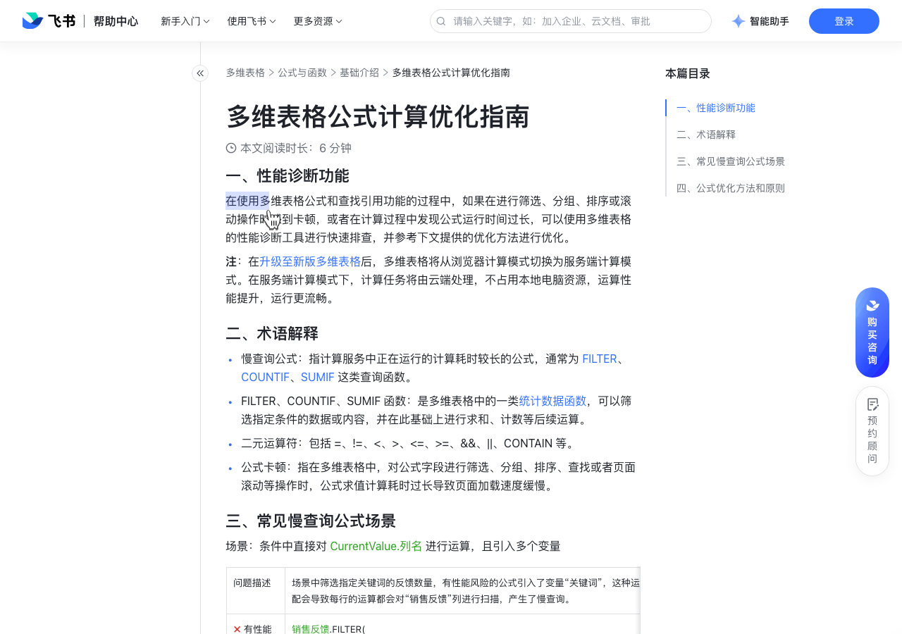

# 多维表格公式计算优化指南

> 来源：[飞书帮助中心](https://www.feishu.cn/hc/zh-CN/articles/022441339437)  
> 分类：多维表格 / 公式与函数 / 基础介绍  
> 抓取时间：2026-09-22T01:23:49.300Z

## 界面截图

### 文档内配图

1. 配图：https://p1-hera.feishucdn.com/tos-cn-i-jbbdkfciu3/2fa34ebba1934f17bc7e497225f5d260~tplv-jbbdkfciu3-image:0:0.image
2. 配图：https://p1-hera.feishucdn.com/tos-cn-i-jbbdkfciu3/ae1fed25510d4223a0b352a9fce403ad~tplv-jbbdkfciu3-image:0:0.image
3. 配图：https://p1-hera.feishucdn.com/tos-cn-i-jbbdkfciu3/add544faa19241c0803e3106a53d8d51~tplv-jbbdkfciu3-image:0:0.image
4. 配图：https://p1-hera.feishucdn.com/tos-cn-i-jbbdkfciu3/b63327a1e0054b65910561046d026328~tplv-jbbdkfciu3-image:0:0.image

## 功能定位

本页对应飞书帮助中心「多维表格 / 公式与函数 / 基础介绍」下的「多维表格公式计算优化指南」。以下需求描述依据官方说明文档提炼，用于指导 DuoWei 对标实现。

## 功能目标

一、性能诊断功能

## 文档结构（官方章节）

- 一、性能诊断功能​
- 二、术语解释​
- 三、常见慢查询公式场景​
- 四、公式优化方法和原则​

## 详细功能说明

一、性能诊断功能

二、术语解释

慢查询公式：指计算服务中正在运行的计算耗时较长的公式，通常为 FILTER、COUNTIF、SUMIF 这类查询函数。

FILTER、COUNTIF、SUMIF 函数：是多维表格中的一类统计数据函数，可以筛选指定条件的数据或内容，并在此基础上进行求和、计数等后续运算。

二元运算符：包括 =、!=、<、>、<=、>=、&&、||、CONTAIN 等。

公式卡顿：指在多维表格中，对公式字段进行筛选、分组、排序、查找或者页面滚动等操作时，公式求值计算耗时过长导致页面加载速度缓慢。

三、常见慢查询公式场景

场景：条件中直接对 CurrentValue.列名 进行运算，且引入多个变量

问题描述

场景中筛选指定关键词的反馈数量，有性能风险的公式引入了变量“关键词”，这种运算中的模糊匹配会导致每行的运算都会对“销售反馈”列进行扫描，产生了慢查询。

✗ 有性能风险

销售反馈.FILTER(CurrentValue.反馈详情.CONTAINTEXT(关键词) ).反馈数量.COUNTA()

✓ 无性能风险

将“销售反馈”列的“反馈详情”添加关键词标签，即“反馈标签”，减少引入变量。销售反馈.FILTER(CurrentValue.反馈标签 = 关键词).反馈数量.COUNTA()

四、公式优化方法和原则

在多维表格右上方找到并点击 多维表格 AI 图标 > 图标 > 性能诊断。如果没有该入口，你可以在多维表格右下角找到并点击 多维表格智能问答 图标 > 性能诊断。

筛选问题公式：在性能诊断面板，筛选 慢查询 和 长耗时 公式，并按照提示进行公式修改。

公式范式

销售总表.FILTER(CurrentValue.列名 操作符=/ >= / <= / !=列名/常量&& CurrentValue.列名 操作符= / >= / <= / !=列名/常量&&CurrentValue.列名 操作符= / >= / <= / !=列名/常量).结果.LISTCOMBINE().SUM() / COUNTA() / UNIQUE()

详细示例

销售总表.FILTER(CurrentValue.销售人员=销售人员&&CurrentValue.销售额>0).销售额.SUM()

场景描述

场景中需要计算不同人员不同年份的销售总额。

采用多个变量列：列 1：Table.FILTER(CurrentValue.年份=2021&&CurrentValue.人员=姓名).销售额.SUM()列 2：Table.FILTER(CurrentValue.年份=2022&&CurrentValue.人员=姓名).销售额.SUM()

使用一个变量列：Table.FILTER(CurrentValue.年份=年份列&&CurrentValue.人员=姓名).销售额.SUM()250px|700px|reset

问题描述 | 场景中筛选指定关键词的反馈数量，有性能风险的公式引入了变量“关键词”，这种运算中的模糊匹配会导致每行的运算都会对“销售反馈”列进行扫描，产生了慢查询。

✗ 有性能风险 | 销售反馈.FILTER(CurrentValue.反馈详情.CONTAINTEXT(关键词) ).反馈数量.COUNTA()

✓ 无性能风险 | 将“销售反馈”列的“反馈详情”添加关键词标签，即“反馈标签”，减少引入变量。销售反馈.FILTER(CurrentValue.反馈标签 = 关键词).反馈数量.COUNTA()

公式范式 | 销售总表.FILTER(CurrentValue.列名 操作符=/ >= / <= / !=列名/常量&& CurrentValue.列名 操作符= / >= / <= / !=列名/常量&&CurrentValue.列名 操作符= / >= / <= / !=列名/常量).结果.LISTCOMBINE().SUM() / COUNTA() / UNIQUE()

详细示例 | 销售总表.FILTER(CurrentValue.销售人员=销售人员&&CurrentValue.销售额>0).销售额.SUM()

场景描述 | 场景中需要计算不同人员不同年份的销售总额。

✗ 有性能风险 | 采用多个变量列：列 1：Table.FILTER(CurrentValue.年份=2021&&CurrentValue.人员=姓名).销售额.SUM()列 2：Table.FILTER(CurrentValue.年份=2022&&CurrentValue.人员=姓名).销售额.SUM()

✓ 无性能风险 | 使用一个变量列：Table.FILTER(CurrentValue.年份=年份列&&CurrentValue.人员=姓名).销售额.SUM()250px|700px|reset

## 实现要点（对标 DuoWei）

1. **入口与信息架构**：在产品中明确该能力所属模块（公式与函数 / 基础介绍），并保证用户可从对应导航触达。
2. **核心交互**：按上文「详细功能说明」还原主要操作路径；截图中出现的按钮、字段、面板命名尽量与飞书语义一致或可映射。
3. **数据与权限**：若文档涉及可见范围、可编辑范围、分享或高级权限，实现时需落到角色/成员模型，并保证 API/MCP 与 UI 权限一致。
4. **边界与上限**：若文档提到数量上限、格式限制、导入导出约束，需在实现与错误提示中体现。
5. **验收**：以本页截图场景为用例，完成「能打开 / 能配置 / 能保存 / 能被 Agent 读写（如适用）」四项检查。

## 原始摘录摘要

> 一、性能诊断功能 二、术语解释 慢查询公式：指计算服务中正在运行的计算耗时较长的公式，通常为 FILTER、COUNTIF、SUMIF 这类查询函数。 FILTER、COUNTIF、SUMIF 函数：是多维表格中的一类统计数据函数，可以筛选指定条件的数据或内容，并在此基础上进行求和、计数等后续运算。 二元运算符：包括 =、!=、<、>、<=、>=、&&、||、CONTAIN 等。 公式卡顿：指在多维表格中，对公式字段进行筛选、分组、排序、查找或者页面滚动等操作时，公式求值计算耗时过长导致页面加载速度缓慢。 三、常见慢查询公式场景 场景：条件中直接对 CurrentValue.列名 进行运算，且引入多个变量 问题描述 场景中筛选指定关键词的反馈数量，有性能风险的公式引入了变量“关键词”，这种运算中的模糊匹配会导致每行的运算都会对“销售反馈”列进行扫描，产生了慢查询。 ✗ 有性能风险 销售反馈.FILTER(CurrentValue.反馈详情.CONTAINTEXT(关键词) ).反馈数量.COUNTA() ✓ 无性能风险 将“销售反馈”列的“反馈详情”添加关键词标签，即“反馈标签”，减少引入变量。销售反馈.FILTER(CurrentValue.反馈标签 = 关键词).反馈数量.COUNTA() 四、公式优化方法和原则 在多维表格右上方找到并点击 多维表格 AI 图标 > 图标 > 性能诊断。如果没有该入口，你可以在多维表格右下角找到并点击 多维表格智能问答 图标 > 性能诊断。 筛选问题公式：在性能诊断面板，筛选 慢查询 和 长耗时 公式，并按照提示进行公式修改。 公式范式 销售总表.FILTER(CurrentValue.列名 操作符=/ >= / <= / !=列名/常量&& CurrentValue.列名 操作符= / >= / <= / !=列名/常量&&Curre…

## 元数据

- article_id: `7153963190265577500`
- category_id: `7082596125407985665`
- path: `/hc/zh-CN/articles/022441339437`
- extracted_text_length: 2014
