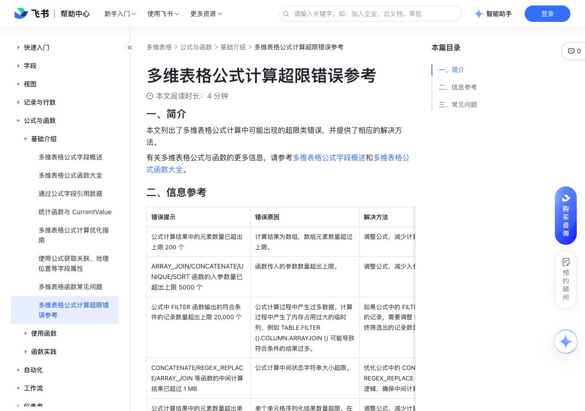

# 多维表格公式计算超限错误参考

> 来源：[飞书帮助中心](https://www.feishu.cn/hc/zh-CN/articles/140179638490)  
> 分类：多维表格 / 公式与函数 / 基础介绍  
> 抓取时间：2026-09-22T01:23:51.126Z

## 界面截图

## 功能定位

本页对应飞书帮助中心「多维表格 / 公式与函数 / 基础介绍」下的「多维表格公式计算超限错误参考」。以下需求描述依据官方说明文档提炼，用于指导 DuoWei 对标实现。

## 功能目标

一、简介

## 文档结构（官方章节）

- 一、简介​
- 二、信息参考​
- 三、常见问题​

## 详细功能说明

一、简介

二、信息参考

错误提示

错误原因

解决方法

公式计算结果中的元素数量已超出上限 200 个

计算结果为数组，数组元素数量超过上限。

调整公式，减少计算结果中的元素数量后重试。

ARRAY_JOIN/CONCATENATE/UNIQUE/SORT 函数的入参数量已超出上限 5000 个

函数传入的参数数量超出上限。

调整公式，减少入参数量后重试。

公式中 FILTER 函数输出的符合条件的记录数量超出上限 20,000 个

公式计算过程中产生过多数据。计算过程中产生了内存占用过大的临时列，例如 TABLE.FILTER ().COLUMN.ARRAYJOIN () 可能导致符合条件的结果过多。

如果公式中的 FILTER () 函数返回过多符合筛选条件的记录，需要调整 FILTER 函数的筛选条件，保证最终筛选出的记录数量不超过 20,000 项。

CONCATENATE/REGEX_REPLACE/ARRAY_JOIN 等函数的中间计算结果已超过 1 MB

公式计算中间状态字符串大小超限。

优化公式中的 CONCATENATE ()、REGEX_REPLACE ()、ARRAY_JOIN () 等函数的公式逻辑，确保中间计算结果不超过 1 MB。

公式计算结果中的元素数量超出单层上限 200 个

单个单元格序列化结果数量超限。在序列化时，如存在计算结果类型为数组，则其内部每层嵌套的数组元素个数上限为 200。

调整公式，减少计算结果列表中存在的嵌套层级或元素数量。

该单元格的计算结果已超出上限 4 MB

单个单元格结果的数据大小超限。

调整公式，减少公式返回的数据量，或者分步执行复杂计算，以减少公式的返回结果数据量。

该列的计算结果已超出上限 100 MB

整列结果的数据大小超限。

减少公式返回的数据量，或者分步执行复杂计算，以减少公式的返回结果数据量。

该表的计算结果已超出上限 256 MB

整表的计算结果数据量大小超限。

当前多维表格单表的存储容量已超出上限 10 GB

数据表存储超限。

删除部分数据或将数据表拆分后重试。

三、常见问题

问：如何优化多维表格中公式的逻辑？

答：优化公式逻辑通常涉及以下几个方面：减少不必要的计算：避免在公式中进行重复计算，可以使用单独的一列来存储中间结果。筛选数据源：在计算前，先通过筛选功能减少参与计算的数据行数。选择更适合的函数：尝试使用更高效的函数组合来替代复杂的嵌套函数。你可以参考多维表格公式计算优化指南中描述的方法进行优化。

问：多维表格公式中为什么会出现“整列/整表的结果大小已超过上限”的提示？

答：该错误通常是因公式计算产生大量结果数据导致的。例如，将公式应用到整列，且每一行都返回一个较长的文本或数组时，可能出现该问题。你可以尝试减少公式返回的数据量，或者分步执行复杂计算。

错误提示 | 错误原因 | 解决方法

公式计算结果中的元素数量已超出上限 200 个 | 计算结果为数组，数组元素数量超过上限。 | 调整公式，减少计算结果中的元素数量后重试。

ARRAY_JOIN/CONCATENATE/UNIQUE/SORT 函数的入参数量已超出上限 5000 个 | 函数传入的参数数量超出上限。 | 调整公式，减少入参数量后重试。

公式中 FILTER 函数输出的符合条件的记录数量超出上限 20,000 个 | 公式计算过程中产生过多数据。计算过程中产生了内存占用过大的临时列，例如 TABLE.FILTER ().COLUMN.ARRAYJOIN () 可能导致符合条件的结果过多。 | 如果公式中的 FILTER () 函数返回过多符合筛选条件的记录，需要调整 FILTER 函数的筛选条件，保证最终筛选出的记录数量不超过 20,000 项。

CONCATENATE/REGEX_REPLACE/ARRAY_JOIN 等函数的中间计算结果已超过 1 MB | 公式计算中间状态字符串大小超限。 | 优化公式中的 CONCATENATE ()、REGEX_REPLACE ()、ARRAY_JOIN () 等函数的公式逻辑，确保中间计算结果不超过 1 MB。

公式计算结果中的元素数量超出单层上限 200 个 | 单个单元格序列化结果数量超限。在序列化时，如存在计算结果类型为数组，则其内部每层嵌套的数组元素个数上限为 200。 | 调整公式，减少计算结果列表中存在的嵌套层级或元素数量。

该单元格的计算结果已超出上限 4 MB | 单个单元格结果的数据大小超限。 | 调整公式，减少公式返回的数据量，或者分步执行复杂计算，以减少公式的返回结果数据量。

该列的计算结果已超出上限 100 MB | 整列结果的数据大小超限。 | 减少公式返回的数据量，或者分步执行复杂计算，以减少公式的返回结果数据量。

该表的计算结果已超出上限 256 MB | 整表的计算结果数据量大小超限。 | 减少公式返回的数据量，或者分步执行复杂计算，以减少公式的返回结果数据量。

当前多维表格单表的存储容量已超出上限 10 GB | 数据表存储超限。 | 删除部分数据或将数据表拆分后重试。

## 实现要点（对标 DuoWei）

1. **入口与信息架构**：在产品中明确该能力所属模块（公式与函数 / 基础介绍），并保证用户可从对应导航触达。
2. **核心交互**：按上文「详细功能说明」还原主要操作路径；截图中出现的按钮、字段、面板命名尽量与飞书语义一致或可映射。
3. **数据与权限**：若文档涉及可见范围、可编辑范围、分享或高级权限，实现时需落到角色/成员模型，并保证 API/MCP 与 UI 权限一致。
4. **边界与上限**：若文档提到数量上限、格式限制、导入导出约束，需在实现与错误提示中体现。
5. **验收**：以本页截图场景为用例，完成「能打开 / 能配置 / 能保存 / 能被 Agent 读写（如适用）」四项检查。

## 原始摘录摘要

> 一、简介 二、信息参考 错误提示 错误原因 解决方法 公式计算结果中的元素数量已超出上限 200 个 计算结果为数组，数组元素数量超过上限。 调整公式，减少计算结果中的元素数量后重试。 ARRAY_JOIN/CONCATENATE/UNIQUE/SORT 函数的入参数量已超出上限 5000 个 函数传入的参数数量超出上限。 调整公式，减少入参数量后重试。 公式中 FILTER 函数输出的符合条件的记录数量超出上限 20,000 个 公式计算过程中产生过多数据。计算过程中产生了内存占用过大的临时列，例如 TABLE.FILTER ().COLUMN.ARRAYJOIN () 可能导致符合条件的结果过多。 如果公式中的 FILTER () 函数返回过多符合筛选条件的记录，需要调整 FILTER 函数的筛选条件，保证最终筛选出的记录数量不超过 20,000 项。 CONCATENATE/REGEX_REPLACE/ARRAY_JOIN 等函数的中间计算结果已超过 1 MB 公式计算中间状态字符串大小超限。 优化公式中的 CONCATENATE ()、REGEX_REPLACE ()、ARRAY_JOIN () 等函数的公式逻辑，确保中间计算结果不超过 1 MB。 公式计算结果中的元素数量超出单层上限 200 个 单个单元格序列化结果数量超限。在序列化时，如存在计算结果类型为数组，则其内部每层嵌套的数组元素个数上限为 200。 调整公式，减少计算结果列表中存在的嵌套层级或元素数量。 该单元格的计算结果已超出上限 4 MB 单个单元格结果的数据大小超限。 调整公式，减少公式返回的数据量，或者分步执行复杂计算，以减少公式的返回结果数据量。 该列的计算结果已超出上限 100 MB 整列结果的数据大小超限。 减少公式返回的数据量，或者分步执行复杂计算，以减少公式的返回结果数据量。 该表的计…

## 元数据

- article_id: `7555407087229714436`
- category_id: `7082596125407985665`
- path: `/hc/zh-CN/articles/140179638490`
- extracted_text_length: 2135
