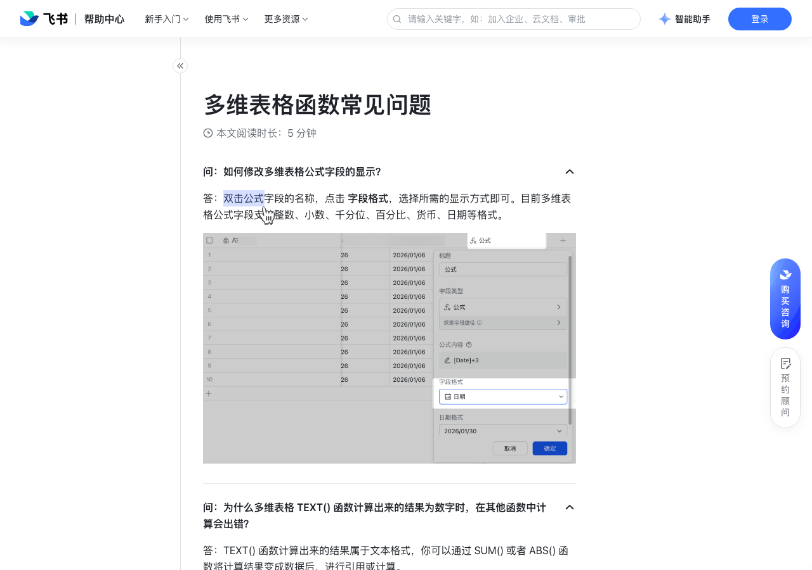

# 多维表格函数常见问题

> 来源：[飞书帮助中心](https://www.feishu.cn/hc/zh-CN/articles/665637142562)  
> 分类：多维表格 / 公式与函数 / 基础介绍  
> 抓取时间：2026-09-22T01:23:49.179Z

## 界面截图

## 功能定位

本页对应飞书帮助中心「多维表格 / 公式与函数 / 基础介绍」下的「多维表格函数常见问题」。以下需求描述依据官方说明文档提炼，用于指导 DuoWei 对标实现。

## 功能目标

格式与占位符

## 详细功能说明

格式与占位符

数字占位符，用于自定义数字格式

TEXT(23.1,"##.#")=23.1 TEXT(23.17,"##.#")=23.2

数字补位符，用于自定义数字格式

TEXT(23.1,"0.00")=23.10 TEXT(23.17,"0.00")=23.17

千位分隔符，在 # 或者 0 之间使用

TEXT(23100,"0,0")=23,100

百分号，需与 # 或者 0 结合使用

TEXT(23,"0%")=2300%

YYYY

年份全称

TEXT("2022-4-15","YYYY")=2022 TEXT("2022-4-15","YYYY年")=2022年

年份缩写

TEXT("2022-4-15","YY")=22 TEXT("2022-4-15","YY年")=22年

月份全称

TEXT("2022-4-15","MMM")=4月

月份数字全写

TEXT("2022-4-15","YYYY/MM")=2022/04 TEXT("2022-4-15","MM月")=04月

月份数字简写

TEXT("2022-4-15","M")=4 TEXT("2022-4-15","M月")=4月

TEXT("2022-4-1","DD")=01 TEXT("2022-4-1","DD日")=01日

TEXT("2022-4-1","D")=1 TEXT("2022-4-1","D日")=1日

DDDD

星期全称

TEXT("2022-4-1","DDDD")=星期五

星期简称

TEXT("2022-4-1","DDD")=周五

TEXT("17:30","hh")=17

TEXT("17:30","hh:mm")=17:30

TEXT("17:30:29","ss")=29

问：如何修改多维表格公式字段的显示？

答：双击公式字段的名称，对内容有疑问？选中评论吧我们将评估你的评论，及时优化内容知道了点击 字段格式，选择所需的显示方式即可。目前多维表格公式字段支持整数、小数、千分位、百分比、货币、日期等格式。250px|700px|reset

问：为什么多维表格 TEXT() 函数计算出来的结果为数字时，在其他函数中计算会出错？

答：TEXT() 函数计算出来的结果属于文本格式，你可以通过 SUM() 或者 ABS() 函数将计算结果变成数据后，进行引用或计算。 250px|700px|reset

问：为什么多维表格显示公式无效？

答：可能有以下几种原因： 公式中用到的运算符号和括号等不是英文符号，例如：“文本” 应该为"文本"。括号数量不匹配，例如：IF(TRUE, 0, 1)) 应该为 IF(TRUE, 0, 1) 。 公式中存在无效数据，例如：SUM([字段A]) 中，字段A 被删除或不存在。百分数格式不正确，参与计算时，百分数应写成小数形式，例如：0.01。使用的运算符号不正确。 数据的格式不正确，如果涉及同步操作，需要在同步前调整好数据格式。

问：多维表格公式中常用的运算符号有哪些？

符号类型 运算符 说明 逻辑运算符 &&并且||或者> 大于>= 大于等于< 小于<= 小于等于= 等于!= 不等于文本链接符 & 将两个文本进行拼接数值运算符 + 两个数值相加 - 两个数值相减* 两个数值相乘/ 两个数值相除% 取余

问：为什么多维表格求和的结果不正确？

答：仅支持对公式字段和数字字段中的数据进行计算，请确认进行计算的字段类型不是文本字段； 数据精确度较高时，请将数字位数调整为小数点后 4 位，再确认计算结果。250px|700px|reset

问：多维表格公式中百分数如何表示？

答：在多维表格公式中，百分数需写成小数形式才能参与计算。例如：10% 在公式中应为 0.1。

问：多维表格公式字段中日期函数的运算结果的数据格式是什么？

答：公式字段中日期函数的运算结果是以时间戳形式存储的。尽管多维表格支持在字段的格式设置中指定日期格式，但该设置仅将结果显示为日期，并未转换数据格式。数据仍以时间戳格式存储。因此，系统仍会将此类数据识别为时间戳。例如在对该字段进行筛选时，筛选条件与数字的筛选条件相同，而非日期。

问：在多维表格中使用 & 符号进行文本拼接时，日期的结果为什么显示的是数字？

答：直接使用 & 符号进行文本拼接时，日期的结果会被识别为数字，所以在对日期进行文本拼接时，需要使用 TEXT() 函数将日期转换为文本格式。250px|700px|reset

问：多维表格公式计算出来应该是日期，为什么显示的是数字？

答：数字是日期格式的运算值，若公式运算的最终结果格式显示不准确，可双击字段名称，将字段调整为日期格式。对于货币、百分比等格式也可采取相同操作。250px|700px|reset注：在公式字段中使用日期相关的函数时，运算结果实际是以时间戳格式存储，而非日期。即使选择了以日期格式显示，系统仍会将该字段识别为时间戳。

问：多维表格公式中如何表示为空？

答：可以用 = ""，也可以用 ISBLANK() 函数。例如：IF([日期]="","为空","不为空")或 IF([日期].ISBLANK(),="","为空","不为空")。

问：多维表格公式中被引用的日期应该如何书写和参与计算？

答：有以下两种情况； 当公式中引用的数据本身就是日期字段类型时，可以直接参与计算。例如：下图结束时间和开始时间均为日期字段，直接相减即可得出相差的天数。250px|700px|reset当日期为一个固定的文本时，可以通过 TODATE() 函数将输入的文本转换为日期。例如：下图 2022/05/01 是一个固定的日期，需要用 TODATE() 函数进行转换后才能参与计算。 注：文本需用英文双引号括起来，公式才能生效。 250px|700px|reset

问：多维表格 TEXT() 函数支持哪些自定义格式？

答：常见格式请见下表；格式与占位符 说明 举例 # 数字占位符，用于自定义数字格式 TEXT(23.1,"##.#")=23.1 TEXT(23.17,"##.#")=23.2 0 数字补位符，用于自定义数字格式 TEXT(23.1,"0.00")=23.10 TEXT(23.17,"0.00")=23.17 , 千位分隔符，在 # 或者 0 之间使用 TEXT(23100,"0,0")=23,100 % 百分号，需与 # 或者 0 结合使用 TEXT(23,"0%")=2300% YYYY 年份全称 TEXT("2022-4-15","YYYY")=2022 TEXT("2022-4-15","YYYY年")=2022年 YY 年份缩写 TEXT("2022-4-15","YY")=22 TEXT("2022-4-15","YY年")=22年 MMM 月份全称 TEXT("2022-4-15","MMM")=4月 MM 月份数字全写 TEXT("2022-4-15","YYYY/MM")=2022/04 TEXT("2022-4-15","MM月")=04月 M 月份数字简写 TEXT("2022-4-15","M")=4 TEXT("2022-4-15","M月")=4月 DD 日全写 TEXT("2022-4-1","DD")=01 TEXT("2022-4-1","DD日")=01日 D 日简写 TEXT("2022-4-1","D")=1 TEXT("2022-4-1","D日")=1日 DDDD 星期全称 TEXT("2022-4-1","DDDD")=星期五 DDD 星期简称 TEXT("2022-4-1","DDD")=周五 hh 小时 TEXT("17:30","hh")=17 mm 分钟 TEXT("17:30","hh:mm")=17:30 ss 秒钟 TEXT("17:30:29","ss")=29

问：为什么使用多维表格 IFS() 函数时公式书写没有任何错误，结果却显示 #N/A？

答：当数据不满足 IFS() 中任意一个条件时其结果将为 #N/A，为避免这种情况，可以在公式最后添加一个特殊条件。例如：IFS([成绩]=100,"满分", [成绩] >=85,"优秀", [成绩] >=75,"良好", [成绩] >=60,"及格", TRUE,"不及格" ) ，上述公式中的 TRUE,"不及格" 即为一个特殊条件，即所有不满足前三个条件的数据结果都将显示为“不及格”。

问：在多维表格中，已知一个日期，怎样计算在该日期特定工作天数后的日期？

答：可以使用 WORKDAY(起始日期, 天数, [节假日]) 函数计算在一个日期的特定数量工作日之后的日期。如，要计算 2024/11/01 之后 10 个工作日的日期，可使用 WORKDAY("2024/11/01", 10)。该函数默认将周六和周日视为非工作日。如需包含其他节假日，可通过 [节假日] 参数进行定义。该参数需为一个包含日期的数组。可预先定义一个日期字段，并将其设置为 [节假日] 参数。

问：如何使用多维表格公式快速统计字段中值的个数？

答：可以使用 COUNTA(值1, [值2, ...]) 函数统计数据集中非空值的个数。 如，使用该函数统计人员字段中人员的个数：COUNTA([人员字段])；或附件字段中附件的个数：COUNTA([附件字段])。如果输入多个参数，COUNTA() 会统计参数值的总个数，应确保统计结果是有意义的。

问：在多维表格中，如何使用公式将文本转为日期？

答：可以通过 TODATE 函数将输入的文本转换为日期。如：在统计某一时间段内的销售额时，需要在公式中将文本转换为时间。例：[数据表].FILTER(CurrentValue.[时间] > TODATE("2021/12/31") && CurrentValue.[时间] < TODATE("2022/12/31"))

问：多维表格的单个公式字段中可引用字段的数量上限是多少？

答：单个公式字段中最多可以引用 300 个字段。

问：多维表格如何跨数据表查询重复字段？

答：如果要跨数据表查找重复字段并进行标注，可以使用公式字段。将公式设置如下，并将公式中对应的数据表和字段名修改为你需要查重的数据表和字段：IF([数据表 2].COUNTIF(CURRENTVAlUE.[数据表 2 查重字段]=[当前表查重字段]) = 0, "不重复", "重复")。该公式字段将使用“重复”和“不重复”标注查重结果。

问：如何在多维表格数据表中按行对数据进行基础运算？

答：如果仅需要按行进行运算，只需新增一个公式字段，在公式中引用相应的字段并添加运算符即可，如“[字段 1] + [字段 2] * [字段 3]”。

问：多维表格数据表中可以自动引用上一行中的字段吗？

答：不支持。

问：可以通过多维表格的公式或函数获取某个字段的名称吗？

格式与占位符 | 说明 | 举例

# | 数字占位符，用于自定义数字格式 | TEXT(23.1,"##.#")=23.1 TEXT(23.17,"##.#")=23.2

0 | 数字补位符，用于自定义数字格式 | TEXT(23.1,"0.00")=23.10 TEXT(23.17,"0.00")=23.17

, | 千位分隔符，在 # 或者 0 之间使用 | TEXT(23100,"0,0")=23,100

% | 百分号，需与 # 或者 0 结合使用 | TEXT(23,"0%")=2300%

YYYY | 年份全称 | TEXT("2022-4-15","YYYY")=2022 TEXT("2022-4-15","YYYY年")=2022年

YY | 年份缩写 | TEXT("2022-4-15","YY")=22 TEXT("2022-4-15","YY年")=22年

MMM | 月份全称 | TEXT("2022-4-15","MMM")=4月

MM | 月份数字全写 | TEXT("2022-4-15","YYYY/MM")=2022/04 TEXT("2022-4-15","MM月")=04月

M | 月份数字简写 | TEXT("2022-4-15","M")=4 TEXT("2022-4-15","M月")=4月

DD | 日全写 | TEXT("2022-4-1","DD")=01 TEXT("2022-4-1","DD日")=01日

D | 日简写 | TEXT("2022-4-1","D")=1 TEXT("2022-4-1","D日")=1日

DDDD | 星期全称 | TEXT("2022-4-1","DDDD")=星期五

DDD | 星期简称 | TEXT("2022-4-1","DDD")=周五

hh | 小时 | TEXT("17:30","hh")=17

mm | 分钟 | TEXT("17:30","hh:mm")=17:30

ss | 秒钟 | TEXT("17:30:29","ss")=29

## 实现要点（对标 DuoWei）

1. **入口与信息架构**：在产品中明确该能力所属模块（公式与函数 / 基础介绍），并保证用户可从对应导航触达。
2. **核心交互**：按上文「详细功能说明」还原主要操作路径；截图中出现的按钮、字段、面板命名尽量与飞书语义一致或可映射。
3. **数据与权限**：若文档涉及可见范围、可编辑范围、分享或高级权限，实现时需落到角色/成员模型，并保证 API/MCP 与 UI 权限一致。
4. **边界与上限**：若文档提到数量上限、格式限制、导入导出约束，需在实现与错误提示中体现。
5. **验收**：以本页截图场景为用例，完成「能打开 / 能配置 / 能保存 / 能被 Agent 读写（如适用）」四项检查。

## 原始摘录摘要

> 格式与占位符 数字占位符，用于自定义数字格式 TEXT(23.1,"##.#")=23.1 TEXT(23.17,"##.#")=23.2 数字补位符，用于自定义数字格式 TEXT(23.1,"0.00")=23.10 TEXT(23.17,"0.00")=23.17 千位分隔符，在 # 或者 0 之间使用 TEXT(23100,"0,0")=23,100 百分号，需与 # 或者 0 结合使用 TEXT(23,"0%")=2300% YYYY 年份全称 TEXT("2022-4-15","YYYY")=2022 TEXT("2022-4-15","YYYY年")=2022年 年份缩写 TEXT("2022-4-15","YY")=22 TEXT("2022-4-15","YY年")=22年 月份全称 TEXT("2022-4-15","MMM")=4月 月份数字全写 TEXT("2022-4-15","YYYY/MM")=2022/04 TEXT("2022-4-15","MM月")=04月 月份数字简写 TEXT("2022-4-15","M")=4 TEXT("2022-4-15","M月")=4月 TEXT("2022-4-1","DD")=01 TEXT("2022-4-1","DD日")=01日 TEXT("2022-4-1","D")=1 TEXT("2022-4-1","D日")=1日 DDDD 星期全称 TEXT("2022-4-1","DDDD")=星期五 星期简称 TEXT("2022-4-1","DDD")=周五 TEXT("17:30","hh")=17 TEXT("17:30","hh:mm")=17:30 TEXT("17:30:29","ss")=29 问：如何修改多维表格公式字段的显示？ 答：双击公式字段的名称，对内容有疑问？选中评论吧我们将…

## 元数据

- article_id: `7344989869439696924`
- category_id: `7082596125407985665`
- path: `/hc/zh-CN/articles/665637142562`
- extracted_text_length: 5401
