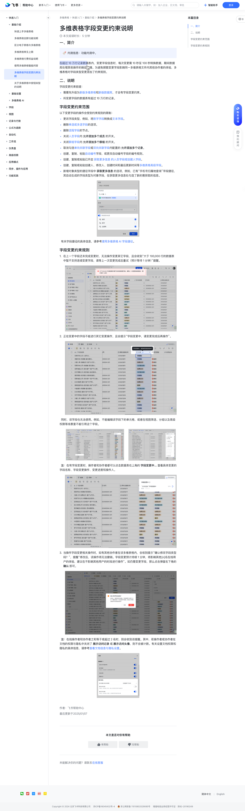

# 多维表格字段变更约束说明

> 来源：[飞书帮助中心](https://www.feishu.cn/hc/zh-CN/articles/678308220311)  
> 分类：多维表格 / 快速入门 / 基础介绍  
> 抓取时间：2026-09-22T00:46:14.358Z

## 界面截图

### 文档内配图

1. 配图：https://p1-hera.feishucdn.com/tos-cn-i-jbbdkfciu3/75d46a38aa9e4f5ea445a895c8dbb295~tplv-jbbdkfciu3-image:0:0.image
2. 配图：https://p1-hera.feishucdn.com/tos-cn-i-jbbdkfciu3/eae2633ea1e64bd0b6352951b0346d69~tplv-jbbdkfciu3-image:0:0.image
3. 配图：https://p1-hera.feishucdn.com/tos-cn-i-jbbdkfciu3/9af9d36c86874760baf13a9d20980e4a~tplv-jbbdkfciu3-image:0:0.image
4. 配图：https://p1-hera.feishucdn.com/tos-cn-i-jbbdkfciu3/4b26c048d2cb4332b42e5f4913e2f58b~tplv-jbbdkfciu3-image:0:0.image
5. 配图：https://p1-hera.feishucdn.com/tos-cn-i-jbbdkfciu3/62053c863dc0405498bc033700445f01~tplv-jbbdkfciu3-image:0:0.image
6. 配图：https://p1-hera.feishucdn.com/tos-cn-i-jbbdkfciu3/a25b8bc14d604568a4602d6860aec744~tplv-jbbdkfciu3-image:0:0.image
7. 配图：https://p1-hera.feishucdn.com/tos-cn-i-jbbdkfciu3/053fa98fcd2e40b8b485600e123e40a1~tplv-jbbdkfciu3-image:0:0.image
8. 配图：https://p1-hera.feishucdn.com/tos-cn-i-jbbdkfciu3/2fdca6ab20804230a5555569672a4269~tplv-jbbdkfciu3-image:0:0.image

## 功能定位

本页对应飞书帮助中心「多维表格 / 快速入门 / 基础介绍」下的「多维表格字段变更约束说明」。以下需求描述依据官方说明文档提炼，用于指导 DuoWei 对标实现。

## 功能目标

一、简介

## 文档结构（官方章节）

- 一、简介​
- 二、说明​
- 字段变更约束范围​
- 字段变更约束规则​

## 详细功能说明

一、简介

二、说明

需要先升级为新版多维表格和新版数据库，才会有字段变更约束。

所变更字段的数据表有超过 10 万行的记录。

字段变更约束范围

更改字段类型，例如，将数字字段转换成文本字段。

删除单选或多选字段的选项。

删除流程字段的节点。

关闭人员字段内 允许添加多个成员 的开关。

关闭群组字段内 允许添加多个群组 的开关。

取消勾选单向关联字段或双向关联字段内配置的 允许添加多个记录。

创建、复制、粘贴自动编号字段，或更改自动编号字段的编号规则。

创建、复制或粘贴已开启 获取更多信息 的人员字段或创建人字段。

创建、复制或粘贴创建人、修改人、创建时间和最后更新时间等多维表格高级字段。

新增对象类型的捷径字段中 获取更多信息 的选项，例如，已有“手机号归属地查询”字段捷径，其自动生成的字段类型为对象字段，在获取更多信息处勾选了新的需获取的信息。

字段变更约束规则

在上一个字段还未完成变更时，无法操作变更其它字段，且会收到“大于 100,000 行的数据表中暂不支持连续变更字段，请等上一次变更完成后重试（预计等待 1 分钟）”提醒。

正在变更中的字段不能进行其它变更操作，且会提示“字段变更中，请变更完成后再操作”。

当操作字段变更相关操作时，如有其他协作者在该多维表格内，会收到提示“确认修改字段类型吗？”，提醒“修改后，该操作将无法撤销。字段变更预计持续 1 分钟，将影响其他[n]名在线用户的体验，建议在不影响其他用户的时段进行操作”。如仍需变更字段，那么点击弹窗右下角的 确认 即可。

一、简介🔖内测信息：功能内测中。在超过 10 万行记录数据表内，对内容有疑问？选中评论吧我们将评估你的评论，及时优化内容知道了变更字段信息时，每次变更需 10 秒至 100 秒转换数据，期间数据库处理其他操作的响应变慢。为避免频繁变更字段影响同一多维表格文件内其他协作者的体验，多维表格对字段类型变更添加了约束规则。 二、说明字段变更约束前提：需要先升级为新版多维表格和新版数据库，才会有字段变更约束。所变更字段的数据表有超过 10 万行的记录。字段变更约束范围以下变更字段的操作会受到约束规则的限制：更改字段类型，例如，将数字字段转换成文本字段。删除单选或多选字段的选项。删除流程字段的节点。关闭人员字段内 允许添加多个成员 的开关。关闭群组字段内 允许添加多个群组 的开关。取消勾选单向关联字段或双向关联字段内配置的 允许添加多个记录。创建、复制、粘贴自动编号字段，或更改自动编号字段的编号规则。创建、复制或粘贴已开启 获取更多信息 的人员字段或创建人字段。创建、复制或粘贴创建人、修改人、创建时间和最后更新时间等多维表格高级字段。新增对象类型的捷径字段中 获取更多信息 的选项，例如，已有“手机号归属地查询”字段捷径，其自动生成的字段类型为对象字段，在获取更多信息处勾选了新的需获取的信息。250px|700px|reset 有关字段捷径的具体信息，请参考使用多维表格 AI 字段捷径。字段变更约束规则在上一个字段还未完成变更时，无法操作变更其它字段，且会收到“大于 100,000 行的数据表中暂不支持连续变更字段，请等上一次变更完成后重试（预计等待 1 分钟）”提醒。250px|700px|reset正在变更中的字段不能进行其它变更操作，且会提示“字段变更中，请变更完成后再操作”。250px|700px|reset 同时，该字段也无法使用。例如，不能编辑该字段下的单元格，或者在视图筛选、分组以及高级权限等场景里不能引用这个字段。250px|700px|reset250px|700px|reset 注：在有字段变更时，操作者和协作者都可以点击数据表右上角的 字段变更中… 查看具体变更的字段名称、字段变更操作、变更进度和操作人。250px|700px|reset当操作字段变更相关操作时，如有其他协作者在该多维表格内，会收到提示“确认修改字段类型吗？”，提醒“修改后，该操作将无法撤销。字段变更预计持续 1 分钟，将影响其他[n]名在线用户的体验，建议在不影响其他用户的时段进行操作”。如仍需变更字段，那么点击弹窗右下角的 确认 即可。250px|700px|reset 注：在线操作者和协作者之和等于或超过 2 名时，则会收到该提醒。其中，若操作者或协作者在文档的权限与隐私中关闭了 展示访问记录 或 展示访问头像，则不会被计数。有关设置文档权限和隐私的具体信息，请参考查看文档信息与隐私设置。250px|700px|reset

## 实现要点（对标 DuoWei）

1. **入口与信息架构**：在产品中明确该能力所属模块（快速入门 / 基础介绍），并保证用户可从对应导航触达。
2. **核心交互**：按上文「详细功能说明」还原主要操作路径；截图中出现的按钮、字段、面板命名尽量与飞书语义一致或可映射。
3. **数据与权限**：若文档涉及可见范围、可编辑范围、分享或高级权限，实现时需落到角色/成员模型，并保证 API/MCP 与 UI 权限一致。
4. **边界与上限**：若文档提到数量上限、格式限制、导入导出约束，需在实现与错误提示中体现。
5. **验收**：以本页截图场景为用例，完成「能打开 / 能配置 / 能保存 / 能被 Agent 读写（如适用）」四项检查。

## 原始摘录摘要

> 一、简介 二、说明 需要先升级为新版多维表格和新版数据库，才会有字段变更约束。 所变更字段的数据表有超过 10 万行的记录。 字段变更约束范围 更改字段类型，例如，将数字字段转换成文本字段。 删除单选或多选字段的选项。 删除流程字段的节点。 关闭人员字段内 允许添加多个成员 的开关。 关闭群组字段内 允许添加多个群组 的开关。 取消勾选单向关联字段或双向关联字段内配置的 允许添加多个记录。 创建、复制、粘贴自动编号字段，或更改自动编号字段的编号规则。 创建、复制或粘贴已开启 获取更多信息 的人员字段或创建人字段。 创建、复制或粘贴创建人、修改人、创建时间和最后更新时间等多维表格高级字段。 新增对象类型的捷径字段中 获取更多信息 的选项，例如，已有“手机号归属地查询”字段捷径，其自动生成的字段类型为对象字段，在获取更多信息处勾选了新的需获取的信息。 字段变更约束规则 在上一个字段还未完成变更时，无法操作变更其它字段，且会收到“大于 100,000 行的数据表中暂不支持连续变更字段，请等上一次变更完成后重试（预计等待 1 分钟）”提醒。 正在变更中的字段不能进行其它变更操作，且会提示“字段变更中，请变更完成后再操作”。 当操作字段变更相关操作时，如有其他协作者在该多维表格内，会收到提示“确认修改字段类型吗？”，提醒“修改后，该操作将无法撤销。字段变更预计持续 1 分钟，将影响其他[n]名在线用户的体验，建议在不影响其他用户的时段进行操作”。如仍需变更字段，那么点击弹窗右下角的 确认 即可。 一、简介🔖内测信息：功能内测中。在超过 10 万行记录数据表内，对内容有疑问？选中评论吧我们将评估你的评论，及时优化内容知道了变更字段信息时，每次变更需 10 秒至 100 秒转换数据，期间数据库处理其他操作的响应变慢。为避免频繁变更字段影响同一多维表格文件内其他协作者的体验，多维表格对字…

## 元数据

- article_id: `7451454655453904900`
- category_id: `7225072370607013890`
- path: `/hc/zh-CN/articles/678308220311`
- extracted_text_length: 1228
