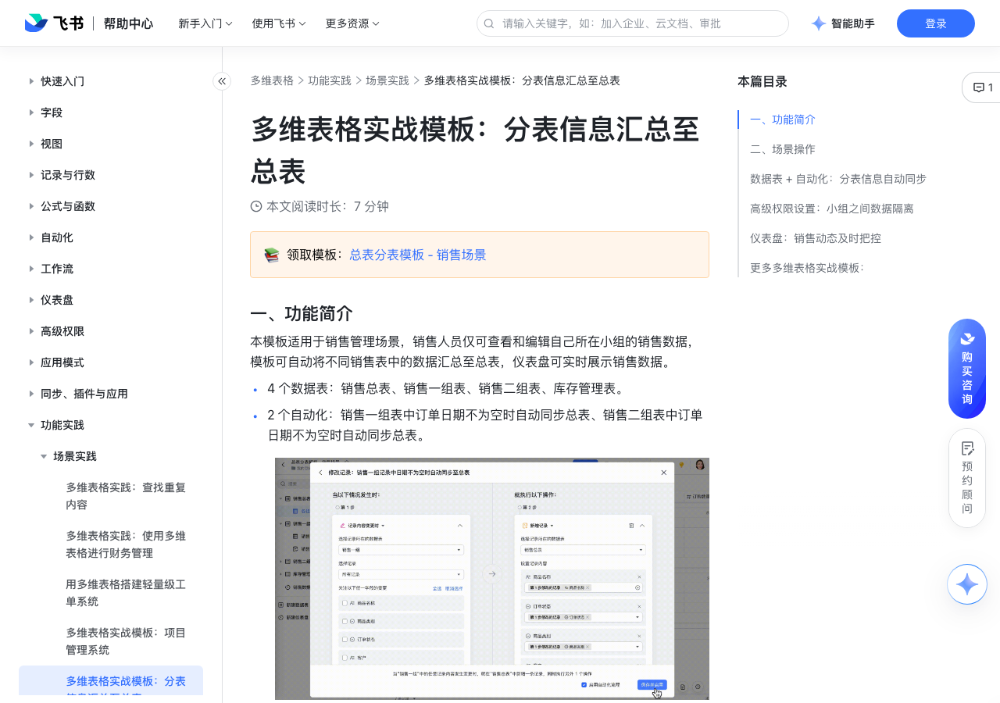

# 多维表格实战模板：分表信息汇总至总表 

> 来源：[飞书帮助中心](https://www.feishu.cn/hc/zh-CN/articles/213323084795)  
> 分类：多维表格 / 功能实践 / 场景实践  
> 抓取时间：2026-09-22T01:26:49.643Z

## 界面截图

### 文档内配图

1. 配图：https://p1-hera.feishucdn.com/tos-cn-i-jbbdkfciu3/f19c3203c6054927b6ed4776700d5d30~tplv-jbbdkfciu3-image:0:0.image
2. 配图：https://p1-hera.feishucdn.com/tos-cn-i-jbbdkfciu3/764a44134ea8414699706131de34c2dc~tplv-jbbdkfciu3-image:0:0.image
3. 配图：https://p1-hera.feishucdn.com/tos-cn-i-jbbdkfciu3/507f30f07b5c4b05ae3588a8e0542890~tplv-jbbdkfciu3-image:0:0.image
4. 配图：https://p1-hera.feishucdn.com/tos-cn-i-jbbdkfciu3/c8acdf863be7415dbb396278bf04ec32~tplv-jbbdkfciu3-image:0:0.image
5. 配图：https://p1-hera.feishucdn.com/tos-cn-i-jbbdkfciu3/5f14fb7af32a410c845ff0ca3f91e10e~tplv-jbbdkfciu3-image:0:0.image
6. 配图：https://p1-hera.feishucdn.com/tos-cn-i-jbbdkfciu3/34d995d8cf85475ea96464af73c26a9e~tplv-jbbdkfciu3-image:0:0.image
7. 配图：https://p1-hera.feishucdn.com/tos-cn-i-jbbdkfciu3/5b7d0f2f91694ac1a74d4769d8a08730~tplv-jbbdkfciu3-image:0:0.image
8. 配图：https://p1-hera.feishucdn.com/tos-cn-i-jbbdkfciu3/944d875fe60f4a1e89bf243823ac8bd8~tplv-jbbdkfciu3-image:0:0.image
9. 配图：https://p1-hera.feishucdn.com/tos-cn-i-jbbdkfciu3/bc16217c6a05442ebfbd19d5c9fec586~tplv-jbbdkfciu3-image:0:0.image
10. 配图：https://p1-hera.feishucdn.com/tos-cn-i-jbbdkfciu3/26efa040eb89484fa19edb37e4ac3da7~tplv-jbbdkfciu3-image:0:0.image
11. 配图：https://p1-hera.feishucdn.com/tos-cn-i-jbbdkfciu3/b0e67a8f452948bbb3039937d5a56c3b~tplv-jbbdkfciu3-image:0:0.image
12. 配图：https://p1-hera.feishucdn.com/tos-cn-i-jbbdkfciu3/daa6502a713a4e09ac1fe0405c804f9e~tplv-jbbdkfciu3-image:0:0.image
13. 配图：https://p1-hera.feishucdn.com/tos-cn-i-jbbdkfciu3/31a21971e1bd4b3db6840000da4ccc5d~tplv-jbbdkfciu3-image:0:0.image
14. 配图：https://p1-hera.feishucdn.com/tos-cn-i-jbbdkfciu3/7c37ae0395054efd80767606ffb2f8c9~tplv-jbbdkfciu3-image:0:0.image
15. 配图：https://p1-hera.feishucdn.com/tos-cn-i-jbbdkfciu3/4cd68d7076564663be0d6a9ac28f744e~tplv-jbbdkfciu3-image:0:0.image
16. 配图：https://p1-hera.feishucdn.com/tos-cn-i-jbbdkfciu3/0a2d030ea05445d795931a0d9e2363fd~tplv-jbbdkfciu3-image:0:0.image

## 功能定位

本页对应飞书帮助中心「多维表格 / 功能实践 / 场景实践」下的「多维表格实战模板：分表信息汇总至总表 」。以下需求描述依据官方说明文档提炼，用于指导 DuoWei 对标实现。

## 功能目标

📚领取模板：总表分表模板 - 销售场景

## 文档结构（官方章节）

- 一、功能简介 ​
- 二、场景操作​
- 数据表 + 自动化：分表信息自动同步 ​
- 高级权限设置：小组之间数据隔离 ​
- 仪表盘：销售动态及时把控 ​
- 更多多维表格实战模板：​

## 详细功能说明

📚领取模板：总表分表模板 - 销售场景

一、功能简介

4 个数据表：销售总表、销售一组表、销售二组表、库存管理表。

2 个自动化：销售一组表中订单日期不为空时自动同步总表、销售二组表中订单日期不为空时自动同步总表。

2 个权限组：分别设置销售一组和二组成员仅能编辑和查看本组数据，小组间数据隔离。

1 个仪表盘：销售数据看板，实时监测销售数据的动态和趋势。

二、场景操作

数据表 + 自动化：分表信息自动同步

销售总表：将各组销售数据汇总，管理者可以查看所有销售数据。

销售一组：销售成员视角，仅销售一组成员可以查看和编辑的数据表，小组成员可以通过表单汇总销售数据，也可以直接在表格中新增，新增的数据将自动汇总到总表中。

表单视图：不同销售组的成员同步信息时，既可以在表格视图中直接新增数据，也可以通过表单同步信息，更有效实现信息隔离。

250px|700px|reset

自动化流程：销售一组表中日期不为空时自动同步至总表。当销售一组成员新增了一条销售记录，且订单日期不为空时，可以实现在销售总表中自动新增一条相同的记录，且新增的记录将自动划分至一组的数据中。

销售二组：销售成员视角，仅销售二组成员可以查看和编辑的数据表，小组成员可以通过表单汇总销售数据，也可以直接在表格中新增，新增的数据将自动汇总到总表中

表单视图：不同销售组的成员同步信息时，既可以在表格视图中直接新增数据，也可以通过表单同步信息，更有效实现信息隔离

自动化流程：销售二组表中日期不为空时自动同步至总表。当销售二组成员新增了一条销售记录，且订单日期不为空时，可以实现在销售总表中自动新增一条相同的记录，且新增的记录将自动划分至二组的数据中。

库存管理：管理员或采购成员管理库存。管理者或采购人员视角，根据销售情况等信息，及时盘点商品库存。

表格视图：库存状态表。根据公式计算的结果，按照库存是否充足对商品进行分组，采购人员或管理员可以清晰查看需要补充的商品

表单视图：商品录入，采购人员购入新商品时可以通过表单将购入商品的信息同步到库存表中。

画册视图：商品库，画册视图以图片为主视觉，有助于管理者或采购人员一眼定位到商品。

高级权限设置：小组之间数据隔离

销售一组：

设置仪表盘、销售总表、销售二组表、库存表为无权限。

设置销售一组权限为：成员可编辑与自己相关的记录。

销售一组成员将只能编辑自己创建的记录，且只能查看本小组成员的数据 。

设置仪表盘、销售总表、销售一组表、库存表为无权限。

设置销售二组权限为：成员可编辑与自己相关的记录。

销售二组成员将只能编辑自己创建的记录，且只能查看本小组成员的数据。

仪表盘：销售动态及时把控

更多多维表格实战模板：

多维表格实战模板：项目管理系统

多维表格实战模板：物品申领

## 实现要点（对标 DuoWei）

1. **入口与信息架构**：在产品中明确该能力所属模块（功能实践 / 场景实践），并保证用户可从对应导航触达。
2. **核心交互**：按上文「详细功能说明」还原主要操作路径；截图中出现的按钮、字段、面板命名尽量与飞书语义一致或可映射。
3. **数据与权限**：若文档涉及可见范围、可编辑范围、分享或高级权限，实现时需落到角色/成员模型，并保证 API/MCP 与 UI 权限一致。
4. **边界与上限**：若文档提到数量上限、格式限制、导入导出约束，需在实现与错误提示中体现。
5. **验收**：以本页截图场景为用例，完成「能打开 / 能配置 / 能保存 / 能被 Agent 读写（如适用）」四项检查。

## 原始摘录摘要

> 📚领取模板：总表分表模板 - 销售场景 一、功能简介 4 个数据表：销售总表、销售一组表、销售二组表、库存管理表。 2 个自动化：销售一组表中订单日期不为空时自动同步总表、销售二组表中订单日期不为空时自动同步总表。 2 个权限组：分别设置销售一组和二组成员仅能编辑和查看本组数据，小组间数据隔离。 1 个仪表盘：销售数据看板，实时监测销售数据的动态和趋势。 二、场景操作 数据表 + 自动化：分表信息自动同步 销售总表：将各组销售数据汇总，管理者可以查看所有销售数据。 销售一组：销售成员视角，仅销售一组成员可以查看和编辑的数据表，小组成员可以通过表单汇总销售数据，也可以直接在表格中新增，新增的数据将自动汇总到总表中。 表单视图：不同销售组的成员同步信息时，既可以在表格视图中直接新增数据，也可以通过表单同步信息，更有效实现信息隔离。 250px|700px|reset 自动化流程：销售一组表中日期不为空时自动同步至总表。当销售一组成员新增了一条销售记录，且订单日期不为空时，可以实现在销售总表中自动新增一条相同的记录，且新增的记录将自动划分至一组的数据中。 销售二组：销售成员视角，仅销售二组成员可以查看和编辑的数据表，小组成员可以通过表单汇总销售数据，也可以直接在表格中新增，新增的数据将自动汇总到总表中 表单视图：不同销售组的成员同步信息时，既可以在表格视图中直接新增数据，也可以通过表单同步信息，更有效实现信息隔离 自动化流程：销售二组表中日期不为空时自动同步至总表。当销售二组成员新增了一条销售记录，且订单日期不为空时，可以实现在销售总表中自动新增一条相同的记录，且新增的记录将自动划分至二组的数据中。 库存管理：管理员或采购成员管理库存。管理者或采购人员视角，根据销售情况等信息，及时盘点商品库存。 表格视图：库存状态表。根据公式计算的结果，按照库存是否充足对商品进行分组，采购人员…

## 元数据

- article_id: `7130831602975850497`
- category_id: `7225155238691471361`
- path: `/hc/zh-CN/articles/213323084795`
- extracted_text_length: 1149
