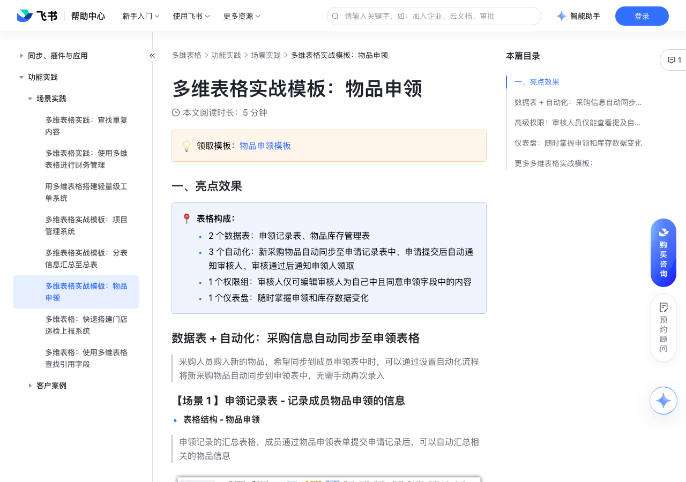

# 多维表格实战模板：物品申领 

> 来源：[飞书帮助中心](https://www.feishu.cn/hc/zh-CN/articles/224079112662)  
> 分类：多维表格 / 功能实践 / 场景实践  
> 抓取时间：2026-09-22T01:26:49.696Z

## 界面截图

### 文档内配图

1. 配图：https://p1-hera.feishucdn.com/tos-cn-i-jbbdkfciu3/4a87ab2cc8f14130ac6ecffade7623ef~tplv-jbbdkfciu3-image:0:0.image
2. 配图：https://p1-hera.feishucdn.com/tos-cn-i-jbbdkfciu3/cd6c0c351b364559936d8ab6ae9bdaa4~tplv-jbbdkfciu3-image:0:0.image
3. 配图：https://p1-hera.feishucdn.com/tos-cn-i-jbbdkfciu3/cf96b6352c4d42168d56eb5436b277dd~tplv-jbbdkfciu3-image:0:0.image
4. 配图：https://p1-hera.feishucdn.com/tos-cn-i-jbbdkfciu3/dac66ac30cd44d77b685d118c65b1c9a~tplv-jbbdkfciu3-image:0:0.image
5. 配图：https://p1-hera.feishucdn.com/tos-cn-i-jbbdkfciu3/dfecbd06ce9140dc80dc9cb706d138a7~tplv-jbbdkfciu3-image:0:0.image
6. 配图：https://p1-hera.feishucdn.com/tos-cn-i-jbbdkfciu3/b90cc79f0dbb4bd183dd4f0522fcd7ac~tplv-jbbdkfciu3-image:0:0.image
7. 配图：https://p1-hera.feishucdn.com/tos-cn-i-jbbdkfciu3/211bb159fc5246f0a611ed0fc1e34af7~tplv-jbbdkfciu3-image:0:0.image
8. 配图：https://p1-hera.feishucdn.com/tos-cn-i-jbbdkfciu3/b748b9bf47d747b4a1bd47b380cc286c~tplv-jbbdkfciu3-image:0:0.image
9. 配图：https://p1-hera.feishucdn.com/tos-cn-i-jbbdkfciu3/e57dc96a54974ec7af273353dbf5bfc3~tplv-jbbdkfciu3-image:0:0.image

## 功能定位

本页对应飞书帮助中心「多维表格 / 功能实践 / 场景实践」下的「多维表格实战模板：物品申领 」。以下需求描述依据官方说明文档提炼，用于指导 DuoWei 对标实现。

## 功能目标

一、亮点效果

## 文档结构（官方章节）

- 一、亮点效果​
- 数据表 + 自动化：采购信息自动同步至申领表格​
- 【场景 1 】申领记录表 - 记录成员物品申领的信息​
- 【场景 2】物品库存管理表 - 记录物品采购和库存明细​
- 高级权限：审核人员仅能查看提及自己的记录​
- 仪表盘：随时掌握申领和库存数据变化​
- 更多多维表格实战模板：​

## 详细功能说明

一、亮点效果

2 个数据表：申领记录表、物品库存管理表

3 个自动化：新采购物品自动同步至申请记录表中、申请提交后自动通知审核人、审核通过后通知申领人领取

1 个权限组：审核人仅可编辑审核人为自己中且同意申领字段中的内容

1 个仪表盘：随时掌握申领和库存数据变化

数据表 + 自动化：采购信息自动同步至申领表格

【场景 1 】申领记录表 - 记录成员物品申领的信息

表格结构 - 物品申领

表单 - 物品申领表单

【场景 2】物品库存管理表 - 记录物品采购和库存明细

表格结构 - 库存明细

表单视图 - 物品采购录入

自动化流程

采购通过表单新增的物品自动同步至申领表中

新的采购物品可以通过筛选的方式在申领表中被自动隐藏，不会影响成员真正提交的申领记录信息

高级权限：审核人员仅能查看提及自己的记录

设置仪表盘、物品库存管理表为无权限

设置申领记录表的权限为：以下字段中包含成员本人的记录，其他记录权限为禁止查看，可编辑的字段为是否统一申领

审核人员进入该表时，将只能查看审核人为自己的记录

仪表盘：随时掌握申领和库存数据变化

更多多维表格实战模板：

多维表格实战模板：项目管理系统

多维表格实战模板：分表信息汇总至总表

## 实现要点（对标 DuoWei）

1. **入口与信息架构**：在产品中明确该能力所属模块（功能实践 / 场景实践），并保证用户可从对应导航触达。
2. **核心交互**：按上文「详细功能说明」还原主要操作路径；截图中出现的按钮、字段、面板命名尽量与飞书语义一致或可映射。
3. **数据与权限**：若文档涉及可见范围、可编辑范围、分享或高级权限，实现时需落到角色/成员模型，并保证 API/MCP 与 UI 权限一致。
4. **边界与上限**：若文档提到数量上限、格式限制、导入导出约束，需在实现与错误提示中体现。
5. **验收**：以本页截图场景为用例，完成「能打开 / 能配置 / 能保存 / 能被 Agent 读写（如适用）」四项检查。

## 原始摘录摘要

> 一、亮点效果 2 个数据表：申领记录表、物品库存管理表 3 个自动化：新采购物品自动同步至申请记录表中、申请提交后自动通知审核人、审核通过后通知申领人领取 1 个权限组：审核人仅可编辑审核人为自己中且同意申领字段中的内容 1 个仪表盘：随时掌握申领和库存数据变化 数据表 + 自动化：采购信息自动同步至申领表格 【场景 1 】申领记录表 - 记录成员物品申领的信息 表格结构 - 物品申领 表单 - 物品申领表单 【场景 2】物品库存管理表 - 记录物品采购和库存明细 表格结构 - 库存明细 表单视图 - 物品采购录入 自动化流程 采购通过表单新增的物品自动同步至申领表中 新的采购物品可以通过筛选的方式在申领表中被自动隐藏，不会影响成员真正提交的申领记录信息 高级权限：审核人员仅能查看提及自己的记录 设置仪表盘、物品库存管理表为无权限 设置申领记录表的权限为：以下字段中包含成员本人的记录，其他记录权限为禁止查看，可编辑的字段为是否统一申领 审核人员进入该表时，将只能查看审核人为自己的记录 仪表盘：随时掌握申领和库存数据变化 更多多维表格实战模板： 多维表格实战模板：项目管理系统 多维表格实战模板：分表信息汇总至总表

## 元数据

- article_id: `7132012370624528412`
- category_id: `7225155238691471361`
- path: `/hc/zh-CN/articles/224079112662`
- extracted_text_length: 513
