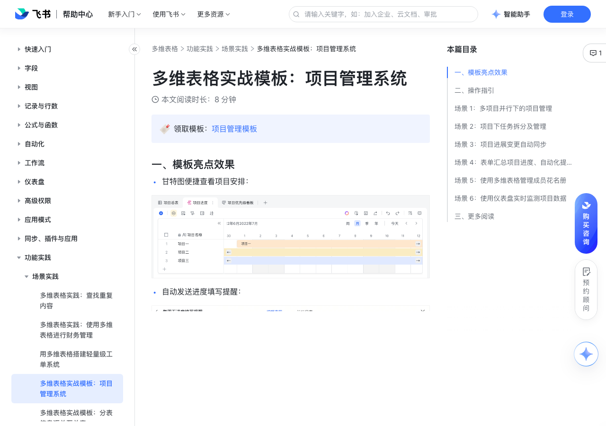

# 多维表格实战模板：项目管理系统 

> 来源：[飞书帮助中心](https://www.feishu.cn/hc/zh-CN/articles/184008024837)  
> 分类：多维表格 / 功能实践 / 场景实践  
> 抓取时间：2026-09-22T01:26:49.052Z

## 界面截图

### 文档内配图

1. 配图：https://p1-hera.feishucdn.com/tos-cn-i-jbbdkfciu3/c9bef24b3fc94193992e31ddda04cd79~tplv-jbbdkfciu3-image:0:0.image
2. 配图：https://p1-hera.feishucdn.com/tos-cn-i-jbbdkfciu3/8e6229de96e149f988fc7cc279811dae~tplv-jbbdkfciu3-image:0:0.image
3. 配图：https://p1-hera.feishucdn.com/tos-cn-i-jbbdkfciu3/bb3240b96a7a4d619cd6469cb3c66466~tplv-jbbdkfciu3-image:0:0.image
4. 配图：https://p1-hera.feishucdn.com/tos-cn-i-jbbdkfciu3/a9807f421f2e43f7960d13bb97646f16~tplv-jbbdkfciu3-image:0:0.image
5. 配图：https://p1-hera.feishucdn.com/tos-cn-i-jbbdkfciu3/e2ea751cc5b54412a7fcec9f9128ce33~tplv-jbbdkfciu3-image:0:0.image
6. 配图：https://p1-hera.feishucdn.com/tos-cn-i-jbbdkfciu3/ad90c6a690f047e9ad77fc1ffcff6a01~tplv-jbbdkfciu3-image:0:0.image
7. 配图：https://p1-hera.feishucdn.com/tos-cn-i-jbbdkfciu3/8577d55da2e64b228995dd18f29d5b21~tplv-jbbdkfciu3-image:0:0.image
8. 配图：https://p1-hera.feishucdn.com/tos-cn-i-jbbdkfciu3/e562a87fbe6e41d6a40dba5e0969af5e~tplv-jbbdkfciu3-image:0:0.image
9. 配图：https://p1-hera.feishucdn.com/tos-cn-i-jbbdkfciu3/f6311a6de7834c0989311b5bd3020b9a~tplv-jbbdkfciu3-image:0:0.image
10. 配图：https://p1-hera.feishucdn.com/tos-cn-i-jbbdkfciu3/5700a937a181492782ad1224bf87927a~tplv-jbbdkfciu3-image:0:0.image
11. 配图：https://p1-hera.feishucdn.com/tos-cn-i-jbbdkfciu3/5c203f9d04d3439bb13922f56514b911~tplv-jbbdkfciu3-image:0:0.image
12. 配图：https://p1-hera.feishucdn.com/tos-cn-i-jbbdkfciu3/c47c90f2457c45b3bb7224c5b3bcf696~tplv-jbbdkfciu3-image:0:0.image
13. 配图：https://p1-hera.feishucdn.com/tos-cn-i-jbbdkfciu3/5d181138f48248fe9a20cbefa519f488~tplv-jbbdkfciu3-image:0:0.image
14. 配图：https://p1-hera.feishucdn.com/tos-cn-i-jbbdkfciu3/869da583d58e4b3daf1d0efd5116c0b5~tplv-jbbdkfciu3-image:0:0.image
15. 配图：https://p1-hera.feishucdn.com/tos-cn-i-jbbdkfciu3/ac5c0d4d6ba249ab8131ed91b58c72ce~tplv-jbbdkfciu3-image:0:0.image
16. 配图：https://p1-hera.feishucdn.com/tos-cn-i-jbbdkfciu3/879035fe8f0242a3b41f98ac06c556bf~tplv-jbbdkfciu3-image:0:0.image

## 功能定位

本页对应飞书帮助中心「多维表格 / 功能实践 / 场景实践」下的「多维表格实战模板：项目管理系统 」。以下需求描述依据官方说明文档提炼，用于指导 DuoWei 对标实现。

## 功能目标

一、模板亮点效果

## 文档结构（官方章节）

- 一、模板亮点效果 ​
- 二、操作指引​
- 场景 1：多项目并行下的项目管理​
- 场景 2：项目下任务拆分及管理​
- 场景 3：项目进展变更自动同步​
- 场景 4：表单汇总项目进度、自动化提醒填写​
- 场景 5：使用多维表格管理成员花名册​
- 场景 6：使用仪表盘实时监测项目数据​
- 三、更多阅读​

## 详细功能说明

一、模板亮点效果

甘特图便捷查看项目安排：

自动发送进度填写提醒：

实时查看项目相关数据：

二、操作指引

4 个数据表：“项目维度表”表、“设计开发工作计划”表、“项目进度同步汇总”表、“项目人员信息”表。

2 个自动化流程：“每周五进度填写提醒”、“项目进展变更同步”。

1 个仪表盘：“项目数据看板”，可实时监测项目数据的变更。

场景 1：多项目并行下的项目管理

用甘特视图查看项目进度：根据项目开始和结束的时间，自动生成时间线，便捷查看每个项目的进度。

用看板视图区分项目优先级：根据项目的优先级查看相关项目，方便负责人根据优先级调整开发人力和方向。

场景 2：项目下任务拆分及管理

在“计划表（按项目）”这个表格视图中，以项目为条件进行分组，按项目查看每个任务的详细信息。

在“人员任务分配”这个表格视图中，以任务执行人和项目为条件进行分组，可以清楚地查看每个执行人目前所在的项目及进度等信息，了解人力情况。

场景 3：项目进展变更自动同步

设置触发条件为“修改记录时”，关注“进展”这一字段的变更。

设置执行操作为“发送飞书消息”。

场景 4：表单汇总项目进度、自动化提醒填写

使用表单视图汇总各成员填写的进度：

担心成员填写信息的同时，误改其他信息？设置高级权限太过麻烦？可以让成员通过表单填写信息，不仅能实现数据隔离，在移动端也能便捷填写。

成员通过表单填写的进度信息，将自动汇总至总表中，方便后续管理与分析。

使用自动化流程提醒成员填写：

担心成员总是忘记同步进度？用自动化流程，即可实现“每周固定时间提醒成员填写进度同步表单”的效果。

开启“项目进度同步表”的表单分享，并复制分享链接。

设置触发条件为“定时触发”，选择一个日期和时间，并选择“每周重复”。

设置执行操作为“发送飞书消息”，并配置底部按钮为“立即填写”，跳转的链接填入表单“项目进度同步表”的分享链接。

场景 5：使用多维表格管理成员花名册

场景 6：使用仪表盘实时监测项目数据

三、更多阅读

多维表格实战模板：物品申领

多维表格实战模板：分表信息汇总至总表

## 实现要点（对标 DuoWei）

1. **入口与信息架构**：在产品中明确该能力所属模块（功能实践 / 场景实践），并保证用户可从对应导航触达。
2. **核心交互**：按上文「详细功能说明」还原主要操作路径；截图中出现的按钮、字段、面板命名尽量与飞书语义一致或可映射。
3. **数据与权限**：若文档涉及可见范围、可编辑范围、分享或高级权限，实现时需落到角色/成员模型，并保证 API/MCP 与 UI 权限一致。
4. **边界与上限**：若文档提到数量上限、格式限制、导入导出约束，需在实现与错误提示中体现。
5. **验收**：以本页截图场景为用例，完成「能打开 / 能配置 / 能保存 / 能被 Agent 读写（如适用）」四项检查。

## 原始摘录摘要

> 一、模板亮点效果 甘特图便捷查看项目安排： 自动发送进度填写提醒： 实时查看项目相关数据： 二、操作指引 4 个数据表：“项目维度表”表、“设计开发工作计划”表、“项目进度同步汇总”表、“项目人员信息”表。 2 个自动化流程：“每周五进度填写提醒”、“项目进展变更同步”。 1 个仪表盘：“项目数据看板”，可实时监测项目数据的变更。 场景 1：多项目并行下的项目管理 用甘特视图查看项目进度：根据项目开始和结束的时间，自动生成时间线，便捷查看每个项目的进度。 用看板视图区分项目优先级：根据项目的优先级查看相关项目，方便负责人根据优先级调整开发人力和方向。 场景 2：项目下任务拆分及管理 在“计划表（按项目）”这个表格视图中，以项目为条件进行分组，按项目查看每个任务的详细信息。 在“人员任务分配”这个表格视图中，以任务执行人和项目为条件进行分组，可以清楚地查看每个执行人目前所在的项目及进度等信息，了解人力情况。 场景 3：项目进展变更自动同步 设置触发条件为“修改记录时”，关注“进展”这一字段的变更。 设置执行操作为“发送飞书消息”。 场景 4：表单汇总项目进度、自动化提醒填写 使用表单视图汇总各成员填写的进度： 担心成员填写信息的同时，误改其他信息？设置高级权限太过麻烦？可以让成员通过表单填写信息，不仅能实现数据隔离，在移动端也能便捷填写。 成员通过表单填写的进度信息，将自动汇总至总表中，方便后续管理与分析。 使用自动化流程提醒成员填写： 担心成员总是忘记同步进度？用自动化流程，即可实现“每周固定时间提醒成员填写进度同步表单”的效果。 开启“项目进度同步表”的表单分享，并复制分享链接。 设置触发条件为“定时触发”，选择一个日期和时间，并选择“每周重复”。 设置执行操作为“发送飞书消息”，并配置底部按钮为“立即填写”，跳转的链接填入表单“项目进度同步表”的分享链接。 场景 5：使…

## 元数据

- article_id: `7130828209337122844`
- category_id: `7225155238691471361`
- path: `/hc/zh-CN/articles/184008024837`
- extracted_text_length: 871
