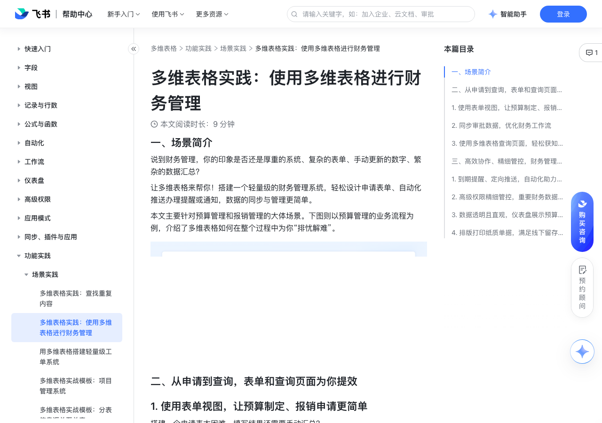

# 多维表格实践：使用多维表格进行财务管理

> 来源：[飞书帮助中心](https://www.feishu.cn/hc/zh-CN/articles/608717030518)  
> 分类：多维表格 / 功能实践 / 场景实践  
> 抓取时间：2026-09-22T01:26:48.733Z

## 界面截图

### 文档内配图

1. 配图：https://p1-hera.feishucdn.com/tos-cn-i-jbbdkfciu3/db3a496619ad4bb1836310a82b6ee9d2~tplv-jbbdkfciu3-image:0:0.image
2. 配图：https://p1-hera.feishucdn.com/tos-cn-i-jbbdkfciu3/a44c8081844b46f882c7bed78a1b2244~tplv-jbbdkfciu3-image:0:0.image
3. 配图：https://p1-hera.feishucdn.com/tos-cn-i-jbbdkfciu3/98eb37fd7e534722abbca8a705842951~tplv-jbbdkfciu3-image:0:0.image
4. 配图：https://p1-hera.feishucdn.com/tos-cn-i-jbbdkfciu3/090e421910ec41d3a511c78f8b8a7226~tplv-jbbdkfciu3-image:0:0.image
5. 配图：https://p1-hera.feishucdn.com/tos-cn-i-jbbdkfciu3/356b0b44bfd043818b57a0e003ca8563~tplv-jbbdkfciu3-image:0:0.image
6. 配图：https://p1-hera.feishucdn.com/tos-cn-i-jbbdkfciu3/decfa70ec71344dcb895420f46232785~tplv-jbbdkfciu3-image:0:0.image
7. 配图：https://p1-hera.feishucdn.com/tos-cn-i-jbbdkfciu3/dc8ef681a5344a918c3717a7b6e9b29b~tplv-jbbdkfciu3-image:0:0.image
8. 配图：https://p1-hera.feishucdn.com/tos-cn-i-jbbdkfciu3/0a4753df38dc421f947715f5197794c7~tplv-jbbdkfciu3-image:0:0.image
9. 配图：https://p1-hera.feishucdn.com/tos-cn-i-jbbdkfciu3/3103b03b4557458eac8f0719cca9b60f~tplv-jbbdkfciu3-image:0:0.image
10. 配图：https://p1-hera.feishucdn.com/tos-cn-i-jbbdkfciu3/067ee544a6f74d7b86165f1a017d78e6~tplv-jbbdkfciu3-image:0:0.image

## 功能定位

本页对应飞书帮助中心「多维表格 / 功能实践 / 场景实践」下的「多维表格实践：使用多维表格进行财务管理」。以下需求描述依据官方说明文档提炼，用于指导 DuoWei 对标实现。

## 功能目标

一、场景简介

## 文档结构（官方章节）

- 一、场景简介​
- 二、从申请到查询，表单和查询页面为你提效​
- 使用表单视图，让预算制定、报销申请更简单​
- 同步审批数据，优化财务工作流​
- 使用多维表格查询页面，轻松获知申请进度​
- 三、高效协作、精细管控，财务管理细节面面俱到​
- 到期提醒、定向推送，自动化助力财务流转​
- 高级权限精细管控，重要财务数据相互隔离​
- 数据透明且直观，仪表盘展示预算用量​
- 排版打印纸质单据，满足线下留存与管理需求​

## 详细功能说明

一、场景简介

二、从申请到查询，表单和查询页面为你提效

使用表单视图，让预算制定、报销申请更简单

各部门提交预算计划，包含单据编号、预算部门、预算金额、预算科目、备注说明等关键信息。

各部门提交费用报销单，包含报销单号、部门、费用金额、备注说明等信息，每一条费用记录关联部门预算。

在多维表格界面，选择 表单视图，进行表单问题编辑。你也可以在表格视图中设定好各个字段，通过“新建表单视图”来一键转为表单。

开启表单分享，复制表单分享链接，发送给填写者。

成员点击分享链接，完成表单填写并提交，便会在多维表格内自动生成汇总记录。

同步审批数据，优化财务工作流

点击多维表格左下角的 从其他数据源同步 > 飞书审批。

选择审批流程、时间范围、要同步的字段，以及是否开启自动同步。

添加同步后，该审批流程的全部字段及审批记录都会被同步到多维表格中。

使用多维表格查询页面，轻松获知申请进度

部门 A 员工提交部门预算计划后，部门负责人 B 可根据部门查询已提交的记录，进行查看或修改。

C 员工提交费用报销单后，根据单据编号或自己的姓名，查询报销的处理进度。

D 员工输入自己所在的部门名称后，查询部门的预算占用及剩余情况。

管理者新建查询页面：点击多维表格视图名称最右侧的 + 新增视图 > 查询页面。

分享查询页面链接：点击查询页面右上角的 发布，复制分享链接或分享二维码。

员工在点击分享链接或扫描二维码后，即可查询自己所需的结果。

三、高效协作、精细管控，财务管理细节面面俱到

到期提醒、定向推送，自动化助力财务流转

当新增一条费用报销时，提醒财务负责人进行审批。

当部门的预算计划被审批通过时，提醒预算申请人“你所提交的申请已有处理结果，点击跳转查看”。

高级权限精细管控，重要财务数据相互隔离

为预算信息表设置高级权限，按部门设置角色，让部门内成员仅能查看本部门的财务明细数据。

为费用报销表设置高级权限，使员工仅可查看本人提交的报销单信息。

点击右上角 高级权限 按钮，开启高级权限。

修改角色权限，按需设置记录和字段的权限。例如，下图中为“市场部”角色组的设置，在“预算登记”数据表中，市场部成员只能编辑和查看“创建人”为自己、且“预算部门”为市场部的指定记录，其余记录禁止查看。

数据透明且直观，仪表盘展示预算用量

点击页面左下角的 仪表盘 来新建一个仪表盘。

点击 + 添加组件 来添加各种类型的图表、组件。你可以使用饼图来查看部门预算的占比、使用统计数字来直观展示重点数字。仪表盘还支持全屏展示、独立分享。

排版打印纸质单据，满足线下留存与管理需求

在你需要打印的数据表中，点击视图名称右侧的 + > 排版打印，打开排版打印插件的编辑界面。

点击 编辑 按钮可自定义排版界面及结构，你可以拖拽组件至右侧，也可以引用数据表中已有的字段。

## 实现要点（对标 DuoWei）

1. **入口与信息架构**：在产品中明确该能力所属模块（功能实践 / 场景实践），并保证用户可从对应导航触达。
2. **核心交互**：按上文「详细功能说明」还原主要操作路径；截图中出现的按钮、字段、面板命名尽量与飞书语义一致或可映射。
3. **数据与权限**：若文档涉及可见范围、可编辑范围、分享或高级权限，实现时需落到角色/成员模型，并保证 API/MCP 与 UI 权限一致。
4. **边界与上限**：若文档提到数量上限、格式限制、导入导出约束，需在实现与错误提示中体现。
5. **验收**：以本页截图场景为用例，完成「能打开 / 能配置 / 能保存 / 能被 Agent 读写（如适用）」四项检查。

## 原始摘录摘要

> 一、场景简介 二、从申请到查询，表单和查询页面为你提效 使用表单视图，让预算制定、报销申请更简单 各部门提交预算计划，包含单据编号、预算部门、预算金额、预算科目、备注说明等关键信息。 各部门提交费用报销单，包含报销单号、部门、费用金额、备注说明等信息，每一条费用记录关联部门预算。 在多维表格界面，选择 表单视图，进行表单问题编辑。你也可以在表格视图中设定好各个字段，通过“新建表单视图”来一键转为表单。 开启表单分享，复制表单分享链接，发送给填写者。 成员点击分享链接，完成表单填写并提交，便会在多维表格内自动生成汇总记录。 同步审批数据，优化财务工作流 点击多维表格左下角的 从其他数据源同步 > 飞书审批。 选择审批流程、时间范围、要同步的字段，以及是否开启自动同步。 添加同步后，该审批流程的全部字段及审批记录都会被同步到多维表格中。 使用多维表格查询页面，轻松获知申请进度 部门 A 员工提交部门预算计划后，部门负责人 B 可根据部门查询已提交的记录，进行查看或修改。 C 员工提交费用报销单后，根据单据编号或自己的姓名，查询报销的处理进度。 D 员工输入自己所在的部门名称后，查询部门的预算占用及剩余情况。 管理者新建查询页面：点击多维表格视图名称最右侧的 + 新增视图 > 查询页面。 分享查询页面链接：点击查询页面右上角的 发布，复制分享链接或分享二维码。 员工在点击分享链接或扫描二维码后，即可查询自己所需的结果。 三、高效协作、精细管控，财务管理细节面面俱到 到期提醒、定向推送，自动化助力财务流转 当新增一条费用报销时，提醒财务负责人进行审批。 当部门的预算计划被审批通过时，提醒预算申请人“你所提交的申请已有处理结果，点击跳转查看”。 高级权限精细管控，重要财务数据相互隔离 为预算信息表设置高级权限，按部门设置角色，让部门内成员仅能查看本部门的财务明细数据。 为费用报销表设…

## 元数据

- article_id: `7347622420074905601`
- category_id: `7225155238691471361`
- path: `/hc/zh-CN/articles/608717030518`
- extracted_text_length: 1175
