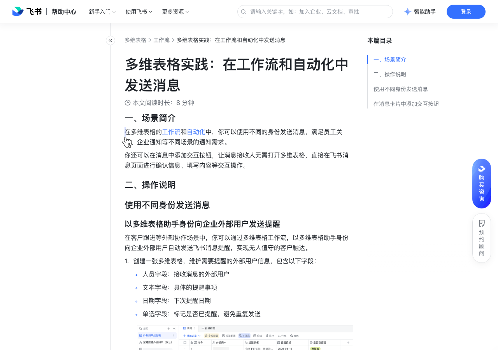

# 多维表格实践：在工作流和自动化中发送消息

> 来源：[飞书帮助中心](https://www.feishu.cn/hc/zh-CN/articles/376118741958)  
> 分类：多维表格 / 工作流  
> 抓取时间：2026-09-22T01:25:08.199Z

## 界面截图

### 文档内配图

1. 配图：https://p1-hera.feishucdn.com/tos-cn-i-jbbdkfciu3/722a4c3511654fb9bf5d03f5558a1051~tplv-jbbdkfciu3-image:0:0.image
2. 配图：https://p1-hera.feishucdn.com/tos-cn-i-jbbdkfciu3/8de7ae65607a4c9e900b3b1acd2f2373~tplv-jbbdkfciu3-image:0:0.image
3. 配图：https://p1-hera.feishucdn.com/tos-cn-i-jbbdkfciu3/34df4e7c877d4cadab8bd0b6da93482c~tplv-jbbdkfciu3-image:0:0.image
4. 配图：https://p1-hera.feishucdn.com/tos-cn-i-jbbdkfciu3/2af0633c15c4426f9641991bb47e7399~tplv-jbbdkfciu3-image:0:0.image
5. 配图：https://p1-hera.feishucdn.com/tos-cn-i-jbbdkfciu3/18949ecb1d254ee8b6f3e9fffe0ea948~tplv-jbbdkfciu3-image:0:0.image
6. 配图：https://p1-hera.feishucdn.com/tos-cn-i-jbbdkfciu3/2c7199f5788544ec8235de67d8acc30d~tplv-jbbdkfciu3-image:0:0.image
7. 配图：https://p1-hera.feishucdn.com/tos-cn-i-jbbdkfciu3/c95733f1f789418a82b4d4cf3d474099~tplv-jbbdkfciu3-image:0:0.image
8. 配图：https://p1-hera.feishucdn.com/tos-cn-i-jbbdkfciu3/e8b53e0af62540ff8965668b9cf80f4d~tplv-jbbdkfciu3-image:0:0.image
9. 配图：https://p1-hera.feishucdn.com/tos-cn-i-jbbdkfciu3/f308426ca2df427fac2a127ac67a8325~tplv-jbbdkfciu3-image:0:0.image
10. 配图：https://p1-hera.feishucdn.com/tos-cn-i-jbbdkfciu3/2c672b3730a84e5aa95479dc930fd21c~tplv-jbbdkfciu3-image:0:0.image
11. 配图：https://p1-hera.feishucdn.com/tos-cn-i-jbbdkfciu3/f14fab5010e7448e8a156948000a78b9~tplv-jbbdkfciu3-image:0:0.image
12. 配图：https://p1-hera.feishucdn.com/tos-cn-i-jbbdkfciu3/1b7e7e10252444b5b42b644385c69536~tplv-jbbdkfciu3-image:0:0.image
13. 配图：https://p1-hera.feishucdn.com/tos-cn-i-jbbdkfciu3/7fe385913a5a45b394a94f698389306c~tplv-jbbdkfciu3-image:0:0.image

## 功能定位

本页对应飞书帮助中心「多维表格 / 工作流」下的「多维表格实践：在工作流和自动化中发送消息」。以下需求描述依据官方说明文档提炼，用于指导 DuoWei 对标实现。

## 功能目标

一、场景简介

## 文档结构（官方章节）

- 一、场景简介​
- 二、操作说明​
- 使用不同身份发送消息​
- 以多维表格助手身份向企业外部用户发送提醒​
- 员工生日当天以用户身份发送祝福​
- 项目管理发送跟进提醒​
- 在消息卡片中添加交互按钮​
- 审批报备​
- 任务督办​

## 详细功能说明

一、场景简介

二、操作说明

使用不同身份发送消息

以多维表格助手身份向企业外部用户发送提醒

创建一张多维表格，维护需要提醒的外部用户信息，包含以下字段：

人员字段：接收消息的外部用户

文本字段：具体的提醒事项

日期字段：下次提醒日期

单选字段：标记是否已提醒，避免重复发送

创建定时触发工作流，外部用户会在指定时间收到来自多维表格助手的飞书消息提醒。

将触发条件设置为 定时触发，频率设为每天，时间设为上午 9:00。

添加 查找记录 操作，筛选条件为“提醒日期等于今天”且“是否已提醒为未提醒”。系统会自动找出当天需要发送提醒的外部用户记录。

添加 发送飞书消息 操作，以多维表格助手身份为外部用户发送提醒消息。

添加 修改记录 操作，将是否已提醒更新为已提醒，避免重复发送。

保存并启用流程。流程触发后，多维表格助手发送自动化消息的效果如下：

员工生日当天以用户身份发送祝福

创建员工生日数据表，包含以下字段：

日期字段：记录员工生日

公式字段：判断当天的日期是否与员工生日相同

单选字段：记录是否已发送祝福

创建自动化流程，检查当天日期是否是员工生日。

将触发条件设置为每天重复的 定时触发。

将执行操作设置为 修改记录，筛选出“检查每年的生日是否到期”为 true 的记录，将 发送祝福 的值修改为 发送。

创建自动化流程，当单选字段的值为 发送 时，发送生日祝福。

将触发条件设置为 记录满足条件时。

将执行操作设置为 发送飞书消息，由谁发送 一栏选择流程配置人本人，接收方 选择第一步中的员工姓名。并进一步编辑消息详情。

创建自动化流程，发送生日祝福后，在当天将该条记录的“发送祝福”字段值改为 不发送，避免重复发送祝福消息。

将触发条件设置为每天重复的 定时触发，触发时间需晚于设置的定时时间，如延迟 1 或 2 小时。

将执行操作设置为 修改记录，筛选出“检查每年的生日是否到期”为 true 的记录，将 发送祝福 的值修改为 不发送。

流程触发后，以用户身份发送自动化消息的效果如下：

项目管理发送跟进提醒

在项目管理表中创建自动化流程，将触发条件选择为 定时触发，并自定义重复频率，例如每 3 天重复。

执行 查找记录 操作，设置筛选条件为进展是 未开始 和 进行中 的需求，查找对应需求的任务执行人。

执行 发送飞书消息 操作。由谁发送 一栏选择该多维表格应用（项目管理 Q4），接收方 选择 第 2 步查找的记录 > 任务执行人，并编辑卡片标题及内容。

注：不支持发送给外部用户或群组。此处只能选择与多维表格所有者同属一个企业组织的用户和内部群组。

保存并启用流程。流程触发后，以个性化的多维表格应用发送自动化消息的效果如下：

在消息卡片中添加交互按钮

审批报备

在请假报备表中创建自动化流程，当接收到成员的请假申请后，自动给审批人发送消息提醒。同时，在消息卡片中添加“通过”和“拒绝”两个按钮。

注：你可以将按钮设置成“仅允许点击一个按钮”，当成员点击任意一个按钮后，无法再次点击卡片上的按钮。

审批人收到消息后，可以直接在消息卡片中点击，决定是否通过申请，审批结果将自动记录到多维表格中，申请人也将收到审批结果的通知信息。

任务督办

在任务记录表中创建自动化流程，到达截止时间，任务状态仍然为“未完成”时，就向任务执行人发送确认任务状态的提醒。

执行人收到逾期提醒，如果任务已完成，可以直接从消息界面点击按钮确认已完成任务，状态更改将自动同步到多维表格中。

## 实现要点（对标 DuoWei）

1. **入口与信息架构**：在产品中明确该能力所属模块（工作流），并保证用户可从对应导航触达。
2. **核心交互**：按上文「详细功能说明」还原主要操作路径；截图中出现的按钮、字段、面板命名尽量与飞书语义一致或可映射。
3. **数据与权限**：若文档涉及可见范围、可编辑范围、分享或高级权限，实现时需落到角色/成员模型，并保证 API/MCP 与 UI 权限一致。
4. **边界与上限**：若文档提到数量上限、格式限制、导入导出约束，需在实现与错误提示中体现。
5. **验收**：以本页截图场景为用例，完成「能打开 / 能配置 / 能保存 / 能被 Agent 读写（如适用）」四项检查。

## 原始摘录摘要

> 一、场景简介 二、操作说明 使用不同身份发送消息 以多维表格助手身份向企业外部用户发送提醒 创建一张多维表格，维护需要提醒的外部用户信息，包含以下字段： 人员字段：接收消息的外部用户 文本字段：具体的提醒事项 日期字段：下次提醒日期 单选字段：标记是否已提醒，避免重复发送 创建定时触发工作流，外部用户会在指定时间收到来自多维表格助手的飞书消息提醒。 将触发条件设置为 定时触发，频率设为每天，时间设为上午 9:00。 添加 查找记录 操作，筛选条件为“提醒日期等于今天”且“是否已提醒为未提醒”。系统会自动找出当天需要发送提醒的外部用户记录。 添加 发送飞书消息 操作，以多维表格助手身份为外部用户发送提醒消息。 添加 修改记录 操作，将是否已提醒更新为已提醒，避免重复发送。 保存并启用流程。流程触发后，多维表格助手发送自动化消息的效果如下： 员工生日当天以用户身份发送祝福 创建员工生日数据表，包含以下字段： 日期字段：记录员工生日 公式字段：判断当天的日期是否与员工生日相同 单选字段：记录是否已发送祝福 创建自动化流程，检查当天日期是否是员工生日。 将触发条件设置为每天重复的 定时触发。 将执行操作设置为 修改记录，筛选出“检查每年的生日是否到期”为 true 的记录，将 发送祝福 的值修改为 发送。 创建自动化流程，当单选字段的值为 发送 时，发送生日祝福。 将触发条件设置为 记录满足条件时。 将执行操作设置为 发送飞书消息，由谁发送 一栏选择流程配置人本人，接收方 选择第一步中的员工姓名。并进一步编辑消息详情。 创建自动化流程，发送生日祝福后，在当天将该条记录的“发送祝福”字段值改为 不发送，避免重复发送祝福消息。 将触发条件设置为每天重复的 定时触发，触发时间需晚于设置的定时时间，如延迟 1 或 2 小时。 将执行操作设置为 修改记录，筛选出“检查每年的生日是否到期”为 …

## 元数据

- article_id: `7281175102628855810`
- category_id: `7415964452380049412`
- path: `/hc/zh-CN/articles/376118741958`
- extracted_text_length: 1442
