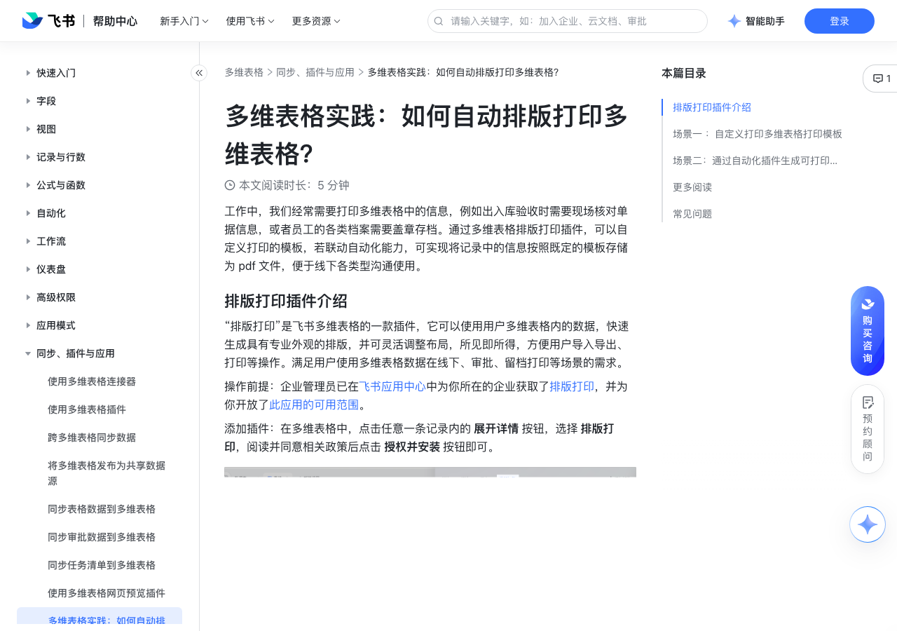

# 多维表格实践：如何自动排版打印多维表格？

> 来源：[飞书帮助中心](https://www.feishu.cn/hc/zh-CN/articles/323620071109)  
> 分类：多维表格 / 同步、插件与应用  
> 抓取时间：2026-09-22T01:26:35.936Z

## 界面截图

### 文档内配图

1. 配图：https://p1-hera.feishucdn.com/tos-cn-i-jbbdkfciu3/3d3b29481f454bfd9cf647ccf75594dc~tplv-jbbdkfciu3-image:0:0.image
2. 配图：https://p1-hera.feishucdn.com/tos-cn-i-jbbdkfciu3/6bb7fa92fd8f4481aaa3cb996b068433~tplv-jbbdkfciu3-image:0:0.image
3. 配图：https://p1-hera.feishucdn.com/tos-cn-i-jbbdkfciu3/a901020884c34c3698e5644eec87ba0c~tplv-jbbdkfciu3-image:0:0.image
4. 配图：https://p1-hera.feishucdn.com/tos-cn-i-jbbdkfciu3/c68a9e5f7963443b84cae8c6035f4256~tplv-jbbdkfciu3-image:0:0.image
5. 配图：https://p1-hera.feishucdn.com/tos-cn-i-jbbdkfciu3/d92e9473e10f470a9c407d48b31bc8d3~tplv-jbbdkfciu3-image:0:0.image
6. 配图：https://p1-hera.feishucdn.com/tos-cn-i-jbbdkfciu3/bc3043dfb57045c9ae633cd86a9edcb9~tplv-jbbdkfciu3-image:0:0.image
7. 配图：https://p1-hera.feishucdn.com/tos-cn-i-jbbdkfciu3/da0e34ce715a4c6a8ff3499cf92c3cb5~tplv-jbbdkfciu3-image:0:0.image
8. 配图：https://p1-hera.feishucdn.com/tos-cn-i-jbbdkfciu3/d928f65c80144b65bf5b21ef931ab5a1~tplv-jbbdkfciu3-image:0:0.image
9. 配图：https://p1-hera.feishucdn.com/tos-cn-i-jbbdkfciu3/0691e65b95c0419f8be0b454112737a4~tplv-jbbdkfciu3-image:0:0.image
10. 配图：https://p1-hera.feishucdn.com/tos-cn-i-jbbdkfciu3/a74a0af2058d456e9dbff78ac99c502f~tplv-jbbdkfciu3-image:0:0.image
11. 配图：https://p1-hera.feishucdn.com/tos-cn-i-jbbdkfciu3/e9ec6120361d4d9db955fac8d5042641~tplv-jbbdkfciu3-image:0:0.image
12. 配图：https://p1-hera.feishucdn.com/tos-cn-i-jbbdkfciu3/9233d947d0024225a402d55648fdbc72~tplv-jbbdkfciu3-image:0:0.image
13. 配图：https://p1-hera.feishucdn.com/tos-cn-i-jbbdkfciu3/9a735a033a5c49a495c82e5d7c54f35a~tplv-jbbdkfciu3-image:0:0.image

## 功能定位

本页对应飞书帮助中心「多维表格 / 同步、插件与应用」下的「多维表格实践：如何自动排版打印多维表格？」。以下需求描述依据官方说明文档提炼，用于指导 DuoWei 对标实现。

## 功能目标

工作中，我们经常需要打印多维表格中的信息，例如出入库验收时需要现场核对单据信息，或者员工的各类档案需要盖章存档。通过多维表格排版打印插件，可以自定义打印的模板，若联动自动化能力，可实现将记录中的信息按照既定的模板存储为 pdf 文件，便于线下各类型沟通使用。

## 文档结构（官方章节）

- 排版打印插件介绍​
- 场景一 ：自定义打印多维表格打印模板​
- 场景二：通过自动化插件生成可打印的 PDF 文件​
- 更多阅读​
- 常见问题​

## 详细功能说明

工作中，我们经常需要打印多维表格中的信息，例如出入库验收时需要现场核对单据信息，或者员工的各类档案需要盖章存档。通过多维表格排版打印插件，可以自定义打印的模板，若联动自动化能力，可实现将记录中的信息按照既定的模板存储为 pdf 文件，便于线下各类型沟通使用。

排版打印插件介绍

场景一 ：自定义打印多维表格打印模板

在任意多维表格数据表的记录中，点击 详情 > 排版打印，在排版打印界面点击 + 按钮，新增空白排版，点击 编辑 按钮，即可开始自定义布局。支持 单条记录排版 或 整表记录排版。

点击右上角 编辑 按钮即可操作排版，支持将 文本、表格、图片、二维码、条形码、水平线、自由动拖动元素 等拖动入排版页面，按需排版布局。

支持导入排版和复用多种排版模板。当前排版模板覆盖对账单、销售报价单、材料入库单、生产订单、付款确认书、费用报销单等场景。下图示例为员工工牌排版及劳动合同排版。

排版编辑完成后，点击左上角 退出 按钮即可。如果希望立刻打印，可以点击右上角 打印 按钮，实时打印。

场景二：通过自动化插件生成可打印的 PDF 文件

点击 自动化 > + 创建自动化流程，设置自动化触发条件及执行操作。

点击 添加操作 > 修改记录 按钮，并按需完成设置，点击 保存并启用 即可。

生成的 PDF 文件自动储存在前文设置的附件字段中，支持下载及打印。

更多阅读

常见问题

问：运行日志中，为什么自动化流程状态显示为未执行？

答：未执行的状态是指自动化流程触发时没有完全满足触发条件，因此未能执行后续操作。如：选择触发条件为 新增记录 且需同时满足另一个条件，此时点击 + 新建记录时，自动化流程即为未执行状态。点击 多维表格自动化流程常见问题 了解更多。

## 实现要点（对标 DuoWei）

1. **入口与信息架构**：在产品中明确该能力所属模块（同步、插件与应用），并保证用户可从对应导航触达。
2. **核心交互**：按上文「详细功能说明」还原主要操作路径；截图中出现的按钮、字段、面板命名尽量与飞书语义一致或可映射。
3. **数据与权限**：若文档涉及可见范围、可编辑范围、分享或高级权限，实现时需落到角色/成员模型，并保证 API/MCP 与 UI 权限一致。
4. **边界与上限**：若文档提到数量上限、格式限制、导入导出约束，需在实现与错误提示中体现。
5. **验收**：以本页截图场景为用例，完成「能打开 / 能配置 / 能保存 / 能被 Agent 读写（如适用）」四项检查。

## 原始摘录摘要

> 工作中，我们经常需要打印多维表格中的信息，例如出入库验收时需要现场核对单据信息，或者员工的各类档案需要盖章存档。通过多维表格排版打印插件，可以自定义打印的模板，若联动自动化能力，可实现将记录中的信息按照既定的模板存储为 pdf 文件，便于线下各类型沟通使用。 排版打印插件介绍 场景一 ：自定义打印多维表格打印模板 在任意多维表格数据表的记录中，点击 详情 > 排版打印，在排版打印界面点击 + 按钮，新增空白排版，点击 编辑 按钮，即可开始自定义布局。支持 单条记录排版 或 整表记录排版。 点击右上角 编辑 按钮即可操作排版，支持将 文本、表格、图片、二维码、条形码、水平线、自由动拖动元素 等拖动入排版页面，按需排版布局。 支持导入排版和复用多种排版模板。当前排版模板覆盖对账单、销售报价单、材料入库单、生产订单、付款确认书、费用报销单等场景。下图示例为员工工牌排版及劳动合同排版。 排版编辑完成后，点击左上角 退出 按钮即可。如果希望立刻打印，可以点击右上角 打印 按钮，实时打印。 场景二：通过自动化插件生成可打印的 PDF 文件 点击 自动化 > + 创建自动化流程，设置自动化触发条件及执行操作。 点击 添加操作 > 修改记录 按钮，并按需完成设置，点击 保存并启用 即可。 生成的 PDF 文件自动储存在前文设置的附件字段中，支持下载及打印。 更多阅读 常见问题 问：运行日志中，为什么自动化流程状态显示为未执行？ 答：未执行的状态是指自动化流程触发时没有完全满足触发条件，因此未能执行后续操作。如：选择触发条件为 新增记录 且需同时满足另一个条件，此时点击 + 新建记录时，自动化流程即为未执行状态。点击 多维表格自动化流程常见问题 了解更多。

## 元数据

- article_id: `7314128946045026305`
- category_id: `7225134052943200257`
- path: `/hc/zh-CN/articles/323620071109`
- extracted_text_length: 731
