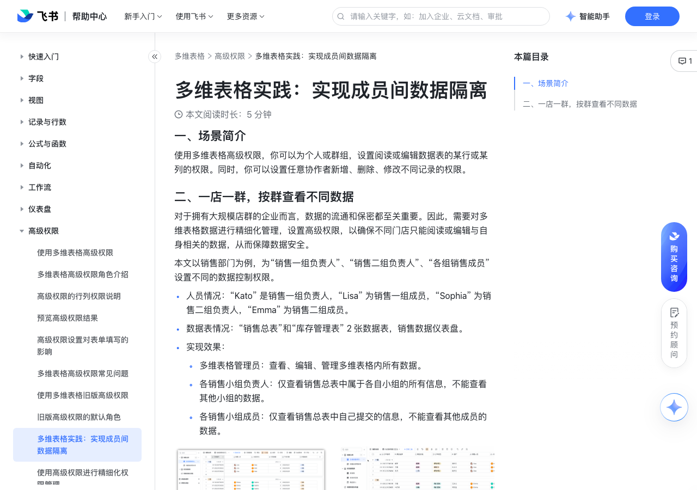

# 多维表格实践：实现成员间数据隔离

> 来源：[飞书帮助中心](https://www.feishu.cn/hc/zh-CN/articles/136725199703)  
> 分类：多维表格 / 高级权限  
> 抓取时间：2026-09-22T01:26:31.209Z

## 界面截图

### 文档内配图

1. 配图：https://p1-hera.feishucdn.com/tos-cn-i-jbbdkfciu3/5201d6a66c5345a4a2179426d91eec58~tplv-jbbdkfciu3-image:0:0.image
2. 配图：https://p1-hera.feishucdn.com/tos-cn-i-jbbdkfciu3/cbe2faa45dda40a181773b8ae1654281~tplv-jbbdkfciu3-image:0:0.image
3. 配图：https://p1-hera.feishucdn.com/tos-cn-i-jbbdkfciu3/442a33027819416ab6b5935b6646e146~tplv-jbbdkfciu3-image:0:0.image
4. 配图：https://p1-hera.feishucdn.com/tos-cn-i-jbbdkfciu3/aba4a159f8f64eebaa85b351219d1ec5~tplv-jbbdkfciu3-image:0:0.image
5. 配图：https://p1-hera.feishucdn.com/tos-cn-i-jbbdkfciu3/22dfb671d63143ee9cbde3ec9982f84a~tplv-jbbdkfciu3-image:0:0.image
6. 配图：https://p1-hera.feishucdn.com/tos-cn-i-jbbdkfciu3/78d9bdfd18b6429a99bf4530b756e0c5~tplv-jbbdkfciu3-image:0:0.image
7. 配图：https://p1-hera.feishucdn.com/tos-cn-i-jbbdkfciu3/71731578bc534e4da8f242838d92f20e~tplv-jbbdkfciu3-image:0:0.image
8. 配图：https://p1-hera.feishucdn.com/tos-cn-i-jbbdkfciu3/0dee823a3a374de9a9fba07e60a32657~tplv-jbbdkfciu3-image:0:0.image
9. 配图：https://p1-hera.feishucdn.com/tos-cn-i-jbbdkfciu3/e5d975fa29b34361beba42fcfcd88d52~tplv-jbbdkfciu3-image:0:0.image

## 功能定位

本页对应飞书帮助中心「多维表格 / 高级权限」下的「多维表格实践：实现成员间数据隔离」。以下需求描述依据官方说明文档提炼，用于指导 DuoWei 对标实现。

## 功能目标

一、场景简介

## 文档结构（官方章节）

- 一、场景简介​
- 二、一店一群，按群查看不同数据​
- 设置多维表格管理员权限​
- 设置销售小组负责人权限​
- 设置销售小组成员权限​

## 详细功能说明

一、场景简介

二、一店一群，按群查看不同数据

人员情况：“Kato” 是销售一组负责人，“Lisa” 为销售一组成员，“Sophia” 为销售二组负责人，“Emma” 为销售二组成员。

数据表情况：“销售总表”和“库存管理表” 2 张数据表，销售数据仪表盘。

实现效果：

多维表格管理员：查看、编辑、管理多维表格内所有数据。

各销售小组负责人：仅查看销售总表中属于各自小组的所有信息，不能查看其他小组的数据。

各销售小组成员：仅查看销售总表中自己提交的信息，不能查看其他成员的数据。

设置多维表格管理员权限

多维表格管理员，也就是多维表格的创建者，拥有管理多维表格高级权限的能力。

点击右上角 分享 按钮，在文本框内输入协作者的姓名，即可成功邀请协作者。同时点击选择 可管理 即可为邀请的协作者赋予相应权限。

设置销售小组负责人权限

点击右上角 高级权限 按钮，进入设置。选择 + 添加自定义角色，为角色命名为“小组负责人权限”。

将仪表盘权限设置为 无权限。

点击设置数据表权限，将“销售总表”权限设置为 仅可阅读，勾选 指定记录，并将筛选条件设置为小组负责人包含访问者本人，在可阅读的字段内容处选择 所有字段内容。

点击“库存管理表”并设置为 仅可阅读，勾选 所有记录，在可阅读的字段内容处勾选 指定字段内容，并勾选“库存数量”和“库存情况”两个字段。

点击 保存。

在配置界面点击 + 添加成员 按钮，将“Kato”和“Sophia”添加为该角色组成员，点击 保存。

配置完成后，以“销售一组 Kato 视角”为例，将不能查看“销售数据仪表盘”，仅可查看“销售总表”中属于自己小组的数据，仅可查看“库存管理表”中的“库存数量”和“库存情况”两列中的内容。

设置销售小组成员权限

点击右上角 高级权限 按钮，进入设置。选择 + 添加自定义角色，为角色命名为“小组成员权限”。

点击设置数据表权限，将“销售总表”权限设置为 可编辑：与成员自己相关的记录，在对记录进行的操作中，勾选 可新增，在可编辑的记录范围中勾选 成员本人创建的记录 同时勾选 销售成员 包含成员本人的记录。设置其他记录权限为 禁止查看。自定义设置字段内容权限为 可阅读 及 可新增，不支持编辑。

点击“库存管理表”并设置为 无权限 即可。

在配置界面点击 + 添加成员 按钮，将“Lias”和“Emma”添加为该角色组成员，点击 保存。

配置完成后，以“销售一组成员 Lias 视角”为例，将不能查看“销售数据仪表盘”和“库存管理表”，仅可查看和编辑“销售总表”中自己提交的信息，同时不能删除已提交的信息。

## 实现要点（对标 DuoWei）

1. **入口与信息架构**：在产品中明确该能力所属模块（高级权限），并保证用户可从对应导航触达。
2. **核心交互**：按上文「详细功能说明」还原主要操作路径；截图中出现的按钮、字段、面板命名尽量与飞书语义一致或可映射。
3. **数据与权限**：若文档涉及可见范围、可编辑范围、分享或高级权限，实现时需落到角色/成员模型，并保证 API/MCP 与 UI 权限一致。
4. **边界与上限**：若文档提到数量上限、格式限制、导入导出约束，需在实现与错误提示中体现。
5. **验收**：以本页截图场景为用例，完成「能打开 / 能配置 / 能保存 / 能被 Agent 读写（如适用）」四项检查。

## 原始摘录摘要

> 一、场景简介 二、一店一群，按群查看不同数据 人员情况：“Kato” 是销售一组负责人，“Lisa” 为销售一组成员，“Sophia” 为销售二组负责人，“Emma” 为销售二组成员。 数据表情况：“销售总表”和“库存管理表” 2 张数据表，销售数据仪表盘。 实现效果： 多维表格管理员：查看、编辑、管理多维表格内所有数据。 各销售小组负责人：仅查看销售总表中属于各自小组的所有信息，不能查看其他小组的数据。 各销售小组成员：仅查看销售总表中自己提交的信息，不能查看其他成员的数据。 设置多维表格管理员权限 多维表格管理员，也就是多维表格的创建者，拥有管理多维表格高级权限的能力。 点击右上角 分享 按钮，在文本框内输入协作者的姓名，即可成功邀请协作者。同时点击选择 可管理 即可为邀请的协作者赋予相应权限。 设置销售小组负责人权限 点击右上角 高级权限 按钮，进入设置。选择 + 添加自定义角色，为角色命名为“小组负责人权限”。 将仪表盘权限设置为 无权限。 点击设置数据表权限，将“销售总表”权限设置为 仅可阅读，勾选 指定记录，并将筛选条件设置为小组负责人包含访问者本人，在可阅读的字段内容处选择 所有字段内容。 点击“库存管理表”并设置为 仅可阅读，勾选 所有记录，在可阅读的字段内容处勾选 指定字段内容，并勾选“库存数量”和“库存情况”两个字段。 点击 保存。 在配置界面点击 + 添加成员 按钮，将“Kato”和“Sophia”添加为该角色组成员，点击 保存。 配置完成后，以“销售一组 Kato 视角”为例，将不能查看“销售数据仪表盘”，仅可查看“销售总表”中属于自己小组的数据，仅可查看“库存管理表”中的“库存数量”和“库存情况”两列中的内容。 设置销售小组成员权限 点击右上角 高级权限 按钮，进入设置。选择 + 添加自定义角色，为角色命名为“小组成员权限”。 点击设置数据表权限，…

## 元数据

- article_id: `7171370006280814593`
- category_id: `7165750460006055938`
- path: `/hc/zh-CN/articles/136725199703`
- extracted_text_length: 1089
