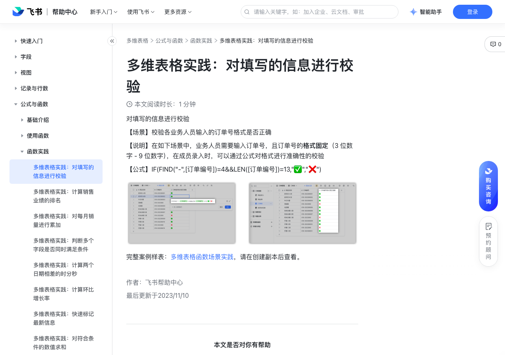

# 多维表格实践：对填写的信息进行校验

> 来源：[飞书帮助中心](https://www.feishu.cn/hc/zh-CN/articles/518439316163)  
> 分类：多维表格 / 公式与函数 / 函数实践  
> 抓取时间：2026-09-22T01:26:58.845Z

## 界面截图

### 文档内配图

1. 配图：https://p1-hera.feishucdn.com/tos-cn-i-jbbdkfciu3/ca38bf24734c4973a1f008567a2b7e4d~tplv-jbbdkfciu3-image:0:0.image
2. 配图：https://p1-hera.feishucdn.com/tos-cn-i-jbbdkfciu3/866b3c5185314b22bac96d56ca9ecfc9~tplv-jbbdkfciu3-image:0:0.image

## 功能定位

本页对应飞书帮助中心「多维表格 / 公式与函数 / 函数实践」下的「多维表格实践：对填写的信息进行校验」。以下需求描述依据官方说明文档提炼，用于指导 DuoWei 对标实现。

## 功能目标

提供与「多维表格实践：对填写的信息进行校验」相关的多维表格能力，行为应对齐飞书帮助文档描述。

## 详细功能说明

（正文提取为空，请结合截图与源链接复核。）

## 实现要点（对标 DuoWei）

1. **入口与信息架构**：在产品中明确该能力所属模块（公式与函数 / 函数实践），并保证用户可从对应导航触达。
2. **核心交互**：按上文「详细功能说明」还原主要操作路径；截图中出现的按钮、字段、面板命名尽量与飞书语义一致或可映射。
3. **数据与权限**：若文档涉及可见范围、可编辑范围、分享或高级权限，实现时需落到角色/成员模型，并保证 API/MCP 与 UI 权限一致。
4. **边界与上限**：若文档提到数量上限、格式限制、导入导出约束，需在实现与错误提示中体现。
5. **验收**：以本页截图场景为用例，完成「能打开 / 能配置 / 能保存 / 能被 Agent 读写（如适用）」四项检查。

## 原始摘录摘要

> 

## 元数据

- article_id: `7133518258371690497`
- category_id: `7082597478679216129`
- path: `/hc/zh-CN/articles/518439316163`
- extracted_text_length: 0
