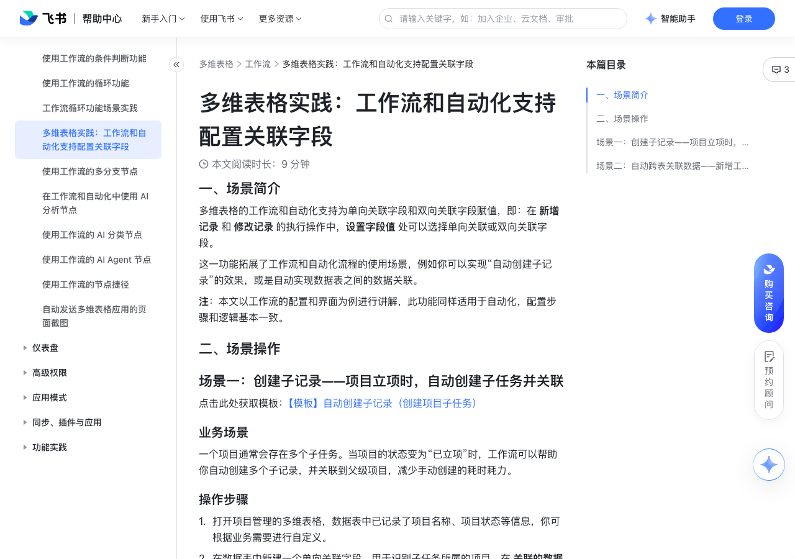

# 多维表格实践：工作流和自动化支持配置关联字段

> 来源：[飞书帮助中心](https://www.feishu.cn/hc/zh-CN/articles/670316784332)  
> 分类：多维表格 / 工作流  
> 抓取时间：2026-09-22T01:25:10.208Z

## 界面截图

### 文档内配图

1. 配图：https://p1-hera.feishucdn.com/tos-cn-i-jbbdkfciu3/f6aec4e5d911418eb063ff7fc5f8d2fa~tplv-jbbdkfciu3-image:0:0.image
2. 配图：https://p1-hera.feishucdn.com/tos-cn-i-jbbdkfciu3/46abfc25c3c0440b97406cdbf914c733~tplv-jbbdkfciu3-image:0:0.image
3. 配图：https://p1-hera.feishucdn.com/tos-cn-i-jbbdkfciu3/3d0106fb19074caf881fe2a9eb3b265f~tplv-jbbdkfciu3-image:0:0.image
4. 配图：https://p1-hera.feishucdn.com/tos-cn-i-jbbdkfciu3/518ee9d28d4446b59988d52da6ffd1ba~tplv-jbbdkfciu3-image:0:0.image
5. 配图：https://p1-hera.feishucdn.com/tos-cn-i-jbbdkfciu3/5a26241c56aa4a568651dfd62bcc4cf4~tplv-jbbdkfciu3-image:0:0.image
6. 配图：https://p1-hera.feishucdn.com/tos-cn-i-jbbdkfciu3/a25a3fd594cd453b9c47d3a105327f80~tplv-jbbdkfciu3-image:0:0.image
7. 配图：https://p1-hera.feishucdn.com/tos-cn-i-jbbdkfciu3/2263a4d1d8f74f75953e671889fbd433~tplv-jbbdkfciu3-image:0:0.image
8. 配图：https://p1-hera.feishucdn.com/tos-cn-i-jbbdkfciu3/eca21c016265405e9add0222b8dd8430~tplv-jbbdkfciu3-image:0:0.image
9. 配图：https://p1-hera.feishucdn.com/tos-cn-i-jbbdkfciu3/1c66fd266c234e61a20b3425ace73cfa~tplv-jbbdkfciu3-image:0:0.image
10. 配图：https://p1-hera.feishucdn.com/tos-cn-i-jbbdkfciu3/694e24fe6d4140ffa5072fe38ae4d9df~tplv-jbbdkfciu3-image:0:0.image
11. 配图：https://p1-hera.feishucdn.com/tos-cn-i-jbbdkfciu3/988c423bc79d4ca2a63c5558b9c06d90~tplv-jbbdkfciu3-image:0:0.image
12. 配图：https://p1-hera.feishucdn.com/tos-cn-i-jbbdkfciu3/52e34e71de1642fd8ae1b7f896a55336~tplv-jbbdkfciu3-image:0:0.image
13. 配图：https://p1-hera.feishucdn.com/tos-cn-i-jbbdkfciu3/a9b802a2ee274a3cab2fe2f7e71ea3dd~tplv-jbbdkfciu3-image:0:0.image
14. 配图：https://p1-hera.feishucdn.com/tos-cn-i-jbbdkfciu3/44f235c9c8e943fc8936350d2bb7ebf0~tplv-jbbdkfciu3-image:0:0.image
15. 配图：https://p1-hera.feishucdn.com/tos-cn-i-jbbdkfciu3/ffa988e75e6e451ba024d49066ada84b~tplv-jbbdkfciu3-image:0:0.image
16. 配图：https://p1-hera.feishucdn.com/tos-cn-i-jbbdkfciu3/b749239ec60c4388924ab2c37d4ec195~tplv-jbbdkfciu3-image:0:0.image

## 功能定位

本页对应飞书帮助中心「多维表格 / 工作流」下的「多维表格实践：工作流和自动化支持配置关联字段」。以下需求描述依据官方说明文档提炼，用于指导 DuoWei 对标实现。

## 功能目标

一、场景简介

## 文档结构（官方章节）

- 一、场景简介​
- 二、场景操作​
- 场景一：创建子记录——项目立项时，自动创建子任务并关联​
- 业务场景​
- 操作步骤​
- 配置效果​
- 场景二：自动跨表关联数据——新增工单时，自动分配跟进人并同步到人员任务表​

## 详细功能说明

一、场景简介

二、场景操作

场景一：创建子记录——项目立项时，自动创建子任务并关联

业务场景

操作步骤

打开项目管理的多维表格，数据表中已记录了项目名称、项目状态等信息，你可根据业务需要进行自定义。

在数据表中新建一个单向关联字段，用于识别子任务所属的项目。在 关联的数据表 处选择当前数据表，可关联的数据范围 选择 所有记录，不要勾选 允许添加多个记录。完成新建后，点击上方 视图配置 的按钮，选择父记录字段 处选择刚刚新建的单向关联字段。

点击左下角的 工作流 创建一个工作流。选择 新增/修改的记录满足条件时 的触发条件，设置满足的条件为：项目状态等于已立项。

添加一个 新增记录 的操作，为已立项的项目自动添加子记录。选择项目数据表，并点击下方的 + 设置字段值。

选择刚才新建的单向关联字段，点击输入框，选择之前步骤产生的数据，选择 1.新增/修改的记录满足条件时 > 当前记录。

250px|700px|reset

按需设置子任务的名称和状态，例如名称为“客户需求调研”，状态为“未开始” 。为方便区分，你可以在子任务的名称中引用项目名称。

如果你想配置多个子任务，可以继续添加 新增记录 的执行操作，重复上述配置。

配置效果

场景二：自动跨表关联数据——新增工单时，自动分配跟进人并同步到人员任务表

新增一条工单时，根据工单创建时间自动判断班次并匹配跟进人。

使用双向关联字段，在人员表中也可以查看每个人所负责的工单。

工单名称：文本字段。

工单创建时间：日期字段，在默认值下选择 添加新记录的创建时间，新增工单时就会自动记录时间。

工单所属范围：公式字段，根据工单创建时间来判断工单所属的班次。例如，我们把 00:00 - 07:59 定义为“凌晨班”，08:00 - 15:59 定义为“早班”，16:00 - 23:59 定义为“晚班”，再利用 IFS 函数实现自动判断班次的效果。

跟进状态：单选字段，按照业务需求自定义即可，例如“待开始”“进行中”和“已完成”。

跟进人：双向关联字段，用于关联 人员表 中的人员信息。在字段配置面板中需勾选“允许添加多个记录”。

人员姓名：公式字段，此处起到“字段引用”的效果，直接引用人员字段的值。

注：在 工单表 中，跟进人 字段是双向关联字段，在数据表中只会显示对应记录的索引列的内容，因此我们需要在索引列中展示出人员姓名。但由于索引列的字段类型不能选择人员字段，于是此处使用公式字段进行辅助，确保工单表的跟进人正常显示人员姓名。

负责人：人员字段。

排班类型：单选字段，可根据业务需要自定义。此处我们以凌晨班、早班和晚班为例。

班次详情：文本字段，对排班时间的详细描述。

负责工单：双向关联字段，用于关联 工单表 中的工单信息。通过这个字段，我们可以直接看到每个人员负责的所有工单。

选择 添加新记录时 的触发条件。选择 工单表 数据表，并选择 工单名称 不为空。当新增了一条工单时会触发工作流。此时，公式字段会根据创建时间自动计算出该条工单所属的排班。

添加一个 查找记录 的执行操作，根据自动计算出的排班，从 人员表 中找到对应的负责人。

数据表选择 人员表，并对 排班类型 设置筛选条件，使其 等于 1.添加新记录时 中的 工单所属范围。按需设置查找内容，此处我们选择 负责人 字段。未查找到记录时，选择 终止。

添加一个 修改记录 的执行操作，补全工单中的负责人信息。

选择 工单表 数据表和 第 1 步新增的记录。

点击 + 设置字段值，设置 跟进人 字段为 2.查找记录 > 查找到的所有记录，同时设置 跟进状态 为 待开始。

注：由于双向关联字段的特性，此处引用整条记录即可，在关联字段中会显示为索引列的值。

添加一个 发送飞书消息 的操作。在 接收方 处，选择之前步骤产生的数据，选择 2.查找记录 > 查找到的所有记录的某列值 > 负责人。

按需设置消息标题和内容，按需配置底部按钮。在消息内容中，你可以点击 ⊕ 引用值 引用工单数据，例如工单名称和工单创建时间等。

## 实现要点（对标 DuoWei）

1. **入口与信息架构**：在产品中明确该能力所属模块（工作流），并保证用户可从对应导航触达。
2. **核心交互**：按上文「详细功能说明」还原主要操作路径；截图中出现的按钮、字段、面板命名尽量与飞书语义一致或可映射。
3. **数据与权限**：若文档涉及可见范围、可编辑范围、分享或高级权限，实现时需落到角色/成员模型，并保证 API/MCP 与 UI 权限一致。
4. **边界与上限**：若文档提到数量上限、格式限制、导入导出约束，需在实现与错误提示中体现。
5. **验收**：以本页截图场景为用例，完成「能打开 / 能配置 / 能保存 / 能被 Agent 读写（如适用）」四项检查。

## 原始摘录摘要

> 一、场景简介 二、场景操作 场景一：创建子记录——项目立项时，自动创建子任务并关联 业务场景 操作步骤 打开项目管理的多维表格，数据表中已记录了项目名称、项目状态等信息，你可根据业务需要进行自定义。 在数据表中新建一个单向关联字段，用于识别子任务所属的项目。在 关联的数据表 处选择当前数据表，可关联的数据范围 选择 所有记录，不要勾选 允许添加多个记录。完成新建后，点击上方 视图配置 的按钮，选择父记录字段 处选择刚刚新建的单向关联字段。 点击左下角的 工作流 创建一个工作流。选择 新增/修改的记录满足条件时 的触发条件，设置满足的条件为：项目状态等于已立项。 添加一个 新增记录 的操作，为已立项的项目自动添加子记录。选择项目数据表，并点击下方的 + 设置字段值。 选择刚才新建的单向关联字段，点击输入框，选择之前步骤产生的数据，选择 1.新增/修改的记录满足条件时 > 当前记录。 250px|700px|reset 按需设置子任务的名称和状态，例如名称为“客户需求调研”，状态为“未开始” 。为方便区分，你可以在子任务的名称中引用项目名称。 如果你想配置多个子任务，可以继续添加 新增记录 的执行操作，重复上述配置。 配置效果 场景二：自动跨表关联数据——新增工单时，自动分配跟进人并同步到人员任务表 新增一条工单时，根据工单创建时间自动判断班次并匹配跟进人。 使用双向关联字段，在人员表中也可以查看每个人所负责的工单。 工单名称：文本字段。 工单创建时间：日期字段，在默认值下选择 添加新记录的创建时间，新增工单时就会自动记录时间。 工单所属范围：公式字段，根据工单创建时间来判断工单所属的班次。例如，我们把 00:00 - 07:59 定义为“凌晨班”，08:00 - 15:59 定义为“早班”，16:00 - 23:59 定义为“晚班”，再利用 IFS 函数实现自动判断班次的效果…

## 元数据

- article_id: `7477521726499586052`
- category_id: `7415964452380049412`
- path: `/hc/zh-CN/articles/670316784332`
- extracted_text_length: 1675
