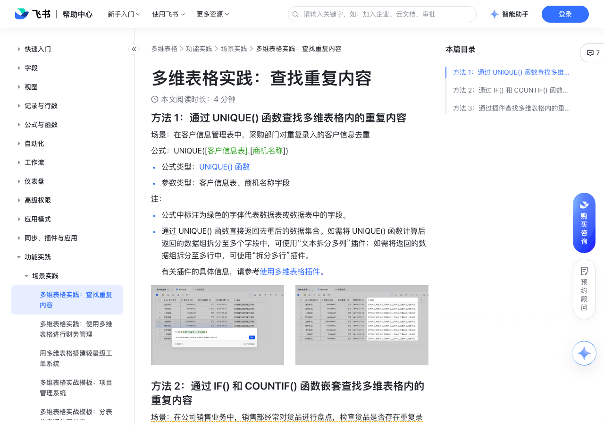

# 多维表格实践：查找重复内容

> 来源：[飞书帮助中心](https://www.feishu.cn/hc/zh-CN/articles/974691484068)  
> 分类：多维表格 / 功能实践 / 场景实践  
> 抓取时间：2026-09-22T01:26:48.588Z

## 界面截图

### 文档内配图

1. 配图：https://p1-hera.feishucdn.com/tos-cn-i-jbbdkfciu3/1bba4c6bb02345288a5319f1ecf71eec~tplv-jbbdkfciu3-image:0:0.image
2. 配图：https://p1-hera.feishucdn.com/tos-cn-i-jbbdkfciu3/5fc40cd22ef148518a58b652c0cdbcb4~tplv-jbbdkfciu3-image:0:0.image
3. 配图：https://p1-hera.feishucdn.com/tos-cn-i-jbbdkfciu3/ed26fefb17ec4116892d2f9f3ed00bfa~tplv-jbbdkfciu3-image:0:0.image
4. 配图：https://p1-hera.feishucdn.com/tos-cn-i-jbbdkfciu3/9ab1928c2c0f482891a5029bc2b7c731~tplv-jbbdkfciu3-image:0:0.image
5. 配图：https://p1-hera.feishucdn.com/tos-cn-i-jbbdkfciu3/b1d136d9248549798f60630e567e8605~tplv-jbbdkfciu3-image:0:0.image

## 功能定位

本页对应飞书帮助中心「多维表格 / 功能实践 / 场景实践」下的「多维表格实践：查找重复内容」。以下需求描述依据官方说明文档提炼，用于指导 DuoWei 对标实现。

## 功能目标

方法 1：通过 UNIQUE() 函数查找多维表格内的重复内容

## 文档结构（官方章节）

- 方法 1：通过 UNIQUE() 函数查找多维表格内的重复内容​
- 方法 2：通过 IF() 和 COUNTIF() 函数嵌套查找多维表格内的重复内容​
- 方法 3：通过插件查找多维表格内的重复内容​

## 详细功能说明

方法 1：通过 UNIQUE() 函数查找多维表格内的重复内容

公式类型：UNIQUE() 函数

参数类型：客户信息表、商机名称字段

公式中标注为绿色的字体代表数据表或数据表中的字段。

通过 UNIQUE() 函数直接返回去重后的数据集合。如需将 UNIQUE() 函数计算后返回的数据组拆分至多个字段中，可使用“文本拆分多列”插件；如需将返回的数据组拆分至多行中，可使用“拆分多行”插件。

有关插件的具体信息，请参考使用多维表格插件。

方法 2：通过 IF() 和 COUNTIF() 函数嵌套查找多维表格内的重复内容

公式类型：IF() 函数、COUNTIF() 函数、AND() 函数

参数类型：商品销售表、货品名称字段

方法 3：通过插件查找多维表格内的重复内容

点击多维表格右上角 多维表格插件 图标，进入插件市场 > 删除重复记录 插件，点击 使用 按钮进入插件配置面板。

按插件配置面板需求，填入待查找重复内容的数据表、作为识别依据的字段及所需的重复记录保留规则，点击 查找重复记录 即可。

## 实现要点（对标 DuoWei）

1. **入口与信息架构**：在产品中明确该能力所属模块（功能实践 / 场景实践），并保证用户可从对应导航触达。
2. **核心交互**：按上文「详细功能说明」还原主要操作路径；截图中出现的按钮、字段、面板命名尽量与飞书语义一致或可映射。
3. **数据与权限**：若文档涉及可见范围、可编辑范围、分享或高级权限，实现时需落到角色/成员模型，并保证 API/MCP 与 UI 权限一致。
4. **边界与上限**：若文档提到数量上限、格式限制、导入导出约束，需在实现与错误提示中体现。
5. **验收**：以本页截图场景为用例，完成「能打开 / 能配置 / 能保存 / 能被 Agent 读写（如适用）」四项检查。

## 原始摘录摘要

> 方法 1：通过 UNIQUE() 函数查找多维表格内的重复内容 公式类型：UNIQUE() 函数 参数类型：客户信息表、商机名称字段 公式中标注为绿色的字体代表数据表或数据表中的字段。 通过 UNIQUE() 函数直接返回去重后的数据集合。如需将 UNIQUE() 函数计算后返回的数据组拆分至多个字段中，可使用“文本拆分多列”插件；如需将返回的数据组拆分至多行中，可使用“拆分多行”插件。 有关插件的具体信息，请参考使用多维表格插件。 方法 2：通过 IF() 和 COUNTIF() 函数嵌套查找多维表格内的重复内容 公式类型：IF() 函数、COUNTIF() 函数、AND() 函数 参数类型：商品销售表、货品名称字段 方法 3：通过插件查找多维表格内的重复内容 点击多维表格右上角 多维表格插件 图标，进入插件市场 > 删除重复记录 插件，点击 使用 按钮进入插件配置面板。 按插件配置面板需求，填入待查找重复内容的数据表、作为识别依据的字段及所需的重复记录保留规则，点击 查找重复记录 即可。

## 元数据

- article_id: `7082607945497722881`
- category_id: `7225155238691471361`
- path: `/hc/zh-CN/articles/974691484068`
- extracted_text_length: 452
