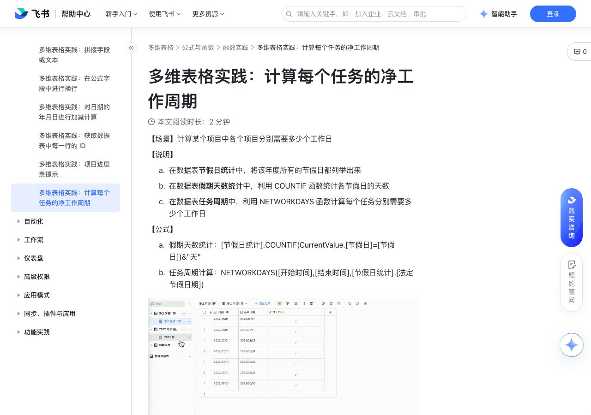

# 多维表格实践：计算每个任务的净工作周期

> 来源：[飞书帮助中心](https://www.feishu.cn/hc/zh-CN/articles/250037834438)  
> 分类：多维表格 / 公式与函数 / 函数实践  
> 抓取时间：2026-09-22T01:23:59.846Z

## 界面截图

### 文档内配图

1. image.png：https://p1-hera.feishucdn.com/tos-cn-i-jbbdkfciu3/da3515371a05411881dfe73c7b2e75df~tplv-jbbdkfciu3-image:0:0.image

## 功能定位

本页对应飞书帮助中心「多维表格 / 公式与函数 / 函数实践」下的「多维表格实践：计算每个任务的净工作周期」。以下需求描述依据官方说明文档提炼，用于指导 DuoWei 对标实现。

## 功能目标

在数据表节假日统计中，将该年度所有的节假日都列举出来

## 详细功能说明

在数据表节假日统计中，将该年度所有的节假日都列举出来

在数据表假期天数统计中，利用 COUNTIF 函数统计各节假日的天数

在数据表任务周期中，利用 NETWORKDAYS 函数计算每个任务分别需要多少个工作日

假期天数统计：[节假日统计].COUNTIF(CurrentValue.[节假日]=[节假日])&"天"

任务周期计算：NETWORKDAYS([开始时间],[结束时间],[节假日统计].[法定节假日期])

## 实现要点（对标 DuoWei）

1. **入口与信息架构**：在产品中明确该能力所属模块（公式与函数 / 函数实践），并保证用户可从对应导航触达。
2. **核心交互**：按上文「详细功能说明」还原主要操作路径；截图中出现的按钮、字段、面板命名尽量与飞书语义一致或可映射。
3. **数据与权限**：若文档涉及可见范围、可编辑范围、分享或高级权限，实现时需落到角色/成员模型，并保证 API/MCP 与 UI 权限一致。
4. **边界与上限**：若文档提到数量上限、格式限制、导入导出约束，需在实现与错误提示中体现。
5. **验收**：以本页截图场景为用例，完成「能打开 / 能配置 / 能保存 / 能被 Agent 读写（如适用）」四项检查。

## 原始摘录摘要

> 在数据表节假日统计中，将该年度所有的节假日都列举出来 在数据表假期天数统计中，利用 COUNTIF 函数统计各节假日的天数 在数据表任务周期中，利用 NETWORKDAYS 函数计算每个任务分别需要多少个工作日 假期天数统计：[节假日统计].COUNTIF(CurrentValue.[节假日]=[节假日])&"天" 任务周期计算：NETWORKDAYS([开始时间],[结束时间],[节假日统计].[法定节假日期])

## 元数据

- article_id: `7082611946712760321`
- category_id: `7082597478679216129`
- path: `/hc/zh-CN/articles/250037834438`
- extracted_text_length: 209
