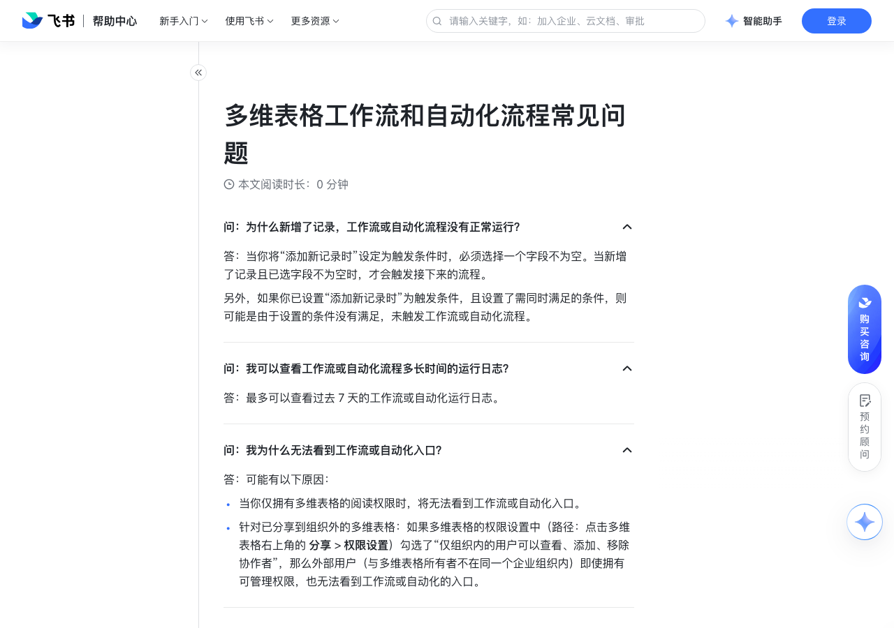

# 多维表格工作流和自动化流程常见问题

> 来源：[飞书帮助中心](https://www.feishu.cn/hc/zh-CN/articles/949255360693)  
> 分类：多维表格 / 工作流  
> 抓取时间：2026-09-22T01:24:07.399Z

## 界面截图

## 功能定位

本页对应飞书帮助中心「多维表格 / 工作流」下的「多维表格工作流和自动化流程常见问题」。以下需求描述依据官方说明文档提炼，用于指导 DuoWei 对标实现。

## 功能目标

未开启高级权限时，多维表格所有者、拥有可管理和可编辑权限的用户可以创建、编辑和删除工作流或自动化流程；若用户失去了可编辑/可管理权限，由该用户启用的工作流或自动化流程可能会自动转交给新的所有者或停止运行。如果工作流或自动化流程停止运行，有多维表格编辑权限的用户可以再次启用此流程。

## 详细功能说明

未开启高级权限时，多维表格所有者、拥有可管理和可编辑权限的用户可以创建、编辑和删除工作流或自动化流程；若用户失去了可编辑/可管理权限，由该用户启用的工作流或自动化流程可能会自动转交给新的所有者或停止运行。如果工作流或自动化流程停止运行，有多维表格编辑权限的用户可以再次启用此流程。

开启高级权限后，仅多维表格所有者和拥有可管理权限的用户可以创建、编辑和删除工作流或自动化流程。若用户失去了可管理权限，由该用户启用的工作流或自动化流程可能会自动转交给新的所有者或停止运行。如果自动化流程停止运行，多维表格所有者或其他拥有权限的用户可以再次启用此流程。

问：为什么新增了记录，工作流或自动化流程没有正常运行？

答：当你将“添加新记录时”设定为触发条件时，必须选择一个字段不为空。当新增了记录且已选字段不为空时，才会触发接下来的流程。另外，如果你已设置“添加新记录时”为触发条件，且设置了需同时满足的条件，则可能是由于设置的条件没有满足，未触发工作流或自动化流程。

问：我可以查看工作流或自动化流程多长时间的运行日志？

答：最多可以查看过去 7 天的工作流或自动化运行日志。

问：我为什么无法看到工作流或自动化入口？

答：可能有以下原因：当你仅拥有多维表格的阅读权限时，将无法看到工作流或自动化入口。针对已分享到组织外的多维表格：如果多维表格的权限设置中（路径：点击多维表格右上角的 分享 > 权限设置）勾选了“仅组织内的用户可以查看、添加、移除协作者”，那么外部用户（与多维表格所有者不在同一个企业组织内）即使拥有可管理权限，也无法看到工作流或自动化的入口。

问：谁可以创建、编辑和删除工作流或自动化流程？

答：未开启高级权限时，多维表格所有者、拥有可管理和可编辑权限的用户可以创建、编辑和删除工作流或自动化流程；若用户失去了可编辑/可管理权限，由该用户启用的工作流或自动化流程可能会自动转交给新的所有者或停止运行。如果工作流或自动化流程停止运行，有多维表格编辑权限的用户可以再次启用此流程。开启高级权限后，仅多维表格所有者和拥有可管理权限的用户可以创建、编辑和删除工作流或自动化流程。若用户失去了可管理权限，由该用户启用的工作流或自动化流程可能会自动转交给新的所有者或停止运行。如果自动化流程停止运行，多维表格所有者或其他拥有权限的用户可以再次启用此流程。关于工作流或自动化流程转交逻辑的具体信息，请参考多维表格工作流和自动化流程转交说明。注：有权限的外部用户（与多维表格所有者不在同一个企业组织内）可以创建流程、删除未 被启用的流程，但不能启用或停用流程。外部用户对流程做的编辑可以被保存但不能被启用。

问：每个多维表格支持创建多少个工作流或自动化流程？

答：每个多维表格中，工作流或自动化流程的创建上限各为 200 个。注：以“到达记录中的时间”为触发条件的工作流或自动化流程，创建上限各为 100 个。

问：工作流或自动化流程的运行次数限制是？

答：具体运行次数请参考下表。运行次数到达每月上限后将停止运行，并于次月 1 日（GMT+0 的 0 时）起自动恢复。基础版商业版企业版免费标准专业旗舰标准专业旗舰200次/月200次/月5,000次/月50万次/月50万次/月50万次/月50 万次 + 60 次*购买人数/月

问：如何计算工作流和自动化流程的运行次数？

答：任一工作流或自动化流程，无论包含多少节点，只要被触发且运行成功，均计为一次运行。例如，当任务信息有更新时，成功给任务负责人发送消息提醒，此流程中包含两个节点，计为一次运行。

问：如何在工作流或自动化流程中引用公式计算出来的日期？

答：当你在工作流或自动化流程中引用公式计算出来的日期，用于填充日程或任务的起止时间、或其他日期字段时，务必保证公式正确，且在 字段格式 处选择了“日期”格式。“默认”格式或其他格式的计算结果都无法被识别成日期。同理，在使用工作流或自动化流程更新数字等其他字段类型时也是如此，需为计算结果选择合适的格式，以确保内容填充正确。250px|700px|reset

问：使用工作流或自动化流程发送消息时，消息中的数字不按照设定好的格式显示，怎么办？

答：当你使用工作流或自动化发送消息，并引用了数字格式的内容时（可能是数字字段，或是计算后的公式或查找引用字段），保留几位小数、百分比等格式设置都不会被保留，需要使用公式来改写格式。例如，如果你想实现“保留两位小数”的效果，可使用 Text 公式，比如 TEXT([原字段]，"0.00")，然后把字段格式改为默认或者文本。如果想展示百分比，就需要用 ROUND 函数取 2 位小数、*100，再拼接 % 符号。

问：为什么使用工作流或自动化流程发送的消息不展示多维表格内的内容？

答：这可能是由于你点击的是 发送预览 按钮，并非真正触发了工作流或自动化流程。点击 发送预览，预览的消息会发送给当前的流程配置者，引用的字段会以“[字段标题]”的形式展示，仅供预览效果。预览消息中无法展示多维表格中实际的字段内容。250px|700px|reset250px|700px|reset

问：我可以在工作流或自动化消息中添加链接吗？

答：可以。你可以在“发送飞书消息”中打开 添加底部按钮，即可自定义按钮的标题和跳转的链接。250px|700px|reset

问：一个工作流或自动化流程中，最多可以选择几个群组？

答：10 个。

问：在工作流或自动化的触发条件中，是否可以选择公式和查找引用字段？

答：可以，当触发条件为“修改记录时”，公式字段和查找引用字段可以作为关注的字段。需注意，仍存在部分无法使用的情况：多维表格创建的时间较早，导致无法使用。请尝试新建多维表格后使用。单个数据表内的公式和查找引用字段总数超出 100 个时，将无法使用。多维表格内存在计算慢的公式，可尝试对公式进行优化后使用。详情可查看多维表格公式计算优化指南。

问：多维表格工作流或自动化流程是否支持以“删除”作为触发条件或执行操作？

答：不支持。多维表格的工作流或自动化流程不支持以“删除”作为触发条件，也不支持删除操作。

问：多维表格工作流或自动化流程是否可以一次新增多条记录？

答：工作流或自动化流程不支持一次新增多条记录。但你可以在工作流中使用循环节点批量新增记录，具体信息请参考工作流循环功能场景实践。

问：怎样查看我的企业里工作流或自动化流程运行了多少次？

答：企业超级管理员或拥有多维表格流程用量权限的管理员，可以在管理后台的企业管理 > 费用中心 > 权益数据 页面，查看多维表格自动化流程的用量和额度。

问：可以使用多维表格工作流或自动化流程删除指定记录吗？

答：多维表格工作流或自动化流程不支持删除记录操作。

## 实现要点（对标 DuoWei）

1. **入口与信息架构**：在产品中明确该能力所属模块（工作流），并保证用户可从对应导航触达。
2. **核心交互**：按上文「详细功能说明」还原主要操作路径；截图中出现的按钮、字段、面板命名尽量与飞书语义一致或可映射。
3. **数据与权限**：若文档涉及可见范围、可编辑范围、分享或高级权限，实现时需落到角色/成员模型，并保证 API/MCP 与 UI 权限一致。
4. **边界与上限**：若文档提到数量上限、格式限制、导入导出约束，需在实现与错误提示中体现。
5. **验收**：以本页截图场景为用例，完成「能打开 / 能配置 / 能保存 / 能被 Agent 读写（如适用）」四项检查。

## 原始摘录摘要

> 未开启高级权限时，多维表格所有者、拥有可管理和可编辑权限的用户可以创建、编辑和删除工作流或自动化流程；若用户失去了可编辑/可管理权限，由该用户启用的工作流或自动化流程可能会自动转交给新的所有者或停止运行。如果工作流或自动化流程停止运行，有多维表格编辑权限的用户可以再次启用此流程。 开启高级权限后，仅多维表格所有者和拥有可管理权限的用户可以创建、编辑和删除工作流或自动化流程。若用户失去了可管理权限，由该用户启用的工作流或自动化流程可能会自动转交给新的所有者或停止运行。如果自动化流程停止运行，多维表格所有者或其他拥有权限的用户可以再次启用此流程。 问：为什么新增了记录，工作流或自动化流程没有正常运行？ 答：当你将“添加新记录时”设定为触发条件时，必须选择一个字段不为空。当新增了记录且已选字段不为空时，才会触发接下来的流程。另外，如果你已设置“添加新记录时”为触发条件，且设置了需同时满足的条件，则可能是由于设置的条件没有满足，未触发工作流或自动化流程。 问：我可以查看工作流或自动化流程多长时间的运行日志？ 答：最多可以查看过去 7 天的工作流或自动化运行日志。 问：我为什么无法看到工作流或自动化入口？ 答：可能有以下原因：当你仅拥有多维表格的阅读权限时，将无法看到工作流或自动化入口。针对已分享到组织外的多维表格：如果多维表格的权限设置中（路径：点击多维表格右上角的 分享 > 权限设置）勾选了“仅组织内的用户可以查看、添加、移除协作者”，那么外部用户（与多维表格所有者不在同一个企业组织内）即使拥有可管理权限，也无法看到工作流或自动化的入口。 问：谁可以创建、编辑和删除工作流或自动化流程？ 答：未开启高级权限时，多维表格所有者、拥有可管理和可编辑权限的用户可以创建、编辑和删除工作流或自动化流程；若用户失去了可编辑/可管理权限，由该用户启用的工作流或自动化流程可能会自动转交给新的所有者…

## 元数据

- article_id: `7111248980809383964`
- category_id: `7415964452380049412`
- path: `/hc/zh-CN/articles/949255360693`
- extracted_text_length: 2772
