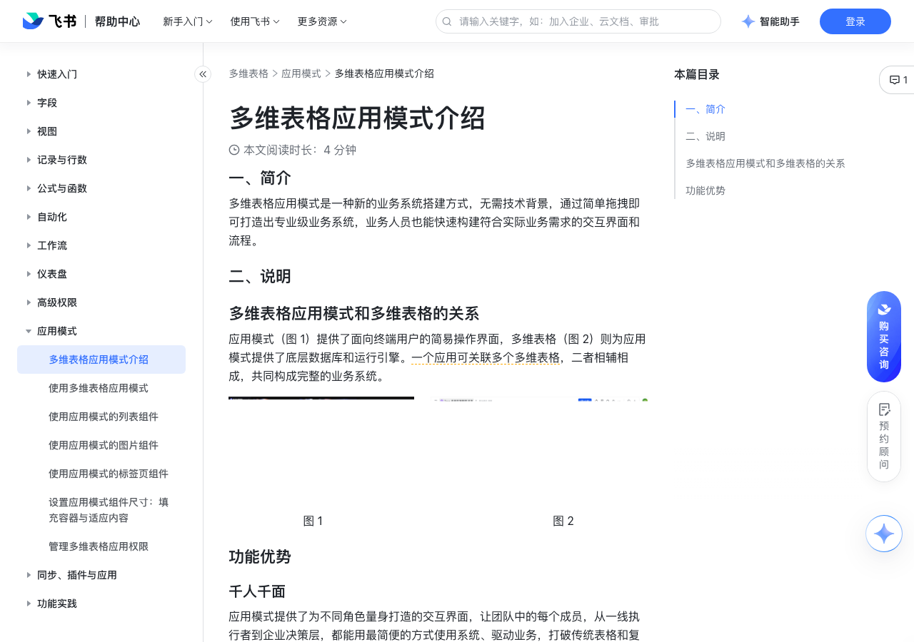

# 多维表格应用模式介绍

> 来源：[飞书帮助中心](https://www.feishu.cn/hc/zh-CN/articles/246735003080)  
> 分类：多维表格 / 应用模式  
> 抓取时间：2026-09-22T01:26:32.038Z

## 界面截图

### 文档内配图

1. 配图：https://p1-hera.feishucdn.com/tos-cn-i-jbbdkfciu3/ef1f33b2f5a94fccbdd65d5d8a7b8cd3~tplv-jbbdkfciu3-image:0:0.image
2. 配图：https://p1-hera.feishucdn.com/tos-cn-i-jbbdkfciu3/ac9c0e11124a45e1b2dbf6d3ae358971~tplv-jbbdkfciu3-image:0:0.image
3. 配图：https://p1-hera.feishucdn.com/tos-cn-i-jbbdkfciu3/948b709b2c5541a8982332f975892ca1~tplv-jbbdkfciu3-image:0:0.image
4. 配图：https://p1-hera.feishucdn.com/tos-cn-i-jbbdkfciu3/8b88f107e5234d03bf44b4cf94272862~tplv-jbbdkfciu3-image:0:0.image
5. 配图：https://p1-hera.feishucdn.com/tos-cn-i-jbbdkfciu3/789a09e219184fe09a4a012010cc6689~tplv-jbbdkfciu3-image:0:0.image

## 功能定位

本页对应飞书帮助中心「多维表格 / 应用模式」下的「多维表格应用模式介绍」。以下需求描述依据官方说明文档提炼，用于指导 DuoWei 对标实现。

## 功能目标

一、简介

## 文档结构（官方章节）

- 一、简介​
- 二、说明​
- 多维表格应用模式和多维表格的关系​
- 功能优势​
- 千人千面​
- 数据互联互通​
- 多端适配​
- 桌面端​
- 移动端​
- 丰富的应用模板​

## 详细功能说明

一、简介

二、说明

多维表格应用模式和多维表格的关系

图 1 图 2

功能优势

千人千面

应用搭建者：零门槛搭建，只需简单地拖拽，即可轻松上手搭建。传统需要数月的开发周期，现在能缩短至数天甚至数小时。

应用使用者：应用界面一目了然，业务组件样式丰富、简单好用，不用进行复杂的表格操作，一看就会。

权限管控：灵活控制页面及操作权限，不同角色看到不同界面，同时确保数据安全与流程规范。

数据互联互通

多端适配

丰富的应用模板

## 实现要点（对标 DuoWei）

1. **入口与信息架构**：在产品中明确该能力所属模块（应用模式），并保证用户可从对应导航触达。
2. **核心交互**：按上文「详细功能说明」还原主要操作路径；截图中出现的按钮、字段、面板命名尽量与飞书语义一致或可映射。
3. **数据与权限**：若文档涉及可见范围、可编辑范围、分享或高级权限，实现时需落到角色/成员模型，并保证 API/MCP 与 UI 权限一致。
4. **边界与上限**：若文档提到数量上限、格式限制、导入导出约束，需在实现与错误提示中体现。
5. **验收**：以本页截图场景为用例，完成「能打开 / 能配置 / 能保存 / 能被 Agent 读写（如适用）」四项检查。

## 原始摘录摘要

> 一、简介 二、说明 多维表格应用模式和多维表格的关系 图 1 图 2 功能优势 千人千面 应用搭建者：零门槛搭建，只需简单地拖拽，即可轻松上手搭建。传统需要数月的开发周期，现在能缩短至数天甚至数小时。 应用使用者：应用界面一目了然，业务组件样式丰富、简单好用，不用进行复杂的表格操作，一看就会。 权限管控：灵活控制页面及操作权限，不同角色看到不同界面，同时确保数据安全与流程规范。 数据互联互通 多端适配 丰富的应用模板

## 元数据

- article_id: `7601057756426243002`
- category_id: `7550306356478574620`
- path: `/hc/zh-CN/articles/246735003080`
- extracted_text_length: 210
