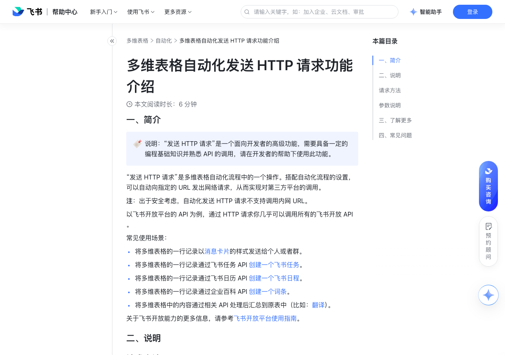

# 多维表格自动化发送 HTTP 请求功能介绍

> 来源：[飞书帮助中心](https://www.feishu.cn/hc/zh-CN/articles/410063847664)  
> 分类：多维表格 / 自动化  
> 抓取时间：2026-09-22T01:24:02.153Z

## 界面截图

## 功能定位

本页对应飞书帮助中心「多维表格 / 自动化」下的「多维表格自动化发送 HTTP 请求功能介绍」。以下需求描述依据官方说明文档提炼，用于指导 DuoWei 对标实现。

## 功能目标

一、简介

## 文档结构（官方章节）

- 一、简介​
- 二、说明​
- 请求方法​
- 参数说明​
- 三、了解更多​
- 四、常见问题​

## 详细功能说明

一、简介

将多维表格的一行记录以消息卡片的样式发送给个人或者群。

将多维表格的一行记录通过飞书任务 API 创建一个飞书任务。

将多维表格的一行记录通过飞书日历 API 创建一个飞书日程。

将多维表格的一行记录通过企业百科 API 创建一个词条。

将多维表格中的内容通过相关 API 处理后汇总到原表中（比如：翻译）。

二、说明

请求方法

请求指定的页面信息，并返回响应主体。用来检索或获取信息。

POST

向指定资源提交数据进行处理（如提交表单、上传文件），数据被包含在请求文本中。用来创建新资源、修改现有资源。

向指定的资源位置上传最新内容，完全覆盖原有资源。

PATCH

修改指定资源的部分字段，用于资源的部分更新。

DELETE

请求服务器删除指定 URL 所对应的资源。

参数说明

参数类型

参数名称

请求 URL

HTTP 请求地址，可以手动输入或引用多维表格中已有的链接。注：此处不支持带有查询参数的链接。

查询参数

HTTP 请求中的 Query 参数，以键（Key）- 值（Value）的形式填入。“值”支持引用多维表格中的数据。

HTTP 请求中的 Header 参数，以键（Key）- 值（Value）的形式填入。“值”支持引用多维表格中的数据。

对 HTTP 响应的解析规则，支持 none、Text、JSON 3 种规则。

返回值（仅当响应体为 JSON 时需配置）

HTTP 响应体，将按照 JSON 规则对响应体进行解析并返回相应的内容。注：为确保返回值内容能够被引用，需保证输入的内容符合 JSON 格式。

POSTPUTPATCHDELETE

可以传输的请求体类型：none、raw、form-data、form-urlencoded none：没有请求体，此时可不填写请求体。raw：仅支持 JSON 格式。如需获取多维表格中的记录信息，可以调用多维表格查询记录 API，具体信息请参考查询记录。form-data：使用 multipart/form-data 编码，按键值对传递数据，不支持嵌套结构和文件上传。form-urlencoded：使用 application/x-www-form-urlencoded 编码，将键值对编码为查询字符串形式，不支持嵌套结构和文件上传。

none：没有请求体，此时可不填写请求体。

raw：仅支持 JSON 格式。如需获取多维表格中的记录信息，可以调用多维表格查询记录 API，具体信息请参考查询记录。

form-data：使用 multipart/form-data 编码，按键值对传递数据，不支持嵌套结构和文件上传。

form-urlencoded：使用 application/x-www-form-urlencoded 编码，将键值对编码为查询字符串形式，不支持嵌套结构和文件上传。

HTTP 响应体，将按照 JSON 规则对响应体进行解析并返回相应的内容。为确保返回值内容能够被引用，需保证输入的内容符合 JSON 格式。注：发送 HTTP 请求后返回的时间格式的结果，不支持直接填充至日期字段中。你可以将日期值或日期时间戳填入文本字段中，再将文本字段改为日期字段。

三、了解更多

四、常见问题

问：多维表格自动化发送的 HTTP 请求，响应时长的上限是多少？

答：HTTP 请求的响应时长的上限是 60 秒。若 60 秒后还未收到响应，即会超时，请求结果便无法被返回到多维表格中。超时后，HTTP 请求可能执行成功、也可能失败，最终的执行结果需向被调用方确认。

问：多维表格自动化发送 HTTP 请求，是否支持固定的 IP 地址（即 IP 白名单）？

答：支持。固定的 IP 地址如下：若企业数据驻留地部署于 CN 机房：123.58.10.238123.58.10.239220.243.131.172220.243.131.173101.126.59.7101.126.59.8101.126.59.9若企业数据驻留地部署于非 CN 机房：3.225.193.5734.196.227.34若无法区分部署地，推荐全部添加到白名单。

问：多维表格自动化发送 HTTP 请求时，可以直接在 URL 里添加查询参数吗？

答：不可以，直接在 URL 里添加的查询参数将无法被识别。如需添加，请在 入参 的 查询参数 处填写相应的查询参数。250px|700px|reset

问：多维表格自动化发送的 HTTP 请求为什么无法被解析？

答：只有 HTTP 状态码在 200-299 之间才会被解析，否则将会直接返回原始报错报文。

问：多维表格自动化发送 HTTP 请求后，如何判断返回值是符合 JSON 格式规范？

答：请从以下 4 个角度确认输入的内容是否符合 JSON 格式规范：数组或对象之中的字符串必须为英文双引号 ""。结构体中需包含一个或多个键值对（Key-Value）。键（Key）必须为字符串，且键与值之间用英文冒号 : 分割。对象必须用大括号 {} 包裹。

问：多维表格自动化发送 HTTP 请求时，最多可以输入多少个键值（Key-Value）对？

答：当前最多支持输入 100 个键值对。

问：多维表格自动化发送 HTTP 请求后，可以引用请求响应中的数组数据吗？

答：只能整体引用数组数据，无法引用 JSON 数组中的单个变量。

问：多维表格自动化发送 HTTP 请求时，响应体的返回值该如何填写？

答：可以在 Postman 或者 API 接口文档中获取响应体示例，并将获取到的响应体示例内容粘贴到自动化流程中 出参 的 响应体 处（仅当响应体为 JSON 时需输入返回值），这样下一步才能引用 HTTP 的请求结果中的值。

问：在多维表格自动化中配置 HTTP 请求时，直接从开放平台复制了发送消息的请求体，为什么运行不成功？

答：可能是因为未在代码开头添加消息类型，如下所示：JSON复制{ "msg_type": "interactive", "card": 从开放平台复制的内容}

请求方法 | 说明

GET | 请求指定的页面信息，并返回响应主体。用来检索或获取信息。

POST | 向指定资源提交数据进行处理（如提交表单、上传文件），数据被包含在请求文本中。用来创建新资源、修改现有资源。

PUT | 向指定的资源位置上传最新内容，完全覆盖原有资源。

PATCH | 修改指定资源的部分字段，用于资源的部分更新。

DELETE | 请求服务器删除指定 URL 所对应的资源。

请求方法 | 参数类型 | 参数名称 | 说明

GET | 入参 | 请求 URL | HTTP 请求地址，可以手动输入或引用多维表格中已有的链接。注：此处不支持带有查询参数的链接。

| | 查询参数 | HTTP 请求中的 Query 参数，以键（Key）- 值（Value）的形式填入。“值”支持引用多维表格中的数据。

| | 请求头 | HTTP 请求中的 Header 参数，以键（Key）- 值（Value）的形式填入。“值”支持引用多维表格中的数据。

| 出参 | 响应体 | 对 HTTP 响应的解析规则，支持 none、Text、JSON 3 种规则。

| | 返回值（仅当响应体为 JSON 时需配置） | HTTP 响应体，将按照 JSON 规则对响应体进行解析并返回相应的内容。注：为确保返回值内容能够被引用，需保证输入的内容符合 JSON 格式。

POSTPUTPATCHDELETE | 入参 | 请求 URL | HTTP 请求地址，可以手动输入或引用多维表格中已有的链接。注：此处不支持带有查询参数的链接。

| | 请求体 | 可以传输的请求体类型：none、raw、form-data、form-urlencoded none：没有请求体，此时可不填写请求体。raw：仅支持 JSON 格式。如需获取多维表格中的记录信息，可以调用多维表格查询记录 API，具体信息请参考查询记录。form-data：使用 multipart/form-data 编码，按键值对传递数据，不支持嵌套结构和文件上传。form-urlencoded：使用 application/x-www-form-urlencoded 编码，将键值对编码为查询字符串形式，不支持嵌套结构和文件上传。

| | 返回值（仅当响应体为 JSON 时需配置） | HTTP 响应体，将按照 JSON 规则对响应体进行解析并返回相应的内容。为确保返回值内容能够被引用，需保证输入的内容符合 JSON 格式。注：发送 HTTP 请求后返回的时间格式的结果，不支持直接填充至日期字段中。你可以将日期值或日期时间戳填入文本字段中，再将文本字段改为日期字段。

## 实现要点（对标 DuoWei）

1. **入口与信息架构**：在产品中明确该能力所属模块（自动化），并保证用户可从对应导航触达。
2. **核心交互**：按上文「详细功能说明」还原主要操作路径；截图中出现的按钮、字段、面板命名尽量与飞书语义一致或可映射。
3. **数据与权限**：若文档涉及可见范围、可编辑范围、分享或高级权限，实现时需落到角色/成员模型，并保证 API/MCP 与 UI 权限一致。
4. **边界与上限**：若文档提到数量上限、格式限制、导入导出约束，需在实现与错误提示中体现。
5. **验收**：以本页截图场景为用例，完成「能打开 / 能配置 / 能保存 / 能被 Agent 读写（如适用）」四项检查。

## 原始摘录摘要

> 一、简介 将多维表格的一行记录以消息卡片的样式发送给个人或者群。 将多维表格的一行记录通过飞书任务 API 创建一个飞书任务。 将多维表格的一行记录通过飞书日历 API 创建一个飞书日程。 将多维表格的一行记录通过企业百科 API 创建一个词条。 将多维表格中的内容通过相关 API 处理后汇总到原表中（比如：翻译）。 二、说明 请求方法 请求指定的页面信息，并返回响应主体。用来检索或获取信息。 POST 向指定资源提交数据进行处理（如提交表单、上传文件），数据被包含在请求文本中。用来创建新资源、修改现有资源。 向指定的资源位置上传最新内容，完全覆盖原有资源。 PATCH 修改指定资源的部分字段，用于资源的部分更新。 DELETE 请求服务器删除指定 URL 所对应的资源。 参数说明 参数类型 参数名称 请求 URL HTTP 请求地址，可以手动输入或引用多维表格中已有的链接。注：此处不支持带有查询参数的链接。 查询参数 HTTP 请求中的 Query 参数，以键（Key）- 值（Value）的形式填入。“值”支持引用多维表格中的数据。 HTTP 请求中的 Header 参数，以键（Key）- 值（Value）的形式填入。“值”支持引用多维表格中的数据。 对 HTTP 响应的解析规则，支持 none、Text、JSON 3 种规则。 返回值（仅当响应体为 JSON 时需配置） HTTP 响应体，将按照 JSON 规则对响应体进行解析并返回相应的内容。注：为确保返回值内容能够被引用，需保证输入的内容符合 JSON 格式。 POSTPUTPATCHDELETE 可以传输的请求体类型：none、raw、form-data、form-urlencoded none：没有请求体，此时可不填写请求体。raw：仅支持 JSON 格式。如需获取多维表格中的记录信息，可以调用多维表格查询记录 …

## 元数据

- article_id: `7114187489329397762`
- category_id: `7165751270974767105`
- path: `/hc/zh-CN/articles/410063847664`
- extracted_text_length: 3618
