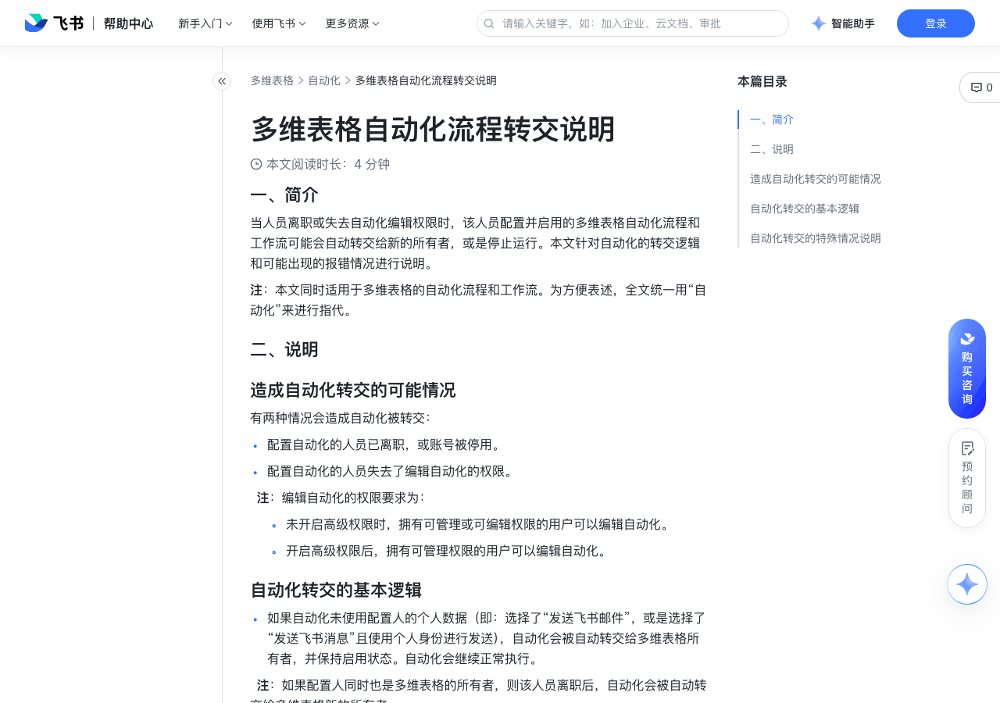

# 多维表格自动化流程转交说明

> 来源：[飞书帮助中心](https://www.feishu.cn/hc/zh-CN/articles/348126593171)  
> 分类：多维表格 / 自动化  
> 抓取时间：2026-09-22T01:24:02.401Z

## 界面截图

## 功能定位

本页对应飞书帮助中心「多维表格 / 自动化」下的「多维表格自动化流程转交说明」。以下需求描述依据官方说明文档提炼，用于指导 DuoWei 对标实现。

## 功能目标

一、简介

## 文档结构（官方章节）

- 一、简介​
- 二、说明​
- 造成自动化转交的可能情况​
- 自动化转交的基本逻辑​
- 自动化转交的特殊情况说明​
- 情况一：当离职人员是多维表格所有者，且多维表格的所有权尚未转移​
- 情况二：当系统转交时，数据表配置发生改变，导致自动化无法正常转交​

## 详细功能说明

一、简介

二、说明

造成自动化转交的可能情况

配置自动化的人员已离职，或账号被停用。

配置自动化的人员失去了编辑自动化的权限。

未开启高级权限时，拥有可管理或可编辑权限的用户可以编辑自动化。

开启高级权限后，拥有可管理权限的用户可以编辑自动化。

自动化转交的基本逻辑

如果自动化未使用配置人的个人数据（即：选择了“发送飞书邮件”，或是选择了“发送飞书消息”且使用个人身份进行发送），自动化会被自动转交给多维表格所有者，并保持启用状态。自动化会继续正常执行。

转交时点：当自动化被触发时，系统会开始转交。

系统会先判断是否能找到自动化的接收人（例如，多维表格文件的所有权是否已经转移给新用户）。找到确定的接收人后，才会完成自动化的转交。

如果自动化使用了配置人的个人数据，自动化无法被转交，会自动停止运行，并向多维表格所有者发送提醒。

自动化转交的特殊情况说明

情况一：当离职人员是多维表格所有者，且多维表格的所有权尚未转移

出现条件（需同时满足以下两点）：

离职的人员既是多维表格所有者又是自动化的配置者。或者，多维表格所有者和自动化的配置者同时离职。

多维表格的所有权尚未转移，即多维表格的所有者仍是账号停用的用户，导致系统无法识别有效的转交对象。

报错信息：“由于此自动化流程原配置人账号已停用，本次触发失败。请等待系统自动转移权限后重试。”

后果及解决方式：

由于系统找不到新的自动化接收人，本次触发的系统转交将会失败，但自动化仍会保持启用状态。

当流程再次被触发时，系统会再次尝试进行转交，无需额外操作。

情况二：当系统转交时，数据表配置发生改变，导致自动化无法正常转交

出现条件：在自动化被转交之前，多维表格中的字段被删除、字段类型被修改、字段配置项被修改等，影响到了离职人员或失去权限的人员配置的自动化。在触发转交时便会出错，自动化无法正常启用。

本次触发的系统转交将会失败，且自动化会停用，系统不会再次进行转交。

流程被停用后，多维表格所有者将收到飞书消息提醒。如需再次启用此流程，需要由多维表格的新的所有者调整流程配置，修复完成后再启用流程。

## 实现要点（对标 DuoWei）

1. **入口与信息架构**：在产品中明确该能力所属模块（自动化），并保证用户可从对应导航触达。
2. **核心交互**：按上文「详细功能说明」还原主要操作路径；截图中出现的按钮、字段、面板命名尽量与飞书语义一致或可映射。
3. **数据与权限**：若文档涉及可见范围、可编辑范围、分享或高级权限，实现时需落到角色/成员模型，并保证 API/MCP 与 UI 权限一致。
4. **边界与上限**：若文档提到数量上限、格式限制、导入导出约束，需在实现与错误提示中体现。
5. **验收**：以本页截图场景为用例，完成「能打开 / 能配置 / 能保存 / 能被 Agent 读写（如适用）」四项检查。

## 原始摘录摘要

> 一、简介 二、说明 造成自动化转交的可能情况 配置自动化的人员已离职，或账号被停用。 配置自动化的人员失去了编辑自动化的权限。 未开启高级权限时，拥有可管理或可编辑权限的用户可以编辑自动化。 开启高级权限后，拥有可管理权限的用户可以编辑自动化。 自动化转交的基本逻辑 如果自动化未使用配置人的个人数据（即：选择了“发送飞书邮件”，或是选择了“发送飞书消息”且使用个人身份进行发送），自动化会被自动转交给多维表格所有者，并保持启用状态。自动化会继续正常执行。 转交时点：当自动化被触发时，系统会开始转交。 系统会先判断是否能找到自动化的接收人（例如，多维表格文件的所有权是否已经转移给新用户）。找到确定的接收人后，才会完成自动化的转交。 如果自动化使用了配置人的个人数据，自动化无法被转交，会自动停止运行，并向多维表格所有者发送提醒。 自动化转交的特殊情况说明 情况一：当离职人员是多维表格所有者，且多维表格的所有权尚未转移 出现条件（需同时满足以下两点）： 离职的人员既是多维表格所有者又是自动化的配置者。或者，多维表格所有者和自动化的配置者同时离职。 多维表格的所有权尚未转移，即多维表格的所有者仍是账号停用的用户，导致系统无法识别有效的转交对象。 报错信息：“由于此自动化流程原配置人账号已停用，本次触发失败。请等待系统自动转移权限后重试。” 后果及解决方式： 由于系统找不到新的自动化接收人，本次触发的系统转交将会失败，但自动化仍会保持启用状态。 当流程再次被触发时，系统会再次尝试进行转交，无需额外操作。 情况二：当系统转交时，数据表配置发生改变，导致自动化无法正常转交 出现条件：在自动化被转交之前，多维表格中的字段被删除、字段类型被修改、字段配置项被修改等，影响到了离职人员或失去权限的人员配置的自动化。在触发转交时便会出错，自动化无法正常启用。 本次触发的系统转交将会失败，且自动化会停…

## 元数据

- article_id: `7506487214067433474`
- category_id: `7165751270974767105`
- path: `/hc/zh-CN/articles/348126593171`
- extracted_text_length: 879
