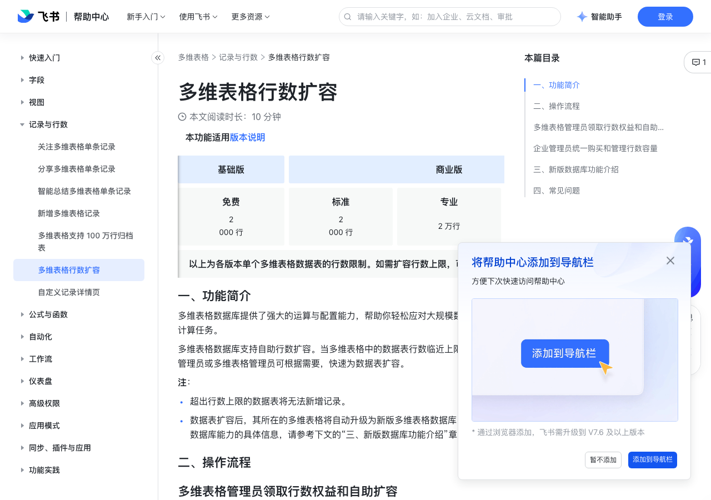

# 多维表格行数扩容

> 来源：[飞书帮助中心](https://www.feishu.cn/hc/zh-CN/articles/389918352455)  
> 分类：多维表格 / 记录与行数  
> 抓取时间：2026-09-22T01:23:46.588Z

## 界面截图

### 文档内配图

1. 配图：https://p1-hera.feishucdn.com/tos-cn-i-jbbdkfciu3/0b9c9981cf7e41b38577d1a8c31d49c6~tplv-jbbdkfciu3-image:0:0.image
2. 配图：https://p1-hera.feishucdn.com/tos-cn-i-jbbdkfciu3/ed29040aff9d4395b8b1b5dea2ca9d03~tplv-jbbdkfciu3-image:0:0.image
3. 配图：https://p1-hera.feishucdn.com/tos-cn-i-jbbdkfciu3/9a8f6fbb99eb4f13a198290f902135e9~tplv-jbbdkfciu3-image:0:0.image

## 功能定位

本页对应飞书帮助中心「多维表格 / 记录与行数」下的「多维表格行数扩容」。以下需求描述依据官方说明文档提炼，用于指导 DuoWei 对标实现。

## 功能目标

一、功能简介

## 文档结构（官方章节）

- 一、功能简介​
- 二、操作流程​
- 多维表格管理员领取行数权益和自助扩容​
- 领取行数权益​
- 自助扩容​
- 企业管理员统一购买和管理行数容量​
- 查看和管理行数扩容包用量​
- 设置数据表扩容上限​
- 三、新版数据库功能介绍​
- 四、常见问题​

## 详细功能说明

一、功能简介

超出行数上限的数据表将无法新增记录。

数据表扩容后，其所在的多维表格将自动升级为新版多维表格数据库。关于新版数据库能力的具体信息，请参考下文的“三、新版数据库功能介绍”章节。

二、操作流程

多维表格管理员领取行数权益和自助扩容

领取行数权益

使用基础版或商业标准版的用户，可以在原有 2,000 行基础上，免费额外领取 1.8 万行权益。

使用商业旗舰版或任一企业版的用户，可以直接解锁 5 万行权益。

自助扩容

如果你所在的企业拥有可分配的多维表格扩容行数，你可以点击对应的扩容选项，或者点击 自定义行数，手动输入要扩容的行数进行扩容。提示扩容成功后，刷新页面，数据表行数上限将立即提升。

注：单张数据表行数不能超过 200 万行，单个多维表格文件的总行数不能超过 1,000 万行。

如果你所在企业当前无可用扩容权益，你可以联系企业管理员，购买行数权益后，再进行扩容。

企业管理员统一购买和管理行数容量

企业超级管理员或拥有费用中心管理权限的企业管理员可以为企业统一购买行数容量扩容包。

支持叠加购买多个扩容包，购买后总行数容量会累加。扩容包的有效期与套件有效期保持一致，如果套件版本有效期不足一年，购买扩容包时价格会根据剩余有效期进行相应折算。

扩容包为企业内所有多维表格可扩容的总体行数，非单张数据表可扩容的行数。扩容包可分配给任意数据表，按照扩容顺序，先扩容的会先消耗剩余行数容量。例如，企业套件内权益为 5 万行，又另外购买了 50 万行扩容包。如果某张数据表总行数为 10 万行，即使用了 5 万行扩容包，则扩容包剩余行数为 45 万行。

如果企业想快捷购买行数扩容包，可直接联系企业客户经理。

当购买行数容量扩容包企业内无足够的可扩容行数时，企业管理员可以点击任意数据表的 更多操作 图标，然后点击 提升行数 进行扩容。

在扩容卡片上选择超出剩余可扩容行数的选项，然后在弹窗中选择 立即购买。

按照界面指示选择需要购买的数量，确认订单信息，勾选协议，点击 创建订单。

选择支付方式并完成支付。关于支付订单的具体信息，请参考管理员线上购买扩容包。

查看和管理行数扩容包用量

在行数用量页面上，管理员可以查看每张数据表的行数用量及上限、是否已使用扩容包、扩容行数等信息。可以通过列表上方的筛选器进行筛选，也可以将数据导出到多维表格。

点击单张数据表右侧操作列下的 ··· 图标 > 管理行数扩容，可为数据表扩容。

如果当前数据表没有领取限时免费的 1.8 万行，或是没有解锁套件中的 5 万行权益，管理员可以在此扩容页面直接为其领取对应的行数权益。

如果希望扩容包只应用于对应的数据表，可以先将数据表的扩容上限设置为 0，然后再对相应的数据表进行扩容。

设置数据表扩容上限

在管理后台中，将鼠标悬停在左上角的 产品设置 上，点击 多维表格。在左侧导航栏中，点击 数据表扩容上限。

点击右上角的 编辑，设置单张数据表可扩容行数上限。

单张数据表最大行数上限为 200 万行。例如，企业套件内权益为 5 万行，那么数据表可扩容的行数上限支持设置为 0-195 万行之间的任意数字。

企业管理员在管理后台为单张数据表扩容时，不受此处设置的扩容上限的限制。

三、新版数据库功能介绍

更高的单表行数上限：多维表格内单个数据表容量上限增加至 200 万行。

更快的公式计算速度：公式计算速度最大提升约 100 倍。

页面高速加载：多维表格页面加载速度可提升约 3 秒。

Time Machine：可以在多维表格中使用 Time Machine 功能，按时间、操作人、数据筛选历史记录，查看详情和恢复指定历史版本。

新版多维表格数据库

旧版多维表格数据库

创建副本

暂不支持（只能创建包含原表结构的副本）

支持创建最大 5 万行的多维表格副本。

复制数据表

仅支持复制原表结构，暂不支持复制数据。

支持复制最大 5 万行的数据表结构和数据。

公式/单向关联/双向关联字段转换为其他字段

暂不支持

支持将公式/关联字段转换为其他字段。

多维表格公式计算规则变化

如果一个公式引用的列已经被删除，迅算引擎直接返回报错 #REF!。循环引用检测，如果公式间逻辑上存在相互引用，新引擎返回报错 #CIRCLE!。有关循环引用的具体信息，请参考帮助文档：解开公式循环引用关系的方式。FILTER 函数、查找引用结果顺序可能会发生变更。由于新旧引擎算法实现的不同，新引擎的 FILTER 顺序可能发生变更，在此基础上 LAST、FIRST、NTH 的叠加可能有变化。随机函数 RandomItem、RandomBetween 等随机种子算法会更新，升级后结果会刷新。

如果一个公式引用的列已经被删除，迅算引擎直接返回报错 #REF!。

循环引用检测，如果公式间逻辑上存在相互引用，新引擎返回报错 #CIRCLE!。

有关循环引用的具体信息，请参考帮助文档：解开公式循环引用关系的方式。

FILTER 函数、查找引用结果顺序可能会发生变更。

由于新旧引擎算法实现的不同，新引擎的 FILTER 顺序可能发生变更，在此基础上 LAST、FIRST、NTH 的叠加可能有变化。

随机函数 RandomItem、RandomBetween 等随机种子算法会更新，升级后结果会刷新。

四、常见问题

问：扩容后的多维表格数据表在被删除或归档后，行数权益会被回收吗？

答：会。如果多维表格数据表被删除或归档，分配给该数据表的行数权益将被添加回企业可用行数容量中。

问：企业管理员购买多维表格行数扩容包后，此前已经超限的数据表会自动恢复至可正常使用状态吗？

答：不会，企业管理员或对多维表格拥有可管理权限的用户需先手动调整超限表的行数上限，该数据表才可正常使用。

问：在管理后台设置了多维表格数据表行数扩容上限后，可以给某张数据表设置大于该上限的值吗？

答：可以。企业管理员可在飞书管理后台为多维表格数据表设置超过行数扩容上限的数值。但单张表格最大行数不可超过 200 万行。

问：可以查看多维表格扩容操作的历史记录吗？

答：不支持。

问：哪些情况不支持多维表格数据表行数扩容？

答：当数据表满足以下任一条件时，暂时不支持扩容：单个数据表下公式和查找引用字段的数量总和超过 100 个（含）。多维表格的创建时间早于 2023 年 4 月。若仍需扩容，可点击数据表 ⋮ 按钮，选择 升级至 50000 行，选择 迁移数据，系统将自动复制当前数据表，并生成扩容后的新多维表格。注：上述扩容方式，不支持迁移数据表中的历史记录。针对使用 OpenAPI 的用户，在采用上述方法扩容时，需特别注意 URL 的变更。250px|700px|reset

功能 | 新版多维表格数据库 | 旧版多维表格数据库

创建副本 | 暂不支持（只能创建包含原表结构的副本） | 支持创建最大 5 万行的多维表格副本。

复制数据表 | 仅支持复制原表结构，暂不支持复制数据。 | 支持复制最大 5 万行的数据表结构和数据。

公式/单向关联/双向关联字段转换为其他字段 | 暂不支持 | 支持将公式/关联字段转换为其他字段。

多维表格公式计算规则变化 | 如果一个公式引用的列已经被删除，迅算引擎直接返回报错 #REF!。循环引用检测，如果公式间逻辑上存在相互引用，新引擎返回报错 #CIRCLE!。有关循环引用的具体信息，请参考帮助文档：解开公式循环引用关系的方式。FILTER 函数、查找引用结果顺序可能会发生变更。由于新旧引擎算法实现的不同，新引擎的 FILTER 顺序可能发生变更，在此基础上 LAST、FIRST、NTH 的叠加可能有变化。随机函数 RandomItem、RandomBetween 等随机种子算法会更新，升级后结果会刷新。 | 暂无。

## 实现要点（对标 DuoWei）

1. **入口与信息架构**：在产品中明确该能力所属模块（记录与行数），并保证用户可从对应导航触达。
2. **核心交互**：按上文「详细功能说明」还原主要操作路径；截图中出现的按钮、字段、面板命名尽量与飞书语义一致或可映射。
3. **数据与权限**：若文档涉及可见范围、可编辑范围、分享或高级权限，实现时需落到角色/成员模型，并保证 API/MCP 与 UI 权限一致。
4. **边界与上限**：若文档提到数量上限、格式限制、导入导出约束，需在实现与错误提示中体现。
5. **验收**：以本页截图场景为用例，完成「能打开 / 能配置 / 能保存 / 能被 Agent 读写（如适用）」四项检查。

## 原始摘录摘要

> 一、功能简介 超出行数上限的数据表将无法新增记录。 数据表扩容后，其所在的多维表格将自动升级为新版多维表格数据库。关于新版数据库能力的具体信息，请参考下文的“三、新版数据库功能介绍”章节。 二、操作流程 多维表格管理员领取行数权益和自助扩容 领取行数权益 使用基础版或商业标准版的用户，可以在原有 2,000 行基础上，免费额外领取 1.8 万行权益。 使用商业旗舰版或任一企业版的用户，可以直接解锁 5 万行权益。 自助扩容 如果你所在的企业拥有可分配的多维表格扩容行数，你可以点击对应的扩容选项，或者点击 自定义行数，手动输入要扩容的行数进行扩容。提示扩容成功后，刷新页面，数据表行数上限将立即提升。 注：单张数据表行数不能超过 200 万行，单个多维表格文件的总行数不能超过 1,000 万行。 如果你所在企业当前无可用扩容权益，你可以联系企业管理员，购买行数权益后，再进行扩容。 企业管理员统一购买和管理行数容量 企业超级管理员或拥有费用中心管理权限的企业管理员可以为企业统一购买行数容量扩容包。 支持叠加购买多个扩容包，购买后总行数容量会累加。扩容包的有效期与套件有效期保持一致，如果套件版本有效期不足一年，购买扩容包时价格会根据剩余有效期进行相应折算。 扩容包为企业内所有多维表格可扩容的总体行数，非单张数据表可扩容的行数。扩容包可分配给任意数据表，按照扩容顺序，先扩容的会先消耗剩余行数容量。例如，企业套件内权益为 5 万行，又另外购买了 50 万行扩容包。如果某张数据表总行数为 10 万行，即使用了 5 万行扩容包，则扩容包剩余行数为 45 万行。 如果企业想快捷购买行数扩容包，可直接联系企业客户经理。 当购买行数容量扩容包企业内无足够的可扩容行数时，企业管理员可以点击任意数据表的 更多操作 图标，然后点击 提升行数 进行扩容。 在扩容卡片上选择超出剩余可扩容行数的选项，然后在…

## 元数据

- article_id: `7549116095803064321`
- category_id: `7341334412564381698`
- path: `/hc/zh-CN/articles/389918352455`
- extracted_text_length: 3208
