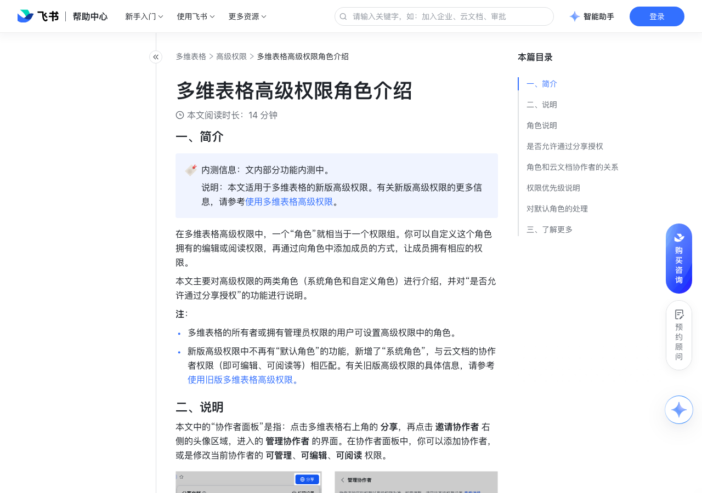

# 多维表格高级权限角色介绍

> 来源：[飞书帮助中心](https://www.feishu.cn/hc/zh-CN/articles/539823920318)  
> 分类：多维表格 / 高级权限  
> 抓取时间：2026-09-22T01:25:23.305Z

## 界面截图

### 文档内配图

1. 配图：https://p1-hera.feishucdn.com/tos-cn-i-jbbdkfciu3/3e1ade6fa12c408685ff5e764a4ab1b2~tplv-jbbdkfciu3-image:0:0.image
2. 配图：https://p1-hera.feishucdn.com/tos-cn-i-jbbdkfciu3/8a9a377fbcf94f48816aef803dc32e08~tplv-jbbdkfciu3-image:0:0.image
3. 配图：https://p1-hera.feishucdn.com/tos-cn-i-jbbdkfciu3/573d2e90a7a0426aa0ef553153a37465~tplv-jbbdkfciu3-image:0:0.image
4. 配图：https://p1-hera.feishucdn.com/tos-cn-i-jbbdkfciu3/600ea82daa124959b934beea6cb6398f~tplv-jbbdkfciu3-image:0:0.image
5. 配图：https://p1-hera.feishucdn.com/tos-cn-i-jbbdkfciu3/e2d4bef6535742f1b0343b07007766c4~tplv-jbbdkfciu3-image:0:0.image
6. 配图：https://p1-hera.feishucdn.com/tos-cn-i-jbbdkfciu3/94b6e2aa28444b608bda56f8c03be20e~tplv-jbbdkfciu3-image:0:0.image
7. 配图：https://p1-hera.feishucdn.com/tos-cn-i-jbbdkfciu3/736bda380f8b4059b555a0b280878913~tplv-jbbdkfciu3-image:0:0.image
8. 配图：https://p1-hera.feishucdn.com/tos-cn-i-jbbdkfciu3/8135c3606f6646acb2e52fd16c056e38~tplv-jbbdkfciu3-image:0:0.image
9. 配图：https://p1-hera.feishucdn.com/tos-cn-i-jbbdkfciu3/a8d269f4bfa0445c827fc2c3546fc88e~tplv-jbbdkfciu3-image:0:0.image
10. 配图：https://p1-hera.feishucdn.com/tos-cn-i-jbbdkfciu3/e0b452fe73404667a10f2cba59e61a5c~tplv-jbbdkfciu3-image:0:0.image
11. 配图：https://p1-hera.feishucdn.com/tos-cn-i-jbbdkfciu3/6b2a4bfafa694a769c9801ea52bb43bf~tplv-jbbdkfciu3-image:0:0.image
12. 配图：https://p1-hera.feishucdn.com/tos-cn-i-jbbdkfciu3/71f6f13d00f64a0fb8830a6c7f7b9013~tplv-jbbdkfciu3-image:0:0.image
13. 配图：https://p1-hera.feishucdn.com/tos-cn-i-jbbdkfciu3/c8288300f9ea42b88b95e6c7d894ad9d~tplv-jbbdkfciu3-image:0:0.image

## 功能定位

本页对应飞书帮助中心「多维表格 / 高级权限」下的「多维表格高级权限角色介绍」。以下需求描述依据官方说明文档提炼，用于指导 DuoWei 对标实现。

## 功能目标

一、简介

## 文档结构（官方章节）

- 一、简介​
- 二、说明​
- 角色说明​
- 系统角色​
- 自定义角色​
- 是否允许通过分享授权​
- 角色和云文档协作者的关系​
- 权限优先级说明​
- 对默认角色的处理​
- 三、了解更多​

## 详细功能说明

一、简介

多维表格的所有者或拥有管理员权限的用户可设置高级权限中的角色。

新版高级权限中不再有“默认角色”的功能，新增了“系统角色”，与云文档的协作者权限（即可编辑、可阅读等）相匹配。有关旧版高级权限的具体信息，请参考使用旧版多维表格高级权限。

二、说明

角色说明

系统角色

设置系统角色：

所有者：即当前多维表格的所有者，默认拥有最高权限（涵盖数据、仪表盘、页面、自动化，以及多维表格的复制与下载）。该角色的权限不可修改，不可添加或移除成员。

管理员：同样拥有多维表格的最高权限（涵盖数据、仪表盘、页面、自动化，以及多维表格的复制与下载）。该角色的权限不可修改，支持添加或移除成员。在协作者面板中被赋予“可管理”权限的成员，会自动被添加到 管理员 系统角色中。

编辑者：支持按需配置数据、仪表盘、页面权限，以及多维表格的复制与下载权限；无自动化权限。支持添加或移除成员。在协作者面板中被赋予“可编辑”权限的成员，会自动被添加到 编辑者 系统角色中。

数据权限：可被设置为 可管理、可编辑、仅可阅读 和 无权限，并支持对记录、字段、视图进行更详细的新增、编辑或阅读的权限配置。

250px|700px|reset

仪表盘权限：可被设置为 可编辑、仅可阅读 和 无权限，并支持设置 是否允许新建仪表盘。

页面权限（内测中）：可被设置为 仅可阅读 和 无权限。

注：高级权限中的“页面权限”仅影响在多维表格内查看页面的场景；通过分享链接访问的用户可查看页面全部数据，不受高级权限限制。

阅读者：该角色的 数据权限、仪表盘权限、页面权限（内测中）均只能被设置为 仅可阅读 和 无权限，其中数据权限支持对记录、字段、视图进行更详细的阅读权限配置。支持添加或移除成员。在协作者面板中被赋予“可阅读”权限的成员，会自动被添加到 阅读者 系统角色中。

切换角色：编辑者 和 阅读者 两个角色之间支持快速切换，所有者 和 管理员 角色不支持切换。例如，点击 阅读者，选择右侧的头像区域进入 该角色包含的成员 界面，点击某个成员右侧的 切换为其他系统角色 图标 > 编辑者，就可以实现 阅读者 到 编辑者 的快速切换。

复制权限配置：在 编辑者 或 阅读者 的权限列表中，将鼠标悬停在数据表、仪表盘或页面右侧，点击出现的 复制权限 图标，使用下拉列表或搜索栏选择角色，点击 确定。

复制完成后，对应角色对该数据表、仪表盘或页面的权限将与当前角色一致。

自定义角色

点击 + 添加角色，你可以新增一个自定义角色，配置角色并添加成员。

将鼠标悬停在任一自定义角色上，点击出现的 ··· 图标，你可以对该角色进行重命名或删除。

切换自定义角色：自定义角色之间支持快速切换。系统角色和自定义角色之间不支持切换。

点击任意一个自定义角色，选择右侧的头像区域进入 该角色包含的成员 界面，点击某个成员右侧的 更改为其他自定义角色 图标，就可以将成员移动到其他自定义角色中。

复制自定义角色和权限：

复制自定义角色：点击自定义角色右侧的 ··· 图标 > 复制角色。该操作将复制当前角色中未被删除的数据表、仪表盘，及其他功能的权限配置，但不会复制协作者。

注：如果已删除的数据表或仪表盘后期被恢复，则复制的角色默认对被恢复的数据表或仪表盘无权限。

复制自定义角色的权限配置：在自定义角色的权限列表中，将鼠标悬停在数据表、仪表盘或页面右侧，点击出现的 复制权限 图标，使用下拉列表或搜索栏选择角色，点击 确定。

是否允许通过分享授权

允许通过分享授权：有权限的用户可通过在分享面板中添加协作者和链接分享的方式分享多维表格，并分配可管理、可编辑或可阅读的权限。推荐对公共数据应用此选项。

注：选择 仅自定义角色可访问 后，系统角色中的 编辑者 角色和 阅读者 角色没有访问多维表格的权限。系统角色中的 所有者 和 管理员 不受影响，可正常访问。

仅自定义角色可访问：仅自定义角色内的成员和拥有多维表格可管理权限的用户可访问多维表格。通过多维表格链接进入的用户，或在分享面板中添加的可编辑和可阅读的协作者，均无法访问多维表格。推荐对敏感数据应用此选项。

角色和云文档协作者的关系

在系统角色和自定义角色中添加的成员，都会被同步添加为云文档的协作者。

在云文档的协作者面板中添加的成员，根据被赋予的权限，会出现在高级权限的系统角色中。详细列举如下：

在协作者面板中被赋予“可管理”权限的成员，会自动被添加到 管理员 系统角色中。

在协作者面板中被赋予“可编辑”权限的成员，会自动被添加到 编辑者 系统角色中。

在协作者面板中被赋予“可阅读”权限的成员，会自动被添加到 阅读者 系统角色中。

注：若当前选择的是 仅自定义角色可访问，即没有开启 允许通过分享授权，那么 编辑者 和 阅读者 角色会显示为 已禁止。此时即使在协作者面板中添加了成员，实际也无法访问多维表格。

如果在云文档的协作者面板中移除了某位成员，那么这位成员的高级权限角色会失效，无法访问多维表格。

若当前多维表格存在子页面，在系统角色中增加或移除成员只会影响当前页面的协作者，子页面协作者不受影响。

权限优先级说明

高级权限系统角色和自定义角色的优先级：

系统角色中的“所有者”和“管理员”优先级高于其他系统角色和自定义角色。如果将用户 A 同时添加至“管理员”和任何其他角色中，则 A 拥有管理员权限。

自定义角色权限的优先级高于系统角色中的“编辑者”和“阅读者”。如果将用户 A 同时添加至“编辑者”和一个自定义角色中，则用户 A 实际拥有自定义角色的权限。

系统角色中“编辑者”的优先级高于“阅读者”。如果将用户 A 同时添加至“编辑者”和“阅读者”角色中，则 A 拥有编辑者权限。

云文档协作者权限和高级权限的优先级：

当用户同时拥有云文档协作者非“可管理”权限和高级权限的非“管理员”角色时，二者取最小权限，即该用户仅拥有云文档协作者和高级权限角色设置中都存在的权限。

例如：在协作者面板中将用户 A 的权限设置为“可阅读”，再将 A 添加到高级权限的自定义角色中，并赋予部分记录的编辑和阅读权限，那么用户 A 只能拥有阅读权限，且可阅读的数据范围受到高级权限的限制。

高级权限的“管理员”角色和协作者面板的“可管理”权限高于其他权限。如果在协作者面板中将用户 A 的权限设置为“可管理”，再将其添加到高级权限的自定义角色中，A 仍然拥有管理权限。

对默认角色的处理

若原本的默认角色有权限访问多维表格：默认角色会变成一个自定义角色，角色名称和原本默认角色选择的角色保持一致，支持修改名称。默认角色的原有权限和成员均会被保留。

当默认角色有权限访问多维表格时，相当于开启了 允许通过分享授权。后续通过链接分享和添加协作者等方式新增的协作者，不会自动被添加到由默认角色转化而成的自定义角色中，而是会根据被分配的权限，进入管理员、编辑者或阅读者的系统角色，其最终的权限以系统角色的权限为准。

若原本的默认角色禁止访问多维表格：默认角色中的成员（即不属于任一角色的协作者）会被添加到 编辑者 或 阅读者 的系统角色下，仍然无权限访问多维表格。

当默认角色禁止访问多维表格时，相当于不允许通过分享授权，仅自定义角色可访问。后续通过链接分享和添加协作者等方式新增的可编辑或可阅读的协作者，会根据被分配的权限，进入编辑者或阅读者的系统角色中，但都无法访问多维表格。如果添加的协作者被赋予了可管理的权限，则可以正常访问多维表格。

三、了解更多

## 实现要点（对标 DuoWei）

1. **入口与信息架构**：在产品中明确该能力所属模块（高级权限），并保证用户可从对应导航触达。
2. **核心交互**：按上文「详细功能说明」还原主要操作路径；截图中出现的按钮、字段、面板命名尽量与飞书语义一致或可映射。
3. **数据与权限**：若文档涉及可见范围、可编辑范围、分享或高级权限，实现时需落到角色/成员模型，并保证 API/MCP 与 UI 权限一致。
4. **边界与上限**：若文档提到数量上限、格式限制、导入导出约束，需在实现与错误提示中体现。
5. **验收**：以本页截图场景为用例，完成「能打开 / 能配置 / 能保存 / 能被 Agent 读写（如适用）」四项检查。

## 原始摘录摘要

> 一、简介 多维表格的所有者或拥有管理员权限的用户可设置高级权限中的角色。 新版高级权限中不再有“默认角色”的功能，新增了“系统角色”，与云文档的协作者权限（即可编辑、可阅读等）相匹配。有关旧版高级权限的具体信息，请参考使用旧版多维表格高级权限。 二、说明 角色说明 系统角色 设置系统角色： 所有者：即当前多维表格的所有者，默认拥有最高权限（涵盖数据、仪表盘、页面、自动化，以及多维表格的复制与下载）。该角色的权限不可修改，不可添加或移除成员。 管理员：同样拥有多维表格的最高权限（涵盖数据、仪表盘、页面、自动化，以及多维表格的复制与下载）。该角色的权限不可修改，支持添加或移除成员。在协作者面板中被赋予“可管理”权限的成员，会自动被添加到 管理员 系统角色中。 编辑者：支持按需配置数据、仪表盘、页面权限，以及多维表格的复制与下载权限；无自动化权限。支持添加或移除成员。在协作者面板中被赋予“可编辑”权限的成员，会自动被添加到 编辑者 系统角色中。 数据权限：可被设置为 可管理、可编辑、仅可阅读 和 无权限，并支持对记录、字段、视图进行更详细的新增、编辑或阅读的权限配置。 250px|700px|reset 仪表盘权限：可被设置为 可编辑、仅可阅读 和 无权限，并支持设置 是否允许新建仪表盘。 页面权限（内测中）：可被设置为 仅可阅读 和 无权限。 注：高级权限中的“页面权限”仅影响在多维表格内查看页面的场景；通过分享链接访问的用户可查看页面全部数据，不受高级权限限制。 阅读者：该角色的 数据权限、仪表盘权限、页面权限（内测中）均只能被设置为 仅可阅读 和 无权限，其中数据权限支持对记录、字段、视图进行更详细的阅读权限配置。支持添加或移除成员。在协作者面板中被赋予“可阅读”权限的成员，会自动被添加到 阅读者 系统角色中。 切换角色：编辑者 和 阅读者 两个角色之间支持快速切换，所有者…

## 元数据

- article_id: `7480100926030987283`
- category_id: `7165750460006055938`
- path: `/hc/zh-CN/articles/539823920318`
- extracted_text_length: 3082
