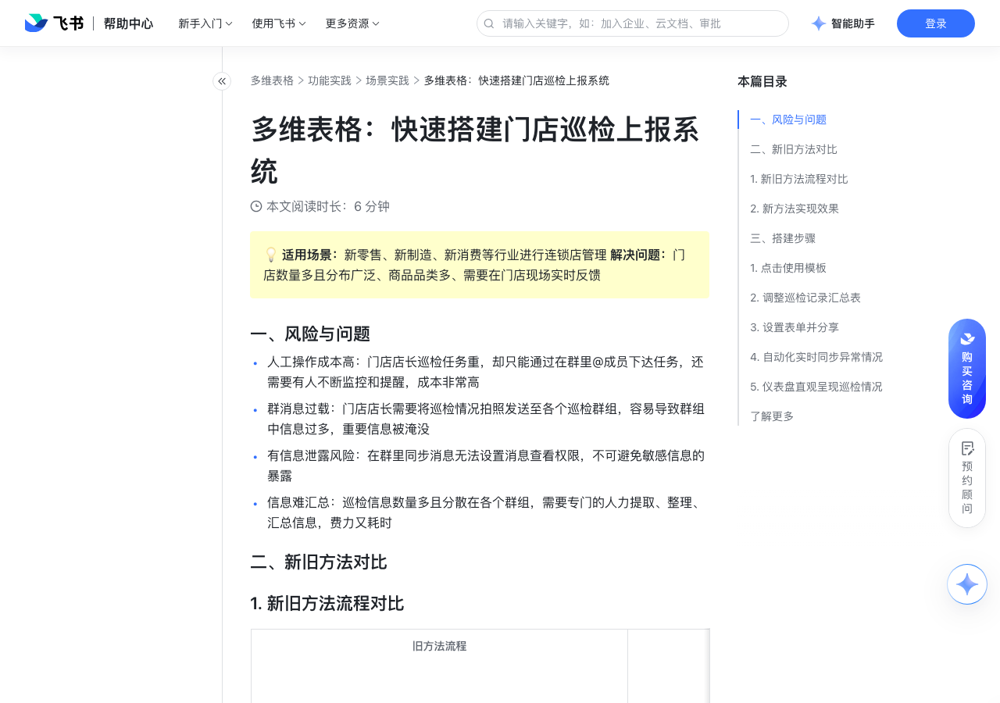

# 多维表格：快速搭建门店巡检上报系统

> 来源：[飞书帮助中心](https://www.feishu.cn/hc/zh-CN/articles/795640995630)  
> 分类：多维表格 / 功能实践 / 场景实践  
> 抓取时间：2026-09-22T01:26:50.091Z

## 界面截图

### 文档内配图

1. 配图：https://p1-hera.feishucdn.com/tos-cn-i-jbbdkfciu3/2553071a55dd422ebfd946a0f3c250c2~tplv-jbbdkfciu3-image:0:0.image
2. 配图：https://p1-hera.feishucdn.com/tos-cn-i-jbbdkfciu3/7aec1d1b4e96472ab7cba8811d2cd49f~tplv-jbbdkfciu3-image:0:0.image
3. 配图：https://p1-hera.feishucdn.com/tos-cn-i-jbbdkfciu3/710adadd2dd1413596561b46c8da7239~tplv-jbbdkfciu3-image:0:0.image
4. 配图：https://p1-hera.feishucdn.com/tos-cn-i-jbbdkfciu3/2e9e7ee0af20436ea5cdd38011d2d768~tplv-jbbdkfciu3-image:0:0.image
5. 配图：https://p1-hera.feishucdn.com/tos-cn-i-jbbdkfciu3/c573e8a80d9b452c93e4e5ee6acb2266~tplv-jbbdkfciu3-image:0:0.image
6. 配图：https://p1-hera.feishucdn.com/tos-cn-i-jbbdkfciu3/571e648d517e42c789334a15c0964746~tplv-jbbdkfciu3-image:0:0.image
7. 配图：https://p1-hera.feishucdn.com/tos-cn-i-jbbdkfciu3/66ee14f1f69d4fa38187789dbd6ebf91~tplv-jbbdkfciu3-image:0:0.image
8. 配图：https://p1-hera.feishucdn.com/tos-cn-i-jbbdkfciu3/02f43c3278b8431c9a650d2697614ec5~tplv-jbbdkfciu3-image:0:0.image
9. 配图：https://p1-hera.feishucdn.com/tos-cn-i-jbbdkfciu3/c9b7d60d441349afba111e36e1ba535a~tplv-jbbdkfciu3-image:0:0.image

## 功能定位

本页对应飞书帮助中心「多维表格 / 功能实践 / 场景实践」下的「多维表格：快速搭建门店巡检上报系统」。以下需求描述依据官方说明文档提炼，用于指导 DuoWei 对标实现。

## 功能目标

一、风险与问题

## 文档结构（官方章节）

- 一、风险与问题​
- 二、新旧方法对比​
- 新旧方法流程对比​
- 新方法实现效果​
- 三、搭建步骤​
- 点击使用模板​
- 调整巡检记录汇总表​
- 设置表单并分享​
- 自动化实时同步异常情况​
- 提醒填写巡检表单​
- 异常情况自动通知负责人​
- 处理结果自动反馈上报人​
- 仪表盘直观呈现巡检情况​
- 了解更多​

## 详细功能说明

一、风险与问题

人工操作成本高：门店店长巡检任务重，却只能通过在群里@成员下达任务，还需要有人不断监控和提醒，成本非常高

群消息过载：门店店长需要将巡检情况拍照发送至各个巡检群组，容易导致群组中信息过多，重要信息被淹没

有信息泄露风险：在群里同步消息无法设置消息查看权限，不可避免敏感信息的暴露

信息难汇总：巡检信息数量多且分散在各个群组，需要专门的人力提取、整理、汇总信息，费力又耗时

二、新旧方法对比

新旧方法流程对比

旧方法流程

新方法流程

250px|700px|reset

新方法实现效果

传统方式

使用飞书多维表格解决方案后

每日任务下达

多个群里 @ 全员

工作台独立入口定时定向下达任务，直接通知到具体人自动化流程定时通知，一键跳转到表单

工作台独立入口定时定向下达任务，直接通知到具体人

自动化流程定时通知，一键跳转到表单

门店动态同步

群中发消息，很快被淹没在对话中

工作台独立入口状态提报，后台一个表查看全部门店动态，群内信息降噪 表单信息自动汇总到数据表中，无需二次整理

工作台独立入口状态提报，后台一个表查看全部门店动态，群内信息降噪

表单信息自动汇总到数据表中，无需二次整理

重点事项响应

每周三由督导组汇总同步

自动化实时将异常情况发送至负责人，问题响应更及时

数据安全管理

群中汇报，全员公开，信息泄露风险高

用多维表格高级权限进行数据隔离，一线人员仅可查看与自己相关的内容

数据自动分析

数据分散，无法实现数据自动分析

数据随需采集，实时分析，多维度展现门店巡检完成情况，帮助总部决策判断

信息存档

原始数据无法进行归档

门店记录按需归档到知识库或共享空间，方便总结

人力成本

占用几十人编制

启用自动化配置，系统自主运行、分发与汇总，解放人力干更有价值的事情

三、搭建步骤

点击使用模板

一键领取模板：简易巡检系统

调整巡检记录汇总表

根据实际情况调整汇总表巡检记录中的字段，增加或删除你需要与不需要的信息

基于汇总表一键生成表单视图

设置表单并分享

基于生成的表单你可以移除无需填写的问题，也可以添加描述帮助填写人理解每一个问题

如需保证上传图片的真实性，可以在附件字段中开启仅可通过移动端拍摄上传

开启表单分享，设置分享范围并获取表单的链接

你可以通过两种方法将表单分享给需要填写表单的人

通过自动化将表单填写链接自动推送给相应的填写人（具体设置请见下一步）

通过管理后台配置将表单添加到工作台的应用中（仅企业管理员可配置）

自动化实时同步异常情况

提醒填写巡检表单

设置触发条件为定时触发，并设置重复的周期

设置执行操作为发送飞书消息，接收人可以选择群组或个人

开启底部按钮，并在跳转链接处输入巡检的表单分享链接

异常情况自动通知负责人

设置触发条件为添加新记录时，且同时满足是否上报栏状态为需要处理

设置执行操作为发送飞书消息，接收人选择处理人，你可以自定义发送的消息标题和内容

如果需要成员进入文档确认具体的问题信息，可以开启底部按钮，并在跳转链接处选择之前记录产生的链接，成员点开后就能立刻跳转到相应的记录，不会迷失在大批的信息中啦

处理结果自动反馈上报人

设置触发条件为记录内容变更时，且同时满足是否上报栏状态为需要处理

仪表盘直观呈现巡检情况

在多维表格中新建一个仪表盘

选择你需要的图表类型并设置数据源和数据范围，其中饼图可以反映各区域巡检问题的占比，统计数字可以统计巡检问题的数量

了解更多

旧方法流程 | 新方法流程

250px|700px|reset | 250px|700px|reset

场景 | 传统方式 | 使用飞书多维表格解决方案后

每日任务下达 | 多个群里 @ 全员 | 工作台独立入口定时定向下达任务，直接通知到具体人自动化流程定时通知，一键跳转到表单

门店动态同步 | 群中发消息，很快被淹没在对话中 | 工作台独立入口状态提报，后台一个表查看全部门店动态，群内信息降噪 表单信息自动汇总到数据表中，无需二次整理

重点事项响应 | 每周三由督导组汇总同步 | 自动化实时将异常情况发送至负责人，问题响应更及时

数据安全管理 | 群中汇报，全员公开，信息泄露风险高 | 用多维表格高级权限进行数据隔离，一线人员仅可查看与自己相关的内容

数据自动分析 | 数据分散，无法实现数据自动分析 | 数据随需采集，实时分析，多维度展现门店巡检完成情况，帮助总部决策判断

信息存档 | 原始数据无法进行归档 | 门店记录按需归档到知识库或共享空间，方便总结

人力成本 | 占用几十人编制 | 启用自动化配置，系统自主运行、分发与汇总，解放人力干更有价值的事情

## 实现要点（对标 DuoWei）

1. **入口与信息架构**：在产品中明确该能力所属模块（功能实践 / 场景实践），并保证用户可从对应导航触达。
2. **核心交互**：按上文「详细功能说明」还原主要操作路径；截图中出现的按钮、字段、面板命名尽量与飞书语义一致或可映射。
3. **数据与权限**：若文档涉及可见范围、可编辑范围、分享或高级权限，实现时需落到角色/成员模型，并保证 API/MCP 与 UI 权限一致。
4. **边界与上限**：若文档提到数量上限、格式限制、导入导出约束，需在实现与错误提示中体现。
5. **验收**：以本页截图场景为用例，完成「能打开 / 能配置 / 能保存 / 能被 Agent 读写（如适用）」四项检查。

## 原始摘录摘要

> 一、风险与问题 人工操作成本高：门店店长巡检任务重，却只能通过在群里@成员下达任务，还需要有人不断监控和提醒，成本非常高 群消息过载：门店店长需要将巡检情况拍照发送至各个巡检群组，容易导致群组中信息过多，重要信息被淹没 有信息泄露风险：在群里同步消息无法设置消息查看权限，不可避免敏感信息的暴露 信息难汇总：巡检信息数量多且分散在各个群组，需要专门的人力提取、整理、汇总信息，费力又耗时 二、新旧方法对比 新旧方法流程对比 旧方法流程 新方法流程 250px|700px|reset 新方法实现效果 传统方式 使用飞书多维表格解决方案后 每日任务下达 多个群里 @ 全员 工作台独立入口定时定向下达任务，直接通知到具体人自动化流程定时通知，一键跳转到表单 工作台独立入口定时定向下达任务，直接通知到具体人 自动化流程定时通知，一键跳转到表单 门店动态同步 群中发消息，很快被淹没在对话中 工作台独立入口状态提报，后台一个表查看全部门店动态，群内信息降噪 表单信息自动汇总到数据表中，无需二次整理 工作台独立入口状态提报，后台一个表查看全部门店动态，群内信息降噪 表单信息自动汇总到数据表中，无需二次整理 重点事项响应 每周三由督导组汇总同步 自动化实时将异常情况发送至负责人，问题响应更及时 数据安全管理 群中汇报，全员公开，信息泄露风险高 用多维表格高级权限进行数据隔离，一线人员仅可查看与自己相关的内容 数据自动分析 数据分散，无法实现数据自动分析 数据随需采集，实时分析，多维度展现门店巡检完成情况，帮助总部决策判断 信息存档 原始数据无法进行归档 门店记录按需归档到知识库或共享空间，方便总结 人力成本 占用几十人编制 启用自动化配置，系统自主运行、分发与汇总，解放人力干更有价值的事情 三、搭建步骤 点击使用模板 一键领取模板：简易巡检系统 调整巡检记录汇总表 根据实际情况调整汇总表巡检记…

## 元数据

- article_id: `7083375616942440450`
- category_id: `7225155238691471361`
- path: `/hc/zh-CN/articles/795640995630`
- extracted_text_length: 1911
