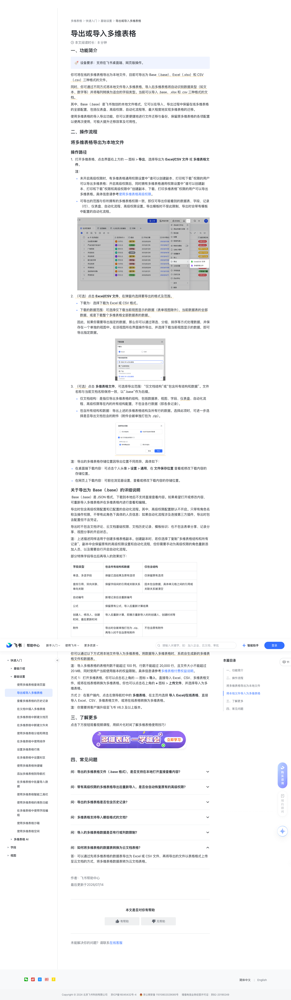

# 导出或导入多维表格

> 来源：[飞书帮助中心](https://www.feishu.cn/hc/zh-CN/articles/360049067854)  
> 分类：多维表格 / 快速入门 / 基础设置  
> 抓取时间：2026-09-22T00:46:19.584Z

## 界面截图

### 文档内配图

1. 配图：https://p1-hera.feishucdn.com/tos-cn-i-jbbdkfciu3/b602943c6b5f489c8cf4ca836a8037cb~tplv-jbbdkfciu3-image:0:0.image
2. 配图：https://p1-hera.feishucdn.com/tos-cn-i-jbbdkfciu3/cf4b93393a634d5989da2bdd63f417d0~tplv-jbbdkfciu3-image:0:0.image
3. 配图：https://p1-hera.feishucdn.com/tos-cn-i-jbbdkfciu3/b92be2873e7b414d979f4ab580dc9ad2~tplv-jbbdkfciu3-image:0:0.image
4. 多维表格视频课按钮.png：https://p1-hera.feishucdn.com/tos-cn-i-jbbdkfciu3/d86f638d8de644a3bdef70f7a38f887a~tplv-jbbdkfciu3-image:0:0.image

## 功能定位

本页对应飞书帮助中心「多维表格 / 快速入门 / 基础设置」下的「导出或导入多维表格」。以下需求描述依据官方说明文档提炼，用于指导 DuoWei 对标实现。

## 功能目标

一、功能简介

## 文档结构（官方章节）

- 一、功能简介​
- 二、操作流程​
- 将多维表格导出为本地文件​
- 操作路径​
- 关于导出为  Base（.base）的详细说明​
- 将本地文件导入为多维表格​
- 三、了解更多​
- 四、常见问题​

## 详细功能说明

一、功能简介

二、操作流程

将多维表格导出为本地文件

操作路径

打开多维表格，点击界面右上方的 ··· 图标 > 导出，选择导出为 Excel/CSV 文件 或 多维表格文件。

未开启高级权限时，有多维表格通用权限设置中“谁可以创建副本、打印和下载”权限的用户可以导出多维表格；开启高级权限后，同时拥有多维表格通用权限设置中“谁可以创建副本、打印和下载”权限和高级权限中“创建副本、下载、打印多维表格”权限的用户可以导出多维表格。具体信息请参考使用多维表格高级权限。

可导出的范围与你所拥有的多维表格权限一致，即仅可导出你能看到的数据表、字段、记录（行）、仪表盘、自动化流程、高级权限设置。导出模板时不受此限制，导出时会带有模板中配置的自动化流程。

（可选）点击 Excel/CSV 文件，在弹窗内选择要导出的格式及范围。

下载为：选择下载为 Excel 或 CSV 格式。

下载的数据范围：可选择仅下载当前视图显示的数据（表单视图除外），当前数据表的全部数据，或是下载整个多维表格全部数据表的数据。

（可选）点击 多维表格文件，可选择导出范围：“仅文档结构”或“包含所有结构和数据”。文件名称与当前文档名称保持一致，以“.base”作为后缀。

仅文档结构：是指仅导出多维表格的结构，包括数据表、视图、字段、仪表盘、自动化流程、高级权限等在内的所有结构配置，不包含各行数据（即各条记录）。

包含所有结构和数据：导出上述的多维表格结构及所有行的数据。选择此项时，可进一步选择是否导出文档包含的附件（附件会被单独打包为 .zip）。

注：导出的多维表格存储位置因导出位置不同而异，具体如下：

在桌面端下载内容：可点击个人头像 > 设置 > 通用，在 文件保存位置 查看或修改下载内容的存储位置。

在网页上下载内容：可前往浏览器设置，查看或修改下载内容的存储位置。

关于导出为 Base（.base）的详细说明

字段类型

包含所有结构和数据

仅包含结构

单选、多选字段

保留已选结果及原有选项

仅保留原有选项

查找引用、双向关联、单向关联

保留字段间的引用或关联关系

因未包含数据，具体单元格之间的引用或关联关系被清空

自动编号

新增记录后会重新编号

保留原有公式，导入后重新计算结果

创建人、修改人、创建时间、最后更新时间

导入后重新计算，即展示重新导入时的创建人、创建时间等

导出时会被单独打包为 .zip，再导入时不包含原有附件

不包含原有附件

将本地文件导入为多维表格

你可以通过以下方式将本地文件导入为多维表格。将数据导入多维表格时，系统会生成新的多维表格文件和数据表。

三、了解更多

四、常见问题

一、功能简介🔖设备要求：支持在飞书桌面端、网页版操作。你可将在线的多维表格导出为本地文件，目前可导出为 Base（.base）、Excel（.xlsx）和 CSV（.csv）三种格式的文件。同时，你可通过不同方式将本地文件导入多维表格，导入后多维表格将自动识别数据类型（如文本、数字等）并将每列转换为适合的字段类型。当前可以导入 .base、.xlsx 和 .csv 三种格式的文档。其中，Base（.base）是飞书独创的本地文件格式，它可以在导入、导出过程中保留在线多维表格的全部配置，包括仪表盘、高级权限、自动化流程等，最大程度地实现多维表格的迁移。使用多维表格的导入导出功能，你可以更便捷地进行文件迁移与备份，保留原多维表格的各项配置以便再次使用，可极大提升迁移效率及可用性。二、操作流程将多维表格导出为本地文件操作路径打开多维表格，点击界面右上方的 ··· 图标 > 导出，选择导出为 Excel/CSV 文件 或 多维表格文件。注：未开启高级权限时，有多维表格通用权限设置中“谁可以创建副本、打印和下载”权限的用户可以导出多维表格；开启高级权限后，同时拥有多维表格通用权限设置中“谁可以创建副本、打印和下载”权限和高级权限中“创建副本、下载、打印多维表格”权限的用户可以导出多维表格。具体信息请参考使用多维表格高级权限。可导出的范围与你所拥有的多维表格权限一致，即仅可导出你能看到的数据表、字段、记录（行）、仪表盘、自动化流程、高级权限设置。导出模板时不受此限制，导出时会带有模板中配置的自动化流程。250px|700px|reset（可选）点击 Excel/CSV 文件，在弹窗内选择要导出的格式及范围。下载为：选择下载为 Excel 或 CSV 格式。下载的数据范围：可选择仅下载当前视图显示的数据（表单视图除外），当前数据表的全部数据，或是下载整个多维表格全部数据表的数据。因此，如果你需要导出指定的数据，那么你可以通过筛选、分组、排序等方式处理数据，并保存在一个单独的视图中。在该视图所在界面操作导出，并选择下载当前视图显示的数据，即可导出指定数据。250px|700px|reset（可选）点击 多维表格文件，可选择导出范围：“仅文档结构”或“包含所有结构和数据”。文件名称与当前文档名称保持一致，以“.base”作为后缀。仅文档结构：是指仅导出多维表格的结构，包括数据表、视图、字段、仪表盘、自动化流程、高级权限等在内的所有结构配置，不包含各行数据（即各条记录）。包含所有结构和数据：导出上述的多维表格结构及所有行的数据。选择此项时，可进一步选择是否导出文档包含的附件（附件会被单独打包为 .zip）。250px|700px|reset注：导出的多维表格存储位置因导出位置不同而异，具体如下：在桌面端下载内容：可点击个人头像 > 设置 > 通用，在 文件保存位置 查看或修改下载内容的存储位置。在网页上下载内容：可前往浏览器设置，查看或修改下载内容的存储位置。关于导出为 Base（.base）的详细说明 Base（.base）是 JSON 格式，下载到本地后不支持直接查看内容。如果希望打开或修改内容，可重新导入多维表格并在多维表格内进行查看和编辑。导出时包含高级权限配置和已配置的自动化流程。其中，高级权限配置默认不开启。只带有角色名称及操作权限，不带有此角色下具体的人员信息；如果自动化流程涉及连接第三方插件，导出时包含配置但不含凭证。导出时不包含文档评论、云文档基础权限、文档历史记录、模板标识；也不包含表单分享、记录分享、视图分享的开启状态。注：上述描述同样适用于创建多维表格副本。创建副本时，若你选择了复制“多维表格结构和所有记录”，副本中会保留原有的高级权限设置和自动化流程，但你需要手动为高级权限的角色重新添加人员，以及需要自行开启自动化流程。部分特殊字段导出后再导入的效果如下：字段类型包含所有结构和数据仅包含结构单选、多选字段保留已选结果及原有选项仅保留原有选项查找引用、双向关联、单向关联保留字段间的引用或关联关系因未包含数据，具体单元格之间的引用或关联关系被清空自动编号新增记录后会重新编号公式保留原有公式，导入后重新计算结果创建人、修改人、创建时间、最后更新时间导入后重新计算，即展示重新导入时的创建人、创建时间等附件导出时会被单独打包为 .zip，再导入时不包含原有附件不包含原有附件将本地文件导入为多维表格你可以通过以下方式将本地文件导入为多维表格。将数据导入多维表格时，系统会生成新的多维表格文件和数据表。注：导入多维表格的表格列数不能超过 100 列，行数不能超过 20,000 行，且文件大小不能超过 20 MB，同时受用户当前使用版本的权益限制。具体信息请参考多维表格付费权益说明。方式 1：打开多维表格，你可以点击右上角的 ··· 图标 > 导入，直接导入 Excel、CSV、多维表格文件，或将在线表格转换为多维表格。你也可以点击右上角的 + 图标 > 上传文件，并选择导入为多维表格。方式 2：在客户端内，点击左侧导航栏中的 多维表格，在主页内选择 导入 Excel/在线表格，直接导入 Excel、CSV、多维表格文件，或将在线表格转换为多维表格。注：你需要将客户端升级至飞书 V6.3 及以上版本。三、了解更多点击下方按钮观看视频课程，用碎片化时间了解多维表格使用技巧！250px|700px|reset四、常见问题

字段类型 | 包含所有结构和数据 | 仅包含结构

单选、多选字段 | 保留已选结果及原有选项 | 仅保留原有选项

查找引用、双向关联、单向关联 | 保留字段间的引用或关联关系 | 因未包含数据，具体单元格之间的引用或关联关系被清空

自动编号 | 新增记录后会重新编号 |

公式 | 保留原有公式，导入后重新计算结果 |

创建人、修改人、创建时间、最后更新时间 | 导入后重新计算，即展示重新导入时的创建人、创建时间等 |

附件 | 导出时会被单独打包为 .zip，再导入时不包含原有附件 | 不包含原有附件

## 实现要点（对标 DuoWei）

1. **入口与信息架构**：在产品中明确该能力所属模块（快速入门 / 基础设置），并保证用户可从对应导航触达。
2. **核心交互**：按上文「详细功能说明」还原主要操作路径；截图中出现的按钮、字段、面板命名尽量与飞书语义一致或可映射。
3. **数据与权限**：若文档涉及可见范围、可编辑范围、分享或高级权限，实现时需落到角色/成员模型，并保证 API/MCP 与 UI 权限一致。
4. **边界与上限**：若文档提到数量上限、格式限制、导入导出约束，需在实现与错误提示中体现。
5. **验收**：以本页截图场景为用例，完成「能打开 / 能配置 / 能保存 / 能被 Agent 读写（如适用）」四项检查。

## 原始摘录摘要

> 一、功能简介 二、操作流程 将多维表格导出为本地文件 操作路径 打开多维表格，点击界面右上方的 ··· 图标 > 导出，选择导出为 Excel/CSV 文件 或 多维表格文件。 未开启高级权限时，有多维表格通用权限设置中“谁可以创建副本、打印和下载”权限的用户可以导出多维表格；开启高级权限后，同时拥有多维表格通用权限设置中“谁可以创建副本、打印和下载”权限和高级权限中“创建副本、下载、打印多维表格”权限的用户可以导出多维表格。具体信息请参考使用多维表格高级权限。 可导出的范围与你所拥有的多维表格权限一致，即仅可导出你能看到的数据表、字段、记录（行）、仪表盘、自动化流程、高级权限设置。导出模板时不受此限制，导出时会带有模板中配置的自动化流程。 （可选）点击 Excel/CSV 文件，在弹窗内选择要导出的格式及范围。 下载为：选择下载为 Excel 或 CSV 格式。 下载的数据范围：可选择仅下载当前视图显示的数据（表单视图除外），当前数据表的全部数据，或是下载整个多维表格全部数据表的数据。 （可选）点击 多维表格文件，可选择导出范围：“仅文档结构”或“包含所有结构和数据”。文件名称与当前文档名称保持一致，以“.base”作为后缀。 仅文档结构：是指仅导出多维表格的结构，包括数据表、视图、字段、仪表盘、自动化流程、高级权限等在内的所有结构配置，不包含各行数据（即各条记录）。 包含所有结构和数据：导出上述的多维表格结构及所有行的数据。选择此项时，可进一步选择是否导出文档包含的附件（附件会被单独打包为 .zip）。 注：导出的多维表格存储位置因导出位置不同而异，具体如下： 在桌面端下载内容：可点击个人头像 > 设置 > 通用，在 文件保存位置 查看或修改下载内容的存储位置。 在网页上下载内容：可前往浏览器设置，查看或修改下载内容的存储位置。 关于导出为 Base（.base）的详细…

## 元数据

- article_id: `6933484150255026204`
- category_id: `7225072576895254530`
- path: `/hc/zh-CN/articles/360049067854`
- extracted_text_length: 2246
