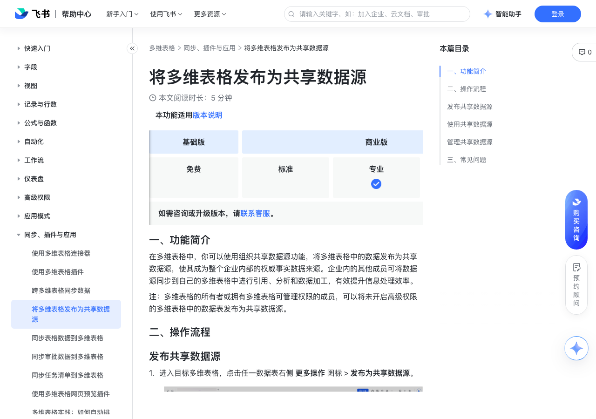

# 将多维表格发布为共享数据源

> 来源：[飞书帮助中心](https://www.feishu.cn/hc/zh-CN/articles/959224273745)  
> 分类：多维表格 / 同步、插件与应用  
> 抓取时间：2026-09-22T01:26:34.838Z

## 界面截图

### 文档内配图

1. 配图：https://p1-hera.feishucdn.com/tos-cn-i-jbbdkfciu3/c58ce3fedb1b4c669d384ae204556240~tplv-jbbdkfciu3-image:0:0.image
2. 配图：https://p1-hera.feishucdn.com/tos-cn-i-jbbdkfciu3/2c8efc420eca4cb499a5f12666dd9327~tplv-jbbdkfciu3-image:0:0.image
3. image.png：https://p1-hera.feishucdn.com/tos-cn-i-jbbdkfciu3/39eed0222d924304ae671c39f6b3b08f.png~tplv-jbbdkfciu3-png:0:0.png
4. 配图：https://p1-hera.feishucdn.com/tos-cn-i-jbbdkfciu3/71c5cf74f58243eeb2411944af9f2400~tplv-jbbdkfciu3-image:0:0.image
5. 配图：https://p1-hera.feishucdn.com/tos-cn-i-jbbdkfciu3/55fe1e7d7e9d449f993de3b1d10ced4d~tplv-jbbdkfciu3-image:0:0.image
6. 配图：https://p1-hera.feishucdn.com/tos-cn-i-jbbdkfciu3/8345b51ee32e45f991ca32a5ed3dd6b5~tplv-jbbdkfciu3-image:0:0.image

## 功能定位

本页对应飞书帮助中心「多维表格 / 同步、插件与应用」下的「将多维表格发布为共享数据源」。以下需求描述依据官方说明文档提炼，用于指导 DuoWei 对标实现。

## 功能目标

一、功能简介

## 文档结构（官方章节）

- 一、功能简介​
- 二、操作流程​
- 发布共享数据源​
- 使用共享数据源​
- 管理共享数据源​
- 三、常见问题​

## 详细功能说明

一、功能简介

二、操作流程

发布共享数据源

进入目标多维表格，点击任一数据表右侧 更多操作 图标 > 发布为共享数据源。

配置以下数据源信息后，点击 发布 即可。

视图：仅支持选择表格视图。

标题：自定义数据源的标题。

描述：添加数据源的描述。

发布范围：选择 组织内全员 或 指定用户、群组或部门。

发布共享数据源前，确保共享范围内的成员可以阅读、复制共享的数据表。

如果企业管理员为共享数据源启用审批流程，你发布的共享数据源需完成审批后方可生效。你可以点击数据表右侧的 更多操作 图标 > 查看数据源发布审批，随时查看审批进度。

使用共享数据源

进入任一多维表格，点击左下角 + 新建 > 导入/同步数据 > 连接器中心 > 管理数据源 > 组织共享数据源。

将鼠标悬停在数据源上，你可以：

点击 预览，查看数据源的数据结构和数据详情。

点击 使用，二次确认后即可将数据源内的数据同步到当前多维表格中。同步数据后，你可以按需调整同步配置，具体信息请参考跨多维表格同步数据。

管理共享数据源

进入任一多维表格，点击左下角 + 新建 > 导入/同步数据 > 连接器中心 > 管理数据源 > 我发布的数据源。

将鼠标悬停在数据源上，你可以进行如下操作：

点击 预览，预览数据源详情。

点击 查看审批，跳转到飞书 审批，查看审批进度。

进入任一多维表格，点击左下角 + 新建 > 导入/同步数据 > 连接器中心 > 管理数据源 > 我管理的数据源。

注：如果你没有当前数据表的阅读权限且不在该数据源的共享范围内，将无法预览数据源详情。

点击 取消发布 图标，该数据源将停止分享。

开启或关闭 发布数据源需要审批：

首次开启审批流程时，系统默认将开启审批的管理员预设为审批流程管理员与审批人员，如果需要变更，可以点击弹窗中的 审批管理 进行修改。审批流程开启后，企业内成员发布的共享数据源需完成审批后方可生效。

注：企业超级管理员或有云文档权限的管理员也可以直接进入 审批管理后台 > 共享数据源，点击 编辑 按钮后按需求调整审批流程。有关审批流程设计的具体信息，请参考管理员设计审批流程。

250px|700px|reset

如果关闭审批流程，企业内成员可直接发布共享数据源，无需任何审批。

三、常见问题

问：谁可以将共享数据源的数据同步到自己的多维表格内？

答：有该多维表格数据源复制权限的成员可以将数据同步到自己的多维表格内。

问：多维表格数据源发生变更时会自动同步吗？

答：会，仅支持每小时自动同步，如需查看实时更新，可手动同步。

问：多维表格共享数据源是否仅支持同组织内发布？

答：是，多维表格共享数据源仅支持在组织内共享或发布。

## 实现要点（对标 DuoWei）

1. **入口与信息架构**：在产品中明确该能力所属模块（同步、插件与应用），并保证用户可从对应导航触达。
2. **核心交互**：按上文「详细功能说明」还原主要操作路径；截图中出现的按钮、字段、面板命名尽量与飞书语义一致或可映射。
3. **数据与权限**：若文档涉及可见范围、可编辑范围、分享或高级权限，实现时需落到角色/成员模型，并保证 API/MCP 与 UI 权限一致。
4. **边界与上限**：若文档提到数量上限、格式限制、导入导出约束，需在实现与错误提示中体现。
5. **验收**：以本页截图场景为用例，完成「能打开 / 能配置 / 能保存 / 能被 Agent 读写（如适用）」四项检查。

## 原始摘录摘要

> 一、功能简介 二、操作流程 发布共享数据源 进入目标多维表格，点击任一数据表右侧 更多操作 图标 > 发布为共享数据源。 配置以下数据源信息后，点击 发布 即可。 视图：仅支持选择表格视图。 标题：自定义数据源的标题。 描述：添加数据源的描述。 发布范围：选择 组织内全员 或 指定用户、群组或部门。 发布共享数据源前，确保共享范围内的成员可以阅读、复制共享的数据表。 如果企业管理员为共享数据源启用审批流程，你发布的共享数据源需完成审批后方可生效。你可以点击数据表右侧的 更多操作 图标 > 查看数据源发布审批，随时查看审批进度。 使用共享数据源 进入任一多维表格，点击左下角 + 新建 > 导入/同步数据 > 连接器中心 > 管理数据源 > 组织共享数据源。 将鼠标悬停在数据源上，你可以： 点击 预览，查看数据源的数据结构和数据详情。 点击 使用，二次确认后即可将数据源内的数据同步到当前多维表格中。同步数据后，你可以按需调整同步配置，具体信息请参考跨多维表格同步数据。 管理共享数据源 进入任一多维表格，点击左下角 + 新建 > 导入/同步数据 > 连接器中心 > 管理数据源 > 我发布的数据源。 将鼠标悬停在数据源上，你可以进行如下操作： 点击 预览，预览数据源详情。 点击 查看审批，跳转到飞书 审批，查看审批进度。 进入任一多维表格，点击左下角 + 新建 > 导入/同步数据 > 连接器中心 > 管理数据源 > 我管理的数据源。 注：如果你没有当前数据表的阅读权限且不在该数据源的共享范围内，将无法预览数据源详情。 点击 取消发布 图标，该数据源将停止分享。 开启或关闭 发布数据源需要审批： 首次开启审批流程时，系统默认将开启审批的管理员预设为审批流程管理员与审批人员，如果需要变更，可以点击弹窗中的 审批管理 进行修改。审批流程开启后，企业内成员发布的共享数据源需完成审批后方可生…

## 元数据

- article_id: `7252227590302679068`
- category_id: `7225134052943200257`
- path: `/hc/zh-CN/articles/959224273745`
- extracted_text_length: 1117
