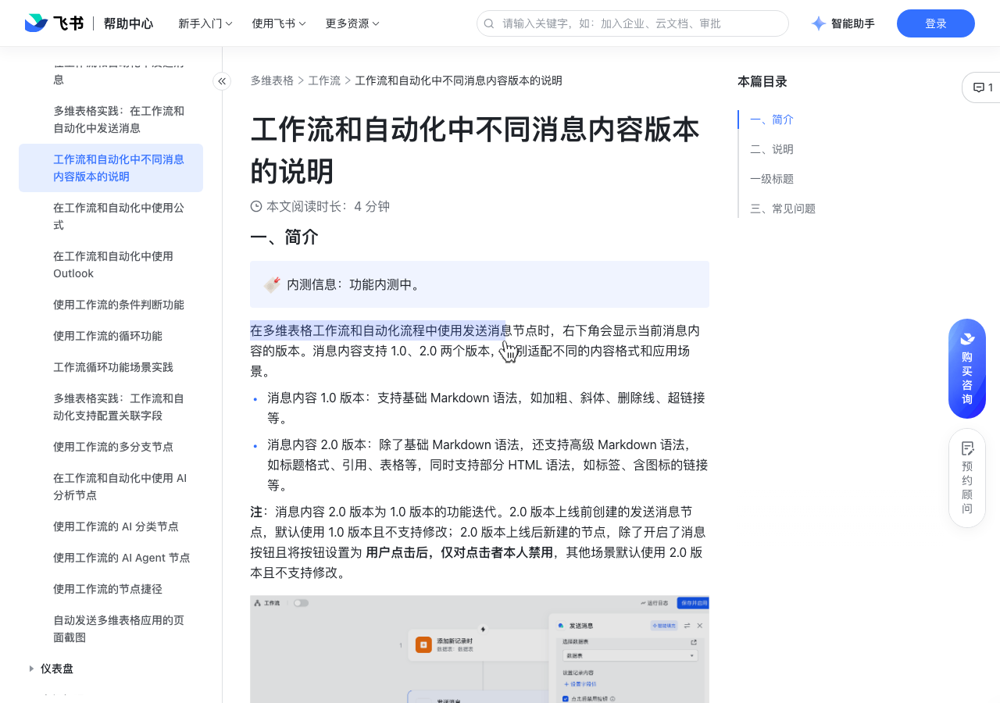

# 工作流和自动化中不同消息内容版本的说明

> 来源：[飞书帮助中心](https://www.feishu.cn/hc/zh-CN/articles/970893436463)  
> 分类：多维表格 / 工作流  
> 抓取时间：2026-09-22T01:25:10.253Z

## 界面截图

### 文档内配图

1. 配图：https://p1-hera.feishucdn.com/tos-cn-i-jbbdkfciu3/90d29131691945a5813dcf4efb274a23~tplv-jbbdkfciu3-image:0:0.image

## 功能定位

本页对应飞书帮助中心「多维表格 / 工作流」下的「工作流和自动化中不同消息内容版本的说明」。以下需求描述依据官方说明文档提炼，用于指导 DuoWei 对标实现。

## 功能目标

一、简介

## 文档结构（官方章节）

- 一、简介 ​
- 二、说明​
- 一级标题​
- 三、常见问题​

## 详细功能说明

一、简介

消息内容 1.0 版本：支持基础 Markdown 语法，如加粗、斜体、删除线、超链接等。

消息内容 2.0 版本：除了基础 Markdown 语法，还支持高级 Markdown 语法，如标题格式、引用、表格等，同时支持部分 HTML 语法，如标签、含图标的链接等。

二、说明

Markdown 语法

支持的消息内容版本

**粗体**

1.0 和 2.0

*文字*

~~文字~~

@所有人

<at id=all></at>

文本颜色

 绿色文本   红色文本   灰色文本 

绿色红色灰色

# 一级标题

一级标题

> 这是一段引用文字\n引用内换行

这是一段引用文字引用内换行

|表头|表头|| -------- | -------- ||第一行第一列|第一行第二列||第二行第一列|第二行第二列|

https://www.example.com

文字链接

[文字](https://www.example.com)

三、常见问题

格式 | Markdown 语法 | 效果 | 支持的消息内容版本

加粗 | **粗体** | 粗体 | 1.0 和 2.0

斜体 | *文字* | 斜体 | 1.0 和 2.0

删除线 | ~~文字~~ | 文字 | 1.0 和 2.0

@所有人 | <at id=all></at> | @所有人 | 1.0 和 2.0

分割线 | 
 | | 1.0 和 2.0

图片 |  | / | 1.0 和 2.0

文本颜色 |  绿色文本   红色文本   灰色文本  | 绿色红色灰色 | 1.0 和 2.0

标题 | # 一级标题 | 一级标题 | 2.0

引用 | > 这是一段引用文字\n引用内换行 | 这是一段引用文字引用内换行 | 2.0

表格 | |表头|表头|| -------- | -------- ||第一行第一列|第一行第二列||第二行第一列|第二行第二列| | / | 2.0

超链接 |  | https://www.example.com | 1.0 和 2.0

文字链接 | [文字](https://www.example.com) | 文字 | 1.0 和 2.0

## 实现要点（对标 DuoWei）

1. **入口与信息架构**：在产品中明确该能力所属模块（工作流），并保证用户可从对应导航触达。
2. **核心交互**：按上文「详细功能说明」还原主要操作路径；截图中出现的按钮、字段、面板命名尽量与飞书语义一致或可映射。
3. **数据与权限**：若文档涉及可见范围、可编辑范围、分享或高级权限，实现时需落到角色/成员模型，并保证 API/MCP 与 UI 权限一致。
4. **边界与上限**：若文档提到数量上限、格式限制、导入导出约束，需在实现与错误提示中体现。
5. **验收**：以本页截图场景为用例，完成「能打开 / 能配置 / 能保存 / 能被 Agent 读写（如适用）」四项检查。

## 原始摘录摘要

> 一、简介 消息内容 1.0 版本：支持基础 Markdown 语法，如加粗、斜体、删除线、超链接等。 消息内容 2.0 版本：除了基础 Markdown 语法，还支持高级 Markdown 语法，如标题格式、引用、表格等，同时支持部分 HTML 语法，如标签、含图标的链接等。 二、说明 Markdown 语法 支持的消息内容版本 **粗体** 1.0 和 2.0 *文字* ~~文字~~ @所有人 <at id=all></at> 
  文本颜色  绿色文本   红色文本   灰色文本  绿色红色灰色 # 一级标题 一级标题 > 这是一段引用文字\n引用内换行 这是一段引用文字引用内换行 |表头|表头|| -------- | -------- ||第一行第一列|第一行第二列||第二行第一列|第二行第二列|  https://www.example.com 文字链接 [文字](https://www.example.com) 三、常见问题 格式 | Markdown 语法 | 效果 | 支持的消息内容版本 加粗 | **粗体** | 粗体 | 1.0 和 2.0 斜体 | *文字* | 斜体 | 1.0 和 2.0 删除线 | ~~文字~~ | 文字 | 1.0 和 2.0 @所有人 | <at id=all></at> | @所有人 | 1.0 和 2.0 分割线 | 
 | | 1.0 和 2.0 图片 |  | / | 1.0 和 2.0 文本颜色 |  绿色文本 …

## 元数据

- article_id: `7586585870782729438`
- category_id: `7415964452380049412`
- path: `/hc/zh-CN/articles/970893436463`
- extracted_text_length: 1153
