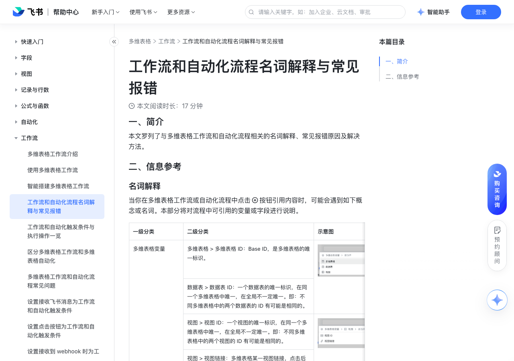

# 工作流和自动化流程名词解释与常见报错

> 来源：[飞书帮助中心](https://www.feishu.cn/hc/zh-CN/articles/687446300693)  
> 分类：多维表格 / 工作流  
> 抓取时间：2026-09-22T01:24:06.694Z

## 界面截图

### 文档内配图

1. 配图：https://p1-hera.feishucdn.com/tos-cn-i-jbbdkfciu3/ef074ab59b8043e3bf8028843b756520~tplv-jbbdkfciu3-image:0:0.image
2. 配图：https://p1-hera.feishucdn.com/tos-cn-i-jbbdkfciu3/4c826009041646d7935f197f6c9cf57c~tplv-jbbdkfciu3-image:0:0.image
3. 配图：https://p1-hera.feishucdn.com/tos-cn-i-jbbdkfciu3/461d1383b814416798ec0f35f4743552~tplv-jbbdkfciu3-image:0:0.image
4. 配图：https://p1-hera.feishucdn.com/tos-cn-i-jbbdkfciu3/198e370776db4b389620293c6b448ece~tplv-jbbdkfciu3-image:0:0.image
5. 配图：https://p1-hera.feishucdn.com/tos-cn-i-jbbdkfciu3/5954ea08e2f54b3eab3b20602f0f109d~tplv-jbbdkfciu3-image:0:0.image
6. 配图：https://p1-hera.feishucdn.com/tos-cn-i-jbbdkfciu3/9d15f7ee64b04f559b2192205894a565~tplv-jbbdkfciu3-image:0:0.image
7. 配图：https://p1-hera.feishucdn.com/tos-cn-i-jbbdkfciu3/aa6495e0b1d24c6c97e92f6e83256d7e~tplv-jbbdkfciu3-image:0:0.image
8. 配图：https://p1-hera.feishucdn.com/tos-cn-i-jbbdkfciu3/eb54be29b90f45e99e30e9786e7910ca~tplv-jbbdkfciu3-image:0:0.image
9. 配图：https://p1-hera.feishucdn.com/tos-cn-i-jbbdkfciu3/4ca62f1c576e4d2d9b2d2e7e643f2474~tplv-jbbdkfciu3-image:0:0.image
10. 配图：https://p1-hera.feishucdn.com/tos-cn-i-jbbdkfciu3/d7a8314c39f14a8397f649327e3cfa01~tplv-jbbdkfciu3-image:0:0.image
11. 配图：https://p1-hera.feishucdn.com/tos-cn-i-jbbdkfciu3/34aae0db176a4caf946b32c6d6f56fb3~tplv-jbbdkfciu3-image:0:0.image

## 功能定位

本页对应飞书帮助中心「多维表格 / 工作流」下的「工作流和自动化流程名词解释与常见报错」。以下需求描述依据官方说明文档提炼，用于指导 DuoWei 对标实现。

## 功能目标

一、简介

## 文档结构（官方章节）

- 一、简介 ​
- 二、信息参考 ​
- 名词解释​
- 常见报错​
- 未知错误解决方法​

## 详细功能说明

一、简介

二、信息参考

名词解释

一级分类

二级分类

多维表格变量

多维表格 > 多维表格 ID：Base ID，是多维表格的唯一标识。

250px|700px|reset

数据表 > 数据表 ID：一个数据表的唯一标识，在同一个多维表格中唯一，在全局不一定唯一。即：不同多维表格中的两个数据表的 ID 有可能是相同的。

视图 > 视图 ID：一个视图的唯一标识，在同一个多维表格中唯一，在全局不一定唯一。即：不同多维表格中的两个视图的 ID 有可能是相同的。

视图 > 视图链接：多维表格某一视图链接，点击后可直接跳转到对应视图。

记录变量（通常出现在前置步骤中有具体的记录，且在引用时选择了“上一步新增/修改的记录”时）

触发时间：流程被触发的时间。

250px|700px|reset250px|700px|reset

记录 ID：一行记录的唯一标识，在一个数据表中唯一，在全局不一定唯一。即：不同数据表中的两行记录的 ID 有可能是相同的。

记录链接：多维表格的记录链接，可直接跳转到特定的某条记录。你还可以进一步选择视图或查询页，点击后会跳转至对应视图中的该条记录。

记录创建人：创建或提交这条记录的用户。

记录创建时间：创建这条记录的时间。

记录修改人：修改这条记录的用户。

记录最后更新时间：最后修改这条记录的时间。

通用的字段变量（通常出现在前置步骤中有具体的记录，且在引用时选择了“上一步新增/修改的记录”时）

字段 ID：一列字段的唯一标识，在一个数据表中唯一，在全局不一定唯一。即：不同数据表中的两个字段的 ID 有可能是相同的。

鼠标悬停在具体的字段后，点击 继续 即可看到。250px|700px|reset250px|700px|reset

字段名：字段的名称。

人员、创建人、修改人字段

人员名：人员的姓名。

人员 Union ID：由同一应用开发商提供的、用户在多个应用间的统一身份。

日期、创建时间、最后更新时间字段

不同日期的时间戳。

附件字段

附件的文件名。

附件的文件类型。

附件的大小。

附件 ID：标识附件的唯一 ID。

超链接字段

超链接的文本。

超链接的地址。

常见报错

报错文案

解决方法

数据表已被删除，请重新配置流程。

数据表被删除。

重新配置流程，选择其他数据表。

指定要修改的记录不存在。

仅出现在“修改记录”时，要修改的目标记录不存在。

重新配置流程。

字段已被删除，请重新配置流程。

字段被删除。

重新配置流程，选择其他字段。

所在数据表已达记录数上限，无法再新增记录。

数据表已达到行数上限。

重新配置流程，选择其他数据表等。

启用该流程的用户不在接收消息的群里。

用户不在目标群组内，导致消息发送失败。

加入消息接收群或更换消息接收群。

当前流程触发过程中被关闭，运行终止。

流程配置者关闭了流程，导致运行终止。

按需重新启动流程。

接收消息的用户数量超出上限，请尝试使用多维表格助手发送消息。

以用户个人身份发送消息时，可选的单聊个数不得超过 20 个，可选的群组不得超过 5 个。

减少接收方中个人用户或群组数量，或改用“多维表格助手”发送消息

发送消息数超出系统限制。

以多维表格应用身份发送消息时，接收方数量超过上限。接收方中的个人用户数不可超过 5000，群组数不可超过 5 个。

减少接收方中个人用户或群组数量，或改用“多维表格助手”发送消息。

HTTP 请求超时。

响应时长上限为 60 秒。若 60 秒后还未收到响应，即会超时，不再等待请求结果返回。

若不需要多维表格获取请求结果，则无需处理此报错，可向被调用方确认最终请求结果。若需要多维表格获取请求结果，则需调整被调用方执行逻辑，在超时前返回执行结果。

若不需要多维表格获取请求结果，则无需处理此报错，可向被调用方确认最终请求结果。

若需要多维表格获取请求结果，则需调整被调用方执行逻辑，在超时前返回执行结果。

HTTP 请求出参返回格式不正确，请检查是否符合请求响应格式。

可能是因为“发送 HTTP 请求”返回的内容自动带上了 content-type 等请求头（Header）的默认值，导致无法识别。

检查并删除请求头默认值后重试。

HTTP 请求 URL 被封禁，请检查公网是否可访问。

HTTP 请求不支持调用内网的 URL。

更换请求 URL。

该附件字段仅支持移动端实时填写，请重新配置。

流程中选择的附件字段设置了“仅可通过移动端拍摄上传”，无法通过流程更改。

重新配置，检查附件字段的设置（取消勾选“仅可通过移动端拍摄上传”），或选取其他字段。

该地理位置字段仅支持移动端实时填写，请重新配置。

流程中选择的地理位置字段设置了“仅允许移动端实时定位”，无法通过流程更改。

重新配置，检查地理位置字段的设置（取消勾选“仅允许移动端实时定位”），或选取其他字段。

无法通过多维表格应用发消息给外部用户。请使用多维表格助手或用户身份发送信息。

个性化的多维表格应用无法向非本企业的成员（包括外部用户、关联组织成员等）或外部群组发送消息。

更改发送消息的身份，选择“多维表格助手”或个人用户身份。其中，个人用户身份可向外部联系人和自己所在的外部群组发送消息，不支持非好友的外部用户。多维表格助手无限制。

接收用户不可见。

可能是消息接收人里包含了非联系人（即：未添加为好友）的外部用户。用多维表格应用和用户身份发送消息时，都可能会出现这种报错。

建议更改发送消息的身份，使用“多维表格助手”进行发送。

不支持 @ 所有人。

消息卡片中不支持 @ 所有人。

图片总数超过 100 张。

每次最多可在消息卡片中添加 100 张图片。

减少图片数量。

图片大小超过 10 MB 限制。

每张图片大小不可以超过 10 MB。

压缩图片尺寸。

附件格式不支持。

仅支持在消息卡片中插入图片，当前支持上传 JPEG、PNG、WEBP、GIF、TIFF、BMP、ICO格式的图片。

删除非图片类附件（如视频、pdf 文件等）。注：非图片类的附件可以跟随消息内容单独发送，具体信息请参考在工作流和自动化中发送消息中的“配置消息附件”。

非法图片。

添加了不支持的格式的图片，或是图片包含不合规信息。

更换图片，当前支持上传 JPEG、PNG、WEBP、GIF、TIFF、BMP、ICO格式的图片。

消息卡片内容大小超出 30 KB 限制。

检查并删除部分内容。

企业内流程运行次数已达上限。

联系客服升级版本或次月 1 日起再运行流程。

该流程处于无限循环状态。

该流程的执行操作会不断触发条件、造成无限循环。例如：触发条件与执行操作均为新增一条记录、且选择了同一数据表。

检查并重新配置流程。

仪表盘加载超时。

仪表盘内容过多。

建议减少仪表盘内容后重试。

仪表盘大小超出限制，请尝试减少图表数量后重试。

仪表盘的高度超过了 100 个网格。

请调整仪表盘中图表的高度或图表数量。

流程操作发生系统内部错误。

流程或消息等系统发生错误。

请稍后重试流程，或联系客服寻求技术支持。

字段类型不匹配。

可能是因为流程中配置了跳转的链接，但跳转链接的地址并非 URL 类型。例如，在你引用超链接字段时，必须选择“超链接地址”，而不能直接引用超链接字段。这一报错也可能是修改字段类型导致的：若流程中引用的字段被修改了字段类型，可能会导致字段格式不同、出现“类型不匹配”的报错。

可能是因为流程中配置了跳转的链接，但跳转链接的地址并非 URL 类型。例如，在你引用超链接字段时，必须选择“超链接地址”，而不能直接引用超链接字段。

这一报错也可能是修改字段类型导致的：若流程中引用的字段被修改了字段类型，可能会导致字段格式不同、出现“类型不匹配”的报错。

检查引用的字段类型和设置，修改流程后再重试。

AI 调用遇到限流，请 1 小时后重试。

流程调用 AI 遇到限流，每小时最多调用 1,800 次。

建议 1 小时后重试。

机器人不允许在群里发言。

接收消息的群组设置了“仅群主和群管理员可以在此群发言”，而多维表格助手不属于群主或群管理员、无法推送消息。

开启“所有群成员可发言”。

无法添加机器人，群设置了“仅群主和管理员可以添加群成员”。

接收消息的群组开启了成员添加权限，流程配置人没有权限将多维表格助手添加到群组。

可向群主或群管理员申请将多维表格助手添加到群组。

机器人不在接收消息的群里，请添加机器人到群后重试。

你所选择的机器人不在群内，因此无法发送消息。注：当你使用“多维表格助手”向一个外部群组发送消息时，如果群组内已经有了“多维表格助手”且是由外部用户邀请入群，那么你的“多维表格助手”无法自动被邀请入群，流程会出现报错。

可更换其他身份来发送消息，或移除已有的“多维表格助手”。例如，如果要满足“向外部群组发送消息”的需求，你可使用用户身份来发送消息，只需保证该用户在群组内即可。

消息接收人配置失败，无法启动该流程。

接收人不存在，或用户账号状态异常。

检查或重新设置消息接收人。

该流程的编辑者权限发生变更。

流程配置人不再有权限编辑或更改流程。

重新创建流程或更改配置人权限。

流程编辑者已离职。

需由多维表格所有者重新开启流程。

该流程不存在/该流程已被删除。

流程被其他人删除。

重新创建流程。

所在数据表的记录已被删除。

流程中使用的记录被删除。

修改流程配置。

该流程被列入黑名单。

流程内包含不合规的内容。

修改流程配置或联系客服进行排查。

流程重试次数超过限制。

修改流程配置后重试。

该流程已超过最长可重新运行的时限。

单个节点最长可重新运行的时限为 3 小时。

点击重试。

该流程运行时间已超过最大可运行时间，执行结果以实际情况为准。

流程运行耗时超过最大时限。

可在运行日志中查看最终的运行结果。

该流程重试间隔小于最小限制时间，建议一分钟后再试。

稍后尝试重新运行流程。

该流程配置已更新，无法重新运行。

流程中的配置发生变更。

新建一个与之前配置一致的流程。

内容校验未通过。

“发送飞书消息”操作中引用字段的字段类型发生了变化或底部链接的链接地址输入错误。

检查“发送飞书消息”操作中引用字段的字段类型是否发生变化。如果有变化，在流程中更新对应的引用字段。检查底部按钮的链接是否正确。

检查“发送飞书消息”操作中引用字段的字段类型是否发生变化。如果有变化，在流程中更新对应的引用字段。

检查底部按钮的链接是否正确。

AI 生成文本节点输入长度超过限制。

AI 生成文本的输入长度上限为 8,192 个 UTF-8 字符。

减少指令的长度。

公式长度超出限制。

公式长度超出 1 万字符上限。

减少公式的长度。

其他可能的报错场景：

创建群组失败：

一次最多可支持 50 人建群，包括多维表格助手。选择超过 50 人会导致流程运行失败。

建群人员的账号存在离职、已禁用、未激活等情况，也会导致建群失败。

创建任务失败：创建任务时，最多支持添加 10 个关注人，超过时会导致任务创建失败。

发送邮件失败：邮件正文中最多可插入 5 张图片，单个图片大小不得超过 2 MB。一封邮件的附件总数不得超过 20 个、附件总大小不得超过 20 MB，一封邮件的大小不得超过 37.5 MB。若超出这些上限，会导致邮件发送失败。有关通过流程发送邮件的更多报错情况，请参考使用工作流和自动化流程发送邮件。

未知错误解决方法

刷新多维表格后，尝试重新触发流程，确认是否能正常运行。

进入流程设置页面，检查流程设置中是否有异常，如有请重新设置流程并再次运行。

进入 运行日志 页面，并对照上文的常见报错查看是否属于其中的问题之一。

如以上步骤均未能解决问题，可联系客服反馈你的问题，反馈时请提供以下信息：

多维表格的文档链接

流程设置的完整截图

运行日志中出现报错的流程 ID（见下图）

一级分类 | 二级分类 | 示意图

多维表格变量 | 多维表格 > 多维表格 ID：Base ID，是多维表格的唯一标识。 | 250px|700px|reset

| 视图 > 视图 ID：一个视图的唯一标识，在同一个多维表格中唯一，在全局不一定唯一。即：不同多维表格中的两个视图的 ID 有可能是相同的。 | 250px|700px|reset

记录变量（通常出现在前置步骤中有具体的记录，且在引用时选择了“上一步新增/修改的记录”时） | 触发时间：流程被触发的时间。 | 250px|700px|reset250px|700px|reset

通用的字段变量（通常出现在前置步骤中有具体的记录，且在引用时选择了“上一步新增/修改的记录”时） | 字段 ID：一列字段的唯一标识，在一个数据表中唯一，在全局不一定唯一。即：不同数据表中的两个字段的 ID 有可能是相同的。 | 鼠标悬停在具体的字段后，点击 继续 即可看到。250px|700px|reset250px|700px|reset

人员、创建人、修改人字段 | 人员名：人员的姓名。 | 250px|700px|reset

日期、创建时间、最后更新时间字段 | 不同日期的时间戳。 | 250px|700px|reset

附件字段 | 附件的文件名。 | 250px|700px|reset

超链接字段 | 超链接的文本。 | 250px|700px|reset

报错文案 | 原因 | 解决方法

数据表已被删除，请重新配置流程。 | 数据表被删除。 | 重新配置流程，选择其他数据表。

指定要修改的记录不存在。 | 仅出现在“修改记录”时，要修改的目标记录不存在。 | 重新配置流程。

字段已被删除，请重新配置流程。 | 字段被删除。 | 重新配置流程，选择其他字段。

所在数据表已达记录数上限，无法再新增记录。 | 数据表已达到行数上限。 | 重新配置流程，选择其他数据表等。

启用该流程的用户不在接收消息的群里。 | 用户不在目标群组内，导致消息发送失败。 | 加入消息接收群或更换消息接收群。

当前流程触发过程中被关闭，运行终止。 | 流程配置者关闭了流程，导致运行终止。 | 按需重新启动流程。

接收消息的用户数量超出上限，请尝试使用多维表格助手发送消息。 | 以用户个人身份发送消息时，可选的单聊个数不得超过 20 个，可选的群组不得超过 5 个。 | 减少接收方中个人用户或群组数量，或改用“多维表格助手”发送消息

发送消息数超出系统限制。 | 以多维表格应用身份发送消息时，接收方数量超过上限。接收方中的个人用户数不可超过 5000，群组数不可超过 5 个。 | 减少接收方中个人用户或群组数量，或改用“多维表格助手”发送消息。

HTTP 请求超时。 | 响应时长上限为 60 秒。若 60 秒后还未收到响应，即会超时，不再等待请求结果返回。 | 若不需要多维表格获取请求结果，则无需处理此报错，可向被调用方确认最终请求结果。若需要多维表格获取请求结果，则需调整被调用方执行逻辑，在超时前返回执行结果。

HTTP 请求出参返回格式不正确，请检查是否符合请求响应格式。 | 可能是因为“发送 HTTP 请求”返回的内容自动带上了 content-type 等请求头（Header）的默认值，导致无法识别。 | 检查并删除请求头默认值后重试。

HTTP 请求 URL 被封禁，请检查公网是否可访问。 | HTTP 请求不支持调用内网的 URL。 | 更换请求 URL。

该附件字段仅支持移动端实时填写，请重新配置。 | 流程中选择的附件字段设置了“仅可通过移动端拍摄上传”，无法通过流程更改。 | 重新配置，检查附件字段的设置（取消勾选“仅可通过移动端拍摄上传”），或选取其他字段。

该地理位置字段仅支持移动端实时填写，请重新配置。 | 流程中选择的地理位置字段设置了“仅允许移动端实时定位”，无法通过流程更改。 | 重新配置，检查地理位置字段的设置（取消勾选“仅允许移动端实时定位”），或选取其他字段。

无法通过多维表格应用发消息给外部用户。请使用多维表格助手或用户身份发送信息。 | 个性化的多维表格应用无法向非本企业的成员（包括外部用户、关联组织成员等）或外部群组发送消息。 | 更改发送消息的身份，选择“多维表格助手”或个人用户身份。其中，个人用户身份可向外部联系人和自己所在的外部群组发送消息，不支持非好友的外部用户。多维表格助手无限制。

接收用户不可见。 | 可能是消息接收人里包含了非联系人（即：未添加为好友）的外部用户。用多维表格应用和用户身份发送消息时，都可能会出现这种报错。 | 建议更改发送消息的身份，使用“多维表格助手”进行发送。

不支持 @ 所有人。 | 消息卡片中不支持 @ 所有人。 | 无

图片总数超过 100 张。 | 每次最多可在消息卡片中添加 100 张图片。 | 减少图片数量。

图片大小超过 10 MB 限制。 | 每张图片大小不可以超过 10 MB。 | 压缩图片尺寸。

附件格式不支持。 | 仅支持在消息卡片中插入图片，当前支持上传 JPEG、PNG、WEBP、GIF、TIFF、BMP、ICO格式的图片。 | 删除非图片类附件（如视频、pdf 文件等）。注：非图片类的附件可以跟随消息内容单独发送，具体信息请参考在工作流和自动化中发送消息中的“配置消息附件”。

非法图片。 | 添加了不支持的格式的图片，或是图片包含不合规信息。 | 更换图片，当前支持上传 JPEG、PNG、WEBP、GIF、TIFF、BMP、ICO格式的图片。

消息卡片内容大小超出 30 KB 限制。 | 无 | 检查并删除部分内容。

企业内流程运行次数已达上限。 | 无 | 联系客服升级版本或次月 1 日起再运行流程。

该流程处于无限循环状态。 | 该流程的执行操作会不断触发条件、造成无限循环。例如：触发条件与执行操作均为新增一条记录、且选择了同一数据表。 | 检查并重新配置流程。

仪表盘加载超时。 | 仪表盘内容过多。 | 建议减少仪表盘内容后重试。

仪表盘大小超出限制，请尝试减少图表数量后重试。 | 仪表盘的高度超过了 100 个网格。 | 请调整仪表盘中图表的高度或图表数量。

流程操作发生系统内部错误。 | 流程或消息等系统发生错误。 | 请稍后重试流程，或联系客服寻求技术支持。

字段类型不匹配。 | 可能是因为流程中配置了跳转的链接，但跳转链接的地址并非 URL 类型。例如，在你引用超链接字段时，必须选择“超链接地址”，而不能直接引用超链接字段。这一报错也可能是修改字段类型导致的：若流程中引用的字段被修改了字段类型，可能会导致字段格式不同、出现“类型不匹配”的报错。 | 检查引用的字段类型和设置，修改流程后再重试。

AI 调用遇到限流，请 1 小时后重试。 | 流程调用 AI 遇到限流，每小时最多调用 1,800 次。 | 建议 1 小时后重试。

机器人不允许在群里发言。 | 接收消息的群组设置了“仅群主和群管理员可以在此群发言”，而多维表格助手不属于群主或群管理员、无法推送消息。 | 开启“所有群成员可发言”。

无法添加机器人，群设置了“仅群主和管理员可以添加群成员”。 | 接收消息的群组开启了成员添加权限，流程配置人没有权限将多维表格助手添加到群组。 | 可向群主或群管理员申请将多维表格助手添加到群组。

机器人不在接收消息的群里，请添加机器人到群后重试。 | 你所选择的机器人不在群内，因此无法发送消息。注：当你使用“多维表格助手”向一个外部群组发送消息时，如果群组内已经有了“多维表格助手”且是由外部用户邀请入群，那么你的“多维表格助手”无法自动被邀请入群，流程会出现报错。 | 可更换其他身份来发送消息，或移除已有的“多维表格助手”。例如，如果要满足“向外部群组发送消息”的需求，你可使用用户身份来发送消息，只需保证该用户在群组内即可。

消息接收人配置失败，无法启动该流程。 | 接收人不存在，或用户账号状态异常。 | 检查或重新设置消息接收人。

该流程的编辑者权限发生变更。 | 流程配置人不再有权限编辑或更改流程。 | 重新创建流程或更改配置人权限。

流程编辑者已离职。 | 无 | 需由多维表格所有者重新开启流程。

该流程不存在/该流程已被删除。 | 流程被其他人删除。 | 重新创建流程。

所在数据表的记录已被删除。 | 流程中使用的记录被删除。 | 修改流程配置。

该流程被列入黑名单。 | 流程内包含不合规的内容。 | 修改流程配置或联系客服进行排查。

流程重试次数超过限制。 | 无 | 修改流程配置后重试。

该流程已超过最长可重新运行的时限。 | 单个节点最长可重新运行的时限为 3 小时。 | 点击重试。

该流程运行时间已超过最大可运行时间，执行结果以实际情况为准。 | 流程运行耗时超过最大时限。 | 可在运行日志中查看最终的运行结果。

该流程重试间隔小于最小限制时间，建议一分钟后再试。 | 无 | 稍后尝试重新运行流程。

该流程配置已更新，无法重新运行。 | 流程中的配置发生变更。 | 新建一个与之前配置一致的流程。

内容校验未通过。 | “发送飞书消息”操作中引用字段的字段类型发生了变化或底部链接的链接地址输入错误。 | 检查“发送飞书消息”操作中引用字段的字段类型是否发生变化。如果有变化，在流程中更新对应的引用字段。检查底部按钮的链接是否正确。

AI 生成文本节点输入长度超过限制。 | AI 生成文本的输入长度上限为 8,192 个 UTF-8 字符。 | 减少指令的长度。

公式长度超出限制。 | 公式长度超出 1 万字符上限。 | 减少公式的长度。

## 实现要点（对标 DuoWei）

1. **入口与信息架构**：在产品中明确该能力所属模块（工作流），并保证用户可从对应导航触达。
2. **核心交互**：按上文「详细功能说明」还原主要操作路径；截图中出现的按钮、字段、面板命名尽量与飞书语义一致或可映射。
3. **数据与权限**：若文档涉及可见范围、可编辑范围、分享或高级权限，实现时需落到角色/成员模型，并保证 API/MCP 与 UI 权限一致。
4. **边界与上限**：若文档提到数量上限、格式限制、导入导出约束，需在实现与错误提示中体现。
5. **验收**：以本页截图场景为用例，完成「能打开 / 能配置 / 能保存 / 能被 Agent 读写（如适用）」四项检查。

## 原始摘录摘要

> 一、简介 二、信息参考 名词解释 一级分类 二级分类 多维表格变量 多维表格 > 多维表格 ID：Base ID，是多维表格的唯一标识。 250px|700px|reset 数据表 > 数据表 ID：一个数据表的唯一标识，在同一个多维表格中唯一，在全局不一定唯一。即：不同多维表格中的两个数据表的 ID 有可能是相同的。 视图 > 视图 ID：一个视图的唯一标识，在同一个多维表格中唯一，在全局不一定唯一。即：不同多维表格中的两个视图的 ID 有可能是相同的。 视图 > 视图链接：多维表格某一视图链接，点击后可直接跳转到对应视图。 记录变量（通常出现在前置步骤中有具体的记录，且在引用时选择了“上一步新增/修改的记录”时） 触发时间：流程被触发的时间。 250px|700px|reset250px|700px|reset 记录 ID：一行记录的唯一标识，在一个数据表中唯一，在全局不一定唯一。即：不同数据表中的两行记录的 ID 有可能是相同的。 记录链接：多维表格的记录链接，可直接跳转到特定的某条记录。你还可以进一步选择视图或查询页，点击后会跳转至对应视图中的该条记录。 记录创建人：创建或提交这条记录的用户。 记录创建时间：创建这条记录的时间。 记录修改人：修改这条记录的用户。 记录最后更新时间：最后修改这条记录的时间。 通用的字段变量（通常出现在前置步骤中有具体的记录，且在引用时选择了“上一步新增/修改的记录”时） 字段 ID：一列字段的唯一标识，在一个数据表中唯一，在全局不一定唯一。即：不同数据表中的两个字段的 ID 有可能是相同的。 鼠标悬停在具体的字段后，点击 继续 即可看到。250px|700px|reset250px|700px|reset 字段名：字段的名称。 人员、创建人、修改人字段 人员名：人员的姓名。 人员 Union ID：由同一应用开发商提供的、用户在多个应…

## 元数据

- article_id: `7217734939897446402`
- category_id: `7415964452380049412`
- path: `/hc/zh-CN/articles/687446300693`
- extracted_text_length: 8886
