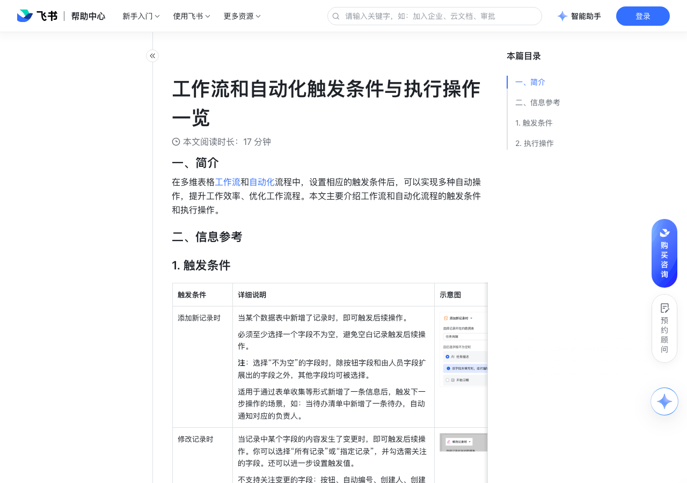

# 工作流和自动化触发条件与执行操作一览

> 来源：[飞书帮助中心](https://www.feishu.cn/hc/zh-CN/articles/740947703250)  
> 分类：多维表格 / 工作流  
> 抓取时间：2026-09-22T01:24:06.687Z

## 界面截图

### 文档内配图

1. 配图：https://p1-hera.feishucdn.com/tos-cn-i-jbbdkfciu3/a3f9010e2d0b495897b3918ada62576a~tplv-jbbdkfciu3-image:0:0.image
2. 配图：https://p1-hera.feishucdn.com/tos-cn-i-jbbdkfciu3/62d69873017b4ae0b289d1638176f0b3~tplv-jbbdkfciu3-image:0:0.image
3. 配图：https://p1-hera.feishucdn.com/tos-cn-i-jbbdkfciu3/4e52f9c2a93143ec8427463ba67754dd~tplv-jbbdkfciu3-image:0:0.image
4. 配图：https://p1-hera.feishucdn.com/tos-cn-i-jbbdkfciu3/5412b617bc144c9fb7396071c9b9f451~tplv-jbbdkfciu3-image:0:0.image
5. 配图：https://p1-hera.feishucdn.com/tos-cn-i-jbbdkfciu3/b6195a60182d40baaa3a1bf570c41da5~tplv-jbbdkfciu3-image:0:0.image
6. 配图：https://p1-hera.feishucdn.com/tos-cn-i-jbbdkfciu3/27de6e8a782c46f1bf703dbf9c50b2be~tplv-jbbdkfciu3-image:0:0.image
7. image.png：https://p1-hera.feishucdn.com/tos-cn-i-jbbdkfciu3/aceccb0d7a884dba8f75ea613d94b2d2~tplv-jbbdkfciu3-image:0:0.image
8. 配图：https://p1-hera.feishucdn.com/tos-cn-i-jbbdkfciu3/c7d450b745a543a4af043d36e9568dc9~tplv-jbbdkfciu3-image:0:0.image
9. 配图：https://p1-hera.feishucdn.com/tos-cn-i-jbbdkfciu3/09e3d2aeb2544ba5a763207b5e943a49~tplv-jbbdkfciu3-image:0:0.image
10. 配图：https://p1-hera.feishucdn.com/tos-cn-i-jbbdkfciu3/2392b3b44b6b4d468325ad050363941a~tplv-jbbdkfciu3-image:0:0.image
11. 配图：https://p1-hera.feishucdn.com/tos-cn-i-jbbdkfciu3/c0c6e904f28742fcba0055a9ba66980b~tplv-jbbdkfciu3-image:0:0.image
12. 配图：https://p1-hera.feishucdn.com/tos-cn-i-jbbdkfciu3/b013203a27b44274ba94faef9fdf853d~tplv-jbbdkfciu3-image:0:0.image
13. 配图：https://p1-hera.feishucdn.com/tos-cn-i-jbbdkfciu3/5f6e70cf63554e2084b6975b436f6c6a~tplv-jbbdkfciu3-image:0:0.image
14. 配图：https://p1-hera.feishucdn.com/tos-cn-i-jbbdkfciu3/10c58773d78b4c4aaf326ba7656c8b96~tplv-jbbdkfciu3-image:0:0.image
15. 配图：https://p1-hera.feishucdn.com/tos-cn-i-jbbdkfciu3/8410961246be41b6a6fecbc42cc66f60~tplv-jbbdkfciu3-image:0:0.image
16. 配图：https://p1-hera.feishucdn.com/tos-cn-i-jbbdkfciu3/16ae2be518234250a173ded1e59a6fdd~tplv-jbbdkfciu3-image:0:0.image
17. 配图：https://p1-hera.feishucdn.com/tos-cn-i-jbbdkfciu3/3f54d70eb37742ae93b42d6811df7bd5~tplv-jbbdkfciu3-image:0:0.image
18. 配图：https://p1-hera.feishucdn.com/tos-cn-i-jbbdkfciu3/edb095cde6c14e74965031a30d72fab9~tplv-jbbdkfciu3-image:0:0.image
19. 配图：https://p1-hera.feishucdn.com/tos-cn-i-jbbdkfciu3/b9c7fba1cfa346eea68514e6f2ab508c~tplv-jbbdkfciu3-image:0:0.image
20. 配图：https://p1-hera.feishucdn.com/tos-cn-i-jbbdkfciu3/6a8bc8a6b4d74cc3bf14f38bfc6d848c~tplv-jbbdkfciu3-image:0:0.image
21. 配图：https://p1-hera.feishucdn.com/tos-cn-i-jbbdkfciu3/fd8dc5b2f7f04c5a9cd4ae804e7747f3~tplv-jbbdkfciu3-image:0:0.image
22. 配图：https://p1-hera.feishucdn.com/tos-cn-i-jbbdkfciu3/a92598dc42064e668803c8e5e88141bd~tplv-jbbdkfciu3-image:0:0.image
23. 配图：https://p1-hera.feishucdn.com/tos-cn-i-jbbdkfciu3/1037cf150a0e4ed581962c8e1cfbf642~tplv-jbbdkfciu3-image:0:0.image
24. 配图：https://p1-hera.feishucdn.com/tos-cn-i-jbbdkfciu3/40d1b98283d3419d8e9e34cad1249062~tplv-jbbdkfciu3-image:0:0.image
25. 配图：https://p1-hera.feishucdn.com/tos-cn-i-jbbdkfciu3/bb87153af17b4af0a06c7bbfbe19b0e7~tplv-jbbdkfciu3-image:0:0.image
26. 配图：https://p1-hera.feishucdn.com/tos-cn-i-jbbdkfciu3/6c1ff1b2c7ac482080bd0b156403eae9~tplv-jbbdkfciu3-image:0:0.image
27. 配图：https://p1-hera.feishucdn.com/tos-cn-i-jbbdkfciu3/faf231745aef4a3c89fc67e77c6e0cbf~tplv-jbbdkfciu3-image:0:0.image
28. 配图：https://p1-hera.feishucdn.com/tos-cn-i-jbbdkfciu3/f3a06d64d64f438da4cc78bdefd7efc1~tplv-jbbdkfciu3-image:0:0.image
29. 配图：https://p1-hera.feishucdn.com/tos-cn-i-jbbdkfciu3/089bcdb9fa6a423498641f7e2cd8c685~tplv-jbbdkfciu3-image:0:0.image
30. 配图：https://p1-hera.feishucdn.com/tos-cn-i-jbbdkfciu3/4d1eaeed93a64e81bb297f6e4e4405ec~tplv-jbbdkfciu3-image:0:0.image
31. 配图：https://p1-hera.feishucdn.com/tos-cn-i-jbbdkfciu3/8eb74f826e884fe5967743e037258494~tplv-jbbdkfciu3-image:0:0.image
32. 配图：https://p1-hera.feishucdn.com/tos-cn-i-jbbdkfciu3/9de51a69254344f3ac5979d63ede17f1~tplv-jbbdkfciu3-image:0:0.image
33. 配图：https://p1-hera.feishucdn.com/tos-cn-i-jbbdkfciu3/248b284231e246838e4023e869fee2df~tplv-jbbdkfciu3-image:0:0.image

## 功能定位

本页对应飞书帮助中心「多维表格 / 工作流」下的「工作流和自动化触发条件与执行操作一览」。以下需求描述依据官方说明文档提炼，用于指导 DuoWei 对标实现。

## 功能目标

一、简介

## 文档结构（官方章节）

- 一、简介​
- 二、信息参考​
- 触发条件​
- 执行操作​

## 详细功能说明

一、简介

二、信息参考

触发条件

详细说明

添加新记录时

当某个数据表中新增了记录时，即可触发后续操作。必须至少选择一个字段不为空，避免空白记录触发后续操作。注：选择“不为空”的字段时，除按钮字段和由人员字段扩展出的字段之外，其他字段均可被选择。适用于通过表单收集等形式新增了一条信息后，触发下一步操作的场景，如：当待办清单中新增了一条待办，自动通知对应的负责人。

250px|700px|reset

修改记录时

当记录中某个字段的内容发生了变更时，即可触发后续操作。你可以选择“所有记录”或“指定记录”，并勾选需关注的字段。还可以进一步设置触发值。不支持关注变更的字段：按钮、自动编号、创建人、创建时间，以及由人员字段扩展出的字段。适用于某一关键字段的内容发生变化时触发操作的场景，如：进行任务管理时，当进展变更为“已完成”，自动记录完成时间。

新增/修改的记录满足条件时

新增或修改记录时，当特定的字段发生了变更且满足了特定的条件时，即可触发后续操作。已有的记录内容满足条件时并不会触发。注：只有当你设置的字段本身发生变更、且满足了条件时，才会触发后续操作。其他字段的变更不会触发。这也是“新增/修改的记录满足条件时”和“修改记录时”的区别之一。如果你想监测任意字段的变动，且对某一字段的值有要求，请选择“修改记录时”作为触发条件。不支持将按钮和链接字段作为“设置满足的条件”的条件字段。

只有当你设置的字段本身发生变更、且满足了条件时，才会触发后续操作。其他字段的变更不会触发。这也是“新增/修改的记录满足条件时”和“修改记录时”的区别之一。如果你想监测任意字段的变动，且对某一字段的值有要求，请选择“修改记录时”作为触发条件。

不支持将按钮和链接字段作为“设置满足的条件”的条件字段。

到达记录中的时间时

当到达了记录中设置的时间时，即可触发后续操作。此触发条件为一次性触发，不支持重复、周期性的触发。只支持选择“日期”字段、“创建时间”字段、显示格式为日期的“公式”字段。适用于项目管理等明确填写了时间节点的场景。

定时触发

在特定的时间触发后续操作。适用于需要周期性、重复触发同一操作的场景。你可以自定义日期、时间，并自行设置是否重复触发该操作。注：如果你选择了“自定义重复”并设置了截止日期，那么截止日期当天不会触发流程。例如，如果你希望流程运行到 1 月 28 号、且 28 号当天也同样运行，需要将截止日期设置为 29 号。另外，当你设置触发时间为某个月的 31 日、频次为“每月重复”，如果下个月份没有 31 日，则会跳过这个月、不触发任何自动化流程。针对 2 月份也是同理：如果你设置的每月重复的日期在 2 月份不存在，则 2 月不会触发自动化流程。

点击按钮时

当用户点击了多维表格中的按钮时，即可触发后续操作。此处的“按钮”包括数据表中的“按钮字段”、仪表盘中的“按钮组件”、消息卡片底部的“按钮”。适用于权限管控较为严格、又需要用户在多维表格内触发操作的场景，如：仅拥有可阅读权限的用户也能通过点击按钮加入某一群组。

接收到飞书消息时

当多维表格机器人在飞书群组或单聊中收到符合条件的消息时，将触发后续操作。如设置“在群组中接收到消息”为触发条件，需要选择要接收消息的群组和消息的接收范围。还可以设置消息需要满足的条件，可选条件有：消息包含指定关键词消息由指定用户发送新话题消息消息中包含图片或文件如果设置在单聊中接收到消息为触发条件，需要选择单聊的用户。还可以设置消息需要满足的条件，可选条件有：消息包含指定关键词消息中包含图片或文件在后续执行的操作中，可以引用接收到消息的如下信息：触发流程的消息 ID 及其所回复的消息 ID消息类型、消息内容、消息中包含的附件（图片、文件、音视频）发送人、发送时间、提及的成员（仅群聊消息）所在群组和消息链接

如设置“在群组中接收到消息”为触发条件，需要选择要接收消息的群组和消息的接收范围。

还可以设置消息需要满足的条件，可选条件有：

消息包含指定关键词

消息由指定用户发送

新话题消息

消息中包含图片或文件

如果设置在单聊中接收到消息为触发条件，需要选择单聊的用户。

触发流程的消息 ID 及其所回复的消息 ID

消息类型、消息内容、消息中包含的附件（图片、文件、音视频）

发送人、发送时间、提及的成员

（仅群聊消息）所在群组和消息链接

接收到 webhook 时

通过 webhook 调用多维表格工作流或自动化流程，可实现不同多维表格间、外部系统与多维表格间的数据联动和同步。外部系统发生变更后，发送 HTTP 请求（POST）至多维表格流程。多维表格流程接收到信息后，进一步触发相应后续操作。

接收到 Outlook 邮件时

当关联的 Outlook 邮箱中接收到邮件时，多维表格工作流或自动化流程将自动执行相应操作。支持将邮件主题关键词、正文关键词、发件地址、收件地址或抄送地址设置为触发条件。

执行操作

基础/常用

发送飞书消息

发送飞书消息给个人或群组，可以使用个性化的多维表格应用、个人用户、多维表格助手等不同身份；发送到群组中时，还可选择自定义机器人。消息将以卡片的形式发送，你可自定义卡片标题与内容，引用多维表格中的字段内容。支持添加附件和按钮。具体信息请参考在工作流和自动化中发送消息。

发送飞书消息给个人或群组，可以使用个性化的多维表格应用、个人用户、多维表格助手等不同身份；发送到群组中时，还可选择自定义机器人。

消息将以卡片的形式发送，你可自定义卡片标题与内容，引用多维表格中的字段内容。支持添加附件和按钮。

发送飞书邮件

前提：管理员已为所在企业启用邮箱功能。自定义收件人、邮件主题和正文，还可以引用多维表格中的附件字段作为邮件附件。

新增记录

在多维表格的一个数据表中新增一条记录。点击 设置字段值，可自行设置新增记录中各个字段的内容。不支持设置的字段类型：自动编号、查找引用、按钮、单向关联、双向关联、创建人、修改人、创建时间、最后更新时间，以及需计算的公式字段和从人员字段扩展出的字段。除此之外，如果附件、条码、地理位置字段设置了仅移动端可操作，也无法被设置。

修改记录

修改多维表格中的记录内容。可以修改全部记录，或设置筛选条件、修改符合条件的指定记录。若“修改记录”的操作与前序步骤选择了同一个数据表，还可以选择之前步骤中对应的记录。可同时修改记录中多个字段的内容。点击 设置字段值，可自行设置各个字段的修改后内容。不支持设置的字段类型：自动编号、查找引用、按钮、单向关联、双向关联、创建人、修改人、创建时间、最后更新时间，以及需计算的公式字段和从人员字段扩展出的字段。除此之外，如果附件、条码、地理位置字段设置了仅移动端可操作，也无法被设置。

可以修改全部记录，或设置筛选条件、修改符合条件的指定记录。

若“修改记录”的操作与前序步骤选择了同一个数据表，还可以选择之前步骤中对应的记录。

可同时修改记录中多个字段的内容。点击 设置字段值，可自行设置各个字段的修改后内容。

查找记录

查找多维表格中符合条件的记录，并将查找到的记录用于后续步骤中。其中：设置筛选条件：用于筛选出符合条件的所有记录（行）。设置查找内容：此处填入你后续想引用的字段。设置排序规则：按照指定规则对查找到的记录进行排序。

设置筛选条件：用于筛选出符合条件的所有记录（行）。

设置查找内容：此处填入你后续想引用的字段。

设置排序规则：按照指定规则对查找到的记录进行排序。

发送 HTTP 请求

通过 URL 发出网络请求，调用第三方平台来处理数据。

在上一步操作执行之后，延迟指定的时长，再触发下一步操作。延迟的单位仅支持“分钟”。可设置的延迟时长最长 2 小时、最短 1 分钟。

发送 Outlook 邮件

当满足特定条件时，向指定的 Outlook 邮箱地址发送邮件。定义收件人、邮件主题和正文，还可以引用多维表格中的附件字段作为邮件附件。

你可以通过条件判断、多分支或循环操作，构建复杂流程。注：逻辑操作仅支持在工作流中使用。

飞书应用

创建飞书日程

基于多维表格中的内容，在飞书日历上创建一个日程。可直接在流程中设置日程主题、开始与结束时间、参与人等。选择日历时，你只能选择你是“管理员”或“编辑者”的日历。注：通过工作流或自动化流程创建的日程默认提前 5 分钟提醒，在流程配置界面无法修改，需自行在日历的日程详情内进行修改。

删除飞书日程

通过输入日历 ID 和日程 ID，删除之前创建的飞书日程。注：若你没有该日程所在日历的编辑或管理权限，无法删除日程。日历 ID 和日程 ID 是在“创建飞书日程”时产生的变量，因此建议：在多维表格中创建两个文本字段，分别命名为“日历 ID”和“日程 ID”。在自动化流程中，在“创建飞书日程”后增加一个“修改记录”的步骤，将日历 ID 和日程 ID 记录在多维表格中，方便后续引用。

在多维表格中创建两个文本字段，分别命名为“日历 ID”和“日程 ID”。

在自动化流程中，在“创建飞书日程”后增加一个“修改记录”的步骤，将日历 ID 和日程 ID 记录在多维表格中，方便后续引用。

250px|700px|reset250px|700px|reset

创建飞书任务

基于多维表格中的内容，创建一个飞书任务。可直接在工作流或自动化流程中设置任务标题、负责人、截止时间、关注人等信息。

完成飞书任务

通过输入任务 ID，完成/重启/删除之前创建的飞书任务。右侧上方示意图以“完成飞书任务”为例。任务 ID 是在“创建飞书任务”时产生的变量，因此建议：在多维表格中创建一个文本字段，命名为“任务 ID”。在工作流或自动化流程中，在“创建飞书任务”后增加一个“修改记录”的步骤，将任务 ID 记录在多维表格中，方便后续引用。

在多维表格中创建一个文本字段，命名为“任务 ID”。

在工作流或自动化流程中，在“创建飞书任务”后增加一个“修改记录”的步骤，将任务 ID 记录在多维表格中，方便后续引用。

重启飞书任务

删除飞书任务

创建飞书群组

基于多维表格中的内容，创建一个飞书群组。可直接在工作流或自动化流程中设置群名称、群成员、群主等信息。最多可添加 50 个群成员。创建的群组可以被填写到群组字段中，也可以被设置为飞书消息的接收群组。

添加群成员

可通过搜索来选择群组、选择想要添加或移除的群成员，也可以选择之前步骤产生的群组或人员数据。右侧示意图以“添加群成员”为例。

移除群成员

AI 生成文本

配置指令，由 AI 生成文本内容。支持引用多维表格中的内容，或是引用前置工作流或自动化步骤产生的数据，进行润色、总结并生成一段文本。生成的文本内容还可以进一步作为后续的自动化步骤的输入。

AI 更新记录

自动更新一个数据表中 AI 字段的内容。可同时选择多个 AI 字段进行更新。仅适用于所选数据表中有 AI 字段、且前置步骤中有具体指定记录的情况。注：该操作仅支持在自动化流程中使用，且仅支持对飞书提供的 AI 字段捷径进行更新，即 分类、智能标签、翻译、自定义 AI 自动填充、总结、信息提取。不支持自动化更新其他字段。

AI 分类

通过与预设的分类规则进行匹配，自动对内容进行分类，并执行对应类别分支的后续流程。注：该操作仅支持在工作流中使用。

AI Agent

根据实际任务要求进行智能规划，自动调用工具（如发送消息、新增记录、抽签等）完成任务。注：该操作仅支持在工作流中使用。

自动化插件

添加不同的多维表格插件

通过添加自动化插件，无需额外技术配置，即可快速执行复杂操作。此处可见的插件类型取决于所在企业的管理员启用了哪些多维表格插件，在此不详细展开。注：该操作仅支持在自动化流程中使用。

节点捷径

添加不同的节点捷径

通过添加节点捷径，无需额外技术配置，即可快速执行复杂操作。注：该操作仅支持在工作流中使用。

触发条件 | 详细说明 | 示意图

添加新记录时 | 当某个数据表中新增了记录时，即可触发后续操作。必须至少选择一个字段不为空，避免空白记录触发后续操作。注：选择“不为空”的字段时，除按钮字段和由人员字段扩展出的字段之外，其他字段均可被选择。适用于通过表单收集等形式新增了一条信息后，触发下一步操作的场景，如：当待办清单中新增了一条待办，自动通知对应的负责人。 | 250px|700px|reset

修改记录时 | 当记录中某个字段的内容发生了变更时，即可触发后续操作。你可以选择“所有记录”或“指定记录”，并勾选需关注的字段。还可以进一步设置触发值。不支持关注变更的字段：按钮、自动编号、创建人、创建时间，以及由人员字段扩展出的字段。适用于某一关键字段的内容发生变化时触发操作的场景，如：进行任务管理时，当进展变更为“已完成”，自动记录完成时间。 | 250px|700px|reset

新增/修改的记录满足条件时 | 新增或修改记录时，当特定的字段发生了变更且满足了特定的条件时，即可触发后续操作。已有的记录内容满足条件时并不会触发。注：只有当你设置的字段本身发生变更、且满足了条件时，才会触发后续操作。其他字段的变更不会触发。这也是“新增/修改的记录满足条件时”和“修改记录时”的区别之一。如果你想监测任意字段的变动，且对某一字段的值有要求，请选择“修改记录时”作为触发条件。不支持将按钮和链接字段作为“设置满足的条件”的条件字段。 | 250px|700px|reset

到达记录中的时间时 | 当到达了记录中设置的时间时，即可触发后续操作。此触发条件为一次性触发，不支持重复、周期性的触发。只支持选择“日期”字段、“创建时间”字段、显示格式为日期的“公式”字段。适用于项目管理等明确填写了时间节点的场景。 | 250px|700px|reset

定时触发 | 在特定的时间触发后续操作。适用于需要周期性、重复触发同一操作的场景。你可以自定义日期、时间，并自行设置是否重复触发该操作。注：如果你选择了“自定义重复”并设置了截止日期，那么截止日期当天不会触发流程。例如，如果你希望流程运行到 1 月 28 号、且 28 号当天也同样运行，需要将截止日期设置为 29 号。另外，当你设置触发时间为某个月的 31 日、频次为“每月重复”，如果下个月份没有 31 日，则会跳过这个月、不触发任何自动化流程。针对 2 月份也是同理：如果你设置的每月重复的日期在 2 月份不存在，则 2 月不会触发自动化流程。 | 250px|700px|reset

点击按钮时 | 当用户点击了多维表格中的按钮时，即可触发后续操作。此处的“按钮”包括数据表中的“按钮字段”、仪表盘中的“按钮组件”、消息卡片底部的“按钮”。适用于权限管控较为严格、又需要用户在多维表格内触发操作的场景，如：仅拥有可阅读权限的用户也能通过点击按钮加入某一群组。 | 250px|700px|reset

接收到飞书消息时 | 当多维表格机器人在飞书群组或单聊中收到符合条件的消息时，将触发后续操作。如设置“在群组中接收到消息”为触发条件，需要选择要接收消息的群组和消息的接收范围。还可以设置消息需要满足的条件，可选条件有：消息包含指定关键词消息由指定用户发送新话题消息消息中包含图片或文件如果设置在单聊中接收到消息为触发条件，需要选择单聊的用户。还可以设置消息需要满足的条件，可选条件有：消息包含指定关键词消息中包含图片或文件在后续执行的操作中，可以引用接收到消息的如下信息：触发流程的消息 ID 及其所回复的消息 ID消息类型、消息内容、消息中包含的附件（图片、文件、音视频）发送人、发送时间、提及的成员（仅群聊消息）所在群组和消息链接 | 250px|700px|reset

接收到 webhook 时 | 通过 webhook 调用多维表格工作流或自动化流程，可实现不同多维表格间、外部系统与多维表格间的数据联动和同步。外部系统发生变更后，发送 HTTP 请求（POST）至多维表格流程。多维表格流程接收到信息后，进一步触发相应后续操作。 | 250px|700px|reset

接收到 Outlook 邮件时 | 当关联的 Outlook 邮箱中接收到邮件时，多维表格工作流或自动化流程将自动执行相应操作。支持将邮件主题关键词、正文关键词、发件地址、收件地址或抄送地址设置为触发条件。 | 250px|700px|reset

大类 | 执行操作 | 详细说明 | 示意图

基础/常用 | 发送飞书消息 | 发送飞书消息给个人或群组，可以使用个性化的多维表格应用、个人用户、多维表格助手等不同身份；发送到群组中时，还可选择自定义机器人。消息将以卡片的形式发送，你可自定义卡片标题与内容，引用多维表格中的字段内容。支持添加附件和按钮。具体信息请参考在工作流和自动化中发送消息。 | 250px|700px|reset

| 发送飞书邮件 | 前提：管理员已为所在企业启用邮箱功能。自定义收件人、邮件主题和正文，还可以引用多维表格中的附件字段作为邮件附件。 | 250px|700px|reset

| 新增记录 | 在多维表格的一个数据表中新增一条记录。点击 设置字段值，可自行设置新增记录中各个字段的内容。不支持设置的字段类型：自动编号、查找引用、按钮、单向关联、双向关联、创建人、修改人、创建时间、最后更新时间，以及需计算的公式字段和从人员字段扩展出的字段。除此之外，如果附件、条码、地理位置字段设置了仅移动端可操作，也无法被设置。 | 250px|700px|reset

| 修改记录 | 修改多维表格中的记录内容。可以修改全部记录，或设置筛选条件、修改符合条件的指定记录。若“修改记录”的操作与前序步骤选择了同一个数据表，还可以选择之前步骤中对应的记录。可同时修改记录中多个字段的内容。点击 设置字段值，可自行设置各个字段的修改后内容。不支持设置的字段类型：自动编号、查找引用、按钮、单向关联、双向关联、创建人、修改人、创建时间、最后更新时间，以及需计算的公式字段和从人员字段扩展出的字段。除此之外，如果附件、条码、地理位置字段设置了仅移动端可操作，也无法被设置。 | 250px|700px|reset

| 查找记录 | 查找多维表格中符合条件的记录，并将查找到的记录用于后续步骤中。其中：设置筛选条件：用于筛选出符合条件的所有记录（行）。设置查找内容：此处填入你后续想引用的字段。设置排序规则：按照指定规则对查找到的记录进行排序。 | 250px|700px|reset

| 发送 HTTP 请求 | 通过 URL 发出网络请求，调用第三方平台来处理数据。 | 250px|700px|reset

| 延迟 | 在上一步操作执行之后，延迟指定的时长，再触发下一步操作。延迟的单位仅支持“分钟”。可设置的延迟时长最长 2 小时、最短 1 分钟。 | 250px|700px|reset

| 发送 Outlook 邮件 | 当满足特定条件时，向指定的 Outlook 邮箱地址发送邮件。定义收件人、邮件主题和正文，还可以引用多维表格中的附件字段作为邮件附件。 | 250px|700px|reset

| 逻辑 | 你可以通过条件判断、多分支或循环操作，构建复杂流程。注：逻辑操作仅支持在工作流中使用。 | 250px|700px|reset

飞书应用 | 创建飞书日程 | 基于多维表格中的内容，在飞书日历上创建一个日程。可直接在流程中设置日程主题、开始与结束时间、参与人等。选择日历时，你只能选择你是“管理员”或“编辑者”的日历。注：通过工作流或自动化流程创建的日程默认提前 5 分钟提醒，在流程配置界面无法修改，需自行在日历的日程详情内进行修改。 | 250px|700px|reset

| 删除飞书日程 | 通过输入日历 ID 和日程 ID，删除之前创建的飞书日程。注：若你没有该日程所在日历的编辑或管理权限，无法删除日程。日历 ID 和日程 ID 是在“创建飞书日程”时产生的变量，因此建议：在多维表格中创建两个文本字段，分别命名为“日历 ID”和“日程 ID”。在自动化流程中，在“创建飞书日程”后增加一个“修改记录”的步骤，将日历 ID 和日程 ID 记录在多维表格中，方便后续引用。 | 250px|700px|reset250px|700px|reset

| 创建飞书任务 | 基于多维表格中的内容，创建一个飞书任务。可直接在工作流或自动化流程中设置任务标题、负责人、截止时间、关注人等信息。 | 250px|700px|reset

| 完成飞书任务 | 通过输入任务 ID，完成/重启/删除之前创建的飞书任务。右侧上方示意图以“完成飞书任务”为例。任务 ID 是在“创建飞书任务”时产生的变量，因此建议：在多维表格中创建一个文本字段，命名为“任务 ID”。在工作流或自动化流程中，在“创建飞书任务”后增加一个“修改记录”的步骤，将任务 ID 记录在多维表格中，方便后续引用。 | 250px|700px|reset250px|700px|reset

| 创建飞书群组 | 基于多维表格中的内容，创建一个飞书群组。可直接在工作流或自动化流程中设置群名称、群成员、群主等信息。最多可添加 50 个群成员。创建的群组可以被填写到群组字段中，也可以被设置为飞书消息的接收群组。 | 250px|700px|reset

| 添加群成员 | 可通过搜索来选择群组、选择想要添加或移除的群成员，也可以选择之前步骤产生的群组或人员数据。右侧示意图以“添加群成员”为例。 | 250px|700px|reset

AI | AI 生成文本 | 配置指令，由 AI 生成文本内容。支持引用多维表格中的内容，或是引用前置工作流或自动化步骤产生的数据，进行润色、总结并生成一段文本。生成的文本内容还可以进一步作为后续的自动化步骤的输入。 | 250px|700px|reset

| AI 更新记录 | 自动更新一个数据表中 AI 字段的内容。可同时选择多个 AI 字段进行更新。仅适用于所选数据表中有 AI 字段、且前置步骤中有具体指定记录的情况。注：该操作仅支持在自动化流程中使用，且仅支持对飞书提供的 AI 字段捷径进行更新，即 分类、智能标签、翻译、自定义 AI 自动填充、总结、信息提取。不支持自动化更新其他字段。 | 250px|700px|reset250px|700px|reset

| AI 分类 | 通过与预设的分类规则进行匹配，自动对内容进行分类，并执行对应类别分支的后续流程。注：该操作仅支持在工作流中使用。 | 250px|700px|reset

| AI Agent | 根据实际任务要求进行智能规划，自动调用工具（如发送消息、新增记录、抽签等）完成任务。注：该操作仅支持在工作流中使用。 | 250px|700px|reset

自动化插件 | 添加不同的多维表格插件 | 通过添加自动化插件，无需额外技术配置，即可快速执行复杂操作。此处可见的插件类型取决于所在企业的管理员启用了哪些多维表格插件，在此不详细展开。注：该操作仅支持在自动化流程中使用。 | 250px|700px|reset

节点捷径 | 添加不同的节点捷径 | 通过添加节点捷径，无需额外技术配置，即可快速执行复杂操作。注：该操作仅支持在工作流中使用。 | 250px|700px|reset

## 实现要点（对标 DuoWei）

1. **入口与信息架构**：在产品中明确该能力所属模块（工作流），并保证用户可从对应导航触达。
2. **核心交互**：按上文「详细功能说明」还原主要操作路径；截图中出现的按钮、字段、面板命名尽量与飞书语义一致或可映射。
3. **数据与权限**：若文档涉及可见范围、可编辑范围、分享或高级权限，实现时需落到角色/成员模型，并保证 API/MCP 与 UI 权限一致。
4. **边界与上限**：若文档提到数量上限、格式限制、导入导出约束，需在实现与错误提示中体现。
5. **验收**：以本页截图场景为用例，完成「能打开 / 能配置 / 能保存 / 能被 Agent 读写（如适用）」四项检查。

## 原始摘录摘要

> 一、简介 二、信息参考 触发条件 详细说明 添加新记录时 当某个数据表中新增了记录时，即可触发后续操作。必须至少选择一个字段不为空，避免空白记录触发后续操作。注：选择“不为空”的字段时，除按钮字段和由人员字段扩展出的字段之外，其他字段均可被选择。适用于通过表单收集等形式新增了一条信息后，触发下一步操作的场景，如：当待办清单中新增了一条待办，自动通知对应的负责人。 250px|700px|reset 修改记录时 当记录中某个字段的内容发生了变更时，即可触发后续操作。你可以选择“所有记录”或“指定记录”，并勾选需关注的字段。还可以进一步设置触发值。不支持关注变更的字段：按钮、自动编号、创建人、创建时间，以及由人员字段扩展出的字段。适用于某一关键字段的内容发生变化时触发操作的场景，如：进行任务管理时，当进展变更为“已完成”，自动记录完成时间。 新增/修改的记录满足条件时 新增或修改记录时，当特定的字段发生了变更且满足了特定的条件时，即可触发后续操作。已有的记录内容满足条件时并不会触发。注：只有当你设置的字段本身发生变更、且满足了条件时，才会触发后续操作。其他字段的变更不会触发。这也是“新增/修改的记录满足条件时”和“修改记录时”的区别之一。如果你想监测任意字段的变动，且对某一字段的值有要求，请选择“修改记录时”作为触发条件。不支持将按钮和链接字段作为“设置满足的条件”的条件字段。 只有当你设置的字段本身发生变更、且满足了条件时，才会触发后续操作。其他字段的变更不会触发。这也是“新增/修改的记录满足条件时”和“修改记录时”的区别之一。如果你想监测任意字段的变动，且对某一字段的值有要求，请选择“修改记录时”作为触发条件。 不支持将按钮和链接字段作为“设置满足的条件”的条件字段。 到达记录中的时间时 当到达了记录中设置的时间时，即可触发后续操作。此触发条件为一次性触发，不支持重复、周期…

## 元数据

- article_id: `7241777450651566081`
- category_id: `7415964452380049412`
- path: `/hc/zh-CN/articles/740947703250`
- extracted_text_length: 9601
