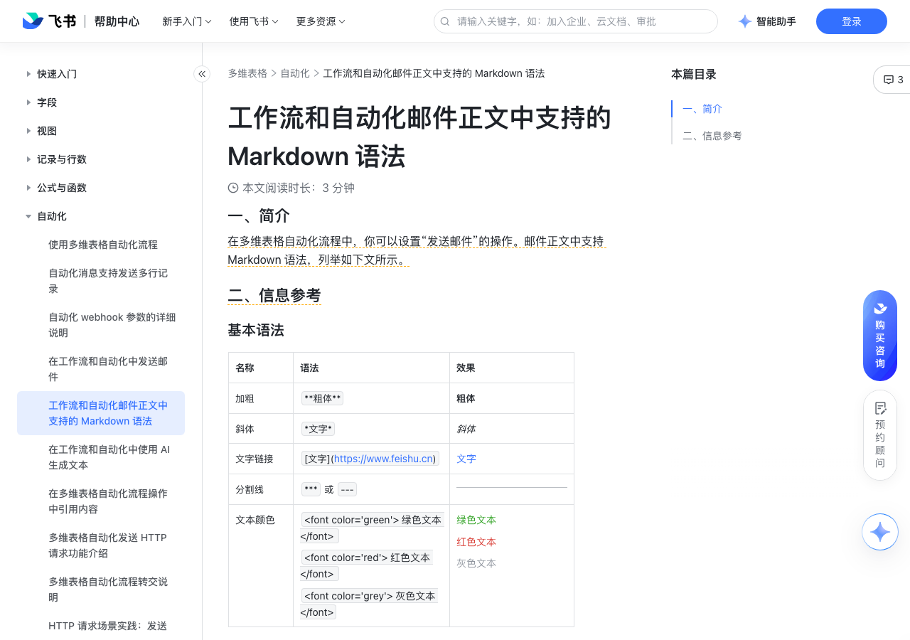

# 工作流和自动化邮件正文中支持的 Markdown 语法

> 来源：[飞书帮助中心](https://www.feishu.cn/hc/zh-CN/articles/183798260343)  
> 分类：多维表格 / 自动化  
> 抓取时间：2026-09-22T01:24:00.334Z

## 界面截图

### 文档内配图

1. 配图：https://p1-hera.feishucdn.com/tos-cn-i-jbbdkfciu3/6d2d4da1b18e4a2da0c8784df4baa3fb~tplv-jbbdkfciu3-image:0:0.image
2. 配图：https://p1-hera.feishucdn.com/tos-cn-i-jbbdkfciu3/d64c30906ab6430e8d3ae246fb5aeb59~tplv-jbbdkfciu3-image:0:0.image

## 功能定位

本页对应飞书帮助中心「多维表格 / 自动化」下的「工作流和自动化邮件正文中支持的 Markdown 语法」。以下需求描述依据官方说明文档提炼，用于指导 DuoWei 对标实现。

## 功能目标

一、简介

## 文档结构（官方章节）

- 一、简介​
- 二、信息参考​
- 基本语法​
- 标题​
- 有序列表和无序列表​
- 表格​

## 详细功能说明

一、简介

二、信息参考

基本语法

**粗体**

*文字*

文字链接

[文字](https://www.feishu.cn)

*** 或 ---

文本颜色

 绿色文本   红色文本   灰色文本 

绿色文本红色文本灰色文本

一级标题

# Heading level 1

250px|700px|reset

二级标题

## Heading level 2

三级标题

### Heading level 3

四级标题

#### Heading level 4

五级标题

##### Heading level 5

六级标题

###### Heading level 6

有序列表和无序列表

有序列表

1. First item2. Second item3. Third item4. Fourth item

First itemSecond itemThird itemFourth item

First item

Second item

Third item

Fourth item

无序列表

- First item- Second item- Third item- Fourth item

语法（示例）

| Syntax | Description | Test Text || :--- |:--- |:--- || Header | Title | Here's this || Paragraph | Text | And more |

名称 | 语法 | 效果

加粗 | **粗体** | 粗体

斜体 | *文字* | 斜体

文字链接 | [文字](https://www.feishu.cn) | 文字

分割线 | *** 或 --- |

文本颜色 |  绿色文本   红色文本   灰色文本  | 绿色文本红色文本灰色文本

一级标题 | # Heading level 1 | 250px|700px|reset

二级标题 | ## Heading level 2 |

三级标题 | ### Heading level 3 |

四级标题 | #### Heading level 4 |

五级标题 | ##### Heading level 5 |

六级标题 | ###### Heading level 6 |

有序列表 | 1. First item2. Second item3. Third item4. Fourth item | First itemSecond itemThird itemFourth item

无序列表 | - First item- Second item- Third item- Fourth item | First itemSecond itemThird itemFourth item

名称 | 语法（示例） | 效果

表格 | | Syntax | Description | Test Text || :--- |:--- |:--- || Header | Title | Here's this || Paragraph | Text | And more | | 250px|700px|reset

## 实现要点（对标 DuoWei）

1. **入口与信息架构**：在产品中明确该能力所属模块（自动化），并保证用户可从对应导航触达。
2. **核心交互**：按上文「详细功能说明」还原主要操作路径；截图中出现的按钮、字段、面板命名尽量与飞书语义一致或可映射。
3. **数据与权限**：若文档涉及可见范围、可编辑范围、分享或高级权限，实现时需落到角色/成员模型，并保证 API/MCP 与 UI 权限一致。
4. **边界与上限**：若文档提到数量上限、格式限制、导入导出约束，需在实现与错误提示中体现。
5. **验收**：以本页截图场景为用例，完成「能打开 / 能配置 / 能保存 / 能被 Agent 读写（如适用）」四项检查。

## 原始摘录摘要

> 一、简介 二、信息参考 基本语法 **粗体** *文字* 文字链接 [文字](https://www.feishu.cn) *** 或 --- 文本颜色  绿色文本   红色文本   灰色文本  绿色文本红色文本灰色文本 一级标题 # Heading level 1 250px|700px|reset 二级标题 ## Heading level 2 三级标题 ### Heading level 3 四级标题 #### Heading level 4 五级标题 ##### Heading level 5 六级标题 ###### Heading level 6 有序列表和无序列表 有序列表 1. First item2. Second item3. Third item4. Fourth item First itemSecond itemThird itemFourth item First item Second item Third item Fourth item 无序列表 - First item- Second item- Third item- Fourth item 语法（示例） | Syntax | Description | Test Text || :--- |:--- |:--- || Header | Title | Here's this || Paragraph | Text | And more | 名称 | 语法 | 效果 加粗 | **粗体** | 粗体 斜体 | *文字* | 斜体 文字链接 | [文字](https://www.feishu.cn) | 文字 分割线 | *** 或 -…

## 元数据

- article_id: `7345408757125365762`
- category_id: `7165751270974767105`
- path: `/hc/zh-CN/articles/183798260343`
- extracted_text_length: 1492
