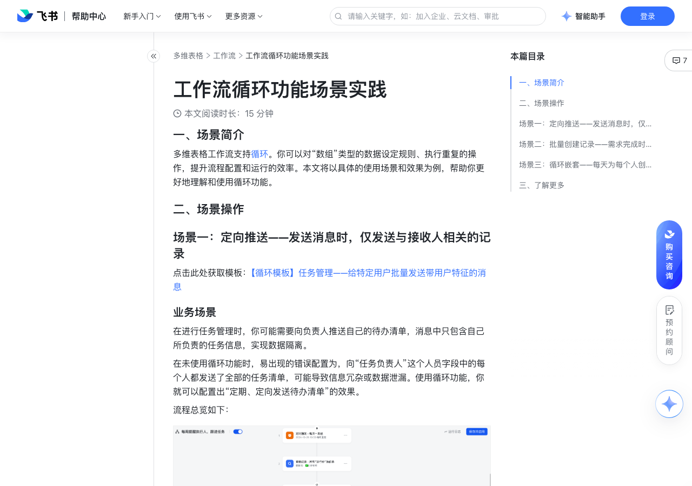

# 工作流循环功能场景实践

> 来源：[飞书帮助中心](https://www.feishu.cn/hc/zh-CN/articles/972474121589)  
> 分类：多维表格 / 工作流  
> 抓取时间：2026-09-22T01:25:10.302Z

## 界面截图

### 文档内配图

1. 配图：https://p1-hera.feishucdn.com/tos-cn-i-jbbdkfciu3/198d494784e44e95960dac316c6998b4~tplv-jbbdkfciu3-image:0:0.image
2. 配图：https://p1-hera.feishucdn.com/tos-cn-i-jbbdkfciu3/15a0dbc5076441c18e388a81d36cb38f~tplv-jbbdkfciu3-image:0:0.image
3. 配图：https://p1-hera.feishucdn.com/tos-cn-i-jbbdkfciu3/0025c8e78bdd446aa46ac81feb7d7420~tplv-jbbdkfciu3-image:0:0.image
4. 配图：https://p1-hera.feishucdn.com/tos-cn-i-jbbdkfciu3/1503c7804fc6473aafad698e926bc8e9~tplv-jbbdkfciu3-image:0:0.image
5. 配图：https://p1-hera.feishucdn.com/tos-cn-i-jbbdkfciu3/94208325cce5451cbf9f1a49a73aac01~tplv-jbbdkfciu3-image:0:0.image
6. 配图：https://p1-hera.feishucdn.com/tos-cn-i-jbbdkfciu3/b78001a3f1e046169a2fe0aa2126bd84~tplv-jbbdkfciu3-image:0:0.image
7. 配图：https://p1-hera.feishucdn.com/tos-cn-i-jbbdkfciu3/4df5ffcab85943ad9822721e73ad186d~tplv-jbbdkfciu3-image:0:0.image
8. 配图：https://p1-hera.feishucdn.com/tos-cn-i-jbbdkfciu3/0cec4c5bff4e43b5bd6b778643b122df~tplv-jbbdkfciu3-image:0:0.image
9. 配图：https://p1-hera.feishucdn.com/tos-cn-i-jbbdkfciu3/d6a78186103643059658a2fd2643cb2d~tplv-jbbdkfciu3-image:0:0.image
10. 配图：https://p1-hera.feishucdn.com/tos-cn-i-jbbdkfciu3/9e60b45668084b3f897626ae3e52147e~tplv-jbbdkfciu3-image:0:0.image
11. 配图：https://p1-hera.feishucdn.com/tos-cn-i-jbbdkfciu3/195c34710a0d458591ccb7274dc4dddb~tplv-jbbdkfciu3-image:0:0.image
12. 配图：https://p1-hera.feishucdn.com/tos-cn-i-jbbdkfciu3/92185367480c4ed286b3d7a24c992223~tplv-jbbdkfciu3-image:0:0.image
13. 配图：https://p1-hera.feishucdn.com/tos-cn-i-jbbdkfciu3/78bc734b92054c9b91f5fd7b02c1a028~tplv-jbbdkfciu3-image:0:0.image
14. 配图：https://p1-hera.feishucdn.com/tos-cn-i-jbbdkfciu3/aef0f15b3a9c41b588ff8e7cf93a51f3~tplv-jbbdkfciu3-image:0:0.image
15. 配图：https://p1-hera.feishucdn.com/tos-cn-i-jbbdkfciu3/b1d5be9cbb9e40d6bab03c0865fddf22~tplv-jbbdkfciu3-image:0:0.image
16. 配图：https://p1-hera.feishucdn.com/tos-cn-i-jbbdkfciu3/c501e2bf236b463e9f05fd3dd70b9041~tplv-jbbdkfciu3-image:0:0.image
17. 配图：https://p1-hera.feishucdn.com/tos-cn-i-jbbdkfciu3/814f2b7af8134ec89bdd9e532f64cd30~tplv-jbbdkfciu3-image:0:0.image
18. 配图：https://p1-hera.feishucdn.com/tos-cn-i-jbbdkfciu3/7f292649d86942fa8213bccd2cabaf00~tplv-jbbdkfciu3-image:0:0.image
19. 配图：https://p1-hera.feishucdn.com/tos-cn-i-jbbdkfciu3/d0afdcd9475e4961a2a9a4ae9bee9194~tplv-jbbdkfciu3-image:0:0.image
20. 配图：https://p1-hera.feishucdn.com/tos-cn-i-jbbdkfciu3/c555a82c5cb74530ba29936bb6dd6ea3~tplv-jbbdkfciu3-image:0:0.image
21. 配图：https://p1-hera.feishucdn.com/tos-cn-i-jbbdkfciu3/eb11d608246645979546af7f2e730b3f~tplv-jbbdkfciu3-image:0:0.image
22. 配图：https://p1-hera.feishucdn.com/tos-cn-i-jbbdkfciu3/7056c61104d24d3696dae4fdfed89c77~tplv-jbbdkfciu3-image:0:0.image
23. 配图：https://p1-hera.feishucdn.com/tos-cn-i-jbbdkfciu3/70a6144c99244d818fe34a187ca5e967~tplv-jbbdkfciu3-image:0:0.image
24. 配图：https://p1-hera.feishucdn.com/tos-cn-i-jbbdkfciu3/089cc985bfe546a194199fb82a502622~tplv-jbbdkfciu3-image:0:0.image
25. 配图：https://p1-hera.feishucdn.com/tos-cn-i-jbbdkfciu3/485974aa04224f38bfc752acfbaa0d45~tplv-jbbdkfciu3-image:0:0.image
26. 配图：https://p1-hera.feishucdn.com/tos-cn-i-jbbdkfciu3/4fcca859932b4c5095943deffd3883cd~tplv-jbbdkfciu3-image:0:0.image
27. 配图：https://p1-hera.feishucdn.com/tos-cn-i-jbbdkfciu3/7e7d2137281f4a699b989e3c38d5feba~tplv-jbbdkfciu3-image:0:0.image
28. 配图：https://p1-hera.feishucdn.com/tos-cn-i-jbbdkfciu3/14eb82b410f54e1184b79b67af552ade~tplv-jbbdkfciu3-image:0:0.image
29. 配图：https://p1-hera.feishucdn.com/tos-cn-i-jbbdkfciu3/b5aa4058f6114b4faa8fc33397c7120c~tplv-jbbdkfciu3-image:0:0.image
30. 配图：https://p1-hera.feishucdn.com/tos-cn-i-jbbdkfciu3/248ac20aac6d469c88817bc6c0512d23~tplv-jbbdkfciu3-image:0:0.image
31. 配图：https://p1-hera.feishucdn.com/tos-cn-i-jbbdkfciu3/e1b894bfee72434cbd2705855bb6deaa~tplv-jbbdkfciu3-image:0:0.image
32. 配图：https://p1-hera.feishucdn.com/tos-cn-i-jbbdkfciu3/d6f97f46803a495b85d8cea46a2ac267~tplv-jbbdkfciu3-image:0:0.image
33. 配图：https://p1-hera.feishucdn.com/tos-cn-i-jbbdkfciu3/a106821c97ee41b087cc05a1855c256f~tplv-jbbdkfciu3-image:0:0.image
34. 配图：https://p1-hera.feishucdn.com/tos-cn-i-jbbdkfciu3/3250279c4a9e4f94bd9371ba2e1991c0~tplv-jbbdkfciu3-image:0:0.image
35. 配图：https://p1-hera.feishucdn.com/tos-cn-i-jbbdkfciu3/e1df90766e434b8c9923949aa6d0f277~tplv-jbbdkfciu3-image:0:0.image
36. 配图：https://p1-hera.feishucdn.com/tos-cn-i-jbbdkfciu3/7ab29abc324f4c2cab354668878a8a05~tplv-jbbdkfciu3-image:0:0.image

## 功能定位

本页对应飞书帮助中心「多维表格 / 工作流」下的「工作流循环功能场景实践」。以下需求描述依据官方说明文档提炼，用于指导 DuoWei 对标实现。

## 功能目标

一、场景简介

## 文档结构（官方章节）

- 一、场景简介​
- 二、场景操作​
- 场景一：定向推送——发送消息时，仅发送与接收人相关的记录​
- 业务场景​
- 操作步骤​
- 配置效果​
- 场景二：批量创建记录——需求完成时同步归档​
- 场景三：循环嵌套——每天为每个人创建多个任务​
- 三、了解更多​

## 详细功能说明

一、场景简介

二、场景操作

场景一：定向推送——发送消息时，仅发送与接收人相关的记录

业务场景

操作步骤

选择 定时触发 的触发条件。设置时间为周一早上 10 点，并选择 每周重复。

添加一个 查找记录 的操作，查找所有进行中的任务。选择任务所在的数据表，并设置筛选条件为 状态 等于 进行中。按需设置查找内容，此处我们选择“任务负责人”字段。

添加一个 循环 的操作，并进行循环节点设置。

选择 依次处理每条数据 的循环方式。

在 需要依次处理的数据 处，点击输入框，将鼠标悬停在 2.查找记录 上并点击 继续，再悬停在 查找到的所有记录的某列值 上并点击 继续，选择 任务负责人。

注：此处用于循环的数据，需选择 查找到的所有记录的某列值 里的人员字段，而不能直接选择 查找到的所有记录。这是因为，选择人员字段后，可以对消息进行去重，确保一个用户只会收到一次消息提醒。如果你选择的是 查找到的所有记录，那么每一行都会进行循环并发送消息；若一个用户负责多条任务，就会收到多条消息。

按需设置 最大循环次数 和循环出错时的处理方式。

添加一个 查找记录 的操作，并添加两个筛选条件：状态 等于 进行中；任务负责人 包含 3.循环 > 当前循环数据。

添加一个 发送飞书消息 的操作。在 接收方 处，选择之前步骤产生的数据，选择 3.循环 > 当前循环数据。

按需设置消息标题和内容。在消息内容中，你可以点击 ⊕ 引用值 引用循环数据，例如引用任务负责人姓名及对应的任务。

配置效果

场景二：批量创建记录——需求完成时同步归档

选择 定时触发 的触发条件。设置时间为晚上 11 点，并选择 每天重复。

添加一个 查找记录 的操作，查找所有已完成的需求。在数据表处选择“需求进度表”，并设置两个筛选条件：需求状态 等于 已上线，且 是否归档 等于 未归档。在 设置查找内容 处，按需选择所有你希望归档的字段即可。此处我们选择了“需求名称”“需求描述”“产品经理”“研发人员”几个字段。

在 需要依次处理的数据 处，点击输入框，将鼠标悬停在 2.查找记录 上并点击 继续，再选择 查找到的所有记录。

接下来，在循环体内添加一个 新增记录 的操作。在数据表处选择“需求归档表”，并点击 + 设置字段值，选择需要填充的字段，并引用第三步的循环数据。

以文本字段“需求名称”为例，点击 ⊕ 引用值 图标，选择之前步骤产生的数据并逐级下钻，即选择 3.循环 > 当前循环数据 > 需求名称。

在循环体外，添加一个 修改记录 的操作，将完成归档的记录更改为“已归档”。

在数据表处，选择“需求进度表”，并选择 指定记录。筛选条件设置为 是否归档 等于 未归档。

在 设置记录内容 处，点击 + 设置字段值，并选择 是否归档 这个单选字段，将它的值设置为 已归档。

场景三：循环嵌套——每天为每个人创建多个任务

“人员底表”用于管理人员信息，包括在职或离职状态、是否休假、员工类型等信息。

“任务底表”用于管理周期性的任务信息，包括重点事项、周期、时间点、工作类型等等。从表中可以看到，不同的任务会由不同层级的员工负责。

“任务明细表”用于存放每日生成的各个员工的任务清单。

选择 定时触发 的触发条件。设置时间为早上 10 点，并选择 每个工作日重复。

添加一个 查找记录 的操作，查找今日所有在职且未休假的员工。在数据表处选择“人员底表”，并设置两个筛选条件：当前状态 等于 在职，且 今日是否休假 不等于 休假。在 设置查找内容 处，按需选择字段即可。此处我们选择“员工”和“员工类型”字段。

接下来，我们需要对照员工类型来分配不同的任务。在循环体内添加一个 查找记录 的操作，在数据表处选择“任务底表”，并设置两个筛选条件：周期 等于 每日，且 工作类型 等于 3.循环 > 当前循环数据 > 员工类型。在 设置查找内容 处，按需选择字段即可。此处我们选择“工作编号”“重点事项”“周期”“时间点”几个字段。

在循环体中，再添加一个 循环 的操作，对每条任务进行循环。

在 需要依次处理的数据 处，点击输入框，将鼠标悬停在 4.查找记录 上并点击 继续，再选择 查找到的所有记录。

在第二个循环体中，添加一个 新增记录 的操作。在数据表处，选择“任务明细表”，并点击 + 设置字段值，选择需要填充的字段，并引用循环数据。

针对任务相关的字段，例如“工作任务”和“任务编号”，我们需要引用第 5 步中的循环数据，下钻选取 当前循环数据 > 重点事项 等字段值。

针对人员相关的字段，即“负责员工”，我们需要引用第 3 步中的循环数据，下钻选取 当前循环数据 > 员工。

将任务状态默认设置为“未开始”，将所属日期默认设置为动态的“今天”。

三、了解更多

使用工作流的循环功能

什么是多维表格工作流

使用多维表格工作流

## 实现要点（对标 DuoWei）

1. **入口与信息架构**：在产品中明确该能力所属模块（工作流），并保证用户可从对应导航触达。
2. **核心交互**：按上文「详细功能说明」还原主要操作路径；截图中出现的按钮、字段、面板命名尽量与飞书语义一致或可映射。
3. **数据与权限**：若文档涉及可见范围、可编辑范围、分享或高级权限，实现时需落到角色/成员模型，并保证 API/MCP 与 UI 权限一致。
4. **边界与上限**：若文档提到数量上限、格式限制、导入导出约束，需在实现与错误提示中体现。
5. **验收**：以本页截图场景为用例，完成「能打开 / 能配置 / 能保存 / 能被 Agent 读写（如适用）」四项检查。

## 原始摘录摘要

> 一、场景简介 二、场景操作 场景一：定向推送——发送消息时，仅发送与接收人相关的记录 业务场景 操作步骤 选择 定时触发 的触发条件。设置时间为周一早上 10 点，并选择 每周重复。 添加一个 查找记录 的操作，查找所有进行中的任务。选择任务所在的数据表，并设置筛选条件为 状态 等于 进行中。按需设置查找内容，此处我们选择“任务负责人”字段。 添加一个 循环 的操作，并进行循环节点设置。 选择 依次处理每条数据 的循环方式。 在 需要依次处理的数据 处，点击输入框，将鼠标悬停在 2.查找记录 上并点击 继续，再悬停在 查找到的所有记录的某列值 上并点击 继续，选择 任务负责人。 注：此处用于循环的数据，需选择 查找到的所有记录的某列值 里的人员字段，而不能直接选择 查找到的所有记录。这是因为，选择人员字段后，可以对消息进行去重，确保一个用户只会收到一次消息提醒。如果你选择的是 查找到的所有记录，那么每一行都会进行循环并发送消息；若一个用户负责多条任务，就会收到多条消息。 按需设置 最大循环次数 和循环出错时的处理方式。 添加一个 查找记录 的操作，并添加两个筛选条件：状态 等于 进行中；任务负责人 包含 3.循环 > 当前循环数据。 添加一个 发送飞书消息 的操作。在 接收方 处，选择之前步骤产生的数据，选择 3.循环 > 当前循环数据。 按需设置消息标题和内容。在消息内容中，你可以点击 ⊕ 引用值 引用循环数据，例如引用任务负责人姓名及对应的任务。 配置效果 场景二：批量创建记录——需求完成时同步归档 选择 定时触发 的触发条件。设置时间为晚上 11 点，并选择 每天重复。 添加一个 查找记录 的操作，查找所有已完成的需求。在数据表处选择“需求进度表”，并设置两个筛选条件：需求状态 等于 已上线，且 是否归档 等于 未归档。在 设置查找内容 处，按需选择所有你希望归档的字…

## 元数据

- article_id: `7451955187030245377`
- category_id: `7415964452380049412`
- path: `/hc/zh-CN/articles/972474121589`
- extracted_text_length: 2002
