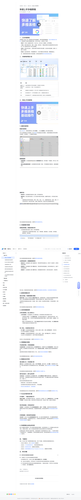

# 快速上手多维表格

> 来源：[飞书帮助中心](https://www.feishu.cn/hc/zh-CN/articles/697278684206)  
> 分类：多维表格 / 快速入门 / 基础介绍  
> 抓取时间：2026-09-22T00:43:28.061Z

## 界面截图

### 文档内配图

1. 配图：https://p1-hera.feishucdn.com/tos-cn-i-jbbdkfciu3/09dea827d2cc4a02b2d8f953804c0b96~tplv-jbbdkfciu3-image:0:0.image
2. 配图：https://p1-hera.feishucdn.com/tos-cn-i-jbbdkfciu3/29002cc0c15b4cb98bc66c0acbb862b0~tplv-jbbdkfciu3-image:0:0.image
3. 配图：https://p1-hera.feishucdn.com/tos-cn-i-jbbdkfciu3/e2c0bf398d4d450ba4d8e8b9037c2c18~tplv-jbbdkfciu3-image:0:0.image
4. 配图：https://p1-hera.feishucdn.com/tos-cn-i-jbbdkfciu3/c93c336daf87438297d0b06d8baa6e60~tplv-jbbdkfciu3-image:0:0.image
5. 配图：https://p1-hera.feishucdn.com/tos-cn-i-jbbdkfciu3/355528673dda48f998b236a7b7d79173~tplv-jbbdkfciu3-image:0:0.image
6. 配图：https://p1-hera.feishucdn.com/tos-cn-i-jbbdkfciu3/d5b64fd8fe5640eba8286d175dd251c2~tplv-jbbdkfciu3-image:0:0.image
7. 配图：https://p1-hera.feishucdn.com/tos-cn-i-jbbdkfciu3/2912f6cf5bbb4d569963521b40125afc~tplv-jbbdkfciu3-image:0:0.image
8. image.png：https://p1-hera.feishucdn.com/tos-cn-i-jbbdkfciu3/ffb5f0a55e8d4526904ddf601e520b26~tplv-jbbdkfciu3-png:0:0.png
9. 配图：https://p1-hera.feishucdn.com/tos-cn-i-jbbdkfciu3/ec0704fb0caf41ceb4bb935727959388~tplv-jbbdkfciu3-image:0:0.image
10. 配图：https://p1-hera.feishucdn.com/tos-cn-i-jbbdkfciu3/acfac3751e3048ffaa5157dd3a4fc964~tplv-jbbdkfciu3-image:0:0.image
11. 配图：https://p1-hera.feishucdn.com/tos-cn-i-jbbdkfciu3/ec33bd6522b3481fa5adc924e409f39e~tplv-jbbdkfciu3-image:0:0.image
12. 配图：https://p1-hera.feishucdn.com/tos-cn-i-jbbdkfciu3/7b33051877234f87a0d4359c3ed3a774~tplv-jbbdkfciu3-image:0:0.image
13. 配图：https://p1-hera.feishucdn.com/tos-cn-i-jbbdkfciu3/9d71d966192b4ab79b3635333b7a3dff~tplv-jbbdkfciu3-image:0:0.image
14. 配图：https://p1-hera.feishucdn.com/tos-cn-i-jbbdkfciu3/9db37c45a2404105a98e567c9569e5df~tplv-jbbdkfciu3-image:0:0.image
15. 配图：https://p1-hera.feishucdn.com/tos-cn-i-jbbdkfciu3/54972ad0ddc84014b67b7385d0837568~tplv-jbbdkfciu3-image:0:0.image
16. 配图：https://p1-hera.feishucdn.com/tos-cn-i-jbbdkfciu3/674437bc982249c1a06872c847942b19~tplv-jbbdkfciu3-image:0:0.image

## 功能定位

本页对应飞书帮助中心「多维表格 / 快速入门 / 基础介绍」下的「快速上手多维表格」。以下需求描述依据官方说明文档提炼，用于指导 DuoWei 对标实现。

## 功能目标

播放 00:00 / 03:28 直播 00:00 进入全屏 1x 0.5x0.75x1x1.5x2x 点击按住可拖动视频

## 文档结构（官方章节）

- 一、认识多维表格​
- 二、多维表格界面介绍​
- 三、快速上手多维表格​
- 创建多维表格​
- 新建多维表格​
- 管理数据表​
- 管理字段​
- 多维度展示数据​
- 按需选择视图，数据呈现更多样​
- 分组筛选排序，数据整理更规范​
- 直观的数据分析​
- 通过仪表盘，构建数据展示看板​
- 及时的数据流转​
- 分享多维表格，线上协同办公​
- 导入导出，多维表格迁移无忧​
- 权限精细化管控​
- 开启高级权限，实现数据隔离​
- 数据自动化同步​
- 通过函数公式，灵活数据计算​
- 操作自动执行，提升业务效率​
- 与企业内部系统打通​
- 打印插件，一键自动排版打印​
- 同步审批数据，实现信息同步​
- 共享数据源，高效复用权威数据​
- 快速搭建企业级业务系统​
- 四、了解更多​
- 五、常见问题​

## 详细功能说明

播放 00:00 / 03:28 直播 00:00 进入全屏 1x 0.5x0.75x1x1.5x2x 点击按住可拖动视频

0.5x

0.75x

1.5x

一、认识多维表格

易协作：实现多人编辑实时同步、批注讨论，历史记录一键溯源，协作更便捷。

个性化：提供丰富的字段、视图、仪表盘、插件能力，根据业务需求灵活搭建定制化的业务系统，用一张表轻松实现个性化业务管理。

自动化：通过自动化能力，无需代码即可快速同步项目进展、自动发送消息通知，解放人力，提升工作效率。

安全性：通过高级权限，可根据需要对行、列进行精细化的权限设置，保障数据安全。

注：多维表格高级权限已升级至新版，具体信息请参考使用多维表格高级权限。

二、多维表格界面介绍

数据表、仪表盘和工作流列表

当前多维表格中已存在的数据表、仪表盘和工作流列表。点击列表中的一个选项，可在右侧将其打开。

指数据的汇总和展现形式，你可以为同一份数据选取不同的可视化方式。

即多维表格的“行”，将不同的数据填入记录中，方便数据的存储和分析。

即多维表格的“列”，多维表格提供丰富的字段类型，满足录入多样数据的需求。

三、快速上手多维表格

00:00 开头介绍

00:10 创建与编辑

02:07 分享与协作

02:40 查看和分析数据

创建多维表格

新建多维表格

管理数据表

新建数据表：在多维表格界面左侧点击 新建数据表 按钮，即可新建一个数据表，用于录入不同的数据。

重命名/复制/删除数据表：点击数据表名称右侧的 ⋮ 图标，可对数据表进行重命名、复制或删除操作。

管理字段

新增字段：点击数据表页面右侧 + 图标，即可新增字段。

编辑字段：双击任意字段名称，在下拉菜单中更改字段类型，编辑字段名称，对字段进行格式设置。

多维表格支持多种字段类型，例如：单选、多选、人员、日期等常规字段；进度、按钮、评分等业务字段；单向/双向关联、创建人等高级字段，满足多样化的数据填写需求。

多维度展示数据

按需选择视图，数据呈现更多样

点击数据表视图右侧的 + 图标，即可新建视图。

多维表格支持 6 种视图来展示数据，包含：表格视图、看板视图、日历视图、甘特视图、画册视图、表单视图。

分组筛选排序，数据整理更规范

数据分组：点击数据表工具栏 分组 按钮，可按任意字段设置分组。支持多个分组条件，按序逐层细化数据。

数据筛选：点击数据表工具栏 筛选 按钮，可按任意字段筛选数据。支持多种筛选方式，满足不同的查阅需求。

数据排序：点击数据表工具栏 排序 按钮，实现数据的有序排列，更支持自动排序、多级排序。

直观的数据分析

通过仪表盘，构建数据展示看板

及时的数据流转

分享多维表格，线上协同办公

分享多维表格：点击数据表右上角 分享 按钮，将多维表格分享给同事进行协作。

多维表格分享操作，支持 邀请协作者，也支持通过链接的形式，直接发送给协作者，并设置分享范围。同时，还支持对多维表格的查阅权限进行限制，如谁可以复制、创建副本、管理协作者等。

要缩小分享范围或取消分享，只需将 链接分享 调整为所在组织或 未开启，并在 管理协作者 中移除已被添加为协作者的用户即可。

250px|700px|reset

导入导出，多维表格迁移无忧

导入数据：在多维表格数据表界面，点击右上角的 + 图标，选择 上传本地文件，可将本地 Excel 等文件直接导入为多维表格。

导出数据：在多维表格数据表界面，点击右上角的 ··· 按钮，选择 导出 即可。支持导出为 Excel/CSV 或多维表格文件，实现不同格式间的数据迁移。

权限精细化管控

开启高级权限，实现数据隔离

数据自动化同步

通过函数公式，灵活数据计算

操作自动执行，提升业务效率

新增任务时，自动分配负责人并发送通知。

自动排查未完成全部巡店记录的负责人，并发送提醒。

用自动化流程创建任务、日程和群组

与企业内部系统打通

打印插件，一键自动排版打印

同步审批数据，实现信息同步

共享数据源，高效复用权威数据

快速搭建企业级业务系统

四、了解更多

点击进入帮助中心，学习 多维表格 功能操作。

点击进入 飞书多维表格研究所，了解多维表格更多妙用。

点击进入 多维表格训练营，查看更多视频教程。

点击进入 多维表格模板社区 Base Templates Community ，查看更多实用模板。

五、常见问题

00:00

03:28

进入全屏

0.5x0.75x1x1.5x2x

点击按住可拖动视频

一、认识多维表格多维表格（Base）是一款表格形态的在线数据库，用来存储和管理数据。区别于常规的电子表格，多维表格不仅能实现数据的存储、分析及可视化，还具有以下优势：易协作：实现多人编辑实时同步、批注讨论，历史记录一键溯源，协作更便捷。个性化：提供丰富的字段、视图、仪表盘、插件能力，根据业务需求灵活搭建定制化的业务系统，用一张表轻松实现个性化业务管理。自动化：通过自动化能力，无需代码即可快速同步项目进展、自动发送消息通知，解放人力，提升工作效率。安全性：通过高级权限，可根据需要对行、列进行精细化的权限设置，保障数据安全。注：多维表格高级权限已升级至新版，具体信息请参考使用多维表格高级权限。二、多维表格界面介绍250px|700px|reset模块描述数据表、仪表盘和工作流列表当前多维表格中已存在的数据表、仪表盘和工作流列表。点击列表中的一个选项，可在右侧将其打开。视图指数据的汇总和展现形式，你可以为同一份数据选取不同的可视化方式。记录即多维表格的“行”，将不同的数据填入记录中，方便数据的存储和分析。字段即多维表格的“列”，多维表格提供丰富的字段类型，满足录入多样数据的需求。三、快速上手多维表格

章节介绍

00:00 开头介绍00:10 创建与编辑02:07 分享与协作02:40 查看和分析数据

创建多维表格新建多维表格在云文档主页，将鼠标悬停在左上角的 新建 上，点击 多维表格，即可创建多维表格。你可以选择新建空白多维表格，或从模板库中挑选最适合你的模板。多维表格模板支持项目统筹、任务跟进、活动策划、个人管理等多种需求。250px|700px|reset管理数据表新建数据表：在多维表格界面左侧点击 新建数据表 按钮，即可新建一个数据表，用于录入不同的数据。重命名/复制/删除数据表：点击数据表名称右侧的 ⋮ 图标，可对数据表进行重命名、复制或删除操作。250px|700px|reset管理字段新增字段：点击数据表页面右侧 + 图标，即可新增字段。编辑字段：双击任意字段名称，在下拉菜单中更改字段类型，编辑字段名称，对字段进行格式设置。多维表格支持多种字段类型，例如：单选、多选、人员、日期等常规字段；进度、按钮、评分等业务字段；单向/双向关联、创建人等高级字段，满足多样化的数据填写需求。250px|700px|reset有关多维表格字段的具体信息，请参考使用多维表格字段。多维度展示数据按需选择视图，数据呈现更多样点击数据表视图右侧的 + 图标，即可新建视图。多维表格支持 6 种视图来展示数据，包含：表格视图、看板视图、日历视图、甘特视图、画册视图、表单视图。250px|700px|reset有关多维表格视图的具体信息，请参考使用多维表格视图。分组筛选排序，数据整理更规范数据分组：点击数据表工具栏 分组 按钮，可按任意字段设置分组。支持多个分组条件，按序逐层细化数据。数据筛选：点击数据表工具栏 筛选 按钮，可按任意字段筛选数据。支持多种筛选方式，满足不同的查阅需求。数据排序：点击数据表工具栏 排序 按钮，实现数据的有序排列，更支持自动排序、多级排序。250px|700px|reset有关分组、筛选和排序的具体信息，请参考使用多维表格分组和筛选、在多维表格中使用排序。直观的数据分析通过仪表盘，构建数据展示看板新建仪表盘：点击左下角导航栏 新建仪表盘 按钮，选择图表类型。仪表盘支持选择数据源及数据范围，自由设置横轴和纵轴的数据维度、挑选适合的配色方案，数据分析实用又美观。多维表格支持按需添加柱状图、折线图、饼图、条形图、组合图等多种图表。支持拖动图表，改变图表大小。250px|700px|reset有关多维表格仪表盘的具体信息，请参考使用多维表格仪表盘。及时的数据流转分享多维表格，线上协同办公分享多维表格：点击数据表右上角 分享 按钮，将多维表格分享给同事进行协作。多维表格分享操作，支持 邀请协作者，也支持通过链接的形式，直接发送给协作者，并设置分享范围。同时，还支持对多维表格的查阅权限进行限制，如谁可以复制、创建副本、管理协作者等。要缩小分享范围或取消分享，只需将 链接分享 调整为所在组织或 未开启，并在 管理协作者 中移除已被添加为协作者的用户即可。250px|700px|reset导入导出，多维表格迁移无忧导入数据：在多维表格数据表界面，点击右上角的 + 图标，选择 上传本地文件，可将本地 Excel 等文件直接导入为多维表格。导出数据：在多维表格数据表界面，点击右上角的 ··· 按钮，选择 导出 即可。支持导出为 Excel/CSV 或多维表格文件，实现不同格式间的数据迁移。250px|700px|reset有关导入与导出的具体信息，请参考多维表格的导入与导出。权限精细化管控开启高级权限，实现数据隔离开启高级权限：点击数据表页面右上角 高级权限 图标，在弹窗中点击 开启高级权限，并自定义角色权限。如你需要为协作者添加权限，点击 + 添加自定义角色，根据需求设置仪表盘或数据表权限。高级权限支持控制行/列数据仅对部分人可见，点击实现成员间数据隔离了解更多。250px|700px|reset有关权限管理的具体信息，请参考使用多维表格高级权限。数据自动化同步通过函数公式，灵活数据计算添加公式：点击数据表右侧的 + 图标，选择 字段类型，选择 公式，点击 确定，完成新增公式字段。通过丰富的函数可以实现数据的自动计算，高效处理数据，点击多维表格公式字段概述了解更多。250px|700px|reset有多维表格支持函数的具体信息，请参考多维表格公式函数大全。操作自动执行，提升业务效率开启自动化：点击数据表右上角 自动化 图标，选择 创建自定义流程 或推荐流程，设置触发条件和执行操作，多维表格即可按照设定的自动运行规则执行操作，充分缓解反复填写维护多维表格的压力，释放人力。自动化的常用场景包括但不限于：新增任务时，自动分配负责人并发送通知。自动排查未完成全部巡店记录的负责人，并发送提醒。用自动化流程创建任务、日程和群组250px|700px|reset有多维表格自动化和工作流的具体信息，请参考使用多维表格自动化流程和使用多维表格工作流。与企业内部系统打通打印插件，一键自动排版打印排版打印插件：选中数据表中任意记录，点击索引列（左起第一列）的 查看详情 图标，添加 排版打印插件。支持自定义排版，轻松实现打印页面灵活布局，满足线下审批、留档打印等需求。250px|700px|reset同步审批数据，实现信息同步开启同步：点击数据表左下角 从其他数据源同步 > 应用 > 飞书审批，选择待同步的审批流即可，便捷同步审批中的核心数据和信息，快速整理审批数据。具体信息请参考同步审批数据到多维表格。250px|700px|reset共享数据源，高效复用权威数据开启共享：点击左下角 从其他数据源同步 按钮，进入组织共享数据源应用，可以查看和使用被共享的组织内数据源，引用数据后进行加工，有效提升信息处理效率。具体信息请参考使用多维表格共享组织内数据源了解更多。250px|700px|reset快速搭建企业级业务系统基于已创建的多维表格，你可以使用多维表格应用模式，通过简单的拖、拉、拽创建企业级及业务系统。无需技术背景，业务人员也能快速构建符合实际业务需求的交互界面和流程。应用模式提供了面向用户的操作界面，多维表格提供了底层数据库和运行引擎。一个应用可关联多个多维表格文件，二者相辅相成，共同构成完整的业务系统。具体信息请参考使用多维表格应用模式（内测中）。250px|700px|reset四、了解更多现在，你已经了解了多维表格的重点功能。点击下方链接，探索其他多维表格相关知识。点击进入帮助中心，学习 多维表格 功能操作。点击进入 飞书多维表格研究所，了解多维表格更多妙用。点击进入 多维表格训练营，查看更多视频教程。点击进入 多维表格模板社区 Base Templates Community ，查看更多实用模板。五、常见问题

模块 | 描述

数据表、仪表盘和工作流列表 | 当前多维表格中已存在的数据表、仪表盘和工作流列表。点击列表中的一个选项，可在右侧将其打开。

视图 | 指数据的汇总和展现形式，你可以为同一份数据选取不同的可视化方式。

记录 | 即多维表格的“行”，将不同的数据填入记录中，方便数据的存储和分析。

字段 | 即多维表格的“列”，多维表格提供丰富的字段类型，满足录入多样数据的需求。

## 实现要点（对标 DuoWei）

1. **入口与信息架构**：在产品中明确该能力所属模块（快速入门 / 基础介绍），并保证用户可从对应导航触达。
2. **核心交互**：按上文「详细功能说明」还原主要操作路径；截图中出现的按钮、字段、面板命名尽量与飞书语义一致或可映射。
3. **数据与权限**：若文档涉及可见范围、可编辑范围、分享或高级权限，实现时需落到角色/成员模型，并保证 API/MCP 与 UI 权限一致。
4. **边界与上限**：若文档提到数量上限、格式限制、导入导出约束，需在实现与错误提示中体现。
5. **验收**：以本页截图场景为用例，完成「能打开 / 能配置 / 能保存 / 能被 Agent 读写（如适用）」四项检查。

## 原始摘录摘要

> 播放 00:00 / 03:28 直播 00:00 进入全屏 1x 0.5x0.75x1x1.5x2x 点击按住可拖动视频 0.5x 0.75x 1.5x 一、认识多维表格 易协作：实现多人编辑实时同步、批注讨论，历史记录一键溯源，协作更便捷。 个性化：提供丰富的字段、视图、仪表盘、插件能力，根据业务需求灵活搭建定制化的业务系统，用一张表轻松实现个性化业务管理。 自动化：通过自动化能力，无需代码即可快速同步项目进展、自动发送消息通知，解放人力，提升工作效率。 安全性：通过高级权限，可根据需要对行、列进行精细化的权限设置，保障数据安全。 注：多维表格高级权限已升级至新版，具体信息请参考使用多维表格高级权限。 二、多维表格界面介绍 数据表、仪表盘和工作流列表 当前多维表格中已存在的数据表、仪表盘和工作流列表。点击列表中的一个选项，可在右侧将其打开。 指数据的汇总和展现形式，你可以为同一份数据选取不同的可视化方式。 即多维表格的“行”，将不同的数据填入记录中，方便数据的存储和分析。 即多维表格的“列”，多维表格提供丰富的字段类型，满足录入多样数据的需求。 三、快速上手多维表格 00:00 开头介绍 00:10 创建与编辑 02:07 分享与协作 02:40 查看和分析数据 创建多维表格 新建多维表格 管理数据表 新建数据表：在多维表格界面左侧点击 新建数据表 按钮，即可新建一个数据表，用于录入不同的数据。 重命名/复制/删除数据表：点击数据表名称右侧的 ⋮ 图标，可对数据表进行重命名、复制或删除操作。 管理字段 新增字段：点击数据表页面右侧 + 图标，即可新增字段。 编辑字段：双击任意字段名称，在下拉菜单中更改字段类型，编辑字段名称，对字段进行格式设置。 多维表格支持多种字段类型，例如：单选、多选、人员、日期等常规字段；进度、按钮、评分等业务字段；单向/双向关联、创建人等高级字段…

## 元数据

- article_id: `7288632904585560065`
- category_id: `7225072370607013890`
- path: `/hc/zh-CN/articles/697278684206`
- extracted_text_length: 4503
