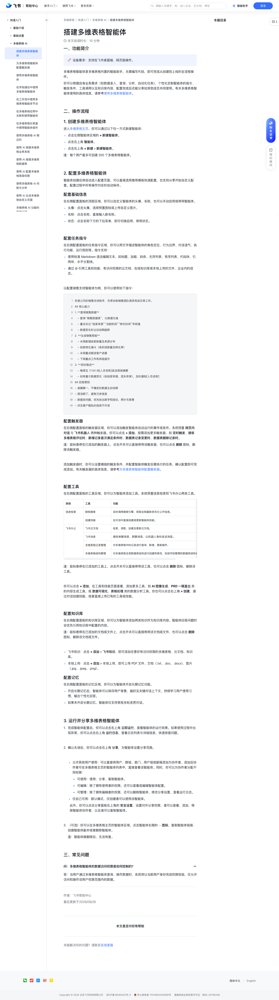

# 搭建多维表格智能体

> 来源：[飞书帮助中心](https://www.feishu.cn/hc/zh-CN/articles/333906895867)  
> 分类：多维表格 / 快速入门 / 多维表格 AI  
> 抓取时间：2026-09-22T01:16:00.868Z

## 界面截图

### 文档内配图

1. 配图：https://p1-hera.feishucdn.com/tos-cn-i-jbbdkfciu3/89c9a27aedc74ae198e7a24690c4ba85~tplv-jbbdkfciu3-image:0:0.image
2. 配图：https://p1-hera.feishucdn.com/tos-cn-i-jbbdkfciu3/6ff468bb767a484d8b7def3b2ad16d37~tplv-jbbdkfciu3-image:0:0.image
3. 配图：https://p1-hera.feishucdn.com/tos-cn-i-jbbdkfciu3/17f0fa47ac5a43fab4a1f50274d6f51a~tplv-jbbdkfciu3-image:0:0.image
4. 配图：https://p1-hera.feishucdn.com/tos-cn-i-jbbdkfciu3/a01e1528680a43009782b2e42eab8e7c~tplv-jbbdkfciu3-image:0:0.image
5. 配图：https://p1-hera.feishucdn.com/tos-cn-i-jbbdkfciu3/970a25d6767043cc9ede741b0507cd2a~tplv-jbbdkfciu3-image:0:0.image
6. 配图：https://p1-hera.feishucdn.com/tos-cn-i-jbbdkfciu3/d2f06aa411f14e27a59e512639114f39~tplv-jbbdkfciu3-image:0:0.image
7. 配图：https://p1-hera.feishucdn.com/tos-cn-i-jbbdkfciu3/daf9e6fd300640e59be9fc673008cb90~tplv-jbbdkfciu3-image:0:0.image
8. 配图：https://p1-hera.feishucdn.com/tos-cn-i-jbbdkfciu3/bd13345c4372463a8fac7394c570fba2~tplv-jbbdkfciu3-image:0:0.image
9. 配图：https://p1-hera.feishucdn.com/tos-cn-i-jbbdkfciu3/a6d7257011b5452eb69d6fb76370f5f4~tplv-jbbdkfciu3-image:0:0.image
10. 配图：https://p1-hera.feishucdn.com/tos-cn-i-jbbdkfciu3/370ab1fa92964a7b92d2518fecd69d34~tplv-jbbdkfciu3-image:0:0.image
11. 配图：https://p1-hera.feishucdn.com/tos-cn-i-jbbdkfciu3/98affbd3fe35419ca8bf9ee8be612e2e~tplv-jbbdkfciu3-image:0:0.image
12. 配图：https://p1-hera.feishucdn.com/tos-cn-i-jbbdkfciu3/5ce1450091f24eeb874fcd470661c31a~tplv-jbbdkfciu3-image:0:0.image
13. 配图：https://p1-hera.feishucdn.com/tos-cn-i-jbbdkfciu3/df7840549f45480bb9515d5217bce457~tplv-jbbdkfciu3-image:0:0.image
14. 配图：https://p1-hera.feishucdn.com/tos-cn-i-jbbdkfciu3/4b32757482df469a9b97d7f6f5344dec~tplv-jbbdkfciu3-image:0:0.image

## 功能定位

本页对应飞书帮助中心「多维表格 / 快速入门 / 多维表格 AI」下的「搭建多维表格智能体」。以下需求描述依据官方说明文档提炼，用于指导 DuoWei 对标实现。

## 功能目标

一、功能简介

## 文档结构（官方章节）

- 一、功能简介​
- 二、操作流程​
- 创建多维表格智能体​
- 配置多维表格智能体​
- 配置基础信息​
- 配置任务指令​
- 配置触发器​
- 配置工具​
- 配置知识库​
- 配置记忆​
- 运行并分享多维表格智能体​
- 三、常见问题​

## 详细功能说明

一、功能简介

二、操作流程

创建多维表格智能体

点击左侧智能体区域的 + 新建智能体。

点击右上角 智能体。

点击右上角 + 新建 > 新建智能体。

配置多维表格智能体

配置基础信息

头像：点击头像，选择预置图标或上传自定义图片。

名称：点击名称，直接输入新名称。

状态：点击名称下方的下拉菜单，即可切换启用、停用状态。

配置任务指令

使用标准 Markdown 语法编辑文本，如标题、加粗、斜体、无序列表、有序列表、代码块、引用块、水平分割线。

通过 @ 引用工具和技能、有访问权限的云文档、在线知识库或本地上传的文件、企业内的成员。

配置触发器

配置工具

信息检索

联网搜索

实时调用搜索引擎，获取全网最新资讯与公开信息。

创建技能

在对话中直接创建或更新智能体技能。

飞书办公

飞书云文档

检索、读取、创建及更新云文档。

飞书消息

接收单聊消息、群聊消息，以机器人身份发送消息。

多维表格记录管理

对多维表格中的记录进行查询、新增、更新操作。

多维表格结构管理

对多维表格及其数据表结构进行创建和修改，包括字段管理和数据表结构调整。

配置知识库

飞书知识：点击 + 添加 > 飞书知识，即可添加任意你有访问权限的多维表格、云文档、知识库。

本地上传：点击 + 添加 > 本地上传，即可上传 PDF 文件、文档（.txt、.doc、.docx）、图片（.jpg、.jpeg、.png）。

配置记忆

开启长期记忆后，智能体可以保存用户背景、偏好及关键对话上下文，持续学习用户使用习惯，输出个性化回答。

如果未开启长期记忆，智能体仅支持常规多轮连贯对话。

运行并分享多维表格智能体

完成智能体配置后，你可以点击右上角 立即运行，查看智能体的运行效果。如果使用过程中出现异常，你可以点击右上角 运行日志，查看日志列表与详细信息，快速排查问题。

确认无误后，你可以点击右上角 分享，为智能体设置分享范围。

允许其他用户使用：可以直接将用户、群组、部门、用户组或邮箱添加为协作者，添加后协作者可在多维表格主页的智能体列表中，直接查看该智能体。同时，你可以为协作者分配不同权限：

可使用：使用、分享、复制智能体。

可编辑：除了拥有使用者的权限，还可以查看或编辑智能体配置。

可管理：除了拥有编辑者的权限，还可以删除智能体、修改分享设置、查看运行日志。

仅自己可用：默认模式，仅创建者可以使用该智能体。

（可选）你可以在多维表格主页的智能体区域，点击智能体右侧的 ··· 图标，复制智能体链接、创建智能体副本或者删除智能体。

注：智能体被删除后，无法恢复。

三、常见问题

问：多维表格智能体的数据访问权限是如何控制的？

答：当用户通过多维表格智能体查询、操作数据时，系统将以当前用户身份完成权限校验，仅允许访问和操作该用户权限范围内的数据。

类别 | 工具 | 功能

信息检索 | 联网搜索 | 实时调用搜索引擎，获取全网最新资讯与公开信息。

| 创建技能 | 在对话中直接创建或更新智能体技能。

飞书办公 | 飞书云文档 | 检索、读取、创建及更新云文档。

| 飞书消息 | 接收单聊消息、群聊消息，以机器人身份发送消息。

| 多维表格记录管理 | 对多维表格中的记录进行查询、新增、更新操作。

| 多维表格结构管理 | 对多维表格及其数据表结构进行创建和修改，包括字段管理和数据表结构调整。

## 实现要点（对标 DuoWei）

1. **入口与信息架构**：在产品中明确该能力所属模块（快速入门 / 多维表格 AI），并保证用户可从对应导航触达。
2. **核心交互**：按上文「详细功能说明」还原主要操作路径；截图中出现的按钮、字段、面板命名尽量与飞书语义一致或可映射。
3. **数据与权限**：若文档涉及可见范围、可编辑范围、分享或高级权限，实现时需落到角色/成员模型，并保证 API/MCP 与 UI 权限一致。
4. **边界与上限**：若文档提到数量上限、格式限制、导入导出约束，需在实现与错误提示中体现。
5. **验收**：以本页截图场景为用例，完成「能打开 / 能配置 / 能保存 / 能被 Agent 读写（如适用）」四项检查。

## 原始摘录摘要

> 一、功能简介 二、操作流程 创建多维表格智能体 点击左侧智能体区域的 + 新建智能体。 点击右上角 智能体。 点击右上角 + 新建 > 新建智能体。 配置多维表格智能体 配置基础信息 头像：点击头像，选择预置图标或上传自定义图片。 名称：点击名称，直接输入新名称。 状态：点击名称下方的下拉菜单，即可切换启用、停用状态。 配置任务指令 使用标准 Markdown 语法编辑文本，如标题、加粗、斜体、无序列表、有序列表、代码块、引用块、水平分割线。 通过 @ 引用工具和技能、有访问权限的云文档、在线知识库或本地上传的文件、企业内的成员。 配置触发器 配置工具 信息检索 联网搜索 实时调用搜索引擎，获取全网最新资讯与公开信息。 创建技能 在对话中直接创建或更新智能体技能。 飞书办公 飞书云文档 检索、读取、创建及更新云文档。 飞书消息 接收单聊消息、群聊消息，以机器人身份发送消息。 多维表格记录管理 对多维表格中的记录进行查询、新增、更新操作。 多维表格结构管理 对多维表格及其数据表结构进行创建和修改，包括字段管理和数据表结构调整。 配置知识库 飞书知识：点击 + 添加 > 飞书知识，即可添加任意你有访问权限的多维表格、云文档、知识库。 本地上传：点击 + 添加 > 本地上传，即可上传 PDF 文件、文档（.txt、.doc、.docx）、图片（.jpg、.jpeg、.png）。 配置记忆 开启长期记忆后，智能体可以保存用户背景、偏好及关键对话上下文，持续学习用户使用习惯，输出个性化回答。 如果未开启长期记忆，智能体仅支持常规多轮连贯对话。 运行并分享多维表格智能体 完成智能体配置后，你可以点击右上角 立即运行，查看智能体的运行效果。如果使用过程中出现异常，你可以点击右上角 运行日志，查看日志列表与详细信息，快速排查问题。 确认无误后，你可以点击右上角 分享，为智能体设置分享范围。…

## 元数据

- article_id: `7639645269843528916`
- category_id: `7630766419524717789`
- path: `/hc/zh-CN/articles/333906895867`
- extracted_text_length: 1392
