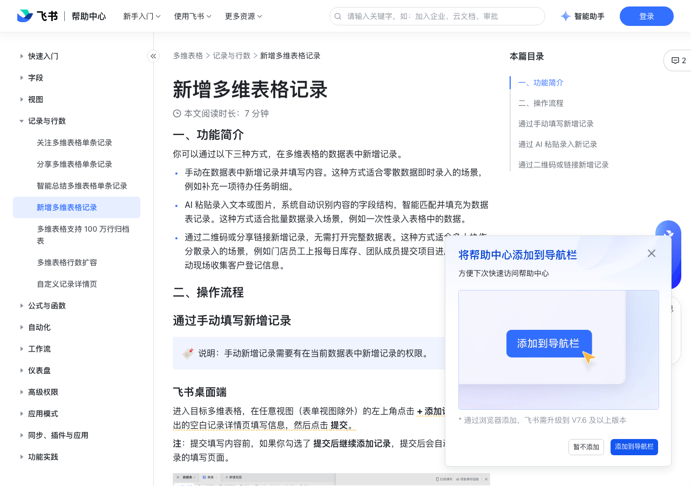

# 新增多维表格记录

> 来源：[飞书帮助中心](https://www.feishu.cn/hc/zh-CN/articles/333406176860)  
> 分类：多维表格 / 记录与行数  
> 抓取时间：2026-09-22T01:23:46.444Z

## 界面截图

### 文档内配图

1. 配图：https://p1-hera.feishucdn.com/tos-cn-i-jbbdkfciu3/eefae44718ae49f9b2785e0567eeec92~tplv-jbbdkfciu3-image:0:0.image
2. 配图：https://p1-hera.feishucdn.com/tos-cn-i-jbbdkfciu3/f3117147676e46bb995812b4d5fda548~tplv-jbbdkfciu3-image:0:0.image
3. 配图：https://p1-hera.feishucdn.com/tos-cn-i-jbbdkfciu3/14aa9f89e82140b4954dce9a46e81083~tplv-jbbdkfciu3-image:0:0.image
4. 配图：https://p1-hera.feishucdn.com/tos-cn-i-jbbdkfciu3/a834d7ff44584aab932c888334e2581d~tplv-jbbdkfciu3-image:0:0.image

## 功能定位

本页对应飞书帮助中心「多维表格 / 记录与行数」下的「新增多维表格记录」。以下需求描述依据官方说明文档提炼，用于指导 DuoWei 对标实现。

## 功能目标

一、功能简介

## 文档结构（官方章节）

- 一、功能简介​
- 二、操作流程​
- 通过手动填写新增记录​
- 飞书桌面端​
- 飞书移动端​
- 通过 AI 粘贴录入新记录​
- 通过二维码或链接新增记录​

## 详细功能说明

一、功能简介

手动在数据表中新增记录并填写内容。这种方式适合零散数据即时录入的场景，例如补充一项待办任务明细。

AI 粘贴录入文本或图片，系统自动识别内容的字段结构，智能匹配并填充为数据表记录。这种方式适合批量数据录入场景，例如一次性录入表格中的数据。

通过二维码或分享链接新增记录，无需打开完整数据表。这种方式适合多人协作分散录入的场景，例如门店员工上报每日库存、团队成员提交项目进度反馈、活动现场收集客户登记信息。

二、操作流程

通过手动填写新增记录

飞书桌面端

飞书移动端

通过 AI 粘贴录入新记录

支持粘贴的文本格式包括纯文本、Markdown，建议使用结构化的文本，如直接复制表格中的数据；文本大小上限为 10,000 字符。

支持粘贴的图片格式包括 PNG、JPG、JPEG；图片大小上限为 10 MB。

单次粘贴最多支持 3,000 行数据，200 列数据；同时受用户当前使用版本的权益限制，具体信息请参考多维表格付费权益说明。超出部分将无法录入。

AI 粘贴录入操作支持在桌面端、网页版操作，且你需要有在当前数据表中新增及编辑字段、记录的权限。

AI 粘贴录入功能每月均有一定的免费使用额度。超出免费额度后，可以继续使用企业购买的 AI 额度，具体信息请参考多维表格 AI 功能使用 AI 额度的说明。

进入目标多维表格，通过以下任一方式将文本或图片内容粘贴到数据表。

方式 1：

在任意视图（表单视图除外）的左上角点击 + 添加记录 后的 下拉 图标 > AI 粘贴录入。

250px|700px|reset

在弹窗中，你可以直接粘贴复制好的文本或图片；你也可以通过拖拽或者点击 上传图片，上传本地图片。

注：如果想替换已粘贴、上传的文本或图片，可将鼠标悬停在对应的内容上方，点击 清除 图标。清空当前内容后，可以重新粘贴、上传内容。

确认好内容后，点击 识别并录入到当前数据表。

系统会自动识别录入的文本或图片内容，当前仅支持录入文本、数字、日期、单选、多选类型的数据。

当录入的内容与当前数据表字段完全一致，或者当前数据表为空时，数据将直接录入到数据表中。当前数据表为空时，系统会自动生成字段名称、字段类型。

当录入的内容与当前数据表字段不一致时，需要在数据表确认弹窗中再次选择 新建数据表并录入 或 录入到当前数据表。如果你想取消录入操作，可在弹窗中点击 取消 或 X 图标，并进行二次确认。

如果选择 新建数据表并录入，数据将直接录入到新的数据表中。系统会自动生成字段名称、字段类型。

如果选择 录入到当前数据表，需要在弹窗中配置字段对应关系。确认字段关系后，系统会自动将数据录入到当前数据表中对应的字段位置，未配置对应关系的字段将不会录入到现有数据表。

通过二维码或链接新增记录

获取并分享二维码或链接。

桌面端：进入目标多维表格，在任意视图（表单视图除外）的左上角点击 + 添加记录。在弹出的记录详情页，你可以进行如下操作：

点击右上角 扫码填写，即可下载或复制二维码。

点击右上角 获取填写链接，即可复制链接。

移动端：进入目标多维表格，在任意视图（表单视图除外）的右下角点击 + 图标。在弹出的记录详情页，点击右上角 链接 图标，选择 发送至会话、复制链接、二维码 中的任一方式将记录填写链接或二维码直接分享给他人。

当协作者收到链接或二维码后，无需打开多维表格，可以直接填写内容，快捷新增记录。

链接：在桌面端或移动端点击链接中的 立即添加，在弹出的空白记录详情页填写内容并提交。

二维码：使用移动端扫描二维码，在弹出的空白记录详情页填写内容并提交。

## 实现要点（对标 DuoWei）

1. **入口与信息架构**：在产品中明确该能力所属模块（记录与行数），并保证用户可从对应导航触达。
2. **核心交互**：按上文「详细功能说明」还原主要操作路径；截图中出现的按钮、字段、面板命名尽量与飞书语义一致或可映射。
3. **数据与权限**：若文档涉及可见范围、可编辑范围、分享或高级权限，实现时需落到角色/成员模型，并保证 API/MCP 与 UI 权限一致。
4. **边界与上限**：若文档提到数量上限、格式限制、导入导出约束，需在实现与错误提示中体现。
5. **验收**：以本页截图场景为用例，完成「能打开 / 能配置 / 能保存 / 能被 Agent 读写（如适用）」四项检查。

## 原始摘录摘要

> 一、功能简介 手动在数据表中新增记录并填写内容。这种方式适合零散数据即时录入的场景，例如补充一项待办任务明细。 AI 粘贴录入文本或图片，系统自动识别内容的字段结构，智能匹配并填充为数据表记录。这种方式适合批量数据录入场景，例如一次性录入表格中的数据。 通过二维码或分享链接新增记录，无需打开完整数据表。这种方式适合多人协作分散录入的场景，例如门店员工上报每日库存、团队成员提交项目进度反馈、活动现场收集客户登记信息。 二、操作流程 通过手动填写新增记录 飞书桌面端 飞书移动端 通过 AI 粘贴录入新记录 支持粘贴的文本格式包括纯文本、Markdown，建议使用结构化的文本，如直接复制表格中的数据；文本大小上限为 10,000 字符。 支持粘贴的图片格式包括 PNG、JPG、JPEG；图片大小上限为 10 MB。 单次粘贴最多支持 3,000 行数据，200 列数据；同时受用户当前使用版本的权益限制，具体信息请参考多维表格付费权益说明。超出部分将无法录入。 AI 粘贴录入操作支持在桌面端、网页版操作，且你需要有在当前数据表中新增及编辑字段、记录的权限。 AI 粘贴录入功能每月均有一定的免费使用额度。超出免费额度后，可以继续使用企业购买的 AI 额度，具体信息请参考多维表格 AI 功能使用 AI 额度的说明。 进入目标多维表格，通过以下任一方式将文本或图片内容粘贴到数据表。 方式 1： 在任意视图（表单视图除外）的左上角点击 + 添加记录 后的 下拉 图标 > AI 粘贴录入。 250px|700px|reset 在弹窗中，你可以直接粘贴复制好的文本或图片；你也可以通过拖拽或者点击 上传图片，上传本地图片。 注：如果想替换已粘贴、上传的文本或图片，可将鼠标悬停在对应的内容上方，点击 清除 图标。清空当前内容后，可以重新粘贴、上传内容。 确认好内容后，点击 识别并录入到当前数据表。…

## 元数据

- article_id: `7313874682468581404`
- category_id: `7341334412564381698`
- path: `/hc/zh-CN/articles/333406176860`
- extracted_text_length: 1494
