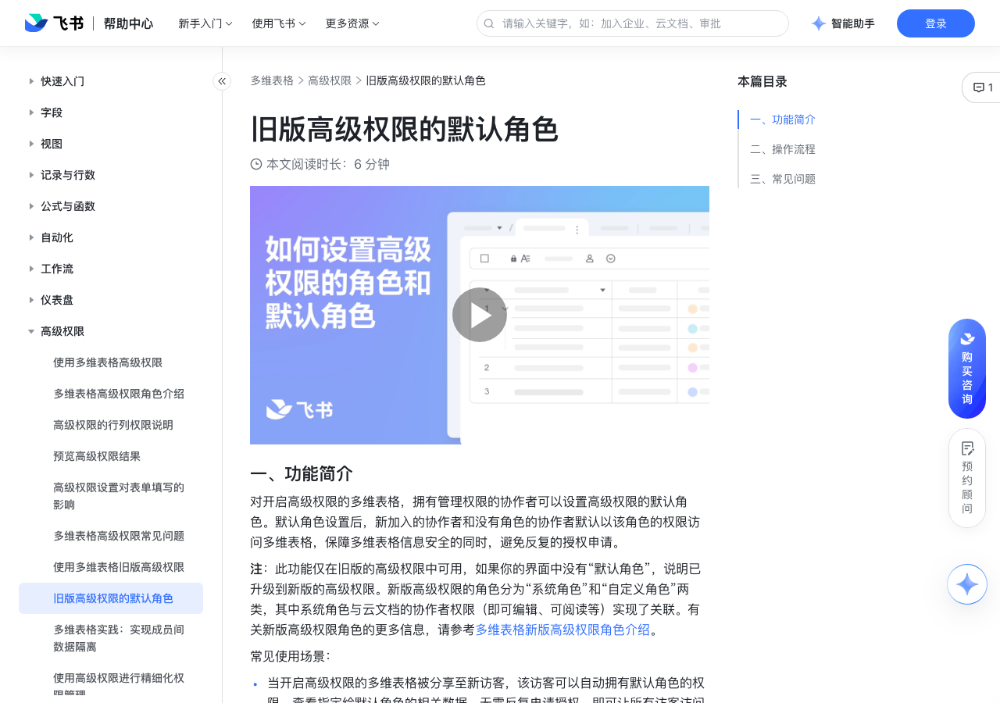

# 旧版高级权限的默认角色

> 来源：[飞书帮助中心](https://www.feishu.cn/hc/zh-CN/articles/173353144094)  
> 分类：多维表格 / 高级权限  
> 抓取时间：2026-09-22T01:26:31.294Z

## 界面截图

### 文档内配图

1. 配图：https://p1-hera.feishucdn.com/tos-cn-i-jbbdkfciu3/89b85b38fabf4f76943b725fa781878e~tplv-jbbdkfciu3-image:0:0.image

## 功能定位

本页对应飞书帮助中心「多维表格 / 高级权限」下的「旧版高级权限的默认角色」。以下需求描述依据官方说明文档提炼，用于指导 DuoWei 对标实现。

## 功能目标

播放 00:00 / 00:00 直播 00:00 进入全屏 1x 0.5x0.75x1x1.5x2x 点击按住可拖动视频

## 文档结构（官方章节）

- 一、功能简介​
- 二、操作流程​
- 三、常见问题​

## 详细功能说明

播放 00:00 / 00:00 直播 00:00 进入全屏 1x 0.5x0.75x1x1.5x2x 点击按住可拖动视频

0.5x

0.75x

1.5x

一、功能简介

当开启高级权限的多维表格被分享至新访客，该访客可以自动拥有默认角色的权限，查看指定给默认角色的相关数据，无需反复申请授权，即可让所有访客访问指定数据。

在开启高级权限的多维表格中，当自定义角色被解散，解散后的角色成员可继承默认角色的权限，仅可查阅默认角色指定的数据。

二、操作流程

首次开启高级权限的多维表格，在多维表格高级权限设置页面，系统默认 普通用户 角色，为高级权限协作者的默认角色。

点击 普通用户 > 修改角色权限 按钮，按需求完成默认角色的阅读、编辑权限配置。

点击 普通用户 > +添加成员 按钮，添加普通用户的成员。

设置 协作者默认角色 时，系统默认为 普通用户，如需选择其他角色，可点击 +添加自定义角色 按钮，创建符合需求的自定义角色，后设置为默认角色。

设置 协作者默认角色 为 禁止访问 时，通过链接访问和被邀请的没有指定角色的协作者，均无法看到多维表格内容，需要申请高级权限并通过后，才能访问多维表格内容。

三、常见问题

问：关闭高级权限后，文档协作者的权限会受到影响吗？

答：关闭高级权限后，协作者权限默认回归到文档的可编辑、可阅读权限。

问：高级权限中最多可以添加多少个自定义角色？

答：50 个。

问：最多可以设置多少默认角色？

答： 1 个，但默认角色中可以有多名成员。

问：谁可以开启高级权限？

答：拥有管理权限的协作者。

问：谁可以设置默认角色？

## 实现要点（对标 DuoWei）

1. **入口与信息架构**：在产品中明确该能力所属模块（高级权限），并保证用户可从对应导航触达。
2. **核心交互**：按上文「详细功能说明」还原主要操作路径；截图中出现的按钮、字段、面板命名尽量与飞书语义一致或可映射。
3. **数据与权限**：若文档涉及可见范围、可编辑范围、分享或高级权限，实现时需落到角色/成员模型，并保证 API/MCP 与 UI 权限一致。
4. **边界与上限**：若文档提到数量上限、格式限制、导入导出约束，需在实现与错误提示中体现。
5. **验收**：以本页截图场景为用例，完成「能打开 / 能配置 / 能保存 / 能被 Agent 读写（如适用）」四项检查。

## 原始摘录摘要

> 播放 00:00 / 00:00 直播 00:00 进入全屏 1x 0.5x0.75x1x1.5x2x 点击按住可拖动视频 0.5x 0.75x 1.5x 一、功能简介 当开启高级权限的多维表格被分享至新访客，该访客可以自动拥有默认角色的权限，查看指定给默认角色的相关数据，无需反复申请授权，即可让所有访客访问指定数据。 在开启高级权限的多维表格中，当自定义角色被解散，解散后的角色成员可继承默认角色的权限，仅可查阅默认角色指定的数据。 二、操作流程 首次开启高级权限的多维表格，在多维表格高级权限设置页面，系统默认 普通用户 角色，为高级权限协作者的默认角色。 点击 普通用户 > 修改角色权限 按钮，按需求完成默认角色的阅读、编辑权限配置。 点击 普通用户 > +添加成员 按钮，添加普通用户的成员。 设置 协作者默认角色 时，系统默认为 普通用户，如需选择其他角色，可点击 +添加自定义角色 按钮，创建符合需求的自定义角色，后设置为默认角色。 设置 协作者默认角色 为 禁止访问 时，通过链接访问和被邀请的没有指定角色的协作者，均无法看到多维表格内容，需要申请高级权限并通过后，才能访问多维表格内容。 三、常见问题 问：关闭高级权限后，文档协作者的权限会受到影响吗？ 答：关闭高级权限后，协作者权限默认回归到文档的可编辑、可阅读权限。 问：高级权限中最多可以添加多少个自定义角色？ 答：50 个。 问：最多可以设置多少默认角色？ 答： 1 个，但默认角色中可以有多名成员。 问：谁可以开启高级权限？ 答：拥有管理权限的协作者。 问：谁可以设置默认角色？

## 元数据

- article_id: `7264796692146618370`
- category_id: `7165750460006055938`
- path: `/hc/zh-CN/articles/173353144094`
- extracted_text_length: 679
