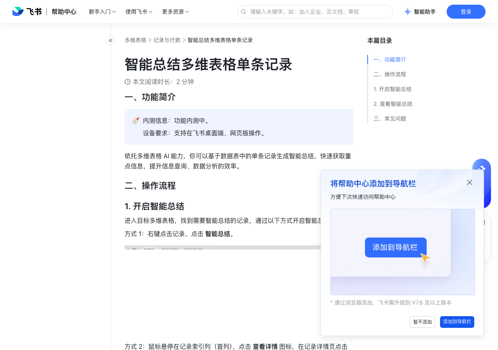

# 智能总结多维表格单条记录

> 来源：[飞书帮助中心](https://www.feishu.cn/hc/zh-CN/articles/128728988194)  
> 分类：多维表格 / 记录与行数  
> 抓取时间：2026-09-22T01:23:46.601Z

## 界面截图

### 文档内配图

1. 配图：https://p1-hera.feishucdn.com/tos-cn-i-jbbdkfciu3/7771b549de324d3b9cb21c3eea750077~tplv-jbbdkfciu3-image:0:0.image
2. 配图：https://p1-hera.feishucdn.com/tos-cn-i-jbbdkfciu3/e077c7586e394e2daaac16c6bf9a1b69~tplv-jbbdkfciu3-image:0:0.image
3. 配图：https://p1-hera.feishucdn.com/tos-cn-i-jbbdkfciu3/54e0c71a4f3b4429928e7b2baf835a6f~tplv-jbbdkfciu3-image:0:0.image

## 功能定位

本页对应飞书帮助中心「多维表格 / 记录与行数」下的「智能总结多维表格单条记录」。以下需求描述依据官方说明文档提炼，用于指导 DuoWei 对标实现。

## 功能目标

一、功能简介

## 文档结构（官方章节）

- 一、功能简介​
- 二、操作流程​
- 开启智能总结​
- 查看智能总结​
- 三、常见问题​

## 详细功能说明

一、功能简介

二、操作流程

开启智能总结

查看智能总结

群组、查找引用、按钮

AI 无法读取的附件、超链接、单向/双向关联

三、常见问题

问：我可以在多维表格 AI 侧边栏输入“帮我总结这条记录”，开启单行记录智能总结吗？

答：不支持在 AI 侧边栏直接输入“帮我总结这条记录”开启智能总结。你可以通过右键点击记录开启智能总结，或者在记录详情页开启智能总结。250px|700px|reset250px|700px|reset

## 实现要点（对标 DuoWei）

1. **入口与信息架构**：在产品中明确该能力所属模块（记录与行数），并保证用户可从对应导航触达。
2. **核心交互**：按上文「详细功能说明」还原主要操作路径；截图中出现的按钮、字段、面板命名尽量与飞书语义一致或可映射。
3. **数据与权限**：若文档涉及可见范围、可编辑范围、分享或高级权限，实现时需落到角色/成员模型，并保证 API/MCP 与 UI 权限一致。
4. **边界与上限**：若文档提到数量上限、格式限制、导入导出约束，需在实现与错误提示中体现。
5. **验收**：以本页截图场景为用例，完成「能打开 / 能配置 / 能保存 / 能被 Agent 读写（如适用）」四项检查。

## 原始摘录摘要

> 一、功能简介 二、操作流程 开启智能总结 查看智能总结 群组、查找引用、按钮 AI 无法读取的附件、超链接、单向/双向关联 三、常见问题 问：我可以在多维表格 AI 侧边栏输入“帮我总结这条记录”，开启单行记录智能总结吗？ 答：不支持在 AI 侧边栏直接输入“帮我总结这条记录”开启智能总结。你可以通过右键点击记录开启智能总结，或者在记录详情页开启智能总结。250px|700px|reset250px|700px|reset

## 元数据

- article_id: `7582888036678011868`
- category_id: `7341334412564381698`
- path: `/hc/zh-CN/articles/128728988194`
- extracted_text_length: 213
