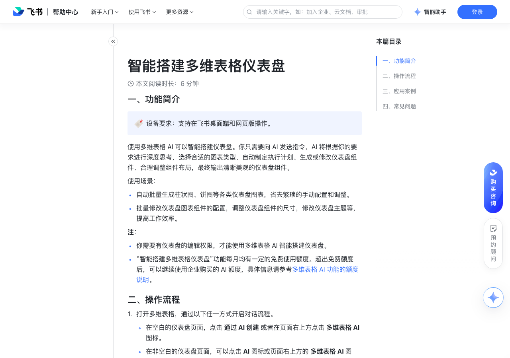

# 智能搭建多维表格仪表盘 

> 来源：[飞书帮助中心](https://www.feishu.cn/hc/zh-CN/articles/366437527961)  
> 分类：多维表格 / 仪表盘  
> 抓取时间：2026-09-22T01:25:13.453Z

## 界面截图

### 文档内配图

1. 配图：https://p1-hera.feishucdn.com/tos-cn-i-jbbdkfciu3/65a5b7251ca04f0cb0a73cb2fccd7948~tplv-jbbdkfciu3-image:0:0.image
2. 配图：https://p1-hera.feishucdn.com/tos-cn-i-jbbdkfciu3/6e8aff5e317940bd897fd5d98993234f~tplv-jbbdkfciu3-image:0:0.image
3. 配图：https://p1-hera.feishucdn.com/tos-cn-i-jbbdkfciu3/98986ca9e7e348769810d6a5cf75dda3~tplv-jbbdkfciu3-image:0:0.image
4. 配图：https://p1-hera.feishucdn.com/tos-cn-i-jbbdkfciu3/973d8f14139349b9bf99669f99f55e25~tplv-jbbdkfciu3-image:0:0.image
5. 配图：https://p1-hera.feishucdn.com/tos-cn-i-jbbdkfciu3/a5db4725b3d1438bb46b26a9f99c2fcf~tplv-jbbdkfciu3-image:0:0.image
6. 配图：https://p1-hera.feishucdn.com/tos-cn-i-jbbdkfciu3/b6be06db10d440f1b828006c269010d7~tplv-jbbdkfciu3-image:0:0.image
7. 配图：https://p1-hera.feishucdn.com/tos-cn-i-jbbdkfciu3/4a67dfc356014b7a910ecaa3548bf82f~tplv-jbbdkfciu3-image:0:0.image
8. 配图：https://p1-hera.feishucdn.com/tos-cn-i-jbbdkfciu3/86db944b1e7f45a798925452ea9d07d5~tplv-jbbdkfciu3-image:0:0.image
9. 配图：https://p1-hera.feishucdn.com/tos-cn-i-jbbdkfciu3/e5691e9983f14be68a7e018a79a63eba~tplv-jbbdkfciu3-image:0:0.image
10. 配图：https://p1-hera.feishucdn.com/tos-cn-i-jbbdkfciu3/f5ce8a511ecf4deb9f91a53e222675ad~tplv-jbbdkfciu3-image:0:0.image
11. 配图：https://p1-hera.feishucdn.com/tos-cn-i-jbbdkfciu3/1ff4b378a6a2447893dca63d969d8d2d~tplv-jbbdkfciu3-image:0:0.image
12. 配图：https://p1-hera.feishucdn.com/tos-cn-i-jbbdkfciu3/a44010befadd4fd08e8781c00e3479ff~tplv-jbbdkfciu3-image:0:0.image
13. 配图：https://p1-hera.feishucdn.com/tos-cn-i-jbbdkfciu3/1a436e8770b346aba0db147a6a556293~tplv-jbbdkfciu3-image:0:0.image

## 功能定位

本页对应飞书帮助中心「多维表格 / 仪表盘」下的「智能搭建多维表格仪表盘 」。以下需求描述依据官方说明文档提炼，用于指导 DuoWei 对标实现。

## 功能目标

一、功能简介

## 文档结构（官方章节）

- 一、功能简介​
- 二、操作流程​
- 三、应用案例​
- 从零搭建仪表盘​
- 完善并美化仪表盘​
- 四、常见问题​

## 详细功能说明

一、功能简介

自动批量生成柱状图、饼图等各类仪表盘图表，省去繁琐的手动配置和调整。

批量修改仪表盘图表组件的配置，调整仪表盘组件的尺寸，修改仪表盘主题等，提高工作效率。

你需要有仪表盘的编辑权限，才能使用多维表格 AI 智能搭建仪表盘。

“智能搭建多维表格仪表盘”功能每月均有一定的免费使用额度。超出免费额度后，可以继续使用企业购买的 AI 额度，具体信息请参考多维表格 AI 功能的额度说明。

二、操作流程

打开多维表格，通过以下任一方式开启对话流程。

在空白的仪表盘页面，点击 通过 AI 创建 或者在页面右上方点击 多维表格 AI 图标。

在非空白的仪表盘页面，可以点击 AI 图标或页面右上方的 多维表格 AI 图标。

向多维表格 AI 说明你的需求。建议明确仪表盘的目标、期望使用的图表类型和数据分析维度等。

新建仪表盘：默认将多维表格中多个数据表的数据整合到一个仪表盘中。如需指定基于某些数据表创建仪表盘，建议在指令中明确说明。

修改仪表盘：支持新增图表、修改图表配置、修改仪表盘背景、调整仪表盘组件布局等。

AI 将对你的需求进行深度思考，判断是否需要收集更多信息。

如果指令不够明确，AI 可能需要收集更多信息，例如和你确认仪表盘的用途等。你可以勾选目标并点击 确认 或者继续通过对话补充信息。确认目标后，AI 会开始制定详细的执行计划。

250px|700px|reset

如果指令足够明确，AI 将根据你的需求制定详细的执行计划。你可以查看该计划并点击 开始执行。如需修改该计划，直接发送你的修改需求即可，AI 会根据新要求重新制定计划。

AI 将按照计划自动执行任务。任务完成后，左侧的仪表盘区域将自动更新，右侧的对话页面将自动发送任务总结。你可以按需查看或修改 AI 创建的仪表盘。

（可选）如果对 AI 生成的仪表盘不满意，可以点击 撤销 按钮，恢复到生成之前的状态。

三、应用案例

从零搭建仪表盘

打开多维表格的仪表盘页面，向多维表格 AI 说明你的需求，例如“帮我创建一个仪表盘，要美观好看”。

根据提示补充 AI 所需的信息，并执行 AI 制定的任务计划。

待 AI 完成任务后，查看生成的仪表盘。

完善并美化仪表盘

打开多维表格的仪表盘页面，向多维表格 AI 说明你的优化需求，例如“帮我补充完善这个仪表盘的指标和图表，并调整布局排版，换成夜览主题，要美观好看”。

待 AI 完成任务后，查看优化后的仪表盘布局。

四、常见问题

问：使用 AI 智能搭建仪表盘时，为什么有些需求被拒绝了？

答：可能是因为当前的 AI 功能无法完成你的需求，例如：要求基于不存在的数据表搭建仪表盘。要求创建不支持的图表类型，例如热力图。要求使用不支持的功能，例如新建字段、修改背景图片、修改组件类型等。你的需求需要先创建字段或工作流才能完成。

## 实现要点（对标 DuoWei）

1. **入口与信息架构**：在产品中明确该能力所属模块（仪表盘），并保证用户可从对应导航触达。
2. **核心交互**：按上文「详细功能说明」还原主要操作路径；截图中出现的按钮、字段、面板命名尽量与飞书语义一致或可映射。
3. **数据与权限**：若文档涉及可见范围、可编辑范围、分享或高级权限，实现时需落到角色/成员模型，并保证 API/MCP 与 UI 权限一致。
4. **边界与上限**：若文档提到数量上限、格式限制、导入导出约束，需在实现与错误提示中体现。
5. **验收**：以本页截图场景为用例，完成「能打开 / 能配置 / 能保存 / 能被 Agent 读写（如适用）」四项检查。

## 原始摘录摘要

> 一、功能简介 自动批量生成柱状图、饼图等各类仪表盘图表，省去繁琐的手动配置和调整。 批量修改仪表盘图表组件的配置，调整仪表盘组件的尺寸，修改仪表盘主题等，提高工作效率。 你需要有仪表盘的编辑权限，才能使用多维表格 AI 智能搭建仪表盘。 “智能搭建多维表格仪表盘”功能每月均有一定的免费使用额度。超出免费额度后，可以继续使用企业购买的 AI 额度，具体信息请参考多维表格 AI 功能的额度说明。 二、操作流程 打开多维表格，通过以下任一方式开启对话流程。 在空白的仪表盘页面，点击 通过 AI 创建 或者在页面右上方点击 多维表格 AI 图标。 在非空白的仪表盘页面，可以点击 AI 图标或页面右上方的 多维表格 AI 图标。 向多维表格 AI 说明你的需求。建议明确仪表盘的目标、期望使用的图表类型和数据分析维度等。 新建仪表盘：默认将多维表格中多个数据表的数据整合到一个仪表盘中。如需指定基于某些数据表创建仪表盘，建议在指令中明确说明。 修改仪表盘：支持新增图表、修改图表配置、修改仪表盘背景、调整仪表盘组件布局等。 AI 将对你的需求进行深度思考，判断是否需要收集更多信息。 如果指令不够明确，AI 可能需要收集更多信息，例如和你确认仪表盘的用途等。你可以勾选目标并点击 确认 或者继续通过对话补充信息。确认目标后，AI 会开始制定详细的执行计划。 250px|700px|reset 如果指令足够明确，AI 将根据你的需求制定详细的执行计划。你可以查看该计划并点击 开始执行。如需修改该计划，直接发送你的修改需求即可，AI 会根据新要求重新制定计划。 AI 将按照计划自动执行任务。任务完成后，左侧的仪表盘区域将自动更新，右侧的对话页面将自动发送任务总结。你可以按需查看或修改 AI 创建的仪表盘。 （可选）如果对 AI 生成的仪表盘不满意，可以点击 撤销 按钮，恢复到生成之前的状态。 三、…

## 元数据

- article_id: `7332030075862269954`
- category_id: `7165754521875005468`
- path: `/hc/zh-CN/articles/366437527961`
- extracted_text_length: 1178
